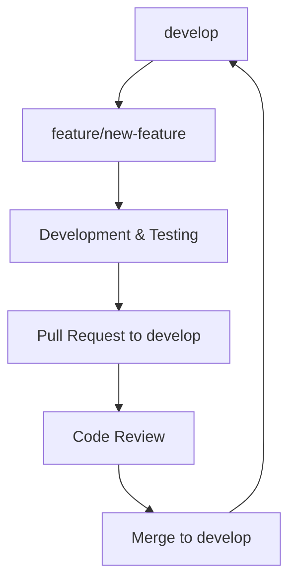
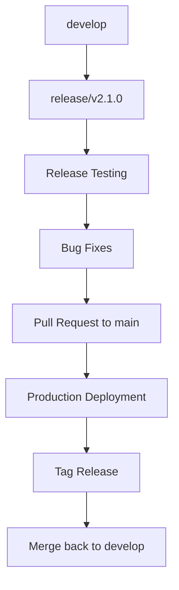
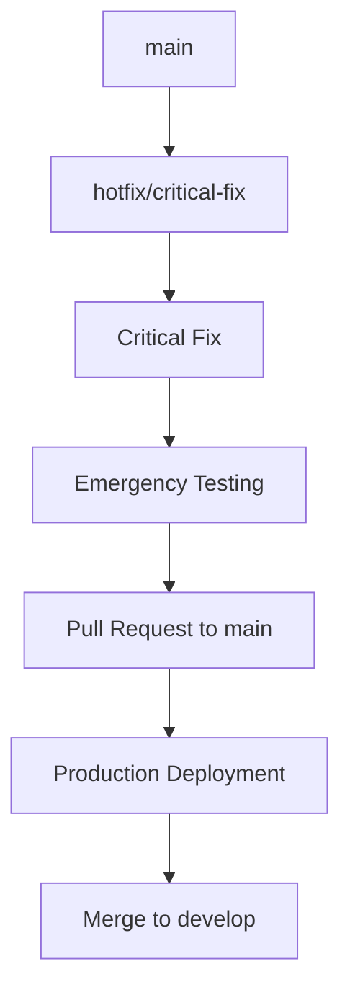

# 🌿 Branch Protection Strategy

This document outlines the branch protection rules and Git workflow for ToolboxAI Solutions.

## 🏗️ Branch Structure

### 📊 Branch Hierarchy
```
main (production)
├── develop (integration)
├── staging (pre-production)
├── feature/* (new features)
├── bugfix/* (bug fixes)  
├── hotfix/* (critical fixes)
└── release/* (release preparation)
```

## 🛡️ Branch Protection Rules

### 🔒 Main Branch (`main`)
**Purpose**: Production-ready code  
**Protection Level**: Maximum

#### Required Settings:
- ✅ **Require pull request reviews**
  - Required reviewers: 2
  - Dismiss stale reviews when new commits are pushed
  - Require review from code owners
  - Require approval from different organizations (if applicable)

- ✅ **Require status checks to pass**  
  - Require branches to be up to date before merging
  - Required status checks:
    - `CI / Python QA (3.11)`
    - `CI / Node.js QA` 
    - `CI / Database Migration Tests`
    - `CI / Quality Gate`
    - `Security / CodeQL Security Scan`
    - `Security / Dependency Security Scan`

- ✅ **Require deployment to succeed**
  - `staging` environment must be successfully deployed

- ✅ **Require signed commits**

- ✅ **Restrict pushes**
  - No direct pushes allowed
  - Only merge commits via pull requests

- ✅ **Restrict force pushes**
  - Force pushes are disabled

- ✅ **Allow deletion**
  - Branch deletion is disabled

#### Auto-merge Conditions:
- All required reviews approved
- All status checks pass
- No conflicts with base branch  
- Security scans complete without critical issues

---

### 🔄 Develop Branch (`develop`) 
**Purpose**: Integration and testing branch  
**Protection Level**: High

#### Required Settings:
- ✅ **Require pull request reviews**
  - Required reviewers: 1
  - Dismiss stale reviews when new commits are pushed
  - Allow specified actors to bypass (maintainers only)

- ✅ **Require status checks to pass**
  - Require branches to be up to date before merging
  - Required status checks:
    - `CI / Python QA (3.11)`
    - `CI / Quality Gate` 
    - `Security / CodeQL Security Scan`

- ✅ **Restrict force pushes**
  - Force pushes allowed for administrators only

- ✅ **Allow deletion**
  - Branch deletion is disabled

---

### 🚀 Staging Branch (`staging`)
**Purpose**: Pre-production testing  
**Protection Level**: Medium

#### Required Settings:
- ✅ **Require pull request reviews**
  - Required reviewers: 1 (from maintainers or admins)

- ✅ **Require status checks to pass**
  - Required status checks:
    - `CI / Quality Gate`
    - `Deploy / Deploy to Staging` 

- ✅ **Restrict force pushes**
  - Force pushes allowed for administrators only

---

### 🛠️ Feature Branches (`feature/*`)
**Purpose**: New feature development  
**Protection Level**: Low

#### Naming Convention:
```
feature/user-authentication
feature/ai-content-generation  
feature/roblox-plugin-v2
feature/dashboard-redesign
```

#### Settings:
- ❌ No branch protection (allows flexible development)
- ✅ Automatic deletion after merge
- ✅ Must be created from `develop` branch

---

### 🐛 Bugfix Branches (`bugfix/*`)
**Purpose**: Non-critical bug fixes  
**Protection Level**: Low

#### Naming Convention:
```
bugfix/login-validation-error
bugfix/dashboard-rendering-issue
bugfix/api-response-format
```

#### Settings:
- ❌ No branch protection
- ✅ Automatic deletion after merge
- ✅ Can be created from `develop` or `main`

---

### 🔥 Hotfix Branches (`hotfix/*`) 
**Purpose**: Critical production fixes  
**Protection Level**: Medium

#### Naming Convention:
```
hotfix/security-vulnerability-fix
hotfix/critical-api-bug
hotfix/database-connection-issue
```

#### Required Settings:
- ✅ **Require pull request reviews**
  - Required reviewers: 1 (from maintainers)
  - Allow hotfix bypasses in emergencies

- ✅ **Require status checks to pass**
  - Required status checks:
    - `CI / Python QA (3.11)`
    - `Security / Security Summary`

#### Special Rules:
- Can be merged directly to `main` in critical emergencies
- Must be immediately merged back to `develop`
- Requires post-merge security review

---

### 🏷️ Release Branches (`release/*`)
**Purpose**: Release preparation and final testing  
**Protection Level**: Medium-High

#### Naming Convention:
```
release/v2.1.0
release/v2.0.5-hotfix
release/2024-q4-major
```

#### Required Settings:
- ✅ **Require pull request reviews**
  - Required reviewers: 2 (including 1 maintainer)

- ✅ **Require status checks to pass**
  - All CI/CD checks must pass
  - Security scans must complete
  - Integration tests must pass

## 🔄 Git Workflow

### 📈 Feature Development Flow


### 🚀 Release Flow


### 🔥 Hotfix Flow


## 👥 Code Review Requirements

### 🔍 Review Criteria

#### Required for Main Branch:
- **Architecture Review**: System design impacts
- **Security Review**: Security implications assessment  
- **Performance Review**: Performance impact analysis
- **Testing Review**: Test coverage and quality
- **Documentation Review**: Documentation completeness

#### Required for Develop Branch:
- **Code Quality**: Code standards compliance
- **Functionality**: Feature completeness
- **Basic Security**: No obvious security issues

### 👤 Reviewer Assignments

#### Automatic Assignment:
- **Backend Changes**: @backend-team  
- **Frontend Changes**: @frontend-team
- **Security Changes**: @security-team
- **Infrastructure**: @devops-team
- **Documentation**: @docs-team

#### Code Owners:
```gitignore
# Global owners
* @ToolboxAI-Solutions/maintainers

# Backend code
/src/api/ @ToolboxAI-Solutions/backend-team
/src/roblox-environment/ @ToolboxAI-Solutions/backend-team  
/database/ @ToolboxAI-Solutions/backend-team

# Frontend code
/src/dashboard/ @ToolboxAI-Solutions/frontend-team
*.tsx @ToolboxAI-Solutions/frontend-team
*.jsx @ToolboxAI-Solutions/frontend-team

# Security sensitive files
/SECURITY.md @ToolboxAI-Solutions/security-team
/.github/workflows/security.yml @ToolboxAI-Solutions/security-team
/.github/codeql/ @ToolboxAI-Solutions/security-team

# Infrastructure and deployment
/.github/workflows/deploy.yml @ToolboxAI-Solutions/devops-team
/scripts/ @ToolboxAI-Solutions/devops-team
Dockerfile* @ToolboxAI-Solutions/devops-team

# Documentation
/docs/ @ToolboxAI-Solutions/docs-team
*.md @ToolboxAI-Solutions/docs-team
```

## 🚦 Merge Strategies

### 🔗 Merge Types by Branch

| Target Branch | Merge Strategy | Rationale |
|---------------|----------------|-----------|
| `main` | **Merge Commit** | Preserve complete history |
| `develop` | **Squash and Merge** | Clean, linear history |
| `staging` | **Merge Commit** | Full traceability |
| Feature branches | **Squash and Merge** | Atomic feature commits |

### 📝 Commit Message Standards
```
type(scope): brief description

- feat: new feature
- fix: bug fix  
- docs: documentation
- style: formatting
- refactor: code restructuring
- test: adding tests
- chore: maintenance

Examples:
feat(auth): add multi-factor authentication
fix(api): resolve rate limiting issue  
docs(readme): update installation instructions
```

## 🔧 Repository Settings

### ⚙️ Required Repository Settings

#### General Settings:
- ✅ **Allow merge commits**
- ✅ **Allow squash merging**  
- ❌ **Allow rebase merging** (disabled for safety)
- ✅ **Automatically delete head branches**
- ✅ **Allow auto-merge**

#### Security Settings:
- ✅ **Enable vulnerability alerts**
- ✅ **Enable automated security fixes**
- ✅ **Enable private security advisory reporting**
- ✅ **Enable Dependabot alerts**
- ✅ **Enable code scanning alerts**
- ✅ **Enable secret scanning alerts**

## 📋 Implementation Checklist

### 🎯 Repository Setup:
- [ ] Configure branch protection rules for `main`
- [ ] Configure branch protection rules for `develop`  
- [ ] Configure branch protection rules for `staging`
- [ ] Set up code owners file (`.github/CODEOWNERS`)
- [ ] Configure automated security scanning
- [ ] Set up required status checks
- [ ] Configure merge settings
- [ ] Enable branch deletion automation

### 👥 Team Setup:
- [ ] Create GitHub teams (@backend-team, @frontend-team, etc.)
- [ ] Assign team permissions
- [ ] Configure team notifications
- [ ] Set up code review assignments

### 🔄 Workflow Testing:
- [ ] Test feature branch workflow
- [ ] Test hotfix workflow  
- [ ] Test release workflow
- [ ] Verify all status checks work
- [ ] Test merge restrictions
- [ ] Validate security scans trigger

## 📚 Additional Resources

- [GitHub Branch Protection Documentation](https://docs.github.com/en/repositories/configuring-branches-and-merges-in-your-repository/defining-the-mergeability-of-pull-requests/about-protected-branches)
- [Git Flow Workflow](https://www.atlassian.com/git/tutorials/comparing-workflows/gitflow-workflow)
- [Conventional Commits](https://www.conventionalcommits.org/)
- [Code Review Best Practices](https://google.github.io/eng-practices/review/)

---

**Last Updated**: January 2025  
**Next Review**: April 2025

For questions about branch protection or workflow, contact the DevOps team or create an issue.