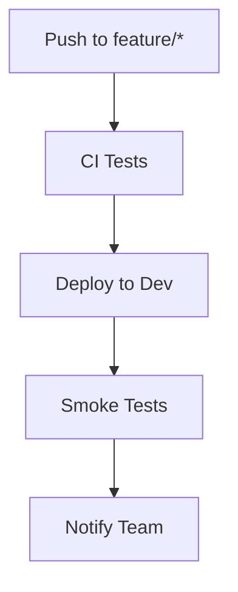
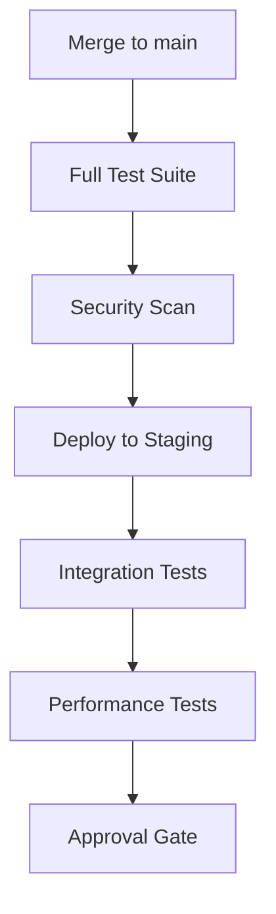
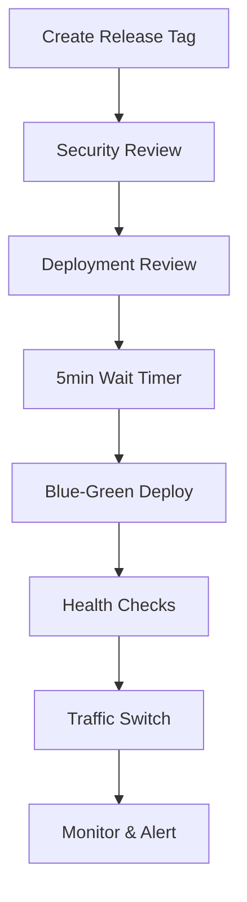

# 🌐 Environment Configuration Guide

This directory contains configuration documentation for all deployment environments in ToolboxAI Solutions. Each environment has specific settings, secrets, and protection rules tailored to its purpose.

## 📋 Environment Overview

| Environment | Purpose | URL | Protection Level | Auto-Deploy |
|-------------|---------|-----|------------------|-------------|
| **Development** | Feature development and testing | `dev.toolboxai.example.com` | Low | ✅ Yes |
| **Staging** | Pre-production testing | `staging.toolboxai.example.com` | Medium | ✅ Yes |
| **Production** | Live user-facing application | `toolboxai.example.com` | High | ❌ Manual |

## 🚀 Environment Setup Instructions

### 1. 🛠️ Initial Setup

#### Prerequisites
- Repository admin access
- GitHub CLI installed and authenticated
- Access to secret management systems (AWS Secret Manager, Azure Key Vault, etc.)

#### Create GitHub Environments
```bash
# Using GitHub CLI to create environments
gh api repos/:owner/:repo/environments/development -X PUT
gh api repos/:owner/:repo/environments/staging -X PUT  
gh api repos/:owner/:repo/environments/production -X PUT
```

### 2. 🔐 Configure Secrets

#### Development Environment
```bash
# Set development secrets
gh secret set DATABASE_PASSWORD --env development --body "dev_password_123"
gh secret set OPENAI_API_KEY --env development --body "sk-dev-key-..."
gh secret set JWT_SECRET_KEY --env development --body "dev-jwt-secret-key"
gh secret set ENCRYPTION_KEY --env development --body "dev-encryption-key-32-chars"
```

#### Staging Environment
```bash
# Set staging secrets (use stronger values)
gh secret set DATABASE_PASSWORD --env staging --body "$(openssl rand -base64 32)"
gh secret set OPENAI_API_KEY --env staging --body "sk-staging-key-..."
gh secret set JWT_SECRET_KEY --env staging --body "$(openssl rand -base64 64)"
gh secret set ENCRYPTION_KEY --env staging --body "$(openssl rand -base64 32)"
```

#### Production Environment
```bash
# Set production secrets (use secret manager)
gh secret set DATABASE_PASSWORD --env production --body "$(aws secretsmanager get-secret-value --secret-id prod/database/password --query SecretString --output text)"
gh secret set OPENAI_API_KEY --env production --body "$(aws secretsmanager get-secret-value --secret-id prod/openai/api-key --query SecretString --output text)"
# ... and so on
```

### 3. 🛡️ Configure Protection Rules

#### Development Environment
```bash
# No protection rules - allow quick deployments
curl -X PUT \
  -H "Accept: application/vnd.github.v3+json" \
  -H "Authorization: token $GITHUB_TOKEN" \
  https://api.github.com/repos/:owner/:repo/environments/development \
  -d '{
    "wait_timer": 0,
    "prevent_self_review": false,
    "reviewers": []
  }'
```

#### Staging Environment  
```bash
# Basic protection with maintainer review
curl -X PUT \
  -H "Accept: application/vnd.github.v3+json" \
  -H "Authorization: token $GITHUB_TOKEN" \
  https://api.github.com/repos/:owner/:repo/environments/staging \
  -d '{
    "wait_timer": 0,
    "prevent_self_review": true,
    "reviewers": [
      {"type": "Team", "id": 12345}
    ]
  }'
```

#### Production Environment
```bash
# Maximum protection with multiple reviews and wait time
curl -X PUT \
  -H "Accept: application/vnd.github.v3+json" \
  -H "Authorization: token $GITHUB_TOKEN" \
  https://api.github.com/repos/:owner/:repo/environments/production \
  -d '{
    "wait_timer": 300,
    "prevent_self_review": true,
    "reviewers": [
      {"type": "Team", "id": 12345},
      {"type": "Team", "id": 67890}
    ],
    "deployment_branch_policy": {
      "protected_branches": true,
      "custom_branch_policies": false
    }
  }'
```

## 🔑 Secret Management Strategy

### 🏗️ Secret Categories

#### 1. Database Secrets
- **Development**: Simple, shared passwords
- **Staging**: Randomized, rotated monthly  
- **Production**: AWS Secret Manager with auto-rotation

#### 2. API Keys
- **Development**: Test/development tier keys
- **Staging**: Limited production keys
- **Production**: Full production keys with monitoring

#### 3. Encryption Keys
- **Development**: Fixed keys for consistency
- **Staging**: Rotated keys matching production pattern
- **Production**: HSM-backed keys with strict access control

### 🔄 Secret Rotation Schedule

| Secret Type | Development | Staging | Production |
|-------------|-------------|---------|------------|
| Database passwords | Never | Monthly | Weekly |
| API keys | Yearly | Quarterly | Monthly |
| Encryption keys | Yearly | Quarterly | Quarterly |
| JWT secrets | Yearly | Monthly | Weekly |

### 🛠️ Secret Management Tools

#### Recommended Tools:
- **AWS Secrets Manager** - For production secrets
- **Azure Key Vault** - Alternative for Azure deployments
- **HashiCorp Vault** - For advanced secret management
- **GitHub Secrets** - For CI/CD integration

#### Setup Scripts:
```bash
# Create AWS secrets for production
aws secretsmanager create-secret \
  --name "toolboxai/prod/database/password" \
  --description "Production database password" \
  --generate-random-password \
  --password-length 32

# Enable automatic rotation
aws secretsmanager update-secret \
  --secret-id "toolboxai/prod/database/password" \
  --rotation-lambda-arn "arn:aws:lambda:region:account:function:SecretsManagerRotation"
```

## 🌍 Environment Variables

### 📊 Variable Categories

#### Application Configuration
- `APP_ENV`: Environment identifier
- `DEBUG`: Debug mode toggle
- `LOG_LEVEL`: Logging verbosity

#### Service Configuration  
- `FASTAPI_HOST`/`FASTAPI_PORT`: API server settings
- `DATABASE_*`: Database connection settings
- `REDIS_*`: Cache configuration

#### Feature Flags
- `ENABLE_DEBUG_ENDPOINTS`: Debug API endpoints
- `ENABLE_ANALYTICS`: Analytics tracking
- `ENABLE_MONITORING`: Monitoring and metrics

#### Performance Settings
- `GUNICORN_WORKERS`: Number of worker processes
- `RATE_LIMIT_*`: Rate limiting configuration
- `AI_MODEL_TEMPERATURE`: AI response creativity

### 🔧 Variable Management

#### Environment-Specific Overrides:
```yaml
# .github/workflows/deploy.yml
env:
  # Base configuration
  APP_NAME: "ToolboxAI Solutions"
  
  # Environment-specific overrides
  DEBUG: ${{ github.ref == 'refs/heads/develop' && 'true' || 'false' }}
  LOG_LEVEL: ${{ github.ref == 'refs/heads/main' && 'WARNING' || 'INFO' }}
```

## 🔍 Health Checks and Monitoring

### 🎯 Health Check Endpoints

#### Universal Endpoints (All Environments):
- `/health` - Basic application health
- `/health/database` - Database connectivity  
- `/health/redis` - Cache connectivity
- `/metrics` - Prometheus metrics

#### Environment-Specific Checks:
- **Development**: Basic health only
- **Staging**: All services + load testing
- **Production**: Comprehensive monitoring + alerting

### 📊 Monitoring Configuration

#### Development:
```yaml
monitoring:
  level: basic
  retention: 7 days
  alerts: disabled
```

#### Staging:
```yaml
monitoring:
  level: comprehensive
  retention: 30 days
  alerts: slack-only
  load_testing: enabled
```

#### Production:
```yaml
monitoring:
  level: enterprise
  retention: 90 days
  alerts: multi-channel
  sla_monitoring: enabled
  disaster_recovery: enabled
```

## 🚀 Deployment Workflows

### 📋 Deployment Matrix

| Source Branch | Target Environment | Trigger | Approval Required |
|---------------|-------------------|---------|-------------------|
| `feature/*` | Development | Automatic | No |
| `develop` | Development | Automatic | No |
| `main` | Staging | Automatic | Yes (1 reviewer) |
| `main` + tag | Production | Manual | Yes (2 reviewers) |

### 🔄 Deployment Process

#### 1. Development Deployment:


#### 2. Staging Deployment:


#### 3. Production Deployment:


## 📚 Environment-Specific Documentation

### 🔗 Quick Links

- [Development Setup Guide](development-setup.md)
- [Staging Validation Process](staging-validation.md)
- [Production Deployment Runbook](production-deployment.md)
- [Disaster Recovery Plan](disaster-recovery.md)

### 📖 Additional Resources

- [AWS Infrastructure Documentation](../docs/infrastructure/aws.md)
- [Security Best Practices](../docs/security/best-practices.md)
- [Monitoring and Alerting](../docs/operations/monitoring.md)
- [Troubleshooting Guide](../docs/operations/troubleshooting.md)

## 🆘 Emergency Procedures

### 🚨 Emergency Deployments

#### Hotfix Deployment:
```bash
# Create emergency hotfix branch
git checkout -b hotfix/critical-security-fix main

# Make minimal changes
# ...

# Emergency deploy to production
gh workflow run deploy.yml \
  --ref hotfix/critical-security-fix \
  --field environment=production \
  --field force_deploy=true
```

#### Rollback Procedures:
```bash
# Rollback to previous version
gh api repos/:owner/:repo/deployments \
  --jq '.[0].sha' | \
  xargs -I {} gh workflow run deploy.yml \
    --field environment=production \
    --field rollback_to={}
```

## 📞 Support and Contacts

### 👥 Environment Owners

- **Development**: @ToolboxAI-Solutions/developers
- **Staging**: @ToolboxAI-Solutions/qa-team  
- **Production**: @ToolboxAI-Solutions/maintainers

### 🚨 Emergency Contacts

- **Security Issues**: security@toolboxai.example.com
- **Production Issues**: ops@toolboxai.example.com
- **24/7 On-Call**: +1-xxx-xxx-xxxx

---

**Last Updated**: January 2025  
**Next Review**: April 2025

For questions about environment configuration, create an issue or contact the DevOps team.