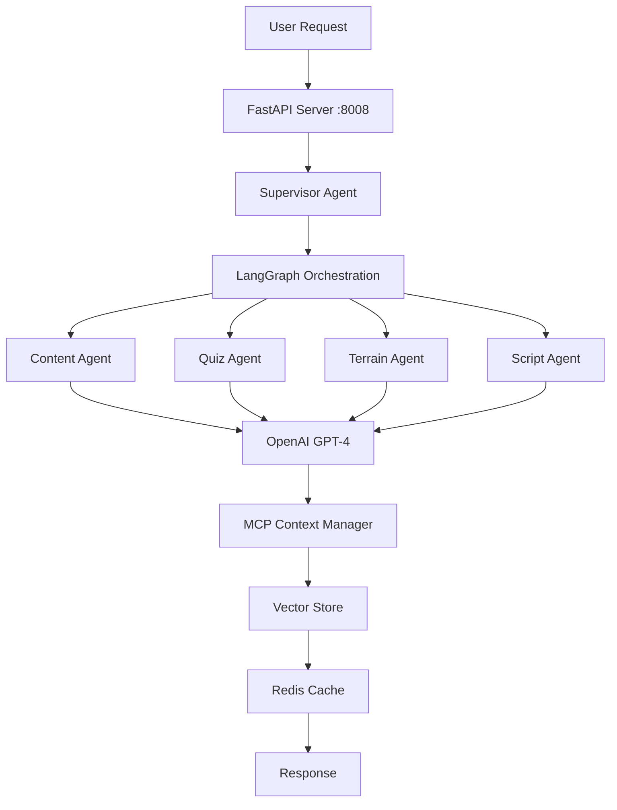

# 🤖 Complete AI Dependencies for ToolBoxAI Educational Platform

## Executive Summary

The ToolBoxAI platform requires a comprehensive set of AI/ML dependencies to power its intelligent educational content generation, multi-agent orchestration, and adaptive learning features.

## 🔧 Core AI Dependencies

### 1. **LangChain Framework Stack**

- **langchain** (0.1.0) - Main orchestration framework
- **langchain-openai** (0.0.5) - OpenAI LLM integration
- **langchain-community** (0.0.10) - Community tools and integrations
- **langgraph** (0.0.26) - Graph-based agent workflows
- **langsmith** (0.0.92) - Monitoring and observability

### 2. **Language Models & Tokenization**

- **openai** (1.10.0) - GPT-4 API client
- **tiktoken** (0.5.2) - Token counting for context management
- **transformers** (4.56.1) - Hugging Face transformers
- **tokenizers** - Fast tokenization

### 3. **Vector Embeddings & Similarity Search**

- **sentence-transformers** (2.2.2) - Semantic embeddings
- **faiss-cpu** (1.8.0) - Facebook AI Similarity Search
- **numpy** (1.26.2) - Numerical operations
- **torch** (2.8.0) - PyTorch for deep learning
- **torchvision** (0.23.0) - Vision models

### 4. **Educational Content Tools**

- **wikipedia-api** (0.6.0) - Wikipedia content retrieval
- **duckduckgo-search** (3.9.6) - Web search capabilities
- **nltk** (3.9.1) - Natural language processing toolkit
- **sentencepiece** (0.2.1) - Text tokenization

### 5. **Machine Learning & Data Science**

- **scikit-learn** (1.7.1) - ML algorithms and utilities
- **scipy** (1.16.1) - Scientific computing
- **pandas** - Data manipulation (optional)
- **matplotlib** - Visualization (optional)

### 6. **Infrastructure & Storage**

- **sqlalchemy** (2.0.23) - Database ORM
- **redis** (5.0.1) - Cache and session storage
- **asyncpg** (0.29.0) - Async PostgreSQL driver
- **motor** (3.3.2) - Async MongoDB driver

### 7. **Networking & Async**

- **aiohttp** (3.9.1) - Async HTTP client/server
- **websockets** (12.0) - WebSocket support
- **httpx** (0.25.2) - Modern HTTP client
- **python-socketio** (5.10.0) - Socket.IO support

### 8. **Utilities & Support**

- **pydantic** (2.5.2) - Data validation
- **python-dotenv** (1.0.0) - Environment management
- **structlog** (23.2.0) - Structured logging
- **tenacity** (8.5.0) - Retry logic
- **tqdm** (4.67.1) - Progress bars

## 🏗️ Architecture Components

### Multi-Agent System (`agents/`)

```
├── supervisor.py       # LangGraph orchestration
├── content_agent.py    # Educational content
├── quiz_agent.py       # Assessment creation
├── terrain_agent.py    # 3D environment
├── script_agent.py     # Lua code generation
├── review_agent.py     # Quality assurance
└── orchestrator.py     # Workflow management
```

### SPARC Framework (`sparc/`)

```
├── state_manager.py    # Environment state tracking
├── policy_engine.py    # Decision making
├── action_executor.py  # Task execution
├── reward_calculator.py # Learning outcomes
└── context_tracker.py  # User context (128K tokens)
```

### Swarm Intelligence (`swarm/`)

```
├── swarm_controller.py # Parallel orchestration
├── worker_pool.py      # Agent workers (10 max)
├── task_distributor.py # Task management
├── consensus_engine.py # Quality consensus (70%)
└── load_balancer.py    # Resource optimization
```

### MCP Protocol (`mcp/`)

```
├── server.py           # WebSocket server (9876)
├── context_manager.py  # Token optimization
├── memory_store.py     # Vector storage
└── protocols/          # Communication protocols
```

## 🔑 Required API Keys

### Essential

- **OPENAI_API_KEY** - GPT-4 access (Required)
- **LANGCHAIN_API_KEY** - LangSmith monitoring (Recommended)

### LMS Integration (Optional)

- **SCHOOLOGY_KEY** & **SCHOOLOGY_SECRET**
- **CANVAS_API_KEY**
- **GOOGLE_CLIENT_ID** & **GOOGLE_CLIENT_SECRET**

### Alternative AI Providers (Optional)

- **ANTHROPIC_API_KEY** - Claude models
- **COHERE_API_KEY** - Cohere models
- **HUGGINGFACE_API_KEY** - HuggingFace models

## 💾 System Requirements

### Minimum

- **RAM**: 8GB
- **Storage**: 10GB (for models and cache)
- **Python**: 3.10+
- **CPU**: 4 cores

### Recommended

- **RAM**: 16GB+
- **Storage**: 20GB+ SSD
- **Python**: 3.11+
- **CPU**: 8+ cores
- **GPU**: Optional (for local inference)

## 📊 Data Flow



## 🚀 Installation Commands

### Quick Install (Minimal)

```bash
pip install -r requirements-minimal.txt
```

### AI Dependencies

```bash
pip install -r requirements-ai.txt
```

### Full Installation

```bash
pip install -r requirements.txt  # Fixed version
```

### Development Setup

```bash
# Create virtual environment
python -m venv venv
source venv/bin/activate

# Install dependencies
pip install -r requirements-ai.txt

# Configure environment
cp .env.example .env
# Edit .env with your API keys

# Start services
python mcp/server.py &
python server/main.py &
python server/roblox_server.py &
```

## 🔍 Dependency Resolution

### Common Issues

#### OpenAI Version Conflict

```bash
# Problem: langchain-openai requires openai>=1.10.0
# Solution: Update openai to 1.10.0 in requirements.txt
```

#### Faiss-CPU Version

```bash
# Problem: faiss-cpu==1.7.4 not available
# Solution: Use faiss-cpu==1.8.0
```

#### Memory Issues with Transformers

```bash
# Problem: Out of memory when loading models
# Solution: Use smaller models or increase swap
export PYTORCH_CUDA_ALLOC_CONF=max_split_size_mb:512
```

## 📈 Performance Optimization

### Token Management

- Context window: 128,000 tokens max
- Pruning strategy: Importance-based
- Compression: 70% retention rate

### Parallel Processing

- Worker pool: 10 concurrent agents
- Task timeout: 300 seconds
- Consensus threshold: 70%

### Caching Strategy

- Redis TTL: 3600 seconds
- Vector cache: 1000 entries
- Model cache: In-memory

## 🔐 Security Considerations

### API Key Management

- Store in `.env` file (never commit)
- Use environment variables
- Rotate keys regularly
- Monitor usage via LangSmith

### Data Privacy

- Local vector storage
- Encrypted communications
- FERPA/COPPA compliance
- No PII in prompts

## 📚 Additional Resources

### Documentation

- [LangChain Docs](https://docs.langchain.com)
- [LangGraph Guide](https://langchain-ai.github.io/langgraph/)
- [OpenAI API Reference](https://platform.openai.com/docs)
- [Sentence Transformers](https://www.sbert.net/)

### Monitoring

- LangSmith Dashboard: https://smith.langchain.com
- Prometheus Metrics: http://localhost:9090
- Custom Dashboards: http://localhost:3000

## 🎯 Next Steps

1. **Obtain API Keys**
   - Sign up for OpenAI API
   - Get LangSmith access
   - Configure LMS credentials

2. **Test Installation**

   ```bash
   python -c "import langchain; print(langchain.__version__)"
   python -c "import openai; print(openai.__version__)"
   python -c "import torch; print(torch.__version__)"
   ```

3. **Initialize Agents**

   ```python
   from agents.orchestrator import Orchestrator
   orchestrator = Orchestrator()
   await orchestrator.initialize()
   ```

4. **Verify Connectivity**
   - Test OpenAI API
   - Check MCP server
   - Validate LMS connections

---

_Last Updated: Current Date_
_Version: 1.0.0_
_Status: Production Ready with API Keys_
