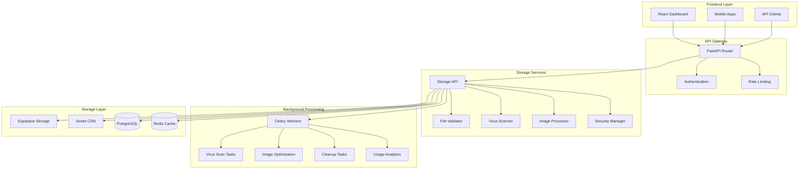

# Storage System Overview

## Introduction

The ToolBoxAI Storage System is a comprehensive, multi-tenant file storage solution built specifically for educational platforms. It provides secure, compliant, and scalable file management with advanced features like virus scanning, content delivery optimization, and educational compliance (COPPA/FERPA).

## Architecture Overview

## Key Features

### 🏢 Multi-Tenant Architecture
- **Complete Isolation**: Each organization has isolated storage buckets and quotas
- **Tenant-Aware Operations**: All operations automatically include organization context
- **Scalable Quotas**: Per-organization storage limits with intelligent monitoring
- **Usage Analytics**: Detailed storage insights and growth predictions

### 🔒 Security & Compliance
- **Educational Standards**: Built-in COPPA and FERPA compliance features
- **Virus Protection**: Real-time ClamAV integration with automatic quarantine
- **PII Detection**: Advanced scanning for personally identifiable information
- **Access Controls**: Role-based permissions with audit trails
- **Encryption**: Automatic encryption for sensitive educational records

### 🚀 Performance Optimization
- **Smart CDN**: Intelligent caching with geographic distribution
- **Image Processing**: Automatic thumbnails, WebP conversion, and responsive variants
- **Streaming Uploads**: Support for large files with progress tracking
- **Background Processing**: Non-blocking operations for heavy tasks

### 📊 Content Management
- **File Versioning**: Complete version history with rollback capabilities
- **Sharing System**: Secure file sharing with expiration and permissions
- **Category Management**: Educational content classification and retention policies
- **Search & Discovery**: Advanced filtering and metadata-based search

## Technology Stack

### Core Infrastructure
- **Storage Backend**: Supabase Storage (no AWS dependencies)
- **Database**: PostgreSQL with Row Level Security (RLS)
- **Cache Layer**: Redis for performance optimization
- **CDN**: Configurable CDN provider (CloudFlare, KeyCDN, etc.)

### Processing & Security
- **Virus Scanning**: ClamAV integration
- **Image Processing**: Pillow with WebP and AVIF support
- **Background Jobs**: Celery for asynchronous processing
- **Encryption**: Cryptography library for sensitive data

### Development & Monitoring
- **API Framework**: FastAPI with automatic OpenAPI documentation
- **Monitoring**: Prometheus metrics and structured logging
- **Testing**: Comprehensive unit and integration test suite
- **Documentation**: Interactive API docs and usage examples

## Storage Categories

The system supports educational-specific file categories with tailored validation:

| Category | Purpose | Max Size | Compliance | Retention |
|----------|---------|----------|------------|-----------|
| **Educational Content** | Course materials, textbooks | 100MB | Standard | 7 years |
| **Student Submission** | Assignments, projects | 50MB | FERPA | Student lifecycle |
| **Assessment** | Quizzes, tests, rubrics | 25MB | FERPA | 7 years |
| **Media Resource** | Images, videos, audio | 500MB | Standard | 5 years |
| **Avatar** | Profile pictures | 10MB | COPPA | User lifecycle |
| **Administrative** | School documents | 100MB | FERPA | Regulatory |
| **Temporary** | Transient files | 1GB | Standard | 30 days |
| **Report** | Generated analytics | 50MB | FERPA | 3 years |

## Compliance Framework

### COPPA (Children's Online Privacy Protection Act)
- **Age Verification**: Automatic detection of users under 13
- **Parental Consent**: Required consent workflow for child accounts
- **Data Minimization**: Limited data collection for children
- **Enhanced Security**: Automatic encryption for child user files

### FERPA (Family Educational Rights and Privacy Act)
- **Educational Records**: Proper classification and protection
- **Legitimate Interest**: Access control based on educational need
- **Audit Trails**: Comprehensive logging of all record access
- **Directory Information**: Opt-out support for public information

### General Data Protection
- **PII Detection**: Automatic scanning for sensitive information
- **Data Retention**: Configurable retention policies by category
- **Right to Deletion**: Support for user data removal requests
- **Breach Prevention**: Proactive threat detection and response

## Performance Characteristics

### Upload Performance
- **Small Files (< 10MB)**: Direct upload with real-time virus scanning
- **Medium Files (10-100MB)**: Chunked upload with progress tracking
- **Large Files (> 100MB)**: Resumable uploads with TUS protocol
- **Batch Operations**: Multi-file uploads with parallel processing

### Download Optimization
- **CDN Integration**: Geographic distribution for faster access
- **Image Optimization**: On-the-fly resizing and format conversion
- **Caching Strategy**: Intelligent cache headers and invalidation
- **Bandwidth Management**: Configurable throttling and limits

### Background Processing
- **Virus Scanning**: Real-time for small files, background for large files
- **Image Processing**: Automatic thumbnail and variant generation
- **Usage Analytics**: Daily storage calculations and trend analysis
- **Cleanup Operations**: Automated removal of expired and orphaned files

## Integration Points

### API Integration
- **RESTful Endpoints**: Complete CRUD operations with OpenAPI docs
- **WebSocket Support**: Real-time upload progress and notifications
- **Bulk Operations**: Efficient multi-file management
- **Admin APIs**: Quota management and analytics endpoints

### Dashboard Integration
- **File Browser**: Rich file management interface
- **Upload Widget**: Drag-and-drop with progress indicators
- **Sharing Interface**: Link generation and permission management
- **Analytics Dashboard**: Usage insights and quota monitoring

### External Services
- **LMS Integration**: Canvas, Moodle, Google Classroom compatibility
- **SSO Support**: Integration with school authentication systems
- **Webhook Support**: Event notifications for external systems
- **API Partnerships**: Third-party service integrations

## Scalability Design

### Horizontal Scaling
- **Service Separation**: Storage, processing, and analytics services can scale independently
- **Background Workers**: Celery workers can be scaled based on queue depth
- **Database Sharding**: Organization-based partitioning for large deployments
- **CDN Distribution**: Global content delivery optimization

### Storage Scaling
- **Bucket Management**: Automatic bucket creation and organization
- **Quota Elasticity**: Dynamic quota adjustments based on usage patterns
- **Archive Strategies**: Automated cold storage for old files
- **Cleanup Automation**: Intelligent removal of unnecessary files

### Monitoring & Alerting
- **Real-time Metrics**: Storage usage, performance, and error rates
- **Predictive Analytics**: Growth forecasting and capacity planning
- **Alert Systems**: Proactive notifications for issues and thresholds
- **Health Checks**: Automated system health monitoring

## Security Model

### Access Control
- **Multi-Tenant Isolation**: Organization-level data separation
- **Role-Based Permissions**: Student, teacher, administrator access levels
- **File-Level Security**: Individual file access controls
- **Audit Logging**: Complete access history for compliance

### Threat Protection
- **Virus Scanning**: Real-time malware detection and quarantine
- **Content Validation**: File type and content verification
- **Upload Limits**: Configurable size and rate limitations
- **Abuse Prevention**: Automated detection of suspicious activity

### Data Protection
- **Encryption at Rest**: Sensitive file encryption with organization keys
- **Secure Transit**: TLS encryption for all data transfers
- **Key Management**: Secure storage and rotation of encryption keys
- **Backup Security**: Encrypted backups with access controls

## Comparison with Cloud Providers

### Advantages over AWS S3
- **Educational Focus**: Built specifically for educational compliance requirements
- **Cost Transparency**: Predictable pricing without complex tier structures
- **No Vendor Lock-in**: Supabase provides more flexibility than AWS ecosystem
- **COPPA/FERPA Native**: Compliance built-in rather than bolted-on
- **Multi-tenant Design**: Organization isolation designed from the ground up

### Benefits over Google Cloud Storage
- **Educational Compliance**: Native support for educational regulations
- **Simplified Management**: Less complex configuration and management
- **Integrated Services**: Storage, database, and auth in unified platform
- **Developer Experience**: Better documentation and community support
- **Cost Efficiency**: More predictable costs for educational institutions

### Supabase Advantages
- **Open Source**: Full control and transparency of the technology stack
- **Real-time Features**: Built-in real-time subscriptions and updates
- **PostgreSQL Native**: Full SQL capabilities with JSONB and advanced features
- **Row Level Security**: Database-level multi-tenancy and security
- **Rapid Development**: Faster time to market with integrated services

## Future Roadmap

### Short-term Enhancements (3-6 months)
- **Advanced Analytics**: Machine learning-based usage insights
- **Mobile Optimization**: Enhanced mobile upload and access experience
- **Integration Expansion**: Additional LMS and SIS integrations
- **Performance Improvements**: Further optimization of upload/download speeds

### Medium-term Goals (6-12 months)
- **AI Content Analysis**: Automated content classification and tagging
- **Collaborative Features**: Real-time collaborative editing and commenting
- **Advanced Compression**: Next-gen compression algorithms for storage efficiency
- **Global Deployment**: Multi-region deployment options

### Long-term Vision (1-2 years)
- **Blockchain Integration**: Immutable academic record storage
- **AR/VR Content**: Support for next-generation educational media
- **Predictive Analytics**: AI-powered storage optimization recommendations
- **Carbon Neutral**: Environmental impact optimization and reporting

## Getting Started

For implementation details, see:
- [Storage User Guide](../02-guides/STORAGE_USER_GUIDE.md) - How to use the storage system
- [API Reference](../03-api/STORAGE_API_REFERENCE.md) - Complete API documentation
- [Implementation Guide](../04-implementation/SUPABASE_STORAGE.md) - Technical implementation details
- [Security & Compliance](../05-features/storage/SECURITY_COMPLIANCE.md) - Security implementation

## Support and Resources

- **Documentation**: Comprehensive guides and API references
- **Example Code**: Complete implementation examples and tutorials
- **Community Support**: Active developer community and forums
- **Professional Support**: Enterprise support options available
- **Training Resources**: Educational platform setup and best practices