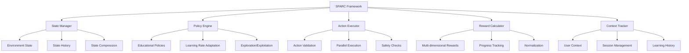
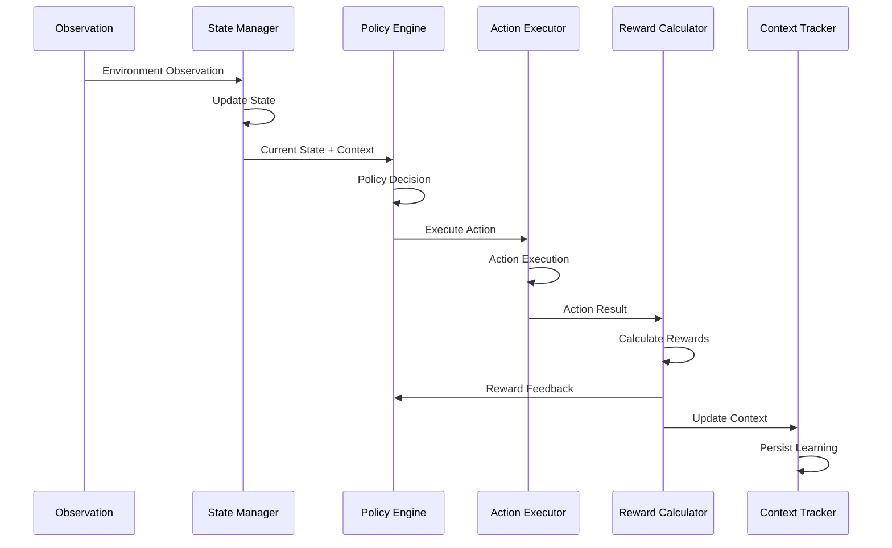

# SPARC Framework Documentation

## Overview

The SPARC (State-Policy-Action-Reward-Context) Framework is a sophisticated decision-making system designed for educational AI agents. It provides a complete cycle of intelligent reasoning, action execution, reward calculation, and context management tailored for educational environments.

## Architecture

### Core Philosophy

SPARC implements a comprehensive reinforcement learning-style cycle optimized for educational contexts:

1. **State**: Environment and learning state tracking
2. **Policy**: Intelligent decision-making based on educational policies
3. **Action**: Safe execution of educational actions
4. **Reward**: Multi-dimensional reward calculation
5. **Context**: Persistent learning context and session management

### System Architecture



### Data Flow



## Core Components

### 1. State Manager

**Purpose**: Tracks and manages environment and learning states

**Key Features**:
- Real-time state tracking
- Historical state management
- State compression for memory efficiency
- State persistence and recovery

```python
class StateManager:
    def __init__(self, history_size: int = 1000, compression_threshold: int = 500):
        self.history_size = history_size
        self.compression_threshold = compression_threshold
        self.state_history = []
        self.current_state = None

    async def update_state(self, observation: Dict[str, Any]) -> EnvironmentState:
        """Update environment state from observation"""

    async def get_recent_states(self, count: int) -> List[EnvironmentState]:
        """Get recent state history"""
```

**Environment State Structure**:
```python
@dataclass
class EnvironmentState:
    timestamp: str
    learning_progress: Dict[str, float]
    student_engagement: float
    content_difficulty: float
    session_duration: float
    interaction_quality: float
    confidence: float
    summary: str
    metadata: Dict[str, Any]
```

### 2. Policy Engine

**Purpose**: Makes intelligent decisions based on educational policies and learning data

**Key Features**:
- Educational policy implementation
- Adaptive learning rate
- Exploration vs exploitation balance
- Policy learning and optimization

```python
class PolicyEngine:
    def __init__(self, learning_rate: float = 0.01, exploration_rate: float = 0.1):
        self.learning_rate = learning_rate
        self.exploration_rate = exploration_rate
        self.policy_network = {}
        self.decision_history = []

    async def decide(self, policy_input: Dict[str, Any]) -> EducationalPolicy:
        """Make policy decision based on current state and context"""

    async def update_policy(self, state, action, reward, next_state):
        """Update policy based on action outcomes"""
```

**Educational Policy Structure**:
```python
@dataclass
class EducationalPolicy:
    action_type: str
    parameters: Dict[str, Any]
    priority: int
    confidence: float
    rationale: str
    next_actions: List[str]
    expected_outcomes: Dict[str, float]
```

### 3. Action Executor

**Purpose**: Safely executes educational actions with validation and monitoring

**Key Features**:
- Action validation and safety checks
- Parallel action execution
- Timeout and retry management
- Action result tracking

```python
class ActionExecutor:
    def __init__(self, max_parallel: int = 5, timeout: float = 30.0):
        self.max_parallel = max_parallel
        self.timeout = timeout
        self.active_actions = {}
        self.safety_validator = SafetyValidator()

    async def execute(self, action: Action) -> ActionResult:
        """Execute action with safety checks and monitoring"""

    async def validate_action(self, action: Action) -> bool:
        """Validate action safety and appropriateness"""
```

**Action Structure**:
```python
@dataclass
class Action:
    type: str
    parameters: Dict[str, Any]
    priority: int
    timeout: float = 30.0
    retry_count: int = 0
    metadata: Dict[str, Any] = field(default_factory=dict)
```

### 4. Reward Calculator

**Purpose**: Calculates multi-dimensional rewards for learning outcomes

**Key Features**:
- Multi-dimensional reward system
- Learning progress tracking
- Engagement measurement
- Curriculum alignment scoring

```python
class RewardCalculator:
    def __init__(self, dimensions: List[str], normalization: bool = True):
        self.dimensions = dimensions
        self.normalization = normalization
        self.reward_history = []
        self.baseline_rewards = {}

    async def calculate_rewards(self, reward_input: Dict[str, Any]) -> RewardSignal:
        """Calculate multi-dimensional rewards"""
```

**Reward Dimensions**:
- **Learning Progress**: Measurable advancement in understanding
- **Engagement**: Student interaction quality and participation
- **Accuracy**: Correctness of responses and problem-solving
- **Creativity**: Novel approaches and creative thinking
- **Collaboration**: Teamwork and peer interaction quality

**Reward Signal Structure**:
```python
@dataclass
class RewardSignal:
    total_reward: float
    dimension_rewards: Dict[str, float]
    normalized_rewards: Dict[str, float]
    progress_indicators: Dict[str, float]
    improvement_areas: List[str]
    celebration_worthy: bool
```

### 5. Context Tracker

**Purpose**: Manages user context, learning history, and session persistence

**Key Features**:
- User context management
- Session tracking
- Learning history persistence
- Context compression and optimization

```python
class ContextTracker:
    def __init__(self, window_size: int = 50, session_timeout: float = 1800.0):
        self.window_size = window_size
        self.session_timeout = session_timeout
        self.user_contexts = {}
        self.active_sessions = {}

    async def update_context(self, context_update: Dict[str, Any]):
        """Update user context with new learning data"""

    async def get_current_context(self) -> UserContext:
        """Get current user context"""
```

## SPARC Framework Configuration

### Default Configuration

```python
@dataclass
class SPARCConfig:
    # State management
    state_history_size: int = 1000
    state_compression_threshold: int = 500
    state_persistence_interval: float = 30.0

    # Policy engine
    policy_learning_rate: float = 0.01
    policy_exploration_rate: float = 0.1
    policy_decay_factor: float = 0.95
    policy_update_frequency: int = 10

    # Action execution
    max_parallel_actions: int = 5
    action_timeout: float = 30.0
    action_retry_attempts: int = 3
    safety_check_enabled: bool = True

    # Reward calculation
    reward_dimensions: List[str] = [
        "learning_progress", "engagement", "accuracy",
        "creativity", "collaboration"
    ]
    reward_normalization: bool = True
    reward_history_size: int = 100

    # Context tracking
    context_window_size: int = 50
    session_timeout: float = 1800.0  # 30 minutes
    context_compression_enabled: bool = True
    learning_history_retention: int = 30  # days
```

### Custom Configuration

```python
# Create custom configuration
config = create_sparc_config(
    policy_learning_rate=0.02,
    max_parallel_actions=10,
    reward_dimensions=["progress", "engagement", "mastery"],
    context_window_size=100
)

# Create SPARC system with custom config
sparc = create_sparc_system(config)
```

## SPARC Cycle Execution

### Complete Cycle

```python
async def execute_sparc_cycle(sparc: SPARCFramework, observation: Dict[str, Any]):
    """Execute a complete SPARC cycle"""

    # Prepare observation
    observation = {
        "student_id": "student_123",
        "current_activity": "math_problem_solving",
        "performance_data": {
            "correct_answers": 8,
            "total_questions": 10,
            "time_spent": 15.5,
            "help_requests": 2
        },
        "engagement_signals": {
            "attention_level": 0.85,
            "interaction_frequency": 12,
            "collaboration_attempts": 3
        }
    }

    # Execute cycle
    result = await sparc.execute_cycle(observation)

    return result
```

### Cycle Response Structure

```python
{
    "cycle_id": 142,
    "timestamp": "2025-09-16T10:30:00Z",
    "duration": 0.245,
    "state": {
        "learning_progress": {"math": 0.75, "problem_solving": 0.68},
        "engagement": 0.85,
        "confidence": 0.72
    },
    "policy_decision": {
        "action_type": "adaptive_difficulty_adjustment",
        "parameters": {"difficulty_level": 0.8, "support_level": 0.3},
        "confidence": 0.91
    },
    "action": {
        "type": "adaptive_difficulty_adjustment",
        "parameters": {"difficulty_level": 0.8},
        "priority": 2
    },
    "action_result": {
        "success": True,
        "output": "Difficulty adjusted successfully",
        "execution_time": 0.12
    },
    "rewards": {
        "total_reward": 0.82,
        "dimension_rewards": {
            "learning_progress": 0.78,
            "engagement": 0.85,
            "accuracy": 0.80,
            "creativity": 0.75,
            "collaboration": 0.92
        }
    },
    "performance": {
        "success_rate": 0.94,
        "average_reward": 0.78,
        "learning_progress": 0.15
    }
}
```

## Integration with AI Agents

### Content Agent Integration

```python
class ContentAgent(BaseAgent):
    def __init__(self, config: Optional[AgentConfig] = None):
        super().__init__(config)

        # Initialize SPARC components
        self.sparc_available = SPARC_AVAILABLE
        if SPARC_AVAILABLE:
            self._init_sparc_components()

    def _init_sparc_components(self):
        """Initialize SPARC framework components"""
        self.state_manager = create_state_manager(
            history_size=100,
            compression_threshold=50
        )
        self.policy_engine = create_policy_engine(
            learning_rate=0.01,
            exploration_rate=0.1
        )
        self.reward_calculator = create_reward_calculator(
            dimensions=["learning_effectiveness", "engagement", "curriculum_alignment"]
        )

    async def _execute_sparc_cycle(self, task_data: Dict[str, Any]) -> Dict[str, Any]:
        """Execute SPARC framework cycle for content generation optimization"""

        # Create observation from task data
        observation = {
            "task_type": "content_generation",
            "subject": task_data.get("context", {}).get("subject", "unknown"),
            "grade_level": task_data.get("context", {}).get("grade_level", "unknown"),
            "content_quality": self._calculate_content_quality_score(task_data.get("content", {})),
            "database_enhanced": self.database_available,
            "timestamp": datetime.now().isoformat()
        }

        # Update state
        current_state = await self.state_manager.update_state(observation)

        # Get policy decision
        policy_input = {
            "state": current_state,
            "context": task_data.get("context", {}),
            "task": task_data.get("task", "")
        }
        policy_decision = await self.policy_engine.decide(policy_input)

        # Execute action
        action = Action(
            type="content_quality_enhancement",
            parameters={
                "enhancement_type": policy_decision.action_type,
                "quality_threshold": 0.8
            },
            priority=1
        )
        action_result = await self.action_executor.execute(action)

        # Calculate rewards
        reward_input = {
            "state": current_state,
            "action": action,
            "result": action_result,
            "quality_metrics": self.quality_metrics
        }
        rewards = await self.reward_calculator.calculate_rewards(reward_input)

        return {
            "sparc_cycle_completed": True,
            "policy_decision": policy_decision.action_type,
            "action_success": action_result.success,
            "total_reward": rewards.total_reward,
            "learning_progress": current_state.learning_progress
        }
```

## Advanced Features

### 1. Adaptive Learning

**Dynamic Policy Adjustment**:
```python
class AdaptivePolicyEngine(PolicyEngine):
    async def adapt_to_learner(self, learner_profile: Dict[str, Any]):
        """Adapt policies to individual learner characteristics"""

        # Adjust learning rate based on learner speed
        if learner_profile.get("learning_speed") == "fast":
            self.learning_rate *= 1.2
        elif learner_profile.get("learning_speed") == "slow":
            self.learning_rate *= 0.8

        # Adjust exploration based on learner confidence
        confidence = learner_profile.get("confidence_level", 0.5)
        self.exploration_rate = max(0.05, 0.2 - confidence * 0.3)
```

### 2. Multi-Agent Coordination

**Shared SPARC Context**:
```python
class SharedSPARCContext:
    def __init__(self):
        self.agents = {}
        self.shared_state = {}
        self.coordination_rewards = {}

    async def coordinate_agents(self, agent_observations: Dict[str, Dict[str, Any]]):
        """Coordinate multiple agents using shared SPARC framework"""

        # Aggregate observations
        combined_state = await self.aggregate_observations(agent_observations)

        # Shared policy decisions
        coordination_policy = await self.get_coordination_policy(combined_state)

        # Distribute actions to agents
        agent_actions = await self.distribute_actions(coordination_policy)

        return agent_actions
```

### 3. Real-time Optimization

**Performance Monitoring**:
```python
class SPARCPerformanceMonitor:
    def __init__(self, sparc_framework: SPARCFramework):
        self.sparc = sparc_framework
        self.performance_metrics = {}
        self.optimization_triggers = {}

    async def monitor_performance(self):
        """Continuously monitor and optimize SPARC performance"""

        current_metrics = await self.sparc.get_framework_status()

        # Check for performance degradation
        if self.detect_performance_issues(current_metrics):
            await self.trigger_optimization()

    async def trigger_optimization(self):
        """Trigger automatic optimization of SPARC components"""

        # Optimize state management
        if self.state_history_growing_too_large():
            await self.sparc.state_manager.compress_history()

        # Optimize policy learning
        if self.policy_convergence_slow():
            self.sparc.policy_engine.adjust_learning_rate(1.1)

        # Optimize reward calculation
        if self.reward_calculation_expensive():
            await self.sparc.reward_calculator.optimize_dimensions()
```

## Educational Applications

### 1. Personalized Learning Paths

```python
async def create_personalized_path(sparc: SPARCFramework, student_profile: Dict[str, Any]):
    """Create personalized learning path using SPARC"""

    # Initial observation
    observation = {
        "student_profile": student_profile,
        "learning_goals": student_profile.get("goals", []),
        "current_mastery": student_profile.get("mastery_levels", {}),
        "preferences": student_profile.get("learning_preferences", {})
    }

    # Execute SPARC cycle for path planning
    result = await sparc.execute_cycle(observation)

    # Extract personalized recommendations
    learning_path = {
        "recommended_activities": result["policy_decision"]["parameters"].get("activities", []),
        "difficulty_progression": result["policy_decision"]["parameters"].get("difficulty_curve", []),
        "support_level": result["policy_decision"]["parameters"].get("support", 0.5),
        "estimated_duration": result["policy_decision"]["expected_outcomes"].get("completion_time", 30)
    }

    return learning_path
```

### 2. Real-time Difficulty Adjustment

```python
async def adjust_difficulty_realtime(sparc: SPARCFramework, performance_data: Dict[str, Any]):
    """Adjust content difficulty in real-time based on performance"""

    observation = {
        "performance_trend": performance_data.get("recent_scores", []),
        "time_per_question": performance_data.get("response_times", []),
        "help_requests": performance_data.get("help_frequency", 0),
        "engagement_signals": performance_data.get("engagement", {})
    }

    result = await sparc.execute_cycle(observation)

    # Apply difficulty adjustments
    if result["policy_decision"]["action_type"] == "increase_difficulty":
        new_difficulty = min(1.0, current_difficulty + 0.1)
    elif result["policy_decision"]["action_type"] == "decrease_difficulty":
        new_difficulty = max(0.1, current_difficulty - 0.1)
    else:
        new_difficulty = current_difficulty

    return {
        "new_difficulty": new_difficulty,
        "adjustment_reason": result["policy_decision"]["rationale"],
        "expected_improvement": result["rewards"]["expected_outcomes"]
    }
```

### 3. Collaborative Learning Optimization

```python
async def optimize_collaboration(sparc: SPARCFramework, group_data: Dict[str, Any]):
    """Optimize collaborative learning experiences"""

    observation = {
        "group_composition": group_data.get("members", []),
        "interaction_patterns": group_data.get("interactions", {}),
        "individual_progress": group_data.get("member_progress", {}),
        "task_complexity": group_data.get("current_task", {}).get("complexity", 0.5)
    }

    result = await sparc.execute_cycle(observation)

    optimization_recommendations = {
        "group_restructuring": result["policy_decision"]["parameters"].get("regroup", False),
        "role_assignments": result["policy_decision"]["parameters"].get("roles", {}),
        "communication_scaffolds": result["policy_decision"]["parameters"].get("scaffolds", []),
        "intervention_timing": result["policy_decision"]["parameters"].get("interventions", [])
    }

    return optimization_recommendations
```

## Performance and Scalability

### Memory Management

**State Compression**:
```python
async def compress_state_history(self):
    """Compress old states to save memory"""
    if len(self.state_history) > self.compression_threshold:
        # Keep recent states, compress older ones
        recent_states = self.state_history[-100:]
        old_states = self.state_history[:-100]

        # Create compressed summary
        compressed_summary = await self.create_state_summary(old_states)

        # Update history
        self.state_history = [compressed_summary] + recent_states
```

**Context Optimization**:
```python
async def optimize_context_storage(self):
    """Optimize context storage for memory efficiency"""

    # Remove redundant context entries
    await self.remove_redundant_contexts()

    # Compress old context data
    await self.compress_historical_contexts()

    # Archive very old contexts
    await self.archive_stale_contexts()
```

### Distributed Processing

**Multi-Instance SPARC**:
```python
class DistributedSPARCFramework:
    def __init__(self, node_id: str, cluster_nodes: List[str]):
        self.node_id = node_id
        self.cluster_nodes = cluster_nodes
        self.local_sparc = SPARCFramework()
        self.coordination_service = ClusterCoordination()

    async def execute_distributed_cycle(self, observation: Dict[str, Any]):
        """Execute SPARC cycle across distributed nodes"""

        # Determine processing node
        target_node = await self.select_processing_node(observation)

        if target_node == self.node_id:
            # Process locally
            result = await self.local_sparc.execute_cycle(observation)
        else:
            # Delegate to remote node
            result = await self.delegate_to_node(target_node, observation)

        # Share results with cluster
        await self.coordination_service.share_results(result)

        return result
```

## Testing and Validation

### Unit Testing

```python
import pytest
from unittest.mock import AsyncMock

@pytest.mark.asyncio
async def test_sparc_cycle_execution():
    """Test complete SPARC cycle execution"""

    # Create test configuration
    config = create_sparc_config(
        state_history_size=10,
        max_parallel_actions=2,
        reward_dimensions=["test_progress", "test_engagement"]
    )

    # Initialize SPARC framework
    sparc = create_sparc_system(config)

    # Test observation
    observation = {
        "student_performance": {"score": 0.8, "time": 30},
        "engagement_level": 0.75,
        "content_difficulty": 0.6
    }

    # Execute cycle
    result = await sparc.execute_cycle(observation)

    # Assertions
    assert result["cycle_id"] == 1
    assert "state" in result
    assert "policy_decision" in result
    assert "action_result" in result
    assert "rewards" in result
    assert result["duration"] > 0
```

### Integration Testing

```python
@pytest.mark.asyncio
async def test_agent_sparc_integration():
    """Test SPARC integration with content agent"""

    # Create content agent with SPARC
    agent = ContentAgent()

    # Test content generation with SPARC optimization
    task_data = {
        "context": {
            "subject": "Mathematics",
            "grade_level": "7",
            "topic": "Algebra Basics"
        },
        "content": {"explanation": "Sample content"},
        "interactive_elements": [],
        "assessments": {}
    }

    # Execute SPARC cycle
    sparc_result = await agent._execute_sparc_cycle(task_data)

    # Verify SPARC integration
    assert sparc_result["sparc_cycle_completed"] == True
    assert "policy_decision" in sparc_result
    assert "total_reward" in sparc_result
    assert sparc_result["action_success"] == True
```

### Performance Testing

```python
@pytest.mark.asyncio
async def test_sparc_performance():
    """Test SPARC framework performance under load"""

    sparc = create_sparc_system()

    # Generate multiple observations
    observations = [
        {"test_data": f"observation_{i}", "value": i * 0.1}
        for i in range(100)
    ]

    # Time execution
    start_time = time.time()

    # Execute cycles
    results = []
    for obs in observations:
        result = await sparc.execute_cycle(obs)
        results.append(result)

    end_time = time.time()
    total_time = end_time - start_time

    # Performance assertions
    assert len(results) == 100
    assert total_time < 10.0  # Should complete in under 10 seconds
    assert all(r["duration"] < 0.5 for r in results)  # Each cycle under 0.5s
```

## Troubleshooting

### Common Issues

1. **Memory Leaks**:
   - **Symptom**: Increasing memory usage over time
   - **Solution**: Enable state compression and context archiving
   - **Prevention**: Regular cleanup of old data

2. **Slow Policy Learning**:
   - **Symptom**: Policy decisions not improving over time
   - **Solution**: Adjust learning rate and exploration parameters
   - **Prevention**: Monitor policy performance metrics

3. **Action Execution Timeouts**:
   - **Symptom**: Actions frequently timing out
   - **Solution**: Increase timeout values or reduce parallel actions
   - **Prevention**: Monitor system resources

### Debugging Tools

```python
# Enable detailed logging
logging.getLogger("core.sparc").setLevel(logging.DEBUG)

# Monitor framework status
status = await sparc.get_framework_status()
print(json.dumps(status, indent=2))

# Track performance metrics
performance = sparc.performance_metrics
for cycle_id, metrics in performance.items():
    print(f"Cycle {cycle_id}: {metrics}")

# Reset framework if needed
await sparc.reset_framework()
```

## Future Enhancements

### Planned Features

1. **Advanced Neural Policies**:
   - Deep reinforcement learning integration
   - Neural network-based policy engines
   - Transfer learning capabilities

2. **Multi-Modal Context**:
   - Vision and audio context integration
   - Gesture and expression recognition
   - Multi-sensory feedback

3. **Federated Learning**:
   - Cross-institution learning
   - Privacy-preserving collaboration
   - Distributed policy optimization

### Research Directions

1. **Causal Reasoning**:
   - Causal policy decisions
   - Intervention analysis
   - Counterfactual learning

2. **Meta-Learning**:
   - Learning to learn faster
   - Few-shot policy adaptation
   - Cross-domain transfer

3. **Explainable AI**:
   - Interpretable policy decisions
   - Transparent reward calculation
   - Educational explanation generation

---

*Last Updated: September 16, 2025*
*Version: 1.0.0*
*Next Review: December 2025*