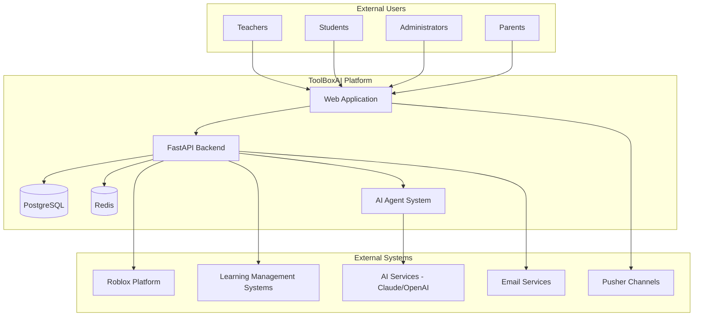

# Detailed System Architecture

This document provides an in-depth technical analysis of the ToolBoxAI Solutions architecture, covering system components, data flow, integration patterns, and scalability considerations.

## Table of Contents

1. [Architecture Overview](#architecture-overview)
2. [Component Architecture](#component-architecture)
3. [Data Architecture](#data-architecture)
4. [Integration Architecture](#integration-architecture)
5. [AI Agent System Architecture](#ai-agent-system-architecture)
6. [Security Architecture](#security-architecture)
7. [Scalability and Performance](#scalability-and-performance)
8. [Deployment Architecture](#deployment-architecture)

## Architecture Overview

### System Context Diagram



### High-Level Architecture Principles

#### Design Philosophy
- **Microservices-Ready**: Modular design enabling future service decomposition
- **Event-Driven**: Asynchronous processing for better user experience
- **AI-First**: Built around AI capabilities with human oversight
- **Educational Focus**: Purpose-built for educational workflows and compliance
- **Scalable Foundation**: Architecture supports growth from classrooms to districts

#### Key Architectural Patterns
- **CQRS (Command Query Responsibility Segregation)**: Separate read and write operations
- **Event Sourcing**: Track state changes for audit and replay capabilities
- **Repository Pattern**: Abstract data access layer
- **Dependency Injection**: Loose coupling and testability
- **Circuit Breaker**: Resilience for external service calls

## Component Architecture

### Frontend Architecture (React Dashboard)

#### Component Hierarchy
```
App
├── AuthProvider
│   ├── Router
│   │   ├── PublicRoutes
│   │   │   ├── Login
│   │   │   ├── Register
│   │   │   └── ForgotPassword
│   │   └── ProtectedRoutes
│   │       ├── DashboardLayout
│   │       │   ├── Header
│   │       │   ├── Sidebar
│   │       │   └── MainContent
│   │       ├── TeacherRoutes
│   │       │   ├── ContentCreator
│   │       │   ├── ClassManagement
│   │       │   └── Analytics
│   │       ├── StudentRoutes
│   │       │   ├── LessonBrowser
│   │       │   ├── ProgressTracker
│   │       │   └── Achievements
│   │       └── AdminRoutes
│   │           ├── UserManagement
│   │           ├── SystemConfig
│   │           └── SystemMonitoring
└── GlobalProviders
    ├── ThemeProvider
    ├── QueryProvider
    ├── NotificationProvider
    └── PusherProvider
```

#### State Management Architecture
```typescript
// Redux Store Structure
interface RootState {
  auth: {
    user: User | null;
    token: string | null;
    isAuthenticated: boolean;
    loading: boolean;
  };
  ui: {
    theme: 'light' | 'dark';
    sidebar: {
      isOpen: boolean;
      activeSection: string;
    };
    notifications: Notification[];
  };
  content: {
    lessons: Lesson[];
    currentLesson: Lesson | null;
    generationStatus: GenerationStatus;
  };
  classes: {
    userClasses: Class[];
    currentClass: Class | null;
    students: Student[];
  };
  realtime: {
    connected: boolean;
    channels: string[];
    lastUpdate: timestamp;
  };
}
```

#### Component Design Patterns

**Higher-Order Components (HOCs)**:
```typescript
// withAuth HOC for protected routes
export const withAuth = <P extends object>(
  Component: React.ComponentType<P>,
  requiredRole?: UserRole
) => {
  return (props: P) => {
    const { user, isAuthenticated } = useAuth();

    if (!isAuthenticated) {
      return <Navigate to="/login" />;
    }

    if (requiredRole && user?.role !== requiredRole) {
      return <AccessDenied />;
    }

    return <Component {...props} />;
  };
};

// withErrorBoundary HOC for error handling
export const withErrorBoundary = <P extends object>(
  Component: React.ComponentType<P>
) => {
  return (props: P) => (
    <ErrorBoundary>
      <Component {...props} />
    </ErrorBoundary>
  );
};
```

**Custom Hooks Pattern**:
```typescript
// useRealtime hook for Pusher integration
export const useRealtime = (channels: string[]) => {
  const [connected, setConnected] = useState(false);
  const [lastUpdate, setLastUpdate] = useState<Date | null>(null);

  useEffect(() => {
    const pusher = new Pusher(config.pusher.key, {
      cluster: config.pusher.cluster,
      authEndpoint: '/api/v1/pusher/auth'
    });

    channels.forEach(channelName => {
      const channel = pusher.subscribe(channelName);
      channel.bind_global((eventName: string, data: any) => {
        setLastUpdate(new Date());
        // Handle event based on type
      });
    });

    setConnected(true);

    return () => {
      pusher.disconnect();
      setConnected(false);
    };
  }, [channels]);

  return { connected, lastUpdate };
};
```

### Backend Architecture (FastAPI)

#### Application Structure
```
apps/backend/
├── main.py                    # Application entry point
├── api/                       # API layer
│   ├── v1/                   # API version 1
│   │   ├── endpoints/        # API endpoints
│   │   └── dependencies.py   # Shared dependencies
│   └── middleware/           # Custom middleware
├── core/                     # Core business logic
│   ├── auth/                 # Authentication
│   ├── config/               # Configuration
│   ├── database/             # Database utilities
│   └── exceptions/           # Custom exceptions
├── models/                   # Data models
│   ├── database/             # SQLAlchemy models
│   └── schemas/              # Pydantic schemas
├── services/                 # Business services
│   ├── user_service.py
│   ├── content_service.py
│   └── ai_service.py
└── utils/                    # Utility functions
```

#### Dependency Injection System
```python
# Dependency injection container
class Container:
    def __init__(self):
        self._services = {}
        self._singletons = {}

    def register_transient(self, interface: Type[T], implementation: Type[T]):
        """Register a transient service (new instance each time)."""
        self._services[interface] = implementation

    def register_singleton(self, interface: Type[T], implementation: Type[T]):
        """Register a singleton service (same instance always)."""
        self._singletons[interface] = implementation

    def resolve(self, interface: Type[T]) -> T:
        """Resolve a service instance."""
        if interface in self._singletons:
            if interface not in self._instances:
                self._instances[interface] = self._singletons[interface]()
            return self._instances[interface]

        if interface in self._services:
            return self._services[interface]()

        raise ServiceNotRegisteredError(f"Service {interface} not registered")

# Usage in FastAPI
def get_container() -> Container:
    return container

def get_user_service(
    container: Container = Depends(get_container)
) -> UserService:
    return container.resolve(IUserService)
```

#### Request/Response Flow
```python
# Middleware stack (executed in order)
@app.middleware("http")
async def correlation_id_middleware(request: Request, call_next):
    """Add correlation ID to all requests."""
    correlation_id = str(uuid.uuid4())
    request.state.correlation_id = correlation_id

    response = await call_next(request)
    response.headers["X-Correlation-ID"] = correlation_id
    return response

@app.middleware("http")
async def timing_middleware(request: Request, call_next):
    """Add timing information to responses."""
    start_time = time.time()
    response = await call_next(request)
    process_time = time.time() - start_time
    response.headers["X-Process-Time"] = str(process_time)
    return response

# Request flow:
# 1. Middleware stack (pre-processing)
# 2. Route handler with dependencies
# 3. Business service layer
# 4. Data access layer
# 5. Response serialization
# 6. Middleware stack (post-processing)
```

### Database Architecture

#### Entity Relationship Model
```mermaid
erDiagram
    User {
        uuid id PK
        string email UK
        string username UK
        string password_hash
        enum role
        string roblox_user_id UK
        boolean is_active
        timestamp created_at
    }

    Class {
        uuid id PK
        string name
        uuid teacher_id FK
        string subject
        integer grade_level
        integer max_students
        boolean is_active
        timestamp created_at
    }

    Lesson {
        uuid id PK
        string title
        uuid creator_id FK
        string subject
        integer grade_level
        json content
        enum status
        timestamp created_at
    }

    Progress {
        uuid id PK
        uuid student_id FK
        uuid lesson_id FK
        integer completion_percentage
        integer xp_earned
        json metadata
        timestamp started_at
        timestamp completed_at
    }

    User ||--o{ Class : teaches
    User ||--o{ Progress : completes
    Class ||--o{ Lesson : contains
    Lesson ||--o{ Progress : tracks
```

#### Data Access Patterns

**Repository Pattern Implementation**:
```python
# Base repository
class BaseRepository(Generic[T]):
    def __init__(self, session: AsyncSession, model: Type[T]):
        self.session = session
        self.model = model

    async def get(self, id: Any) -> Optional[T]:
        result = await self.session.get(self.model, id)
        return result

    async def create(self, entity: T) -> T:
        self.session.add(entity)
        await self.session.commit()
        await self.session.refresh(entity)
        return entity

    async def update(self, entity: T) -> T:
        await self.session.commit()
        await self.session.refresh(entity)
        return entity

    async def delete(self, entity: T) -> None:
        await self.session.delete(entity)
        await self.session.commit()

    async def list(
        self,
        filters: Optional[Dict[str, Any]] = None,
        offset: int = 0,
        limit: int = 100
    ) -> List[T]:
        query = select(self.model)

        if filters:
            for key, value in filters.items():
                query = query.where(getattr(self.model, key) == value)

        query = query.offset(offset).limit(limit)
        result = await self.session.execute(query)
        return result.scalars().all()

# Specialized repository
class UserRepository(BaseRepository[User]):
    async def get_by_email(self, email: str) -> Optional[User]:
        query = select(User).where(User.email == email)
        result = await self.session.execute(query)
        return result.scalar_one_or_none()

    async def get_active_users(self) -> List[User]:
        query = select(User).where(User.is_active == True)
        result = await self.session.execute(query)
        return result.scalars().all()
```

**Unit of Work Pattern**:
```python
class UnitOfWork:
    def __init__(self, session_factory: Callable[[], AsyncSession]):
        self.session_factory = session_factory
        self._session: Optional[AsyncSession] = None

    async def __aenter__(self):
        self._session = self.session_factory()
        self.users = UserRepository(self._session, User)
        self.classes = ClassRepository(self._session, Class)
        self.lessons = LessonRepository(self._session, Lesson)
        return self

    async def __aexit__(self, exc_type, exc_val, exc_tb):
        if exc_type:
            await self._session.rollback()
        else:
            await self._session.commit()
        await self._session.close()

# Usage
async def create_class_with_students(
    class_data: ClassCreate,
    student_emails: List[str]
) -> Class:
    async with UnitOfWork(get_session) as uow:
        # Create class
        new_class = await uow.classes.create(Class(**class_data.dict()))

        # Add students
        for email in student_emails:
            student = await uow.users.get_by_email(email)
            if student:
                enrollment = ClassEnrollment(
                    class_id=new_class.id,
                    student_id=student.id
                )
                await uow.enrollments.create(enrollment)

        return new_class
```

## Integration Architecture

### AI Service Integration

#### AI Agent Orchestration
```python
# Agent coordination system
class AgentOrchestrator:
    def __init__(self):
        self.agents = {
            'content': ContentAgent(),
            'environment': EnvironmentAgent(),
            'assessment': AssessmentAgent(),
            'validation': ValidationAgent()
        }
        self.workflow_engine = WorkflowEngine()

    async def generate_lesson(
        self,
        request: ContentGenerationRequest
    ) -> ContentGenerationResult:
        """Orchestrate multiple agents to generate comprehensive lesson."""

        # Create workflow context
        context = WorkflowContext(
            request=request,
            correlation_id=str(uuid.uuid4()),
            timestamp=datetime.utcnow()
        )

        # Define workflow steps
        workflow = Workflow([
            WorkflowStep(
                name="analyze_requirements",
                agent=self.agents['content'],
                inputs=['request'],
                outputs=['lesson_structure']
            ),
            WorkflowStep(
                name="create_environment",
                agent=self.agents['environment'],
                inputs=['lesson_structure'],
                outputs=['environment_config']
            ),
            WorkflowStep(
                name="generate_assessments",
                agent=self.agents['assessment'],
                inputs=['lesson_structure'],
                outputs=['assessment_config']
            ),
            WorkflowStep(
                name="validate_content",
                agent=self.agents['validation'],
                inputs=['lesson_structure', 'environment_config', 'assessment_config'],
                outputs=['validation_result']
            )
        ])

        # Execute workflow
        result = await self.workflow_engine.execute(workflow, context)

        return ContentGenerationResult(
            content_id=str(uuid.uuid4()),
            lesson_content=result.outputs['lesson_structure'],
            environment_config=result.outputs['environment_config'],
            assessment_config=result.outputs['assessment_config'],
            validation_result=result.outputs['validation_result']
        )
```

#### External AI Service Integration
```python
# AI service abstraction
class AIServiceProvider(ABC):
    @abstractmethod
    async def generate_completion(
        self,
        prompt: str,
        model: str,
        max_tokens: int = 1000
    ) -> str:
        pass

    @abstractmethod
    async def generate_streaming(
        self,
        prompt: str,
        model: str,
        callback: Callable[[str], None]
    ) -> None:
        pass

# Anthropic implementation
class AnthropicProvider(AIServiceProvider):
    def __init__(self, api_key: str):
        self.client = anthropic.AsyncAnthropic(api_key=api_key)

    async def generate_completion(
        self,
        prompt: str,
        model: str = "claude-3-sonnet-20240229",
        max_tokens: int = 1000
    ) -> str:
        message = await self.client.messages.create(
            model=model,
            max_tokens=max_tokens,
            messages=[{"role": "user", "content": prompt}]
        )
        return message.content[0].text

    async def generate_streaming(
        self,
        prompt: str,
        model: str = "claude-3-sonnet-20240229",
        callback: Callable[[str], None]
    ) -> None:
        async with self.client.messages.stream(
            model=model,
            max_tokens=1000,
            messages=[{"role": "user", "content": prompt}]
        ) as stream:
            async for text in stream.text_stream:
                callback(text)

# Service factory with fallback
class AIServiceFactory:
    def __init__(self):
        self.providers = [
            AnthropicProvider(settings.anthropic_api_key),
            OpenAIProvider(settings.openai_api_key)
        ]

    async def get_completion(self, prompt: str) -> str:
        for provider in self.providers:
            try:
                return await provider.generate_completion(prompt)
            except Exception as e:
                logger.warning(f"Provider failed: {e}")
                continue

        raise AIServiceUnavailableError("All AI providers failed")
```

### Roblox Platform Integration

#### Roblox API Client
```python
class RobloxAPIClient:
    def __init__(self, api_key: str):
        self.api_key = api_key
        self.base_url = "https://apis.roblox.com"
        self.session = httpx.AsyncClient()

    async def create_place(self, universe_id: str, place_config: PlaceConfig) -> Place:
        """Create a new place in a Roblox universe."""
        response = await self.session.post(
            f"{self.base_url}/universes/{universe_id}/places",
            headers={"Authorization": f"Bearer {self.api_key}"},
            json=place_config.dict()
        )
        response.raise_for_status()
        return Place.parse_obj(response.json())

    async def upload_place_file(self, place_id: str, rbxl_content: bytes) -> None:
        """Upload a place file to Roblox."""
        response = await self.session.post(
            f"{self.base_url}/places/{place_id}/upload",
            headers={"Authorization": f"Bearer {self.api_key}"},
            files={"file": ("place.rbxl", rbxl_content, "application/octet-stream")}
        )
        response.raise_for_status()

    async def get_place_info(self, place_id: str) -> PlaceInfo:
        """Get information about a Roblox place."""
        response = await self.session.get(
            f"{self.base_url}/places/{place_id}",
            headers={"Authorization": f"Bearer {self.api_key}"}
        )
        response.raise_for_status()
        return PlaceInfo.parse_obj(response.json())
```

#### Content Deployment Pipeline
```python
class RobloxDeploymentService:
    def __init__(self, roblox_client: RobloxAPIClient):
        self.roblox_client = roblox_client
        self.template_engine = RobloxTemplateEngine()

    async def deploy_lesson_content(
        self,
        lesson: Lesson,
        environment_config: EnvironmentConfig
    ) -> DeploymentResult:
        """Deploy generated lesson content to Roblox."""

        try:
            # Generate Roblox place file
            place_data = await self.template_engine.generate_place(
                lesson_content=lesson.content,
                environment_config=environment_config
            )

            # Create or update Roblox place
            if lesson.roblox_place_id:
                # Update existing place
                await self.roblox_client.upload_place_file(
                    lesson.roblox_place_id,
                    place_data
                )
                place_id = lesson.roblox_place_id
            else:
                # Create new place
                place = await self.roblox_client.create_place(
                    universe_id=settings.roblox_universe_id,
                    place_config=PlaceConfig(
                        name=lesson.title,
                        description=lesson.description
                    )
                )
                place_id = place.id

                # Upload content
                await self.roblox_client.upload_place_file(place_id, place_data)

            # Update lesson with Roblox information
            lesson.roblox_place_id = place_id
            lesson.roblox_place_url = f"https://www.roblox.com/games/{place_id}"

            return DeploymentResult(
                success=True,
                place_id=place_id,
                place_url=lesson.roblox_place_url
            )

        except Exception as e:
            logger.error(f"Deployment failed: {e}")
            return DeploymentResult(
                success=False,
                error=str(e)
            )
```

### Real-time Communication Architecture

#### WebSocket and Pusher Integration
```python
# WebSocket manager
class WebSocketManager:
    def __init__(self):
        self.active_connections: Dict[str, WebSocket] = {}
        self.user_connections: Dict[str, List[str]] = {}

    async def connect(self, websocket: WebSocket, user_id: str, connection_id: str):
        await websocket.accept()
        self.active_connections[connection_id] = websocket

        if user_id not in self.user_connections:
            self.user_connections[user_id] = []
        self.user_connections[user_id].append(connection_id)

    async def disconnect(self, connection_id: str, user_id: str):
        if connection_id in self.active_connections:
            del self.active_connections[connection_id]

        if user_id in self.user_connections:
            self.user_connections[user_id].remove(connection_id)
            if not self.user_connections[user_id]:
                del self.user_connections[user_id]

    async def send_to_user(self, user_id: str, message: dict):
        """Send message to all connections for a user."""
        if user_id in self.user_connections:
            for connection_id in self.user_connections[user_id]:
                websocket = self.active_connections.get(connection_id)
                if websocket:
                    try:
                        await websocket.send_json(message)
                    except Exception as e:
                        logger.error(f"Failed to send message: {e}")
                        await self.disconnect(connection_id, user_id)

    async def broadcast_to_channel(self, channel: str, message: dict):
        """Broadcast message to all users in a channel."""
        # Implementation depends on channel membership tracking
        pass

# Pusher service
class PusherService:
    def __init__(self, pusher_client):
        self.pusher = pusher_client

    async def trigger_event(
        self,
        channel: str,
        event: str,
        data: dict,
        socket_id: Optional[str] = None
    ):
        """Trigger a Pusher event."""
        try:
            self.pusher.trigger(
                channel,
                event,
                data,
                socket_id=socket_id
            )
        except Exception as e:
            logger.error(f"Failed to trigger Pusher event: {e}")

    async def authenticate_channel(
        self,
        socket_id: str,
        channel_name: str,
        user_data: Optional[dict] = None
    ) -> dict:
        """Authenticate a private or presence channel."""
        if channel_name.startswith('presence-'):
            return self.pusher.authenticate(
                channel=channel_name,
                socket_id=socket_id,
                custom_data=user_data
            )
        else:
            return self.pusher.authenticate(
                channel=channel_name,
                socket_id=socket_id
            )
```

## AI Agent System Architecture

### SPARC Framework Implementation

#### SPARC Components
```python
# Specification phase
class SpecificationAgent:
    async def analyze_requirements(
        self,
        user_request: ContentGenerationRequest
    ) -> LessonSpecification:
        """Analyze user requirements and create detailed specification."""

        prompt = f"""
        Analyze this educational content request and create a detailed specification:

        Subject: {user_request.subject}
        Grade Level: {user_request.grade_level}
        Learning Objectives: {user_request.learning_objectives}
        Duration: {user_request.duration_minutes} minutes

        Provide a structured specification including:
        1. Detailed learning objectives with measurable outcomes
        2. Content structure and key concepts
        3. Interactive elements and activities
        4. Assessment criteria
        5. Prerequisite knowledge
        """

        specification_text = await self.ai_service.generate_completion(prompt)
        return LessonSpecification.parse_from_text(specification_text)

# Pseudocode phase
class PseudocodeAgent:
    async def create_lesson_pseudocode(
        self,
        specification: LessonSpecification
    ) -> LessonPseudocode:
        """Create pseudocode for lesson implementation."""

        prompt = f"""
        Create detailed pseudocode for implementing this lesson:

        Specification: {specification.to_text()}

        Include:
        1. Lesson flow and structure
        2. Interactive element definitions
        3. Assessment integration points
        4. 3D environment requirements
        5. Student progression logic
        """

        pseudocode_text = await self.ai_service.generate_completion(prompt)
        return LessonPseudocode.parse_from_text(pseudocode_text)

# Architecture phase
class ArchitectureAgent:
    async def design_lesson_architecture(
        self,
        pseudocode: LessonPseudocode
    ) -> LessonArchitecture:
        """Design the technical architecture for the lesson."""

        return LessonArchitecture(
            components=self._identify_components(pseudocode),
            data_flow=self._design_data_flow(pseudocode),
            interfaces=self._define_interfaces(pseudocode),
            environment_specs=self._create_environment_specs(pseudocode)
        )

# Refinement phase
class RefinementAgent:
    async def refine_lesson_design(
        self,
        architecture: LessonArchitecture,
        feedback: Optional[List[FeedbackItem]] = None
    ) -> RefinedLessonDesign:
        """Refine the lesson design based on architecture and feedback."""

        refinements = []

        # Apply educational best practices
        refinements.extend(self._apply_pedagogical_principles(architecture))

        # Incorporate feedback
        if feedback:
            refinements.extend(self._process_feedback(feedback))

        # Optimize for platform constraints
        refinements.extend(self._optimize_for_roblox(architecture))

        return RefinedLessonDesign(
            architecture=architecture,
            refinements=refinements,
            quality_score=self._calculate_quality_score(architecture)
        )

# Code generation phase
class CodeGenerationAgent:
    async def generate_lesson_implementation(
        self,
        refined_design: RefinedLessonDesign
    ) -> LessonImplementation:
        """Generate the actual lesson implementation."""

        # Generate Lua scripts for Roblox
        roblox_scripts = await self._generate_roblox_scripts(refined_design)

        # Generate web interface components
        web_components = await self._generate_web_components(refined_design)

        # Generate assessment configurations
        assessments = await self._generate_assessments(refined_design)

        # Generate progress tracking
        progress_tracking = await self._generate_progress_tracking(refined_design)

        return LessonImplementation(
            roblox_scripts=roblox_scripts,
            web_components=web_components,
            assessments=assessments,
            progress_tracking=progress_tracking,
            metadata=self._generate_metadata(refined_design)
        )
```

### Agent Coordination System

#### Workflow Engine
```python
class WorkflowEngine:
    def __init__(self):
        self.step_executors = {}
        self.event_bus = EventBus()

    async def execute_workflow(
        self,
        workflow: Workflow,
        context: WorkflowContext
    ) -> WorkflowResult:
        """Execute a workflow with proper error handling and monitoring."""

        result = WorkflowResult(workflow_id=workflow.id, context=context)

        try:
            for step in workflow.steps:
                step_result = await self._execute_step(step, context)
                result.step_results[step.name] = step_result

                # Update context with step outputs
                context.data.update(step_result.outputs)

                # Publish step completion event
                await self.event_bus.publish(StepCompletedEvent(
                    workflow_id=workflow.id,
                    step_name=step.name,
                    result=step_result
                ))

                # Check for early termination conditions
                if step_result.should_terminate:
                    break

            result.status = WorkflowStatus.COMPLETED

        except Exception as e:
            result.status = WorkflowStatus.FAILED
            result.error = str(e)
            logger.error(f"Workflow {workflow.id} failed: {e}")

        finally:
            # Publish workflow completion event
            await self.event_bus.publish(WorkflowCompletedEvent(
                workflow_id=workflow.id,
                result=result
            ))

        return result

    async def _execute_step(
        self,
        step: WorkflowStep,
        context: WorkflowContext
    ) -> StepResult:
        """Execute a single workflow step."""

        # Prepare step inputs
        inputs = {}
        for input_name in step.inputs:
            if input_name in context.data:
                inputs[input_name] = context.data[input_name]
            else:
                raise WorkflowExecutionError(
                    f"Required input '{input_name}' not found in context"
                )

        # Execute step
        start_time = time.time()
        try:
            outputs = await step.agent.execute(inputs)
            execution_time = time.time() - start_time

            return StepResult(
                step_name=step.name,
                status=StepStatus.COMPLETED,
                outputs=outputs,
                execution_time=execution_time
            )

        except Exception as e:
            execution_time = time.time() - start_time
            return StepResult(
                step_name=step.name,
                status=StepStatus.FAILED,
                error=str(e),
                execution_time=execution_time
            )
```

## Security Architecture

### Authentication and Authorization

#### JWT Token Architecture
```python
# Token service with refresh capability
class TokenService:
    def __init__(self, secret_key: str, algorithm: str = "HS256"):
        self.secret_key = secret_key
        self.algorithm = algorithm
        self.access_token_expire_minutes = 30
        self.refresh_token_expire_days = 7

    def create_token_pair(self, user: User) -> TokenPair:
        """Create access and refresh token pair."""

        # Access token with short expiration
        access_payload = {
            "sub": user.email,
            "user_id": str(user.id),
            "role": user.role.value,
            "type": "access",
            "exp": datetime.utcnow() + timedelta(minutes=self.access_token_expire_minutes),
            "iat": datetime.utcnow()
        }

        # Refresh token with longer expiration
        refresh_payload = {
            "sub": user.email,
            "user_id": str(user.id),
            "type": "refresh",
            "exp": datetime.utcnow() + timedelta(days=self.refresh_token_expire_days),
            "iat": datetime.utcnow()
        }

        access_token = jwt.encode(access_payload, self.secret_key, algorithm=self.algorithm)
        refresh_token = jwt.encode(refresh_payload, self.secret_key, algorithm=self.algorithm)

        return TokenPair(
            access_token=access_token,
            refresh_token=refresh_token,
            token_type="bearer",
            expires_in=self.access_token_expire_minutes * 60
        )

    def verify_token(self, token: str, token_type: str = "access") -> Optional[dict]:
        """Verify and decode a JWT token."""
        try:
            payload = jwt.decode(token, self.secret_key, algorithms=[self.algorithm])

            if payload.get("type") != token_type:
                return None

            return payload

        except JWTError:
            return None

    def refresh_access_token(self, refresh_token: str) -> Optional[str]:
        """Generate new access token from valid refresh token."""
        payload = self.verify_token(refresh_token, "refresh")
        if not payload:
            return None

        # Create new access token
        access_payload = {
            "sub": payload["sub"],
            "user_id": payload["user_id"],
            "role": payload["role"],
            "type": "access",
            "exp": datetime.utcnow() + timedelta(minutes=self.access_token_expire_minutes),
            "iat": datetime.utcnow()
        }

        return jwt.encode(access_payload, self.secret_key, algorithm=self.algorithm)
```

#### Role-Based Access Control (RBAC)
```python
# Permission system
class Permission(Enum):
    READ_OWN_PROFILE = "read:own_profile"
    UPDATE_OWN_PROFILE = "update:own_profile"
    READ_STUDENTS = "read:students"
    MANAGE_CLASSES = "manage:classes"
    CREATE_CONTENT = "create:content"
    MODERATE_CONTENT = "moderate:content"
    ADMIN_USERS = "admin:users"
    ADMIN_SYSTEM = "admin:system"

class Role(Enum):
    STUDENT = "student"
    TEACHER = "teacher"
    ADMIN = "admin"
    PARENT = "parent"

# Role-permission mapping
ROLE_PERMISSIONS = {
    Role.STUDENT: [
        Permission.READ_OWN_PROFILE,
        Permission.UPDATE_OWN_PROFILE
    ],
    Role.TEACHER: [
        Permission.READ_OWN_PROFILE,
        Permission.UPDATE_OWN_PROFILE,
        Permission.READ_STUDENTS,
        Permission.MANAGE_CLASSES,
        Permission.CREATE_CONTENT
    ],
    Role.ADMIN: [
        # Admins get all permissions
        *list(Permission)
    ],
    Role.PARENT: [
        Permission.READ_OWN_PROFILE,
        Permission.UPDATE_OWN_PROFILE,
        # Can read children's data (implemented in business logic)
    ]
}

# Authorization service
class AuthorizationService:
    def user_has_permission(self, user: User, permission: Permission) -> bool:
        """Check if user has specific permission."""
        user_role = Role(user.role)
        return permission in ROLE_PERMISSIONS.get(user_role, [])

    def require_permission(self, permission: Permission):
        """Dependency to require specific permission."""
        def permission_checker(current_user: User = Depends(get_current_user)):
            if not self.user_has_permission(current_user, permission):
                raise HTTPException(
                    status_code=status.HTTP_403_FORBIDDEN,
                    detail=f"Permission '{permission.value}' required"
                )
            return current_user
        return permission_checker

    def can_access_resource(
        self,
        user: User,
        resource_type: str,
        resource_id: str,
        action: str
    ) -> bool:
        """Check if user can perform action on specific resource."""

        # Resource-specific access control logic
        if resource_type == "student_data":
            if user.role == "teacher":
                # Teachers can access their students' data
                return self._is_teacher_of_student(user.id, resource_id)
            elif user.role == "parent":
                # Parents can access their children's data
                return self._is_parent_of_student(user.id, resource_id)
            elif user.role == "admin":
                return True
            elif str(user.id) == resource_id:
                # Users can access their own data
                return True

        return False
```

### Data Protection and Privacy

#### Data Encryption
```python
# Field-level encryption for sensitive data
class EncryptedField:
    def __init__(self, field_type=String, encryption_key: str = None):
        self.field_type = field_type
        self.encryption_key = encryption_key or settings.field_encryption_key
        self.cipher = Fernet(self.encryption_key.encode())

    def process_bind_param(self, value, dialect):
        """Encrypt value before storing in database."""
        if value is not None:
            encrypted_value = self.cipher.encrypt(value.encode())
            return encrypted_value.decode()
        return value

    def process_result_value(self, value, dialect):
        """Decrypt value after retrieving from database."""
        if value is not None:
            decrypted_value = self.cipher.decrypt(value.encode())
            return decrypted_value.decode()
        return value

# Usage in models
class Student(Base):
    __tablename__ = "students"

    id = Column(UUID, primary_key=True)
    email = Column(String, unique=True, index=True)
    # Encrypt sensitive personal information
    ssn = Column(EncryptedField())
    parent_contact = Column(EncryptedField())
```

#### Audit Logging
```python
# Audit logging system
class AuditLogger:
    def __init__(self, db_session: Session):
        self.db_session = db_session

    async def log_action(
        self,
        user_id: str,
        action: str,
        resource_type: str,
        resource_id: str,
        details: Optional[dict] = None,
        ip_address: Optional[str] = None
    ):
        """Log user action for audit trail."""

        audit_entry = AuditLog(
            id=str(uuid.uuid4()),
            user_id=user_id,
            action=action,
            resource_type=resource_type,
            resource_id=resource_id,
            details=details or {},
            ip_address=ip_address,
            timestamp=datetime.utcnow()
        )

        self.db_session.add(audit_entry)
        await self.db_session.commit()

# Audit middleware
@app.middleware("http")
async def audit_middleware(request: Request, call_next):
    """Log all API requests for audit purposes."""

    # Skip health checks and static files
    if request.url.path in ["/health", "/metrics"] or request.url.path.startswith("/static"):
        return await call_next(request)

    start_time = time.time()
    response = await call_next(request)
    process_time = time.time() - start_time

    # Log request details
    audit_data = {
        "method": request.method,
        "url": str(request.url),
        "status_code": response.status_code,
        "process_time": process_time,
        "user_agent": request.headers.get("user-agent"),
        "ip_address": request.client.host if request.client else None
    }

    # Add user context if available
    if hasattr(request.state, "user"):
        audit_data["user_id"] = str(request.state.user.id)

    logger.info("API Request", extra=audit_data)

    return response
```

## Scalability and Performance

### Horizontal Scaling Architecture

#### Database Scaling Strategy
```python
# Database read/write splitting
class DatabaseRouter:
    def __init__(self):
        self.write_engine = create_async_engine(settings.write_database_url)
        self.read_engines = [
            create_async_engine(url) for url in settings.read_database_urls
        ]
        self.current_read_index = 0

    def get_write_session(self) -> AsyncSession:
        """Get session for write operations."""
        return AsyncSession(self.write_engine)

    def get_read_session(self) -> AsyncSession:
        """Get session for read operations with load balancing."""
        engine = self.read_engines[self.current_read_index]
        self.current_read_index = (self.current_read_index + 1) % len(self.read_engines)
        return AsyncSession(engine)

# Repository with read/write splitting
class ScalableRepository(BaseRepository[T]):
    def __init__(self, db_router: DatabaseRouter, model: Type[T]):
        self.db_router = db_router
        self.model = model

    async def get(self, id: Any) -> Optional[T]:
        """Read operation - use read replica."""
        async with self.db_router.get_read_session() as session:
            return await session.get(self.model, id)

    async def create(self, entity: T) -> T:
        """Write operation - use primary database."""
        async with self.db_router.get_write_session() as session:
            session.add(entity)
            await session.commit()
            await session.refresh(entity)
            return entity
```

#### Caching Architecture
```python
# Multi-level caching system
class CacheManager:
    def __init__(self):
        # L1: In-memory cache (fastest, smallest)
        self.l1_cache = TTLCache(maxsize=1000, ttl=300)  # 5 minutes

        # L2: Redis cache (fast, larger)
        self.l2_cache = redis.Redis.from_url(settings.redis_url)

        # L3: Database (slowest, largest)
        self.database = DatabaseService()

    async def get(self, key: str) -> Optional[Any]:
        """Get value with cache hierarchy."""

        # Try L1 cache first
        if key in self.l1_cache:
            return self.l1_cache[key]

        # Try L2 cache
        l2_value = await self.l2_cache.get(key)
        if l2_value:
            value = json.loads(l2_value)
            self.l1_cache[key] = value  # Populate L1
            return value

        # Fall back to database
        value = await self.database.get(key)
        if value:
            # Populate both cache levels
            await self.l2_cache.setex(key, 1800, json.dumps(value))  # 30 minutes
            self.l1_cache[key] = value

        return value

    async def set(self, key: str, value: Any, ttl: int = 1800):
        """Set value in all cache levels."""
        self.l1_cache[key] = value
        await self.l2_cache.setex(key, ttl, json.dumps(value))

    async def invalidate(self, pattern: str):
        """Invalidate cache entries matching pattern."""
        # Clear L1 cache entries
        keys_to_remove = [k for k in self.l1_cache.keys() if fnmatch(k, pattern)]
        for key in keys_to_remove:
            del self.l1_cache[key]

        # Clear L2 cache entries
        async for key in self.l2_cache.scan_iter(match=pattern):
            await self.l2_cache.delete(key)
```

#### Background Task Processing
```python
# Task queue system with Celery
from celery import Celery

celery_app = Celery(
    "toolboxai",
    broker=settings.celery_broker_url,
    backend=settings.celery_result_backend
)

@celery_app.task(bind=True, max_retries=3)
def generate_content_task(self, request_data: dict):
    """Background task for content generation."""
    try:
        # Long-running content generation process
        result = generate_educational_content(request_data)

        # Notify completion via Pusher
        pusher_client.trigger(
            f"private-user-{request_data['user_id']}",
            "content_generated",
            {"content_id": result.content_id, "status": "completed"}
        )

        return result.dict()

    except Exception as exc:
        # Retry with exponential backoff
        countdown = 2 ** self.request.retries
        raise self.retry(exc=exc, countdown=countdown)

# Task orchestration service
class TaskOrchestrator:
    def __init__(self):
        self.celery = celery_app

    async def submit_content_generation(
        self,
        request: ContentGenerationRequest,
        user_id: str
    ) -> str:
        """Submit content generation task."""

        task = generate_content_task.delay({
            "request": request.dict(),
            "user_id": user_id
        })

        # Store task ID for tracking
        await redis_client.setex(
            f"task:{task.id}",
            3600,  # 1 hour
            json.dumps({"user_id": user_id, "type": "content_generation"})
        )

        return task.id

    async def get_task_status(self, task_id: str) -> TaskStatus:
        """Get status of background task."""
        result = self.celery.AsyncResult(task_id)

        return TaskStatus(
            task_id=task_id,
            status=result.status,
            result=result.result if result.ready() else None,
            progress=result.info.get("progress", 0) if result.info else 0
        )
```

## Deployment Architecture

### Container Orchestration

#### Kubernetes Deployment Configuration
```yaml
# k8s/namespace.yaml
apiVersion: v1
kind: Namespace
metadata:
  name: toolboxai-production

---
# k8s/configmap.yaml
apiVersion: v1
kind: ConfigMap
metadata:
  name: toolboxai-config
  namespace: toolboxai-production
data:
  DATABASE_HOST: "postgres-service"
  REDIS_HOST: "redis-service"
  LOG_LEVEL: "INFO"
  ENVIRONMENT: "production"

---
# k8s/secret.yaml
apiVersion: v1
kind: Secret
metadata:
  name: toolboxai-secrets
  namespace: toolboxai-production
type: Opaque
data:
  JWT_SECRET_KEY: <base64-encoded-secret>
  DATABASE_PASSWORD: <base64-encoded-password>
  OPENAI_API_KEY: <base64-encoded-key>
  ANTHROPIC_API_KEY: <base64-encoded-key>

---
# k8s/backend-deployment.yaml
apiVersion: apps/v1
kind: Deployment
metadata:
  name: toolboxai-backend
  namespace: toolboxai-production
spec:
  replicas: 3
  selector:
    matchLabels:
      app: toolboxai-backend
  template:
    metadata:
      labels:
        app: toolboxai-backend
    spec:
      containers:
      - name: backend
        image: toolboxai/backend:latest
        ports:
        - containerPort: 8009
        env:
        - name: DATABASE_URL
          valueFrom:
            secretKeyRef:
              name: toolboxai-secrets
              key: DATABASE_URL
        - name: JWT_SECRET_KEY
          valueFrom:
            secretKeyRef:
              name: toolboxai-secrets
              key: JWT_SECRET_KEY
        envFrom:
        - configMapRef:
            name: toolboxai-config
        livenessProbe:
          httpGet:
            path: /health
            port: 8009
          initialDelaySeconds: 30
          periodSeconds: 10
        readinessProbe:
          httpGet:
            path: /health
            port: 8009
          initialDelaySeconds: 5
          periodSeconds: 5
        resources:
          requests:
            memory: "512Mi"
            cpu: "250m"
          limits:
            memory: "1Gi"
            cpu: "500m"

---
# k8s/backend-service.yaml
apiVersion: v1
kind: Service
metadata:
  name: toolboxai-backend-service
  namespace: toolboxai-production
spec:
  selector:
    app: toolboxai-backend
  ports:
  - protocol: TCP
    port: 80
    targetPort: 8009
  type: ClusterIP

---
# k8s/frontend-deployment.yaml
apiVersion: apps/v1
kind: Deployment
metadata:
  name: toolboxai-frontend
  namespace: toolboxai-production
spec:
  replicas: 2
  selector:
    matchLabels:
      app: toolboxai-frontend
  template:
    metadata:
      labels:
        app: toolboxai-frontend
    spec:
      containers:
      - name: frontend
        image: toolboxai/frontend:latest
        ports:
        - containerPort: 80
        resources:
          requests:
            memory: "256Mi"
            cpu: "100m"
          limits:
            memory: "512Mi"
            cpu: "200m"

---
# k8s/ingress.yaml
apiVersion: networking.k8s.io/v1
kind: Ingress
metadata:
  name: toolboxai-ingress
  namespace: toolboxai-production
  annotations:
    kubernetes.io/ingress.class: "nginx"
    cert-manager.io/cluster-issuer: "letsencrypt-prod"
    nginx.ingress.kubernetes.io/ssl-redirect: "true"
spec:
  tls:
  - hosts:
    - api.toolboxai.com
    - platform.toolboxai.com
    secretName: toolboxai-tls
  rules:
  - host: platform.toolboxai.com
    http:
      paths:
      - path: /
        pathType: Prefix
        backend:
          service:
            name: toolboxai-frontend-service
            port:
              number: 80
  - host: api.toolboxai.com
    http:
      paths:
      - path: /
        pathType: Prefix
        backend:
          service:
            name: toolboxai-backend-service
            port:
              number: 80
```

#### Auto-scaling Configuration
```yaml
# k8s/hpa.yaml
apiVersion: autoscaling/v2
kind: HorizontalPodAutoscaler
metadata:
  name: toolboxai-backend-hpa
  namespace: toolboxai-production
spec:
  scaleTargetRef:
    apiVersion: apps/v1
    kind: Deployment
    name: toolboxai-backend
  minReplicas: 3
  maxReplicas: 10
  metrics:
  - type: Resource
    resource:
      name: cpu
      target:
        type: Utilization
        averageUtilization: 70
  - type: Resource
    resource:
      name: memory
      target:
        type: Utilization
        averageUtilization: 80
  behavior:
    scaleDown:
      stabilizationWindowSeconds: 300
      policies:
      - type: Percent
        value: 50
        periodSeconds: 60
    scaleUp:
      stabilizationWindowSeconds: 60
      policies:
      - type: Percent
        value: 100
        periodSeconds: 60
```

### Monitoring and Observability

#### Prometheus Monitoring
```yaml
# monitoring/prometheus-config.yaml
apiVersion: v1
kind: ConfigMap
metadata:
  name: prometheus-config
data:
  prometheus.yml: |
    global:
      scrape_interval: 15s

    scrape_configs:
    - job_name: 'toolboxai-backend'
      static_configs:
      - targets: ['toolboxai-backend-service:80']
      metrics_path: '/metrics'

    - job_name: 'toolboxai-postgres'
      static_configs:
      - targets: ['postgres-exporter:9187']

    - job_name: 'toolboxai-redis'
      static_configs:
      - targets: ['redis-exporter:9121']

    rule_files:
    - "alert_rules.yml"

    alerting:
      alertmanagers:
      - static_configs:
        - targets:
          - alertmanager:9093
```

#### Application Metrics
```python
# Prometheus metrics for the application
from prometheus_client import Counter, Histogram, Gauge

# Request metrics
REQUEST_COUNT = Counter(
    'http_requests_total',
    'Total HTTP requests',
    ['method', 'endpoint', 'status']
)

REQUEST_DURATION = Histogram(
    'http_request_duration_seconds',
    'HTTP request duration',
    ['method', 'endpoint']
)

# Business metrics
CONTENT_GENERATION_DURATION = Histogram(
    'content_generation_duration_seconds',
    'Time taken to generate content',
    ['content_type', 'grade_level']
)

ACTIVE_USERS = Gauge(
    'active_users_total',
    'Number of currently active users',
    ['role']
)

AI_API_CALLS = Counter(
    'ai_api_calls_total',
    'Total AI API calls',
    ['provider', 'model', 'status']
)

# Middleware to collect metrics
@app.middleware("http")
async def metrics_middleware(request: Request, call_next):
    start_time = time.time()

    response = await call_next(request)

    duration = time.time() - start_time
    REQUEST_DURATION.labels(
        method=request.method,
        endpoint=request.url.path
    ).observe(duration)

    REQUEST_COUNT.labels(
        method=request.method,
        endpoint=request.url.path,
        status=response.status_code
    ).inc()

    return response
```

---

**Document Version**: 2.0.0
**Last Updated**: January 2025
**Architecture Review Date**: January 2025

*This architecture document is reviewed quarterly and updated with significant system changes.*