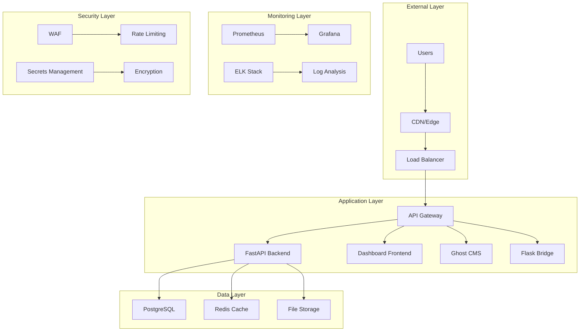
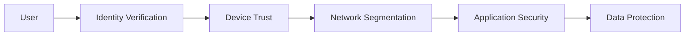
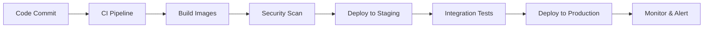

# 🏗️ Infrastructure Overview 2025

## Executive Summary

This document outlines the comprehensive infrastructure architecture for the ToolboxAI Solutions educational platform, implementing 2025 best practices for containerization, orchestration, security, and scalability.

## 🎯 Architecture Principles

### 2025 Infrastructure Standards

- **Cloud-Native Design**: Container-first approach with microservices architecture
- **Zero-Trust Security**: Comprehensive security at every layer
- **Observability**: Full-stack monitoring and logging
- **Scalability**: Auto-scaling and load balancing
- **Resilience**: High availability and disaster recovery
- **Compliance**: COPPA, FERPA, GDPR, and SOC 2 Type 2 compliance

## 🏗️ High-Level Architecture



## 🐳 Containerization Strategy

### Multi-Stage Docker Builds

All services use multi-stage builds for optimal image size and security:

```dockerfile
# Stage 1: Build dependencies
FROM python:3.11-slim AS builder
# Install build tools and dependencies

# Stage 2: Runtime image
FROM python:3.11-slim AS runtime
# Copy only necessary runtime components
```

### Container Security

- **Non-root users**: All containers run as non-root users
- **Minimal base images**: Alpine Linux for reduced attack surface
- **Security scanning**: Automated vulnerability scanning in CI/CD
- **Image signing**: All images are cryptographically signed

## ☸️ Kubernetes Orchestration

### Cluster Architecture

```yaml
# Production cluster configuration
apiVersion: v1
kind: Namespace
metadata:
  name: toolboxai-production
  labels:
    app: toolboxai
    environment: production
```

### Service Mesh Integration

- **Istio**: Service mesh for traffic management and security
- **mTLS**: Mutual TLS for service-to-service communication
- **Traffic policies**: Advanced routing and load balancing

## 🗄️ Data Architecture

### Database Strategy

#### PostgreSQL Primary Database
- **High Availability**: Master-slave replication
- **Backup Strategy**: Automated daily backups with point-in-time recovery
- **Monitoring**: Query performance and connection monitoring
- **Security**: Encryption at rest and in transit

#### Redis Caching Layer
- **Session Storage**: User sessions and authentication tokens
- **Application Cache**: Frequently accessed data
- **Rate Limiting**: API rate limiting and throttling
- **Persistence**: AOF and RDB snapshots for data durability

### Data Compliance

- **COPPA Compliance**: Age verification and parental consent
- **FERPA Compliance**: Educational record protection
- **GDPR Compliance**: Data privacy and user rights
- **Data Anonymization**: PII removal and anonymization

## 🔒 Security Architecture

### Zero-Trust Security Model



### Security Controls

1. **Network Security**
   - VPC with private subnets
   - Security groups and NACLs
   - WAF for application protection
   - DDoS protection

2. **Application Security**
   - OAuth2/JWT authentication
   - API rate limiting
   - Input validation and sanitization
   - Security headers

3. **Data Security**
   - Encryption at rest (AES-256)
   - Encryption in transit (TLS 1.3)
   - Key management (AWS KMS)
   - Database encryption

## 📊 Monitoring & Observability

### Monitoring Stack

#### Metrics Collection
- **Prometheus**: Metrics collection and storage
- **Grafana**: Visualization and dashboards
- **Node Exporter**: System metrics
- **Custom Metrics**: Application-specific metrics

#### Logging
- **ELK Stack**: Elasticsearch, Logstash, Kibana
- **Fluentd**: Log collection and forwarding
- **Centralized Logging**: All services log to central location

#### Tracing
- **Jaeger**: Distributed tracing
- **OpenTelemetry**: Instrumentation
- **Performance Monitoring**: Request tracing and analysis

### Alerting Strategy

```yaml
# Alert rules example
groups:
- name: toolboxai.rules
  rules:
  - alert: HighErrorRate
    expr: rate(http_requests_total{status=~"5.."}[5m]) > 0.1
    for: 5m
    labels:
      severity: critical
    annotations:
      summary: "High error rate detected"
```

## 🚀 Deployment Strategy

### GitOps Workflow



### Environment Strategy

1. **Development**
   - Local development with Docker Compose
   - Hot reloading and debugging
   - Mock services for external dependencies

2. **Staging**
   - Production-like environment
   - Automated testing
   - Performance testing

3. **Production**
   - High availability setup
   - Blue-green deployments
   - Canary releases

## 📈 Scalability & Performance

### Auto-Scaling Configuration

```yaml
apiVersion: autoscaling/v2
kind: HorizontalPodAutoscaler
metadata:
  name: backend-hpa
spec:
  scaleTargetRef:
    apiVersion: apps/v1
    kind: Deployment
    name: backend-deployment
  minReplicas: 3
  maxReplicas: 10
  metrics:
  - type: Resource
    resource:
      name: cpu
      target:
        type: Utilization
        averageUtilization: 70
```

### Performance Optimization

- **CDN**: Global content delivery
- **Caching**: Multi-layer caching strategy
- **Database Optimization**: Query optimization and indexing
- **Load Balancing**: Intelligent traffic distribution

## 🔄 Disaster Recovery

### Backup Strategy

1. **Database Backups**
   - Daily automated backups
   - Point-in-time recovery
   - Cross-region replication

2. **Application Backups**
   - Container image backups
   - Configuration backups
   - Secrets backup

3. **Disaster Recovery Plan**
   - RTO: 4 hours
   - RPO: 1 hour
   - Multi-region deployment

## 📋 Compliance & Governance

### Compliance Standards

- **COPPA**: Children's Online Privacy Protection Act
- **FERPA**: Family Educational Rights and Privacy Act
- **GDPR**: General Data Protection Regulation
- **SOC 2 Type 2**: Security and availability controls

### Governance Framework

- **Infrastructure as Code**: All infrastructure defined in code
- **Policy as Code**: Security and compliance policies
- **Audit Logging**: Comprehensive audit trails
- **Change Management**: Controlled deployment processes

## 🛠️ Development Workflow

### Local Development

```bash
# Start local development environment
docker-compose -f infrastructure/docker/docker-compose.staging.yml up -d

# Run tests
npm test
python -m pytest

# Deploy to staging
kubectl apply -f infrastructure/kubernetes/
```

### CI/CD Pipeline

```yaml
# GitHub Actions workflow
name: Deploy to Production
on:
  push:
    branches: [main]
jobs:
  deploy:
    runs-on: ubuntu-latest
    steps:
      - uses: actions/checkout@v4
      - name: Build and push images
      - name: Deploy to Kubernetes
      - name: Run health checks
```

## 📚 Documentation Standards

### Infrastructure Documentation

- **Architecture Diagrams**: Mermaid diagrams for visual representation
- **API Documentation**: OpenAPI 3.1.0 specifications
- **Runbooks**: Operational procedures and troubleshooting
- **Security Documentation**: Security policies and procedures

### Maintenance Procedures

- **Regular Updates**: Security patches and updates
- **Capacity Planning**: Resource monitoring and scaling
- **Performance Tuning**: Optimization and monitoring
- **Disaster Recovery**: Testing and validation

## 🎯 Future Roadmap

### Planned Enhancements

1. **Service Mesh**: Istio integration for advanced traffic management
2. **Multi-Cloud**: AWS and Azure deployment
3. **Edge Computing**: CDN and edge processing
4. **AI/ML Integration**: Machine learning infrastructure
5. **Blockchain**: Decentralized identity and data integrity

### Technology Evolution

- **Kubernetes**: Latest stable versions
- **Container Runtime**: Containerd and CRI-O
- **Monitoring**: OpenTelemetry and Prometheus
- **Security**: Zero-trust architecture

---

*Last Updated: 2025-09-14*
*Version: 2.0.0*
*Compliance: COPPA, FERPA, GDPR, SOC 2 Type 2*
