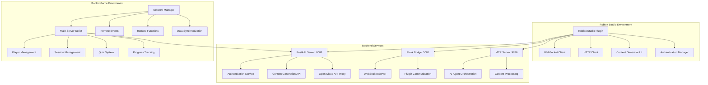

# 🎮 Roblox Integration Architecture 2025

## Executive Summary

This document outlines the comprehensive Roblox Studio integration for the ToolboxAI educational platform, implementing 2025 Open Cloud API standards, OAuth2 authentication, and modern security practices.

## 🏗️ Architecture Overview



## 🔐 Authentication & Security (2025 Standards)

### OAuth2 Implementation

```lua
-- OAuth2 Authentication Manager
local OAuth2Manager = {}
OAuth2Manager.__index = OAuth2Manager

function OAuth2Manager.new()
    local self = setmetatable({}, OAuth2Manager)
    self.clientId = "your-client-id"
    self.redirectUri = "http://localhost:64989/oauth/callback"
    self.scope = "openid profile"
    self.tokenEndpoint = "https://apis.roblox.com/oauth/v1/token"
    self.authorizationEndpoint = "https://authorize.roblox.com/v1/authorize"
    return self
end

function OAuth2Manager:GetAuthorizationUrl()
    local params = {
        response_type = "code",
        client_id = self.clientId,
        redirect_uri = self.redirectUri,
        scope = self.scope,
        state = HttpService:GenerateGUID(false)
    }

    local queryString = ""
    for key, value in pairs(params) do
        queryString = queryString .. key .. "=" .. value .. "&"
    end

    return self.authorizationEndpoint .. "?" .. queryString:sub(1, -2)
end
```

### Security Best Practices

1. **Token Management**
   - Secure token storage using Roblox's secure storage
   - Automatic token refresh
   - Token validation on every request

2. **Request Validation**
   - Rate limiting per user
   - Input sanitization
   - CSRF protection

3. **Data Encryption**
   - All sensitive data encrypted in transit
   - Local data encryption at rest
   - Secure key management

## 🌐 Open Cloud API Integration

### Asset Management

```lua
-- Open Cloud API Client
local OpenCloudClient = {}
OpenCloudClient.__index = OpenCloudClient

function OpenCloudClient.new(apiKey)
    local self = setmetatable({}, OpenCloudClient)
    self.apiKey = apiKey
    self.baseUrl = "https://apis.roblox.com/cloud/v1"
    self.headers = {
        ["Authorization"] = "Bearer " .. apiKey,
        ["Content-Type"] = "application/json"
    }
    return self
end

function OpenCloudClient:CreateAsset(assetData)
    local response = HttpService:RequestAsync({
        Url = self.baseUrl .. "/assets",
        Method = "POST",
        Headers = self.headers,
        Body = HttpService:JSONEncode(assetData)
    })

    if response.Success then
        return HttpService:JSONDecode(response.Body)
    else
        warn("Failed to create asset:", response.StatusCode, response.Body)
        return nil
    end
end
```

### Data Store Integration

```lua
-- Enhanced Data Store Manager
local DataStoreManager = {}
DataStoreManager.__index = DataStoreManager

function DataStoreManager.new()
    local self = setmetatable({}, DataStoreManager)
    self.dataStores = {
        playerData = DataStoreService:GetDataStore("PlayerData"),
        sessionData = DataStoreService:GetDataStore("SessionData"),
        analytics = DataStoreService:GetDataStore("Analytics")
    }
    return self
end

function DataStoreManager:SavePlayerData(userId, data)
    local success, result = pcall(function()
        return self.dataStores.playerData:SetAsync(userId, data)
    end)

    if not success then
        warn("Failed to save player data:", result)
        return false
    end

    return true
end
```

## 🎯 Plugin Architecture

### Main Plugin Structure

```lua
-- AIContentGenerator Plugin (2025 Version)
local AIContentGenerator = {}
AIContentGenerator.__index = AIContentGenerator

function AIContentGenerator.new()
    local self = setmetatable({}, AIContentGenerator)

    -- Initialize components
    self.toolbar = plugin:CreateToolbar("ToolboxAI")
    self.widget = plugin:CreateDockWidgetPluginGui("AIContentGenerator", DockWidgetPluginGuiInfo.new(
        Enum.InitialDockState.Float, false, false, 400, 300, 200, 150
    ))

    -- Initialize managers
    self.authManager = OAuth2Manager.new()
    self.cloudClient = OpenCloudClient.new()
    self.networkManager = NetworkManager.new()

    return self
end
```

### Content Generation Workflow

1. **User Input Collection**
   - Subject selection
   - Grade level specification
   - Learning objectives
   - Environment preferences

2. **AI Processing**
   - Send request to FastAPI backend
   - Process through AI agents
   - Generate educational content

3. **Content Application**
   - Apply terrain changes
   - Create interactive elements
   - Set up quiz systems
   - Configure gamification

## 📊 Real-time Communication

### WebSocket Implementation

```lua
-- Enhanced WebSocket Manager
local WebSocketManager = {}
WebSocketManager.__index = WebSocketManager

function WebSocketManager.new(url)
    local self = setmetatable({}, WebSocketManager)
    self.url = url
    self.connection = nil
    self.reconnectAttempts = 0
    self.maxReconnectAttempts = 10
    self.heartbeatInterval = 30
    return self
end

function WebSocketManager:Connect()
    local success, connection = pcall(function()
        return WebSocket.connect(self.url)
    end)

    if success and connection then
        self.connection = connection
        self:SetupEventHandlers()
        self:StartHeartbeat()
        return true
    else
        warn("Failed to connect to WebSocket:", connection)
        return false
    end
end
```

## 🎮 Game Integration

### Server-Side Architecture

```lua
-- Enhanced Main Server Script
local MainServer = {}
MainServer.__index = MainServer

function MainServer.new()
    local self = setmetatable({}, MainServer)

    -- Initialize services
    self.players = game:GetService("Players")
    self.replicatedStorage = game:GetService("ReplicatedStorage")
    self.dataStoreService = game:GetService("DataStoreService")
    self.httpService = game:GetService("HttpService")

    -- Initialize managers
    self.playerManager = PlayerManager.new()
    self.sessionManager = SessionManager.new()
    self.quizManager = QuizManager.new()
    self.networkManager = NetworkManager.new()

    return self
end
```

### Client-Side Integration

```lua
-- Enhanced Client Script
local ClientManager = {}
ClientManager.__index = ClientManager

function ClientManager.new()
    local self = setmetatable({}, ClientManager)

    -- Initialize UI
    self.uiManager = UIManager.new()
    self.quizUI = QuizUI.new()
    self.progressUI = ProgressUI.new()

    -- Initialize network
    self.networkManager = NetworkManager.new()

    return self
end
```

## 🔧 Development Tools

### Rojo Configuration (2025)

```json
{
  "name": "ToolboxAI-Roblox-Environment",
  "tree": {
    "$className": "DataModel",
    "ServerScriptService": {
      "$className": "ServerScriptService",
      "Scripts": {
        "$path": "Scripts/ServerScripts"
      },
      "Modules": {
        "$path": "Scripts/ModuleScripts"
      }
    },
    "StarterPlayer": {
      "$className": "StarterPlayer",
      "StarterPlayerScripts": {
        "$className": "StarterPlayerScripts",
        "$path": "Scripts/ClientScripts"
      }
    },
    "ReplicatedStorage": {
      "$className": "ReplicatedStorage",
      "RemoteEvents": {
        "$path": "RemoteEvents"
      },
      "RemoteFunctions": {
        "$path": "RemoteFunctions"
      },
      "Modules": {
        "$className": "Folder",
        "NetworkManager": {
          "$path": "Scripts/ModuleScripts/NetworkManager.lua"
        }
      }
    }
  }
}
```

### Testing Framework

```lua
-- Roblox Testing Framework
local TestFramework = {}
TestFramework.__index = TestFramework

function TestFramework.new()
    local self = setmetatable({}, TestFramework)
    self.tests = {}
    self.results = {}
    return self
end

function TestFramework:AddTest(name, testFunction)
    self.tests[name] = testFunction
end

function TestFramework:RunTests()
    for name, test in pairs(self.tests) do
        local success, result = pcall(test)
        self.results[name] = {
            success = success,
            result = result
        }
    end
end
```

## 📈 Performance Optimization

### Memory Management

1. **Object Pooling**
   - Reuse UI elements
   - Pool frequently created objects
   - Implement cleanup routines

2. **Data Optimization**
   - Compress large data structures
   - Use efficient serialization
   - Implement caching strategies

3. **Network Optimization**
   - Batch requests when possible
   - Implement request queuing
   - Use compression for large payloads

### Monitoring & Analytics

```lua
-- Performance Monitor
local PerformanceMonitor = {}
PerformanceMonitor.__index = PerformanceMonitor

function PerformanceMonitor.new()
    local self = setmetatable({}, PerformanceMonitor)
    self.metrics = {
        memoryUsage = 0,
        networkLatency = 0,
        frameRate = 0,
        errorCount = 0
    }
    return self
end

function PerformanceMonitor:StartMonitoring()
    spawn(function()
        while true do
            wait(1)
            self:UpdateMetrics()
        end
    end)
end
```

## 🚀 Deployment & CI/CD

### GitHub Actions Workflow

```yaml
name: Roblox Plugin Build and Deploy

on:
  push:
    branches: [main]
  pull_request:
    branches: [main]

jobs:
  build:
    runs-on: ubuntu-latest

    steps:
    - uses: actions/checkout@v4

    - name: Setup Rojo
      run: |
        cargo install rojo

    - name: Build Plugin
      run: |
        rojo build plugin.project.json -o AIContentGenerator.rbxm

    - name: Upload Artifact
      uses: actions/upload-artifact@v3
      with:
        name: roblox-plugin
        path: AIContentGenerator.rbxm
```

## 📚 API Reference

### Plugin API

| Method | Description | Parameters | Returns |
|--------|-------------|------------|---------|
| `GenerateContent` | Generate educational content | `subject`, `gradeLevel`, `objectives` | `ContentData` |
| `ApplyContent` | Apply generated content to game | `contentData` | `boolean` |
| `SaveProgress` | Save player progress | `playerId`, `progress` | `boolean` |
| `GetAnalytics` | Retrieve analytics data | `sessionId` | `AnalyticsData` |

### Network API

| Event | Description | Data |
|-------|-------------|------|
| `ContentGenerated` | Content generation complete | `ContentData` |
| `ProgressUpdated` | Player progress updated | `ProgressData` |
| `QuizCompleted` | Quiz session completed | `QuizResults` |
| `ErrorOccurred` | Error occurred | `ErrorData` |

## 🔒 Security Considerations

### Data Protection

1. **Personal Information**
   - Minimal data collection
   - Secure data transmission
   - Regular data purging

2. **Authentication**
   - OAuth2 implementation
   - Secure token storage
   - Session management

3. **API Security**
   - Rate limiting
   - Input validation
   - Error handling

### Compliance

- **COPPA Compliance**: Age verification and parental consent
- **FERPA Compliance**: Educational record protection
- **GDPR Compliance**: Data privacy and user rights

## 📖 Best Practices

### Development

1. **Code Organization**
   - Modular architecture
   - Clear separation of concerns
   - Comprehensive documentation

2. **Error Handling**
   - Graceful degradation
   - User-friendly error messages
   - Comprehensive logging

3. **Testing**
   - Unit tests for core functionality
   - Integration tests for API calls
   - User acceptance testing

### Performance

1. **Optimization**
   - Efficient algorithms
   - Memory management
   - Network optimization

2. **Monitoring**
   - Real-time metrics
   - Performance tracking
   - Error monitoring

## 🎯 Future Enhancements

### Planned Features

1. **Advanced AI Integration**
   - Real-time content adaptation
   - Personalized learning paths
   - Advanced analytics

2. **Collaboration Tools**
   - Multi-user editing
   - Real-time collaboration
   - Version control

3. **Mobile Support**
   - Mobile plugin support
   - Touch-optimized UI
   - Cross-platform sync

---

*Last Updated: 2025-09-14*
*Version: 2.0.0*
*Compliance: COPPA, FERPA, GDPR, OWASP Top 10 2025*
