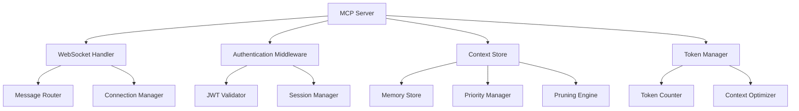
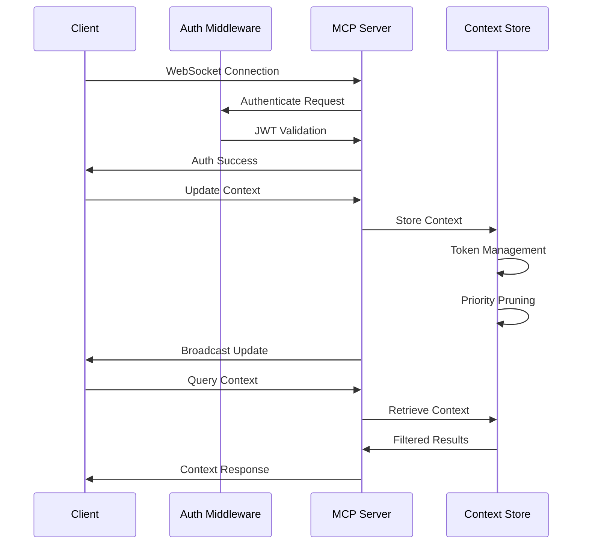

# MCP (Model Context Protocol) Architecture

## Overview

The Model Context Protocol (MCP) is a critical component of the ToolBoxAI system that provides real-time context management and synchronization between AI agents, services, and client applications. It enables intelligent context sharing, token-aware memory management, and secure multi-client communication.

## Architecture

### Core Components



### Data Flow



## Core Features

### 1. WebSocket Communication

**Real-time Bidirectional Communication**
- Low-latency context updates
- Event-driven architecture
- Connection pooling and management
- Automatic reconnection handling

### 2. JWT Authentication

**Secure Access Control**
- Token-based authentication
- Role-based authorization
- Token refresh mechanisms
- Session management

### 3. Context Management

**Intelligent Memory Handling**
- Token-aware storage (128K default limit)
- Priority-based pruning
- Multi-source context aggregation
- Real-time synchronization

### 4. Multi-Client Support

**Scalable Architecture**
- Concurrent client connections
- Broadcast messaging
- Client-specific filtering
- Load balancing ready

## Context Store Architecture

### Context Entry Structure

```python
@dataclass
class ContextEntry:
    timestamp: str          # ISO 8601 timestamp
    content: Dict[str, Any] # Actual context data
    tokens: int            # Token count for memory management
    source: str            # Origin identifier
    priority: int = 1      # Priority level (1-10)
```

### Memory Management

**Token-Aware Pruning**
1. **Total Token Tracking**: Monitors total context size
2. **Priority Sorting**: Higher priority entries retained longer
3. **Recency Weighting**: Recent entries get preference
4. **Graceful Degradation**: Smooth memory management

```python
def _prune_context(self):
    """Remove old context to stay within token limit"""
    total_tokens = sum(entry.tokens for entry in self.context_store.values())

    if total_tokens <= self.max_tokens:
        return

    # Sort by priority (descending) and timestamp (descending)
    sorted_entries = sorted(
        self.context_store.items(),
        key=lambda x: (-x[1].priority, -float(datetime.fromisoformat(x[1].timestamp).timestamp()))
    )

    # Keep entries until we exceed token limit
    kept_entries = {}
    current_tokens = 0

    for key, entry in sorted_entries:
        if current_tokens + entry.tokens <= self.max_tokens:
            kept_entries[key] = entry
            current_tokens += entry.tokens
        else:
            break

    self.context_store = kept_entries
```

## Authentication System

### JWT-Based Security

**Authentication Flow**
1. **Token Extraction**: From WebSocket headers or query parameters
2. **Token Validation**: JWT signature and expiration verification
3. **User Authorization**: Role and permission checks
4. **Session Management**: Active connection tracking

```python
@dataclass
class AuthenticatedClient:
    websocket: Any
    client_id: str
    user_id: Optional[str]
    token_payload: Dict[str, Any]
    authenticated_at: datetime
    last_activity: datetime
```

### Security Features

**Comprehensive Protection**
- **Token Refresh**: Automatic token renewal
- **Connection Timeout**: Stale connection cleanup
- **Rate Limiting**: Request throttling
- **Permission Controls**: Context access restrictions

## Message Protocol

### Message Types

```typescript
interface MCPMessage {
  type: string;
  data?: any;
  metadata?: any;
  timestamp?: string;
}
```

**Core Message Types**:
- `update_context`: Add/update context data
- `get_context`: Retrieve current context
- `query_context`: Search context with filters
- `clear_context`: Remove context entries
- `set_priority`: Update entry priorities
- `refresh_token`: Renew authentication

### Update Context

**Request**:
```json
{
  "type": "update_context",
  "context": {
    "agent": "ContentAgent",
    "task": "Generate math lesson",
    "progress": "content_created"
  },
  "source": "content_agent_001",
  "priority": 5
}
```

**Response**:
```json
{
  "type": "context_update",
  "data": { /* full context store */ },
  "metadata": {
    "total_tokens": 1500,
    "max_tokens": 128000,
    "entry_count": 12
  }
}
```

### Query Context

**Request**:
```json
{
  "type": "query_context",
  "query": {
    "source": "content_agent",
    "min_priority": 3
  }
}
```

**Response**:
```json
{
  "type": "query_response",
  "data": {
    "entry_1": {
      "timestamp": "2025-09-16T10:30:00Z",
      "content": { /* context data */ },
      "tokens": 250,
      "source": "content_agent_001",
      "priority": 5
    }
  }
}
```

## Integration Patterns

### Agent Integration

**Content Agent Example**:
```python
async def _update_mcp_context(self, context_data: Dict[str, Any]) -> bool:
    if not self.mcp_available:
        return False

    try:
        async with websockets.connect(self.mcp_url) as websocket:
            message = {
                "type": "context_update",
                "source": "content_agent",
                "data": context_data,
                "timestamp": datetime.now().isoformat(),
                "priority": 3
            }
            await websocket.send(json.dumps(message))
            response = await websocket.recv()

            response_data = json.loads(response)
            return response_data.get("status") == "success"

    except Exception as e:
        logger.error(f"MCP context update failed: {e}")
        return False
```

### Dashboard Integration

**Real-time Updates**:
```typescript
class MCPClient {
  private ws: WebSocket;
  private token: string;

  async connect(token: string): Promise<void> {
    this.token = token;
    this.ws = new WebSocket(`ws://localhost:9877?token=${token}`);

    this.ws.onmessage = (event) => {
      const message = JSON.parse(event.data);
      this.handleMessage(message);
    };
  }

  async updateContext(context: any, priority: number = 1): Promise<void> {
    const message = {
      type: 'update_context',
      context,
      priority,
      source: 'dashboard'
    };
    this.ws.send(JSON.stringify(message));
  }

  private handleMessage(message: MCPMessage): void {
    switch (message.type) {
      case 'context_update':
        this.onContextUpdate(message.data);
        break;
      case 'auth_success':
        this.onAuthSuccess(message);
        break;
      // ... other handlers
    }
  }
}
```

## Performance Optimization

### Connection Management

**Efficient Resource Usage**:
- Connection pooling
- Heartbeat monitoring
- Graceful degradation
- Memory leak prevention

### Token Optimization

**Smart Memory Usage**:
```python
# Calculate token count (simplified - use tiktoken in production)
tokens = len(json.dumps(context))

# Priority-based retention
def calculate_retention_score(entry: ContextEntry) -> float:
    age_factor = 1.0 / (1.0 + time_since_created_hours)
    priority_factor = entry.priority / 10.0
    size_factor = 1.0 / (1.0 + entry.tokens / 1000.0)
    return age_factor * priority_factor * size_factor
```

### Broadcast Optimization

**Efficient Message Distribution**:
```python
async def broadcast_context(self):
    if not self.authenticated_clients:
        return

    # Prepare message once
    context_data = {
        key: entry.to_dict() for key, entry in self.context_store.items()
    }
    message = json.dumps({
        "type": "context_update",
        "data": context_data,
        "metadata": {
            "total_tokens": sum(e.tokens for e in self.context_store.values()),
            "max_tokens": self.max_tokens,
            "entry_count": len(self.context_store)
        }
    })

    # Send to all clients concurrently
    tasks = [
        client.websocket.send(message)
        for client in self.authenticated_clients.values()
    ]
    await asyncio.gather(*tasks, return_exceptions=True)
```

## Configuration

### Server Configuration

```python
class MCPServer:
    DEFAULT_PORT = 9877
    DEFAULT_MAX_TOKENS = 128000
    JWT_SECRET_KEY = os.getenv("MCP_JWT_SECRET_KEY", "default_secret")
    JWT_ALGORITHM = "HS256"

    def __init__(self, port: int = DEFAULT_PORT, max_tokens: int = DEFAULT_MAX_TOKENS):
        self.port = port
        self.max_tokens = max_tokens
        self.connection_timeout = timedelta(hours=24)
```

### Environment Variables

```bash
# MCP Server Configuration
MCP_PORT=9877
MCP_MAX_TOKENS=128000
MCP_JWT_SECRET_KEY=your_secret_key

# Authentication
JWT_SECRET_KEY=your_jwt_secret
JWT_ALGORITHM=HS256

# Connection Settings
MCP_CONNECTION_TIMEOUT=86400  # 24 hours
MCP_HEARTBEAT_INTERVAL=30     # 30 seconds
```

## Monitoring and Observability

### Status Monitoring

**Server Status Endpoint**:
```python
def get_status(self) -> Dict:
    return {
        "connected_clients": len(self.authenticated_clients),
        "context_entries": len(self.context_store),
        "total_tokens": sum(e.tokens for e in self.context_store.values()),
        "max_tokens": self.max_tokens,
        "authenticated_clients": [
            {
                "client_id": client.client_id,
                "user_id": client.user_id,
                "authenticated_at": client.authenticated_at.isoformat(),
                "last_activity": client.last_activity.isoformat()
            }
            for client in self.authenticated_clients.values()
        ]
    }
```

### Metrics Collection

**Key Metrics**:
- Connection count
- Message throughput
- Context size trends
- Authentication success rate
- Error rates by type

### Logging

**Structured Logging**:
```python
logger.info(f"Client {client_id} authenticated for user {user_id}")
logger.warning(f"Context pruned to {current_tokens} tokens")
logger.error(f"Authentication error: {e}")
```

## Error Handling

### Connection Errors

**Graceful Error Management**:
```python
async def handler(self, websocket, path=None):
    if not await self.register(websocket, path):
        return

    try:
        async for message in websocket:
            await self.handle_message(websocket, message)
    except websockets.exceptions.ConnectionClosed:
        pass
    finally:
        await self.unregister(websocket)
```

### Authentication Errors

**Security-First Error Handling**:
```python
try:
    user_info = await self.auth_middleware.validate_websocket_token(token)
    if not user_info:
        await websocket.close(code=4001, reason="Invalid authentication token")
        return None
except WebSocketAuthError as e:
    logger.warning(f"Authentication error: {e.message}")
    await websocket.close(code=e.code, reason=e.message)
    return None
```

## Security Considerations

### Best Practices

1. **Token Security**:
   - Use secure token generation
   - Implement token rotation
   - Monitor for token abuse

2. **Connection Security**:
   - TLS/WSS in production
   - Rate limiting per client
   - Connection timeout enforcement

3. **Context Security**:
   - User-based access control
   - Content sanitization
   - Audit logging

### Compliance

**Data Protection**:
- COPPA compliance for student data
- FERPA protection for educational records
- GDPR compliance for EU users
- SOC 2 Type 2 controls

## Deployment

### Production Setup

```yaml
# docker-compose.yml
version: '3.8'
services:
  mcp-server:
    build: .
    ports:
      - "9877:9877"
    environment:
      - MCP_JWT_SECRET_KEY=${MCP_JWT_SECRET_KEY}
      - MCP_MAX_TOKENS=256000
    volumes:
      - ./logs:/app/logs
    restart: unless-stopped
```

### Health Checks

```python
async def health_check():
    """Health check endpoint for load balancers"""
    return {
        "status": "healthy",
        "timestamp": datetime.now(timezone.utc).isoformat(),
        "version": "1.0.0",
        "connections": len(self.authenticated_clients),
        "memory_usage": get_memory_usage()
    }
```

## Testing

### Unit Tests

```python
import pytest
from unittest.mock import AsyncMock, MagicMock

@pytest.mark.asyncio
async def test_context_update():
    server = MCPServer()
    websocket = AsyncMock()

    # Test context update
    await server._handle_update_context(
        {
            "context": {"test": "data"},
            "source": "test_agent",
            "priority": 5
        },
        websocket,
        create_mock_authenticated_client()
    )

    assert len(server.context_store) == 1
```

### Integration Tests

```python
@pytest.mark.asyncio
async def test_full_workflow():
    server = MCPServer()

    # Start server
    server_task = asyncio.create_task(server.start())

    # Connect client
    async with websockets.connect("ws://localhost:9877") as websocket:
        # Test authentication and context operations
        pass

    server_task.cancel()
```

## Future Enhancements

### Planned Features

1. **Enhanced Security**:
   - OAuth 2.0 integration
   - Multi-factor authentication
   - Advanced rate limiting

2. **Performance Improvements**:
   - Redis backend for context storage
   - Clustering support
   - Load balancing

3. **Advanced Features**:
   - Context versioning
   - Conflict resolution
   - Offline synchronization

### Research Areas

1. **AI-Driven Context Management**:
   - Intelligent pruning algorithms
   - Context relevance scoring
   - Predictive prefetching

2. **Distributed Architecture**:
   - Multi-region deployment
   - Event sourcing patterns
   - CQRS implementation

---

*Last Updated: September 16, 2025*
*Version: 1.0.0*
*Next Review: December 2025*
