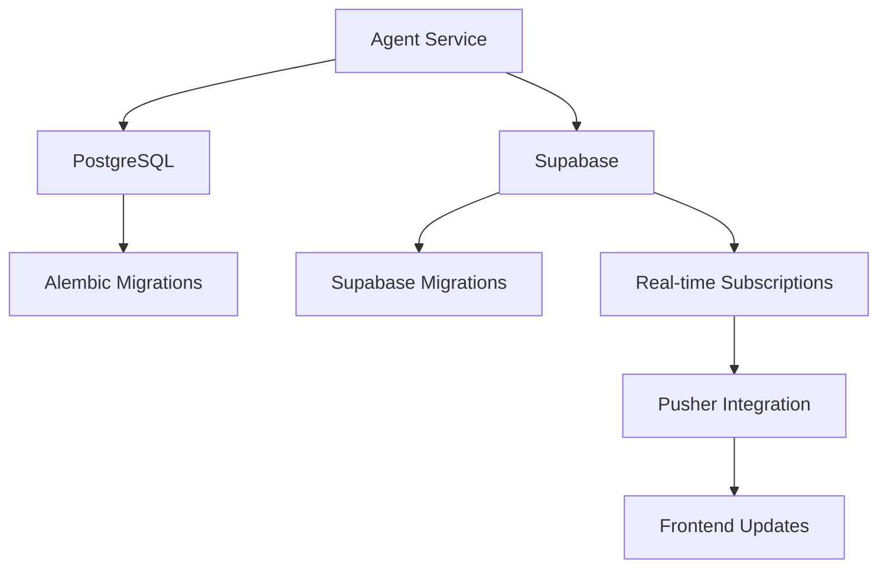
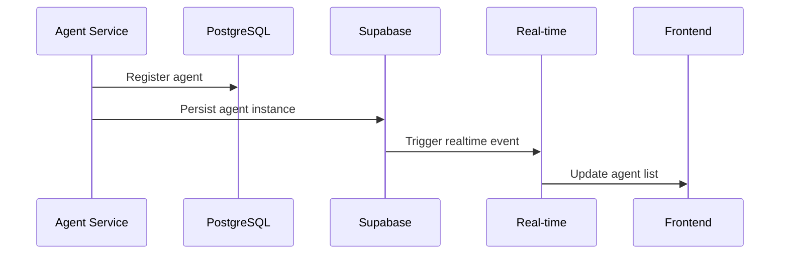
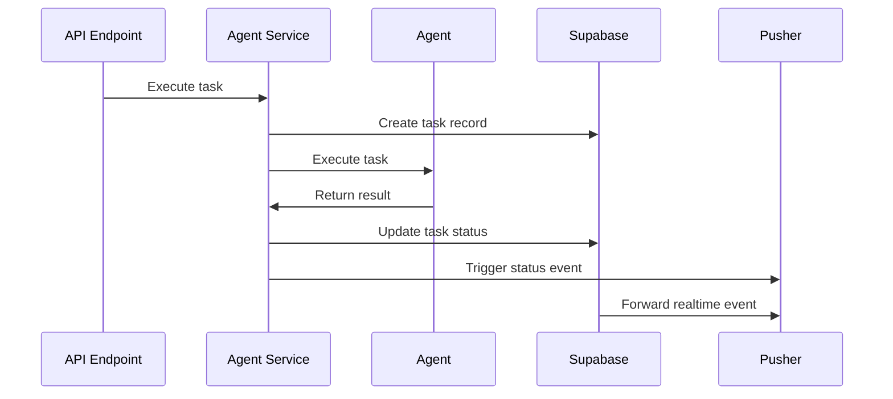

# Supabase Integration Architecture

## Overview

The ToolBoxAI Educational Platform integrates with Supabase to provide comprehensive database services, real-time capabilities, and enhanced data persistence for the agent system. This integration works alongside the existing PostgreSQL database to provide redundancy, real-time features, and cloud-native capabilities.

## Architecture Components

### 1. Dual Database Strategy



**Primary Database (PostgreSQL):**
- Main application data
- Educational content
- User management
- Session data

**Secondary Database (Supabase):**
- Agent system data
- Performance metrics
- Real-time events
- System monitoring

### 2. Agent System Integration

The agent system uses Supabase for:
- **Agent Instance Tracking**: Registration and status monitoring
- **Task Execution History**: Complete audit trail of all agent tasks
- **Performance Metrics**: Aggregated performance data
- **Real-time Updates**: Live status updates via Supabase Realtime

## Configuration

### Environment Variables

```bash
# Supabase Project Configuration
SUPABASE_URL=https://your-project.supabase.co
SUPABASE_ANON_KEY=eyJhbGciOiJIUzI1NiIsInR5cCI6IkpXVCJ9...
SUPABASE_SERVICE_ROLE_KEY=eyJhbGciOiJIUzI1NiIsInR5cCI6IkpXVCJ9...
SUPABASE_JWT_SECRET=your-jwt-secret-from-supabase-settings

# Database Direct Access
SUPABASE_DB_HOST=db.your-project.supabase.co
SUPABASE_DB_PORT=5432
SUPABASE_DB_NAME=postgres
SUPABASE_DB_USER=postgres
SUPABASE_DB_PASS=your-database-password

# Agent System Configuration
SUPABASE_AGENT_SCHEMA=public
SUPABASE_ENABLE_REALTIME=true
SUPABASE_ENABLE_RLS=true
SUPABASE_CONNECTION_TIMEOUT=30
SUPABASE_MAX_RETRIES=3
SUPABASE_RETRY_DELAY=5
```

### Settings Integration

The Supabase configuration is integrated into the main settings system:

```python
from toolboxai_settings.settings import settings

# Access Supabase configuration
supabase_config = settings.get_supabase_config()
is_configured = settings.is_supabase_configured()
database_url = settings.get_supabase_database_url()
```

## Database Schema

### Agent System Tables

#### agent_instances
Tracks individual agent instances and their status:

```sql
CREATE TABLE agent_instances (
    id UUID PRIMARY KEY DEFAULT uuid_generate_v4(),
    agent_id TEXT UNIQUE NOT NULL,
    agent_type agent_type NOT NULL,
    status agent_status NOT NULL DEFAULT 'initializing',
    configuration JSONB DEFAULT '{}',
    resource_limits JSONB DEFAULT '{}',
    performance_thresholds JSONB DEFAULT '{}',
    current_task_id TEXT,
    last_activity TIMESTAMPTZ DEFAULT NOW(),
    total_tasks_completed INTEGER DEFAULT 0,
    total_tasks_failed INTEGER DEFAULT 0,
    created_at TIMESTAMPTZ DEFAULT NOW(),
    updated_at TIMESTAMPTZ DEFAULT NOW()
);
```

#### agent_executions
Records every task execution:

```sql
CREATE TABLE agent_executions (
    id UUID PRIMARY KEY DEFAULT uuid_generate_v4(),
    task_id TEXT UNIQUE NOT NULL,
    agent_instance_id UUID REFERENCES agent_instances(id),
    agent_type agent_type NOT NULL,
    task_type TEXT NOT NULL,
    input_data JSONB NOT NULL DEFAULT '{}',
    output_data JSONB,
    status task_status NOT NULL DEFAULT 'pending',
    quality_score FLOAT CHECK (quality_score >= 0 AND quality_score <= 1),
    execution_time_seconds FLOAT,
    created_at TIMESTAMPTZ DEFAULT NOW(),
    completed_at TIMESTAMPTZ,
    user_id UUID,
    session_id TEXT
);
```

#### agent_metrics
Aggregated performance metrics:

```sql
CREATE TABLE agent_metrics (
    id UUID PRIMARY KEY DEFAULT uuid_generate_v4(),
    agent_instance_id UUID REFERENCES agent_instances(id),
    agent_type agent_type NOT NULL,
    period_start TIMESTAMPTZ NOT NULL,
    period_end TIMESTAMPTZ NOT NULL,
    tasks_completed INTEGER DEFAULT 0,
    success_rate FLOAT DEFAULT 0.0,
    average_execution_time FLOAT DEFAULT 0.0,
    average_quality_score FLOAT DEFAULT 0.0,
    created_at TIMESTAMPTZ DEFAULT NOW()
);
```

### Custom Types

```sql
CREATE TYPE agent_type AS ENUM (
    'content_generator',
    'quiz_generator', 
    'terrain_generator',
    'script_generator',
    'code_reviewer',
    'roblox_asset',
    'roblox_testing',
    'roblox_analytics'
);

CREATE TYPE agent_status AS ENUM (
    'initializing',
    'idle',
    'busy', 
    'processing',
    'waiting',
    'error',
    'offline',
    'maintenance'
);

CREATE TYPE task_status AS ENUM (
    'pending',
    'queued',
    'running',
    'completed',
    'failed',
    'cancelled',
    'retrying'
);
```

## Service Implementation

### 1. Supabase Service

```python
from apps.backend.services.supabase_service import get_supabase_service

# Initialize service
service = get_supabase_service()

# Agent operations
agent_data = await service.create_agent_instance(agent_info)
agent = await service.get_agent_instance(agent_id)
agents = await service.get_all_agent_instances()

# Task operations
task_data = await service.create_task_execution(task_info)
await service.update_task_execution(task_id, updates)
history = await service.get_agent_task_history(agent_id)

# Metrics operations
await service.store_agent_metrics(metrics_data)
metrics = await service.get_agent_metrics(agent_id, hours=24)

# Health monitoring
health = await service.health_check()
await service.store_system_health(health_data)
```

### 2. Real-time Integration

The real-time integration service bridges Supabase Realtime with Pusher Channels:

```python
from apps.backend.services.realtime_integration import get_realtime_integration_service

# Initialize real-time service
service = get_realtime_integration_service()
await service.start()

# Add custom event handlers
async def custom_handler(event):
    # Process real-time event
    pass

service.add_event_handler('agent_instances', custom_handler)
```

### 3. Migration Service

```python
from apps.backend.services.migration_service import get_migration_service

# Initialize migration service
service = get_migration_service()

# Run migrations
results = await service.run_migrations()

# Check migration status
status = await service.get_migration_status()

# Sync schemas
sync_results = await service.sync_schemas()
```

## Frontend Integration

### 1. Supabase Client

```typescript
import { supabase, AgentSupabaseService } from '../lib/supabase';

// Get agent data
const agents = await AgentSupabaseService.getAgentInstances();
const executions = await AgentSupabaseService.getAgentExecutions();
const metrics = await AgentSupabaseService.getAgentMetrics();
```

### 2. React Hooks

```typescript
import { useSupabaseAgent } from '../hooks/useSupabaseAgent';

// Use in component
const {
  agents,
  executions,
  metrics,
  loading,
  error,
  actions
} = useSupabaseAgent({
  enableRealtime: true,
  refreshInterval: 30000
});
```

### 3. Real-time Subscriptions

```typescript
// Subscribe to agent updates
const subscription = AgentSupabaseService.subscribeToAgentUpdates((payload) => {
  console.log('Agent update:', payload);
  // Update UI state
});

// Cleanup
subscription?.unsubscribe();
```

## Docker Configuration

### Supabase Stack

The Docker configuration includes a complete Supabase stack:

```yaml
services:
  supabase-db:
    image: supabase/postgres:15.1.0.117
    ports:
      - "54322:5432"
    environment:
      POSTGRES_PASSWORD: ${SUPABASE_DB_PASSWORD}
    volumes:
      - supabase_db_data:/var/lib/postgresql/data
      - ./database/supabase/migrations:/docker-entrypoint-initdb.d:ro

  supabase-kong:
    image: kong:2.8.1
    ports:
      - "54321:8000"
    depends_on:
      - supabase-auth
      - supabase-rest
      - supabase-realtime

  supabase-auth:
    image: supabase/gotrue:v2.132.3
    environment:
      GOTRUE_JWT_SECRET: ${SUPABASE_JWT_SECRET}
      GOTRUE_DATABASE_URL: postgres://...

  supabase-rest:
    image: postgrest/postgrest:v11.2.2
    environment:
      PGRST_JWT_SECRET: ${SUPABASE_JWT_SECRET}

  supabase-realtime:
    image: supabase/realtime:v2.25.50
    environment:
      API_JWT_SECRET: ${SUPABASE_JWT_SECRET}
```

## Data Flow

### 1. Agent Registration



### 2. Task Execution



## Performance Considerations

### 1. Connection Pooling

- **PostgreSQL**: Primary connection pool (10-20 connections)
- **Supabase**: Secondary connection pool (5-10 connections)
- **Redis**: Cache layer for frequently accessed data

### 2. Query Optimization

- **Indexes**: Optimized indexes on frequently queried fields
- **Pagination**: Limit result sets for large queries
- **Caching**: Redis caching for expensive queries

### 3. Real-time Performance

- **Event Filtering**: Only forward relevant events to Pusher
- **Batch Processing**: Group related events to reduce overhead
- **Circuit Breaker**: Disable real-time if performance degrades

## Error Handling

### 1. Service Availability

The system gracefully handles Supabase unavailability:

```python
# Graceful degradation
if self.supabase_service and self.supabase_service.is_available():
    # Use Supabase features
    await self.supabase_service.create_agent_instance(data)
else:
    # Continue without Supabase
    logger.warning("Supabase not available, continuing without persistence")
```

### 2. Connection Failures

- **Automatic Retry**: Configurable retry logic with exponential backoff
- **Fallback Mode**: System continues to function without Supabase
- **Health Monitoring**: Continuous health checks and alerting

### 3. Data Consistency

- **Transaction Support**: Use Supabase transactions where needed
- **Conflict Resolution**: Handle concurrent updates gracefully
- **Audit Trail**: Complete audit trail for all operations

## Security

### 1. Row Level Security (RLS)

```sql
-- Enable RLS on all tables
ALTER TABLE agent_instances ENABLE ROW LEVEL SECURITY;

-- Create policies
CREATE POLICY "Users can view agent instances" 
ON agent_instances FOR SELECT 
USING (auth.role() = 'authenticated');

CREATE POLICY "Service role can manage agents"
ON agent_instances FOR ALL
USING (auth.role() = 'service_role');
```

### 2. API Security

- **Service Role Key**: Backend uses service role for full access
- **Anon Key**: Frontend uses anon key with RLS restrictions
- **JWT Integration**: Consistent JWT handling across systems

### 3. Network Security

- **VPC**: Supabase services in isolated network
- **SSL/TLS**: Encrypted connections for all traffic
- **API Gateway**: Kong provides additional security layer

## Monitoring and Observability

### 1. Health Checks

```python
# Supabase health endpoint
GET /api/v1/health/supabase

# Response
{
  "status": "healthy",
  "response_time_ms": 45.2,
  "tables_accessible": {
    "agent_instances": true,
    "agent_executions": true,
    "agent_metrics": true
  },
  "realtime_enabled": true
}
```

### 2. Performance Metrics

- **Response Times**: Track query and operation performance
- **Connection Health**: Monitor connection pool status
- **Error Rates**: Track and alert on error patterns
- **Real-time Lag**: Monitor real-time event processing delays

### 3. Alerting

- **Service Degradation**: Alert when Supabase becomes unavailable
- **Performance Issues**: Alert on slow queries or high error rates
- **Data Inconsistency**: Alert on schema or data sync issues

## Development Workflow

### 1. Local Development

```bash
# Start Supabase locally
docker-compose up supabase-db supabase-kong supabase-auth supabase-rest

# Run migrations
python scripts/supabase_migration_automation.py

# Start application with Supabase integration
SUPABASE_URL=http://localhost:54321 python apps/backend/main.py
```

### 2. Testing

```bash
# Run Supabase integration tests
pytest tests/integration/test_supabase_complete_integration.py -v

# Run agent tests with Supabase
pytest tests/agents/test_complete_agent_suite.py::TestCompleteAgentSuite::test_supabase_agent_integration -v
```

### 3. Migration Management

```bash
# Create new migration
python -c "
from apps.backend.services.migration_service import get_migration_service
import asyncio
service = get_migration_service()
result = asyncio.run(service.create_migration('Add new agent field'))
print(result)
"

# Run migrations
python -c "
from apps.backend.services.migration_service import get_migration_service
import asyncio
service = get_migration_service()
result = asyncio.run(service.run_migrations())
print(result)
"
```

## Production Deployment

### 1. Supabase Project Setup

1. **Create Supabase Project**: Create project at supabase.com
2. **Configure Database**: Set up PostgreSQL with required extensions
3. **Run Migrations**: Execute migration scripts via Supabase CLI or API
4. **Configure RLS**: Set up Row Level Security policies
5. **Enable Realtime**: Configure realtime subscriptions

### 2. Environment Configuration

```bash
# Production environment variables
SUPABASE_URL=https://your-project.supabase.co
SUPABASE_ANON_KEY=your_production_anon_key
SUPABASE_SERVICE_ROLE_KEY=your_production_service_key
SUPABASE_JWT_SECRET=your_production_jwt_secret
SUPABASE_DB_PASS=your_secure_production_password

# Feature flags
ENABLE_SUPABASE_INTEGRATION=true
SUPABASE_ENABLE_REALTIME=true
SUPABASE_ENABLE_RLS=true
```

### 3. Monitoring Setup

- **Supabase Dashboard**: Monitor via Supabase dashboard
- **Custom Metrics**: Export metrics to Prometheus/Grafana
- **Log Aggregation**: Centralized logging with structured data
- **Alerting**: Set up alerts for critical issues

## API Reference

### Backend Services

#### SupabaseService

```python
class SupabaseService:
    async def create_agent_instance(self, agent_data: Dict[str, Any]) -> Dict[str, Any]
    async def update_agent_instance(self, agent_id: str, updates: Dict[str, Any]) -> Dict[str, Any]
    async def get_agent_instance(self, agent_id: str) -> Optional[Dict[str, Any]]
    async def get_all_agent_instances(self) -> List[Dict[str, Any]]
    
    async def create_task_execution(self, task_data: Dict[str, Any]) -> Dict[str, Any]
    async def update_task_execution(self, task_id: str, updates: Dict[str, Any]) -> Dict[str, Any]
    async def get_task_execution(self, task_id: str) -> Optional[Dict[str, Any]]
    
    async def store_agent_metrics(self, metrics_data: Dict[str, Any]) -> Dict[str, Any]
    async def get_agent_metrics(self, agent_id: str, hours: int = 24) -> List[Dict[str, Any]]
    
    async def health_check(self) -> Dict[str, Any]
```

#### RealtimeIntegrationService

```python
class RealtimeIntegrationService:
    async def start(self)
    async def stop(self)
    async def get_status(self) -> Dict[str, Any]
    def add_event_handler(self, table_name: str, handler: Callable)
```

#### MigrationService

```python
class MigrationService:
    async def run_migrations(self, target_revision: str = "head") -> Dict[str, Any]
    async def get_migration_status(self) -> Dict[str, Any]
    async def sync_schemas(self) -> Dict[str, Any]
    async def create_migration(self, message: str) -> Dict[str, Any]
```

### Frontend Services

#### AgentSupabaseService

```typescript
class AgentSupabaseService {
    static async getAgentInstances(): Promise<AgentInstance[]>
    static async getAgentExecutions(agentId?: string, limit?: number): Promise<AgentExecution[]>
    static async getAgentMetrics(agentId?: string, hours?: number): Promise<AgentMetrics[]>
    static async getSystemHealth(hours?: number): Promise<SystemHealth[]>
    static subscribeToAgentUpdates(callback: (payload: any) => void)
    static subscribeToSystemHealth(callback: (payload: any) => void)
}
```

## Troubleshooting

### Common Issues

1. **Connection Timeout**
   ```bash
   # Increase timeout
   SUPABASE_CONNECTION_TIMEOUT=60
   ```

2. **Migration Failures**
   ```bash
   # Check migration status
   python -c "
   from apps.backend.services.migration_service import get_migration_service
   import asyncio
   service = get_migration_service()
   status = asyncio.run(service.get_migration_status())
   print(status)
   "
   ```

3. **Real-time Not Working**
   ```bash
   # Check real-time service status
   curl http://localhost:8009/api/v1/health/supabase
   ```

### Debug Mode

Enable debug logging for Supabase operations:

```bash
# Backend
SUPABASE_DEBUG=true
LOG_LEVEL=DEBUG

# Frontend
VITE_SUPABASE_DEBUG=true
VITE_LOG_LEVEL=debug
```

## Best Practices

### 1. Data Management

- **Partition Large Tables**: Use time-based partitioning for metrics
- **Archive Old Data**: Regular cleanup of historical data
- **Backup Strategy**: Regular backups with point-in-time recovery

### 2. Performance Optimization

- **Index Strategy**: Optimize indexes for query patterns
- **Connection Pooling**: Use appropriate pool sizes
- **Query Optimization**: Use efficient queries and avoid N+1 problems

### 3. Security

- **Principle of Least Privilege**: Use minimal required permissions
- **Regular Key Rotation**: Rotate API keys and JWT secrets
- **Audit Logging**: Enable comprehensive audit logging

## Integration Testing

### Test Coverage Requirements

- **Unit Tests**: >85% coverage for Supabase service methods
- **Integration Tests**: End-to-end workflow testing
- **Performance Tests**: Load testing with concurrent operations
- **Error Handling Tests**: Failure scenario testing

### Test Execution

```bash
# Run all Supabase tests
pytest tests/integration/test_supabase_complete_integration.py -v

# Run with coverage
pytest tests/integration/test_supabase_complete_integration.py --cov=apps.backend.services.supabase_service --cov-report=html

# Run performance tests
pytest tests/integration/test_supabase_complete_integration.py::TestSupabasePerformanceIntegration -v
```

## Conclusion

The Supabase integration provides a robust, scalable foundation for the agent system with real-time capabilities, comprehensive monitoring, and cloud-native features. The dual database strategy ensures reliability while the real-time integration enhances user experience with live updates.

The integration maintains backward compatibility and graceful degradation, ensuring the system continues to function even if Supabase becomes unavailable.
