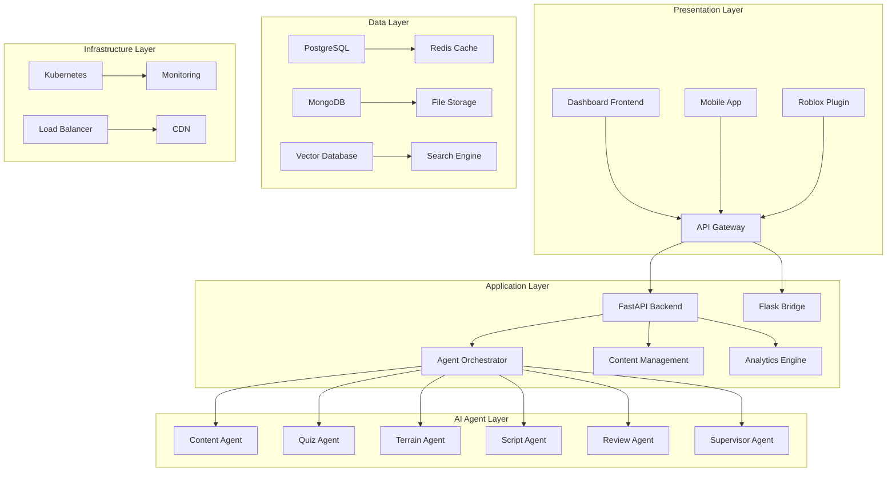
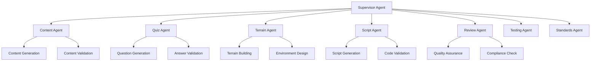
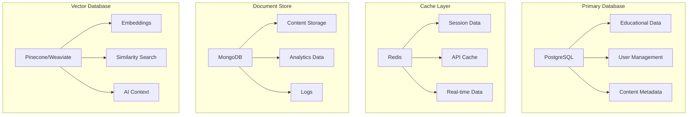

# 🏗️ Core System Architecture 2025

## Overview

This document provides comprehensive architecture documentation for the ToolboxAI Solutions core system components, implementing 2025 best practices for AI agent orchestration, database management, and distributed computing.

## 🎯 System Architecture Principles

### 2025 Core Standards

- **Microservices Architecture**: Loosely coupled, independently deployable services
- **Event-Driven Design**: Asynchronous communication and real-time processing
- **AI-First Approach**: Intelligent agents as first-class citizens
- **Cloud-Native**: Containerized, scalable, and resilient
- **Security by Design**: Zero-trust security model throughout
- **Observability**: Comprehensive monitoring and logging

## 🏗️ High-Level Architecture



## 🤖 AI Agent System Architecture

### Agent Hierarchy



### Agent Communication Protocol

```python
# Agent Communication Interface
from typing import Dict, Any, Optional
from dataclasses import dataclass
from enum import Enum

class AgentStatus(Enum):
    IDLE = "idle"
    PROCESSING = "processing"
    COMPLETED = "completed"
    FAILED = "failed"
    RETRYING = "retrying"

@dataclass
class AgentMessage:
    sender: str
    recipient: str
    message_type: str
    payload: Dict[str, Any]
    timestamp: float
    correlation_id: str
    priority: int = 0

@dataclass
class AgentResponse:
    success: bool
    result: Optional[Dict[str, Any]] = None
    error: Optional[str] = None
    metadata: Optional[Dict[str, Any]] = None
    execution_time: float = 0.0

class AgentCommunicationProtocol:
    async def send_message(self, message: AgentMessage) -> AgentResponse:
        """Send message to another agent"""
        pass

    async def broadcast_message(self, message: AgentMessage) -> List[AgentResponse]:
        """Broadcast message to all agents"""
        pass

    async def subscribe_to_messages(self, agent_id: str, message_types: List[str]):
        """Subscribe to specific message types"""
        pass
```

## 🗄️ Database Architecture

### Multi-Database Strategy



### Database Schema Design

```sql
-- Core Educational Platform Schema
CREATE SCHEMA IF NOT EXISTS educational_platform;

-- Users and Authentication
CREATE TABLE users (
    id UUID PRIMARY KEY DEFAULT gen_random_uuid(),
    username VARCHAR(50) UNIQUE NOT NULL,
    email VARCHAR(255) UNIQUE NOT NULL,
    password_hash VARCHAR(255) NOT NULL,
    role user_role NOT NULL,
    created_at TIMESTAMP WITH TIME ZONE DEFAULT NOW(),
    updated_at TIMESTAMP WITH TIME ZONE DEFAULT NOW(),
    last_login TIMESTAMP WITH TIME ZONE,
    is_active BOOLEAN DEFAULT TRUE
);

-- Educational Content
CREATE TABLE lessons (
    id UUID PRIMARY KEY DEFAULT gen_random_uuid(),
    title VARCHAR(255) NOT NULL,
    description TEXT,
    subject VARCHAR(100) NOT NULL,
    grade_level INTEGER NOT NULL,
    content_data JSONB NOT NULL,
    created_by UUID REFERENCES users(id),
    created_at TIMESTAMP WITH TIME ZONE DEFAULT NOW(),
    updated_at TIMESTAMP WITH TIME ZONE DEFAULT NOW(),
    status lesson_status DEFAULT 'draft'
);

-- AI Agent Workflows
CREATE TABLE agent_workflows (
    id UUID PRIMARY KEY DEFAULT gen_random_uuid(),
    name VARCHAR(255) NOT NULL,
    description TEXT,
    workflow_config JSONB NOT NULL,
    created_by UUID REFERENCES users(id),
    created_at TIMESTAMP WITH TIME ZONE DEFAULT NOW(),
    status workflow_status DEFAULT 'active'
);

-- Agent Execution Logs
CREATE TABLE agent_executions (
    id UUID PRIMARY KEY DEFAULT gen_random_uuid(),
    workflow_id UUID REFERENCES agent_workflows(id),
    agent_name VARCHAR(100) NOT NULL,
    input_data JSONB,
    output_data JSONB,
    status agent_status NOT NULL,
    execution_time_ms INTEGER,
    error_message TEXT,
    created_at TIMESTAMP WITH TIME ZONE DEFAULT NOW()
);
```

## 🔄 Event-Driven Architecture

### Event Bus Design

```python
# Event Bus Implementation
from typing import Callable, Any, Dict
from dataclasses import dataclass
from enum import Enum
import asyncio
import json

class EventType(Enum):
    USER_CREATED = "user.created"
    LESSON_CREATED = "lesson.created"
    AGENT_EXECUTED = "agent.executed"
    CONTENT_GENERATED = "content.generated"
    ERROR_OCCURRED = "error.occurred"

@dataclass
class Event:
    event_type: EventType
    payload: Dict[str, Any]
    timestamp: float
    correlation_id: str
    source: str

class EventBus:
    def __init__(self):
        self.subscribers: Dict[EventType, List[Callable]] = {}
        self.event_queue = asyncio.Queue()

    async def publish(self, event: Event):
        """Publish event to all subscribers"""
        await self.event_queue.put(event)
        await self._process_event(event)

    async def subscribe(self, event_type: EventType, handler: Callable):
        """Subscribe to specific event type"""
        if event_type not in self.subscribers:
            self.subscribers[event_type] = []
        self.subscribers[event_type].append(handler)

    async def _process_event(self, event: Event):
        """Process event and notify subscribers"""
        if event.event_type in self.subscribers:
            tasks = [
                handler(event) for handler in self.subscribers[event.event_type]
            ]
            await asyncio.gather(*tasks, return_exceptions=True)
```

### Event Sourcing

```python
# Event Sourcing Implementation
from typing import List, Any
from dataclasses import dataclass
import json

@dataclass
class EventStore:
    events: List[Event] = []

    async def append_event(self, event: Event):
        """Append event to store"""
        self.events.append(event)
        await self._persist_event(event)

    async def get_events(self, aggregate_id: str) -> List[Event]:
        """Get all events for an aggregate"""
        return [e for e in self.events if e.payload.get('aggregate_id') == aggregate_id]

    async def _persist_event(self, event: Event):
        """Persist event to storage"""
        # Implementation would save to database
        pass

# Aggregate Root Pattern
class AggregateRoot:
    def __init__(self, aggregate_id: str):
        self.aggregate_id = aggregate_id
        self.uncommitted_events: List[Event] = []

    def apply_event(self, event: Event):
        """Apply event to aggregate"""
        self.uncommitted_events.append(event)
        self._handle_event(event)

    def _handle_event(self, event: Event):
        """Handle specific event type"""
        pass
```

## 🔧 Configuration Management

### Environment Configuration

```python
# Configuration Management
from pydantic import BaseSettings, Field
from typing import Optional, List
import os

class DatabaseConfig(BaseSettings):
    host: str = Field(..., env="DB_HOST")
    port: int = Field(5432, env="DB_PORT")
    name: str = Field(..., env="DB_NAME")
    user: str = Field(..., env="DB_USER")
    password: str = Field(..., env="DB_PASSWORD")
    pool_size: int = Field(10, env="DB_POOL_SIZE")
    max_overflow: int = Field(20, env="DB_MAX_OVERFLOW")

    class Config:
        env_file = ".env"

class RedisConfig(BaseSettings):
    host: str = Field(..., env="REDIS_HOST")
    port: int = Field(6379, env="REDIS_PORT")
    db: int = Field(0, env="REDIS_DB")
    password: Optional[str] = Field(None, env="REDIS_PASSWORD")

    class Config:
        env_file = ".env"

class AgentConfig(BaseSettings):
    max_concurrent_agents: int = Field(10, env="MAX_CONCURRENT_AGENTS")
    agent_timeout: int = Field(300, env="AGENT_TIMEOUT")
    retry_attempts: int = Field(3, env="AGENT_RETRY_ATTEMPTS")
    circuit_breaker_threshold: int = Field(5, env="CIRCUIT_BREAKER_THRESHOLD")

    class Config:
        env_file = ".env"

class AppConfig(BaseSettings):
    database: DatabaseConfig = DatabaseConfig()
    redis: RedisConfig = RedisConfig()
    agents: AgentConfig = AgentConfig()

    debug: bool = Field(False, env="DEBUG")
    log_level: str = Field("INFO", env="LOG_LEVEL")
    environment: str = Field("development", env="ENVIRONMENT")

    class Config:
        env_file = ".env"
```

## 🔒 Security Architecture

### Authentication & Authorization

```python
# JWT Authentication
from jose import JWTError, jwt
from datetime import datetime, timedelta
from typing import Optional, Dict, Any

class JWTAuth:
    def __init__(self, secret_key: str, algorithm: str = "HS256"):
        self.secret_key = secret_key
        self.algorithm = algorithm

    def create_token(self, user_id: str, role: str, expires_delta: Optional[timedelta] = None) -> str:
        """Create JWT token"""
        to_encode = {
            "user_id": user_id,
            "role": role,
            "exp": datetime.utcnow() + (expires_delta or timedelta(hours=24))
        }
        return jwt.encode(to_encode, self.secret_key, algorithm=self.algorithm)

    def verify_token(self, token: str) -> Optional[Dict[str, Any]]:
        """Verify JWT token"""
        try:
            payload = jwt.decode(token, self.secret_key, algorithms=[self.algorithm])
            return payload
        except JWTError:
            return None

# Role-Based Access Control
class RBAC:
    def __init__(self):
        self.permissions = {
            "admin": ["read", "write", "delete", "manage"],
            "teacher": ["read", "write"],
            "student": ["read"],
            "parent": ["read"]
        }

    def has_permission(self, role: str, action: str) -> bool:
        """Check if role has permission for action"""
        return action in self.permissions.get(role, [])
```

### Data Encryption

```python
# Data Encryption Service
from cryptography.fernet import Fernet
from cryptography.hazmat.primitives import hashes
from cryptography.hazmat.primitives.kdf.pbkdf2 import PBKDF2HMAC
import base64
import os

class EncryptionService:
    def __init__(self, password: str):
        self.key = self._derive_key(password)
        self.cipher = Fernet(self.key)

    def _derive_key(self, password: str) -> bytes:
        """Derive encryption key from password"""
        salt = os.urandom(16)
        kdf = PBKDF2HMAC(
            algorithm=hashes.SHA256(),
            length=32,
            salt=salt,
            iterations=100000,
        )
        key = base64.urlsafe_b64encode(kdf.derive(password.encode()))
        return key

    def encrypt(self, data: str) -> str:
        """Encrypt data"""
        return self.cipher.encrypt(data.encode()).decode()

    def decrypt(self, encrypted_data: str) -> str:
        """Decrypt data"""
        return self.cipher.decrypt(encrypted_data.encode()).decode()
```

## 📊 Monitoring & Observability

### Metrics Collection

```python
# Metrics Collection
from prometheus_client import Counter, Histogram, Gauge, start_http_server
import time

# Application Metrics
REQUEST_COUNT = Counter('http_requests_total', 'Total HTTP requests', ['method', 'endpoint', 'status'])
REQUEST_DURATION = Histogram('http_request_duration_seconds', 'HTTP request duration', ['method', 'endpoint'])
ACTIVE_CONNECTIONS = Gauge('active_connections', 'Number of active connections')

# Agent Metrics
AGENT_EXECUTIONS = Counter('agent_executions_total', 'Total agent executions', ['agent_name', 'status'])
AGENT_DURATION = Histogram('agent_execution_duration_seconds', 'Agent execution duration', ['agent_name'])
AGENT_QUEUE_SIZE = Gauge('agent_queue_size', 'Number of agents in queue')

# Database Metrics
DB_CONNECTIONS = Gauge('db_connections', 'Number of database connections')
DB_QUERY_DURATION = Histogram('db_query_duration_seconds', 'Database query duration', ['query_type'])

class MetricsCollector:
    def __init__(self, port: int = 8000):
        self.port = port
        start_http_server(port)

    def record_request(self, method: str, endpoint: str, status: int, duration: float):
        """Record HTTP request metrics"""
        REQUEST_COUNT.labels(method=method, endpoint=endpoint, status=status).inc()
        REQUEST_DURATION.labels(method=method, endpoint=endpoint).observe(duration)

    def record_agent_execution(self, agent_name: str, status: str, duration: float):
        """Record agent execution metrics"""
        AGENT_EXECUTIONS.labels(agent_name=agent_name, status=status).inc()
        AGENT_DURATION.labels(agent_name=agent_name).observe(duration)
```

### Health Checks

```python
# Health Check System
from typing import Dict, Any, List
from dataclasses import dataclass
from enum import Enum
import asyncio

class HealthStatus(Enum):
    HEALTHY = "healthy"
    DEGRADED = "degraded"
    UNHEALTHY = "unhealthy"

@dataclass
class HealthCheck:
    name: str
    status: HealthStatus
    message: str
    details: Dict[str, Any] = None

class HealthChecker:
    def __init__(self):
        self.checks: List[Callable] = []

    def add_check(self, check_func: Callable):
        """Add health check function"""
        self.checks.append(check_func)

    async def run_checks(self) -> Dict[str, HealthCheck]:
        """Run all health checks"""
        results = {}

        for check in self.checks:
            try:
                result = await check()
                results[result.name] = result
            except Exception as e:
                results[check.__name__] = HealthCheck(
                    name=check.__name__,
                    status=HealthStatus.UNHEALTHY,
                    message=f"Check failed: {str(e)}"
                )

        return results

# Database Health Check
async def check_database_health() -> HealthCheck:
    """Check database connectivity and performance"""
    try:
        # Implementation would check database connection
        # and run a simple query
        return HealthCheck(
            name="database",
            status=HealthStatus.HEALTHY,
            message="Database is healthy",
            details={"response_time_ms": 10}
        )
    except Exception as e:
        return HealthCheck(
            name="database",
            status=HealthStatus.UNHEALTHY,
            message=f"Database check failed: {str(e)}"
        )
```

## 🚀 Performance Optimization

### Caching Strategy

```python
# Multi-Level Caching
from typing import Any, Optional
import redis
import json
import hashlib

class CacheManager:
    def __init__(self, redis_client: redis.Redis):
        self.redis = redis_client
        self.local_cache = {}
        self.cache_ttl = 3600  # 1 hour

    async def get(self, key: str) -> Optional[Any]:
        """Get value from cache"""
        # Check local cache first
        if key in self.local_cache:
            return self.local_cache[key]

        # Check Redis cache
        value = self.redis.get(key)
        if value:
            data = json.loads(value)
            self.local_cache[key] = data
            return data

        return None

    async def set(self, key: str, value: Any, ttl: Optional[int] = None):
        """Set value in cache"""
        # Set in local cache
        self.local_cache[key] = value

        # Set in Redis cache
        self.redis.setex(key, ttl or self.cache_ttl, json.dumps(value))

    def generate_cache_key(self, prefix: str, **kwargs) -> str:
        """Generate cache key from parameters"""
        key_data = f"{prefix}:{json.dumps(kwargs, sort_keys=True)}"
        return hashlib.md5(key_data.encode()).hexdigest()
```

### Connection Pooling

```python
# Database Connection Pooling
from sqlalchemy import create_engine
from sqlalchemy.pool import QueuePool
from contextlib import asynccontextmanager

class DatabasePool:
    def __init__(self, database_url: str, pool_size: int = 10, max_overflow: int = 20):
        self.engine = create_engine(
            database_url,
            poolclass=QueuePool,
            pool_size=pool_size,
            max_overflow=max_overflow,
            pool_pre_ping=True,
            pool_recycle=3600
        )

    @asynccontextmanager
    async def get_connection(self):
        """Get database connection from pool"""
        connection = None
        try:
            connection = self.engine.connect()
            yield connection
        finally:
            if connection:
                connection.close()

    def get_pool_status(self) -> Dict[str, Any]:
        """Get connection pool status"""
        pool = self.engine.pool
        return {
            "size": pool.size(),
            "checked_in": pool.checkedin(),
            "checked_out": pool.checkedout(),
            "overflow": pool.overflow(),
            "invalid": pool.invalid()
        }
```

## 🔄 Error Handling & Resilience

### Circuit Breaker Pattern

```python
# Circuit Breaker Implementation
from enum import Enum
from typing import Callable, Any
import asyncio
import time

class CircuitState(Enum):
    CLOSED = "closed"
    OPEN = "open"
    HALF_OPEN = "half_open"

class CircuitBreaker:
    def __init__(self, failure_threshold: int = 5, timeout: int = 60, expected_exception: Exception = Exception):
        self.failure_threshold = failure_threshold
        self.timeout = timeout
        self.expected_exception = expected_exception
        self.failure_count = 0
        self.last_failure_time = None
        self.state = CircuitState.CLOSED

    async def call(self, func: Callable, *args, **kwargs) -> Any:
        """Execute function with circuit breaker protection"""
        if self.state == CircuitState.OPEN:
            if self._should_attempt_reset():
                self.state = CircuitState.HALF_OPEN
            else:
                raise Exception("Circuit breaker is OPEN")

        try:
            result = await func(*args, **kwargs)
            self._on_success()
            return result
        except self.expected_exception as e:
            self._on_failure()
            raise e

    def _should_attempt_reset(self) -> bool:
        """Check if enough time has passed to attempt reset"""
        return (time.time() - self.last_failure_time) >= self.timeout

    def _on_success(self):
        """Handle successful execution"""
        self.failure_count = 0
        self.state = CircuitState.CLOSED

    def _on_failure(self):
        """Handle failed execution"""
        self.failure_count += 1
        self.last_failure_time = time.time()

        if self.failure_count >= self.failure_threshold:
            self.state = CircuitState.OPEN
```

### Retry Mechanism

```python
# Retry Mechanism
from typing import Callable, Any, List
import asyncio
import random

class RetryConfig:
    def __init__(self, max_attempts: int = 3, base_delay: float = 1.0, max_delay: float = 60.0, exponential_base: float = 2.0):
        self.max_attempts = max_attempts
        self.base_delay = base_delay
        self.max_delay = max_delay
        self.exponential_base = exponential_base

class RetryManager:
    def __init__(self, config: RetryConfig):
        self.config = config

    async def execute_with_retry(self, func: Callable, *args, **kwargs) -> Any:
        """Execute function with retry logic"""
        last_exception = None

        for attempt in range(self.config.max_attempts):
            try:
                return await func(*args, **kwargs)
            except Exception as e:
                last_exception = e

                if attempt == self.config.max_attempts - 1:
                    raise last_exception

                delay = self._calculate_delay(attempt)
                await asyncio.sleep(delay)

        raise last_exception

    def _calculate_delay(self, attempt: int) -> float:
        """Calculate delay for retry attempt"""
        delay = self.config.base_delay * (self.config.exponential_base ** attempt)
        delay = min(delay, self.config.max_delay)

        # Add jitter to prevent thundering herd
        jitter = random.uniform(0, delay * 0.1)
        return delay + jitter
```

## 📋 API Design Patterns

### RESTful API Design

```python
# RESTful API Endpoints
from fastapi import APIRouter, HTTPException, Depends
from typing import List, Optional
from pydantic import BaseModel

class LessonCreate(BaseModel):
    title: str
    description: str
    subject: str
    grade_level: int
    content_data: dict

class LessonResponse(BaseModel):
    id: str
    title: str
    description: str
    subject: str
    grade_level: int
    created_at: str
    updated_at: str

router = APIRouter(prefix="/api/v1/lessons", tags=["lessons"])

@router.post("/", response_model=LessonResponse)
async def create_lesson(lesson: LessonCreate, current_user: User = Depends(get_current_user)):
    """Create a new lesson"""
    try:
        lesson_data = await lesson_service.create_lesson(lesson, current_user.id)
        return LessonResponse(**lesson_data)
    except Exception as e:
        raise HTTPException(status_code=400, detail=str(e))

@router.get("/", response_model=List[LessonResponse])
async def list_lessons(
    skip: int = 0,
    limit: int = 100,
    subject: Optional[str] = None,
    grade_level: Optional[int] = None
):
    """List lessons with optional filtering"""
    lessons = await lesson_service.list_lessons(skip, limit, subject, grade_level)
    return [LessonResponse(**lesson) for lesson in lessons]

@router.get("/{lesson_id}", response_model=LessonResponse)
async def get_lesson(lesson_id: str):
    """Get a specific lesson"""
    lesson = await lesson_service.get_lesson(lesson_id)
    if not lesson:
        raise HTTPException(status_code=404, detail="Lesson not found")
    return LessonResponse(**lesson)
```

### GraphQL Integration

```python
# GraphQL Schema
from strawberry import Schema, Query, Mutation, Field
from typing import List, Optional
import strawberry

@strawberry.type
class Lesson:
    id: str
    title: str
    description: str
    subject: str
    grade_level: int
    created_at: str

@strawberry.input
class LessonInput:
    title: str
    description: str
    subject: str
    grade_level: int
    content_data: str

@strawberry.type
class Query:
    @Field
    async def lessons(self, subject: Optional[str] = None) -> List[Lesson]:
        """Get all lessons"""
        return await lesson_service.list_lessons(subject=subject)

    @Field
    async def lesson(self, id: str) -> Optional[Lesson]:
        """Get a specific lesson"""
        return await lesson_service.get_lesson(id)

@strawberry.type
class Mutation:
    @Field
    async def create_lesson(self, input: LessonInput) -> Lesson:
        """Create a new lesson"""
        return await lesson_service.create_lesson(input)

schema = Schema(query=Query, mutation=Mutation)
```

## 🧪 Testing Strategy

### Unit Testing

```python
# Unit Test Example
import pytest
from unittest.mock import Mock, patch
from core.agents.content_agent import ContentAgent

class TestContentAgent:
    @pytest.fixture
    def content_agent(self):
        return ContentAgent()

    @pytest.mark.asyncio
    async def test_generate_content_success(self, content_agent):
        """Test successful content generation"""
        with patch('core.agents.content_agent.llm_client') as mock_llm:
            mock_llm.generate.return_value = "Generated content"

            result = await content_agent.generate_content(
                topic="Photosynthesis",
                grade_level=7
            )

            assert result.success is True
            assert "Generated content" in result.output

    @pytest.mark.asyncio
    async def test_generate_content_failure(self, content_agent):
        """Test content generation failure"""
        with patch('core.agents.content_agent.llm_client') as mock_llm:
            mock_llm.generate.side_effect = Exception("API Error")

            result = await content_agent.generate_content(
                topic="Photosynthesis",
                grade_level=7
            )

            assert result.success is False
            assert "API Error" in result.error
```

### Integration Testing

```python
# Integration Test Example
import pytest
from httpx import AsyncClient
from main import app

class TestLessonAPI:
    @pytest.mark.asyncio
    async def test_create_lesson_integration(self):
        """Test lesson creation end-to-end"""
        async with AsyncClient(app=app, base_url="http://test") as client:
            response = await client.post(
                "/api/v1/lessons/",
                json={
                    "title": "Test Lesson",
                    "description": "Test Description",
                    "subject": "Science",
                    "grade_level": 7,
                    "content_data": {}
                },
                headers={"Authorization": "Bearer test_token"}
            )

            assert response.status_code == 201
            data = response.json()
            assert data["title"] == "Test Lesson"
            assert data["subject"] == "Science"
```

## 📚 Documentation Standards

### API Documentation

```python
# OpenAPI Documentation
from fastapi import FastAPI
from fastapi.openapi.utils import get_openapi

app = FastAPI(
    title="ToolboxAI Solutions API",
    description="Educational platform API for creating immersive 3D learning experiences",
    version="2.0.0",
    contact={
        "name": "API Support",
        "email": "api-support@toolboxai.com",
        "url": "https://docs.toolboxai.com/support"
    },
    license_info={
        "name": "MIT",
        "url": "https://opensource.org/licenses/MIT"
    }
)

def custom_openapi():
    if app.openapi_schema:
        return app.openapi_schema

    openapi_schema = get_openapi(
        title="ToolboxAI Solutions API",
        version="2.0.0",
        description="Educational platform API for creating immersive 3D learning experiences",
        routes=app.routes,
    )

    # Add custom documentation
    openapi_schema["info"]["x-logo"] = {
        "url": "https://toolboxai.com/logo.png"
    }

    app.openapi_schema = openapi_schema
    return app.openapi_schema

app.openapi = custom_openapi
```

## 🎯 Best Practices

### Code Organization

1. **Modular Design**: Separate concerns into distinct modules
2. **Dependency Injection**: Use dependency injection for testability
3. **Error Handling**: Implement comprehensive error handling
4. **Logging**: Use structured logging throughout
5. **Type Hints**: Use type hints for better code documentation

### Performance Guidelines

1. **Async/Await**: Use async/await for I/O operations
2. **Connection Pooling**: Implement connection pooling for databases
3. **Caching**: Use multi-level caching strategy
4. **Monitoring**: Implement comprehensive monitoring
5. **Profiling**: Regular performance profiling and optimization

### Security Guidelines

1. **Input Validation**: Validate all inputs
2. **Authentication**: Implement proper authentication
3. **Authorization**: Use role-based access control
4. **Encryption**: Encrypt sensitive data
5. **Audit Logging**: Log all security-relevant events

---

*Last Updated: 2025-09-14*
*Version: 2.0.0*
*Compliance: COPPA, FERPA, GDPR, SOC 2 Type 2*

