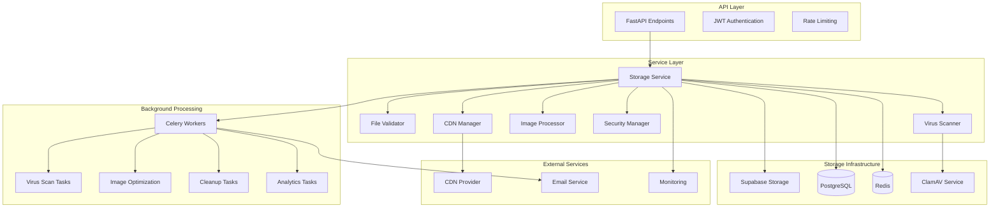

# Supabase Storage Implementation

This document provides comprehensive technical details about the ToolBoxAI Storage System implementation using Supabase as the storage backend. The system is designed with multi-tenancy, security, and educational compliance as core principles.

## Table of Contents
- [Architecture Overview](#architecture-overview)
- [Database Schema](#database-schema)
- [Row Level Security (RLS) Policies](#row-level-security-rls-policies)
- [Storage Service Implementation](#storage-service-implementation)
- [Multi-Tenant Bucket Management](#multi-tenant-bucket-management)
- [Security Implementation](#security-implementation)
- [Performance Optimizations](#performance-optimizations)
- [Background Processing](#background-processing)
- [Integration Patterns](#integration-patterns)
- [Deployment Configuration](#deployment-configuration)

## Architecture Overview

### System Components



### Technology Stack

- **Storage Backend**: Supabase Storage (S3-compatible)
- **Database**: PostgreSQL 15+ with Row Level Security
- **Cache**: Redis 6+ for session and metadata caching
- **Background Jobs**: Celery with Redis broker
- **Virus Scanning**: ClamAV with pyclamd
- **Image Processing**: Pillow with WebP/AVIF support
- **CDN**: Configurable (CloudFlare, KeyCDN, etc.)
- **Monitoring**: Prometheus metrics with Grafana

## Database Schema

### Core Storage Models

The storage system uses several interconnected models to manage files, versions, sharing, and compliance:

```sql
-- Files table with multi-tenant isolation
CREATE TABLE files (
    id UUID PRIMARY KEY DEFAULT gen_random_uuid(),
    organization_id UUID NOT NULL REFERENCES organizations(id),

    -- File metadata
    filename VARCHAR(255) NOT NULL,
    original_filename VARCHAR(255) NOT NULL,
    file_size BIGINT NOT NULL CHECK (file_size > 0),
    mime_type VARCHAR(127) NOT NULL,
    file_extension VARCHAR(20),

    -- Storage information
    storage_path TEXT NOT NULL,
    bucket_name VARCHAR(255) NOT NULL,
    cdn_url TEXT,
    thumbnail_url TEXT,

    -- File properties
    status file_status DEFAULT 'pending' NOT NULL,
    category file_category DEFAULT 'media_resource' NOT NULL,
    checksum VARCHAR(64), -- SHA256

    -- Security and scanning
    virus_scanned BOOLEAN DEFAULT FALSE,
    virus_scan_result JSONB,
    last_scanned_at TIMESTAMPTZ,

    -- Compliance fields
    contains_pii BOOLEAN DEFAULT FALSE,
    requires_consent BOOLEAN DEFAULT FALSE,
    retention_days INTEGER,
    deletion_date TIMESTAMPTZ,

    -- User relationship
    uploaded_by UUID NOT NULL REFERENCES users(id),

    -- Additional metadata
    title VARCHAR(255),
    description TEXT,
    tags JSONB DEFAULT '[]',
    metadata JSONB DEFAULT '{}',

    -- Access tracking
    download_count INTEGER DEFAULT 0,
    last_accessed_at TIMESTAMPTZ,

    -- Timestamps
    created_at TIMESTAMPTZ DEFAULT NOW(),
    updated_at TIMESTAMPTZ DEFAULT NOW(),

    -- Audit fields
    created_by UUID REFERENCES users(id),
    updated_by UUID REFERENCES users(id)
);

-- Indexes for performance
CREATE INDEX idx_files_organization_status ON files(organization_id, status);
CREATE INDEX idx_files_category ON files(category);
CREATE INDEX idx_files_uploaded_by ON files(uploaded_by);
CREATE INDEX idx_files_created_at ON files(created_at);
CREATE INDEX idx_files_checksum ON files(checksum);
CREATE INDEX idx_files_deletion_date ON files(deletion_date) WHERE deletion_date IS NOT NULL;
```

### File Versions

```sql
-- File version tracking
CREATE TABLE file_versions (
    id UUID PRIMARY KEY DEFAULT gen_random_uuid(),
    organization_id UUID NOT NULL REFERENCES organizations(id),
    file_id UUID NOT NULL REFERENCES files(id) ON DELETE CASCADE,

    -- Version information
    version_number INTEGER NOT NULL,
    storage_path TEXT NOT NULL,
    file_size BIGINT NOT NULL,
    checksum VARCHAR(64),

    -- Change tracking
    changed_by UUID NOT NULL REFERENCES users(id),
    change_description TEXT,

    -- Timestamps
    created_at TIMESTAMPTZ DEFAULT NOW(),

    UNIQUE(file_id, version_number)
);

CREATE INDEX idx_file_versions_file_id ON file_versions(file_id);
CREATE INDEX idx_file_versions_created_at ON file_versions(created_at);
```

### File Sharing

```sql
-- File sharing and access control
CREATE TABLE file_shares (
    id UUID PRIMARY KEY DEFAULT gen_random_uuid(),
    organization_id UUID NOT NULL REFERENCES organizations(id),
    file_id UUID NOT NULL REFERENCES files(id) ON DELETE CASCADE,

    -- Share configuration
    share_type share_type DEFAULT 'public_link' NOT NULL,
    share_token VARCHAR(64) NOT NULL UNIQUE DEFAULT gen_random_uuid()::TEXT,

    -- Access control
    password_protected BOOLEAN DEFAULT FALSE,
    password_hash VARCHAR(255),

    -- Permissions
    can_download BOOLEAN DEFAULT TRUE,
    can_view_only BOOLEAN DEFAULT FALSE,

    -- Expiration
    expires_at TIMESTAMPTZ,
    max_downloads INTEGER,
    download_count INTEGER DEFAULT 0,

    -- Sharing details
    shared_by UUID NOT NULL REFERENCES users(id),
    shared_with_users JSONB DEFAULT '[]',
    shared_with_class UUID REFERENCES classes(id),

    -- Access tracking
    last_accessed_at TIMESTAMPTZ,
    access_log JSONB DEFAULT '[]',

    -- Timestamps
    created_at TIMESTAMPTZ DEFAULT NOW(),
    updated_at TIMESTAMPTZ DEFAULT NOW()
);

CREATE INDEX idx_file_shares_file_id ON file_shares(file_id);
CREATE INDEX idx_file_shares_share_token ON file_shares(share_token);
CREATE UNIQUE INDEX uq_file_shares_token ON file_shares(share_token);
```

### Storage Quotas

```sql
-- Storage quota management per organization
CREATE TABLE storage_quotas (
    id UUID PRIMARY KEY DEFAULT gen_random_uuid(),
    organization_id UUID NOT NULL REFERENCES organizations(id) UNIQUE,

    -- Quota limits (in bytes)
    total_quota BIGINT NOT NULL DEFAULT 1073741824, -- 1GB
    used_storage BIGINT NOT NULL DEFAULT 0,

    -- File count limits
    max_files INTEGER DEFAULT 10000,
    file_count INTEGER DEFAULT 0,

    -- Category-specific limits (in MB)
    max_file_size_mb INTEGER DEFAULT 100,
    max_video_size_mb INTEGER DEFAULT 500,
    max_image_size_mb INTEGER DEFAULT 50,
    max_document_size_mb INTEGER DEFAULT 100,

    -- Usage tracking
    last_calculated_at TIMESTAMPTZ DEFAULT NOW(),

    -- Alerts
    warning_threshold_percent INTEGER DEFAULT 80,
    critical_threshold_percent INTEGER DEFAULT 95,
    last_warning_sent_at TIMESTAMPTZ,

    -- Timestamps
    created_at TIMESTAMPTZ DEFAULT NOW(),
    updated_at TIMESTAMPTZ DEFAULT NOW()
);

CREATE INDEX idx_storage_quotas_organization ON storage_quotas(organization_id);
```

### Access Logging

```sql
-- File access audit log (FERPA compliance)
CREATE TABLE file_access_logs (
    id UUID PRIMARY KEY DEFAULT gen_random_uuid(),
    file_id UUID NOT NULL REFERENCES files(id),
    user_id UUID NOT NULL REFERENCES users(id),
    organization_id UUID NOT NULL REFERENCES organizations(id),

    -- Access details
    action VARCHAR(50) NOT NULL, -- view, download, share, delete
    accessed_at TIMESTAMPTZ DEFAULT NOW() NOT NULL,
    ip_address INET,
    user_agent TEXT,

    -- Additional context
    access_granted BOOLEAN DEFAULT TRUE,
    denial_reason VARCHAR(255),
    metadata JSONB DEFAULT '{}'
);

CREATE INDEX idx_file_access_logs_file ON file_access_logs(file_id);
CREATE INDEX idx_file_access_logs_user ON file_access_logs(user_id);
CREATE INDEX idx_file_access_logs_timestamp ON file_access_logs(accessed_at);
CREATE INDEX idx_file_access_logs_organization ON file_access_logs(organization_id);
```

### Enums

```sql
-- File status enumeration
CREATE TYPE file_status AS ENUM (
    'pending',
    'processing',
    'available',
    'quarantined',
    'deleted',
    'archived',
    'error'
);

-- File category enumeration
CREATE TYPE file_category AS ENUM (
    'educational_content',
    'student_submission',
    'assessment',
    'administrative',
    'media_resource',
    'temporary',
    'avatar',
    'report'
);

-- Share type enumeration
CREATE TYPE share_type AS ENUM (
    'public_link',
    'organization',
    'specific_users',
    'class',
    'temporary'
);
```

## Row Level Security (RLS) Policies

### Organization Isolation

All storage tables implement RLS to ensure complete organization isolation:

```sql
-- Enable RLS on all storage tables
ALTER TABLE files ENABLE ROW LEVEL SECURITY;
ALTER TABLE file_versions ENABLE ROW LEVEL SECURITY;
ALTER TABLE file_shares ENABLE ROW LEVEL SECURITY;
ALTER TABLE storage_quotas ENABLE ROW LEVEL SECURITY;
ALTER TABLE file_access_logs ENABLE ROW LEVEL SECURITY;

-- Files table policies
CREATE POLICY files_organization_isolation ON files
    FOR ALL
    USING (organization_id = current_setting('app.current_organization_id')::UUID);

CREATE POLICY files_user_access ON files
    FOR SELECT
    USING (
        organization_id = current_setting('app.current_organization_id')::UUID
        AND (
            uploaded_by = current_setting('app.current_user_id')::UUID
            OR has_file_access(id, current_setting('app.current_user_id')::UUID)
        )
    );

-- File versions policies
CREATE POLICY file_versions_organization_isolation ON file_versions
    FOR ALL
    USING (organization_id = current_setting('app.current_organization_id')::UUID);

-- File shares policies
CREATE POLICY file_shares_organization_isolation ON file_shares
    FOR ALL
    USING (organization_id = current_setting('app.current_organization_id')::UUID);

-- Storage quotas policies
CREATE POLICY storage_quotas_organization_isolation ON storage_quotas
    FOR ALL
    USING (organization_id = current_setting('app.current_organization_id')::UUID);

-- Access logs policies
CREATE POLICY file_access_logs_organization_isolation ON file_access_logs
    FOR ALL
    USING (organization_id = current_setting('app.current_organization_id')::UUID);
```

### Permission Functions

```sql
-- Function to check if user has access to a file
CREATE OR REPLACE FUNCTION has_file_access(file_id UUID, user_id UUID)
RETURNS BOOLEAN AS $$
DECLARE
    file_org_id UUID;
    user_org_id UUID;
    user_role TEXT;
    file_category TEXT;
    is_shared BOOLEAN;
BEGIN
    -- Get file organization and category
    SELECT f.organization_id, f.category
    INTO file_org_id, file_category
    FROM files f
    WHERE f.id = file_id;

    -- Get user organization and role
    SELECT u.organization_id, u.role
    INTO user_org_id, user_role
    FROM users u
    WHERE u.id = user_id;

    -- Check organization membership
    IF file_org_id != user_org_id THEN
        RETURN FALSE;
    END IF;

    -- Admin access
    IF user_role = 'admin' THEN
        RETURN TRUE;
    END IF;

    -- Check if file is shared with user
    SELECT EXISTS(
        SELECT 1 FROM file_shares fs
        WHERE fs.file_id = has_file_access.file_id
        AND (
            fs.share_type = 'organization'
            OR (fs.share_type = 'specific_users' AND fs.shared_with_users ? user_id::TEXT)
            OR (fs.share_type = 'class' AND user_in_class(user_id, fs.shared_with_class))
        )
        AND (fs.expires_at IS NULL OR fs.expires_at > NOW())
    ) INTO is_shared;

    IF is_shared THEN
        RETURN TRUE;
    END IF;

    -- Teacher access to educational content and student submissions
    IF user_role = 'teacher' AND file_category IN ('educational_content', 'student_submission', 'assessment') THEN
        RETURN TRUE;
    END IF;

    -- Student access to their own submissions and shared educational content
    IF user_role = 'student' THEN
        -- Own files
        IF EXISTS(SELECT 1 FROM files f WHERE f.id = file_id AND f.uploaded_by = user_id) THEN
            RETURN TRUE;
        END IF;

        -- Educational content in their classes
        IF file_category = 'educational_content' AND user_has_class_access(user_id, file_id) THEN
            RETURN TRUE;
        END IF;
    END IF;

    RETURN FALSE;
END;
$$ LANGUAGE plpgsql SECURITY DEFINER;
```

## Storage Service Implementation

### Base Storage Service Interface

```python
from abc import ABC, abstractmethod
from typing import List, Optional, Dict, Any, AsyncIterator
from dataclasses import dataclass
from datetime import datetime
from uuid import UUID

@dataclass
class UploadOptions:
    """Configuration options for file upload"""
    file_category: str = "media_resource"
    title: Optional[str] = None
    description: Optional[str] = None
    tags: List[str] = None
    virus_scan: bool = True
    content_validation: bool = True
    generate_thumbnails: bool = False
    optimize_images: bool = False
    retention_days: Optional[int] = None
    metadata: Dict[str, Any] = None

@dataclass
class UploadResult:
    """Result of file upload operation"""
    file_id: UUID
    filename: str
    file_size: int
    mime_type: str
    status: str
    cdn_url: Optional[str] = None
    thumbnail_url: Optional[str] = None
    checksum: Optional[str] = None
    processing_eta: Optional[int] = None

class StorageService(ABC):
    """Abstract base class for storage services"""

    def __init__(self, organization_id: UUID, user_id: UUID):
        self.organization_id = organization_id
        self.user_id = user_id

    @abstractmethod
    async def upload_file(
        self,
        file_data: bytes,
        filename: str,
        options: UploadOptions
    ) -> UploadResult:
        """Upload a single file"""
        pass

    @abstractmethod
    async def upload_file_multipart(
        self,
        file_stream: AsyncIterator[bytes],
        filename: str,
        total_size: int,
        options: UploadOptions,
        chunk_size: int = 10 * 1024 * 1024  # 10MB
    ) -> UploadResult:
        """Upload large file using multipart upload"""
        pass

    @abstractmethod
    async def download_file(
        self,
        file_id: UUID,
        options: Optional[Dict[str, Any]] = None
    ) -> Dict[str, Any]:
        """Get download URL for file"""
        pass

    @abstractmethod
    async def delete_file(
        self,
        file_id: UUID,
        permanent: bool = False
    ) -> bool:
        """Delete file (soft delete by default)"""
        pass

    @abstractmethod
    async def list_files(
        self,
        filters: Optional[Dict[str, Any]] = None,
        page: int = 1,
        size: int = 20
    ) -> Dict[str, Any]:
        """List files with pagination and filtering"""
        pass
```

### Supabase Storage Provider

```python
import asyncio
import hashlib
import mimetypes
from datetime import datetime, timedelta
from typing import Optional, Dict, Any, List, AsyncIterator
from uuid import UUID, uuid4

from supabase import create_client, Client
from sqlalchemy import select, update, delete
from sqlalchemy.ext.asyncio import AsyncSession

from apps.backend.services.storage.file_validator import FileValidator
from apps.backend.services.storage.virus_scanner import VirusScanner
from apps.backend.services.storage.image_processor import ImageProcessor
from apps.backend.services.storage.security_manager import SecurityManager
from apps.backend.services.storage.cdn_manager import CDNManager
from database.models.storage import File, FileStatus, FileCategory
from toolboxai_settings import settings

class SupabaseStorageProvider(StorageService):
    """Supabase-based storage implementation"""

    def __init__(self, organization_id: UUID, user_id: UUID):
        super().__init__(organization_id, user_id)

        # Initialize Supabase client
        self.supabase: Client = create_client(
            settings.SUPABASE_URL,
            settings.SUPABASE_SERVICE_ROLE_KEY
        )

        # Initialize service components
        self.file_validator = FileValidator()
        self.virus_scanner = VirusScanner()
        self.image_processor = ImageProcessor()
        self.security_manager = SecurityManager()
        self.cdn_manager = CDNManager()

        # Organization-specific bucket
        self.bucket_name = f"toolboxai-org-{str(organization_id).replace('-', '')}"

    async def upload_file(
        self,
        file_data: bytes,
        filename: str,
        options: UploadOptions
    ) -> UploadResult:
        """Upload a single file with full processing pipeline"""

        # Validate file
        validation_result = await self.file_validator.validate_file(
            file_data, filename, options.file_category
        )

        if not validation_result.is_valid:
            raise ValueError(f"File validation failed: {validation_result.errors}")

        # Generate file metadata
        file_id = uuid4()
        mime_type = validation_result.detected_mime_type
        file_size = len(file_data)
        checksum = hashlib.sha256(file_data).hexdigest()

        # Generate storage path
        storage_path = self._generate_storage_path(file_id, filename, options.file_category)

        # Create database record
        file_record = File(
            id=file_id,
            organization_id=self.organization_id,
            filename=self._sanitize_filename(filename),
            original_filename=filename,
            file_size=file_size,
            mime_type=mime_type,
            file_extension=self._get_file_extension(filename),
            storage_path=storage_path,
            bucket_name=self.bucket_name,
            status=FileStatus.PENDING,
            category=FileCategory(options.file_category),
            checksum=checksum,
            uploaded_by=self.user_id,
            title=options.title or filename,
            description=options.description,
            tags=options.tags or [],
            metadata=options.metadata or {}
        )

        # Save to database
        async with AsyncSession() as session:
            session.add(file_record)
            await session.commit()

        try:
            # Upload to Supabase Storage
            await self._ensure_bucket_exists()

            upload_response = self.supabase.storage.from_(self.bucket_name).upload(
                path=storage_path,
                file=file_data,
                file_options={
                    "content-type": mime_type,
                    "cache-control": "3600",
                    "upsert": False
                }
            )

            if upload_response.get("error"):
                raise Exception(f"Supabase upload failed: {upload_response['error']}")

            # Get CDN URL
            cdn_url = await self.cdn_manager.get_file_url(
                bucket_name=self.bucket_name,
                storage_path=storage_path
            )

            # Update file record with URLs
            async with AsyncSession() as session:
                await session.execute(
                    update(File)
                    .where(File.id == file_id)
                    .values(
                        cdn_url=cdn_url,
                        status=FileStatus.PROCESSING
                    )
                )
                await session.commit()

            # Schedule background processing
            await self._schedule_background_processing(file_id, file_data, options)

            return UploadResult(
                file_id=file_id,
                filename=file_record.filename,
                file_size=file_size,
                mime_type=mime_type,
                status="processing",
                cdn_url=cdn_url,
                checksum=checksum,
                processing_eta=self._estimate_processing_time(file_size, mime_type)
            )

        except Exception as e:
            # Update file status to error
            async with AsyncSession() as session:
                await session.execute(
                    update(File)
                    .where(File.id == file_id)
                    .values(status=FileStatus.ERROR)
                )
                await session.commit()
            raise e

    async def _schedule_background_processing(
        self,
        file_id: UUID,
        file_data: bytes,
        options: UploadOptions
    ):
        """Schedule background processing tasks"""
        from apps.backend.workers.tasks.storage_tasks import (
            virus_scan_file,
            process_image_variants,
            calculate_storage_usage
        )

        # Virus scanning (always for security)
        if options.virus_scan:
            virus_scan_file.delay(
                str(file_id),
                str(self.organization_id)
            )

        # Image processing
        if options.generate_thumbnails or options.optimize_images:
            if self._is_image_file(file_data):
                process_image_variants.delay(
                    str(file_id),
                    str(self.organization_id),
                    {
                        "generate_thumbnails": options.generate_thumbnails,
                        "optimize": options.optimize_images
                    }
                )

        # Update storage usage
        calculate_storage_usage.delay(str(self.organization_id))

    def _generate_storage_path(
        self,
        file_id: UUID,
        filename: str,
        category: str
    ) -> str:
        """Generate organized storage path"""
        now = datetime.utcnow()
        sanitized_filename = self._sanitize_filename(filename)

        return (
            f"org_{self.organization_id}/"
            f"{category}/"
            f"{now.year:04d}/"
            f"{now.month:02d}/"
            f"{file_id}_{sanitized_filename}"
        )

    def _sanitize_filename(self, filename: str) -> str:
        """Sanitize filename for safe storage"""
        import re
        # Remove or replace unsafe characters
        sanitized = re.sub(r'[^a-zA-Z0-9._-]', '_', filename)
        # Limit length
        if len(sanitized) > 100:
            name, ext = os.path.splitext(sanitized)
            sanitized = name[:95] + ext
        return sanitized

    async def _ensure_bucket_exists(self):
        """Ensure organization bucket exists"""
        try:
            # Check if bucket exists
            buckets = self.supabase.storage.list_buckets()
            bucket_names = [bucket['name'] for bucket in buckets]

            if self.bucket_name not in bucket_names:
                # Create bucket with proper policies
                create_response = self.supabase.storage.create_bucket(
                    id=self.bucket_name,
                    name=self.bucket_name,
                    options={
                        "public": False,  # Private by default
                        "file_size_limit": 1073741824,  # 1GB
                        "allowed_mime_types": None  # Allow all for now
                    }
                )

                if create_response.get("error"):
                    raise Exception(f"Failed to create bucket: {create_response['error']}")

                # Set up bucket policies
                await self._configure_bucket_policies()

        except Exception as e:
            logger.error(f"Failed to ensure bucket exists: {e}")
            raise

    async def _configure_bucket_policies(self):
        """Configure RLS policies for the bucket"""
        # This would typically be done via Supabase SQL editor or migration
        # Policies ensure organization isolation at the storage level
        policies_sql = f"""
        -- Allow organization members to read their files
        CREATE POLICY "org_{self.organization_id}_read" ON storage.objects
        FOR SELECT USING (
            bucket_id = '{self.bucket_name}'
            AND auth.uid()::text IN (
                SELECT user_id::text FROM organization_members
                WHERE organization_id = '{self.organization_id}'::uuid
            )
        );

        -- Allow organization members to upload files
        CREATE POLICY "org_{self.organization_id}_upload" ON storage.objects
        FOR INSERT WITH CHECK (
            bucket_id = '{self.bucket_name}'
            AND auth.uid()::text IN (
                SELECT user_id::text FROM organization_members
                WHERE organization_id = '{self.organization_id}'::uuid
            )
        );
        """

        # Execute via Supabase RPC or direct SQL
        # Implementation depends on your Supabase setup
```

## Multi-Tenant Bucket Management

### Bucket Naming Strategy

```python
class TenantStorageManager:
    """Manages multi-tenant storage buckets and quotas"""

    def __init__(self, supabase_client: Client):
        self.supabase = supabase_client

    def get_bucket_name(self, organization_id: UUID) -> str:
        """Generate organization-specific bucket name"""
        # Remove hyphens and use prefix for clarity
        org_id_clean = str(organization_id).replace('-', '')
        return f"toolboxai-org-{org_id_clean}"

    async def create_organization_bucket(
        self,
        organization_id: UUID,
        quota_gb: int = 1
    ) -> Dict[str, Any]:
        """Create a new bucket for an organization"""
        bucket_name = self.get_bucket_name(organization_id)

        try:
            # Create bucket
            create_response = self.supabase.storage.create_bucket(
                id=bucket_name,
                name=bucket_name,
                options={
                    "public": False,
                    "file_size_limit": quota_gb * 1024 * 1024 * 1024,  # Convert GB to bytes
                    "allowed_mime_types": None
                }
            )

            if create_response.get("error"):
                raise Exception(f"Failed to create bucket: {create_response['error']}")

            # Create storage quota record
            quota_record = StorageQuota(
                organization_id=organization_id,
                total_quota=quota_gb * 1024 * 1024 * 1024,
                max_files=10000,
                max_file_size_mb=100
            )

            async with AsyncSession() as session:
                session.add(quota_record)
                await session.commit()

            # Configure bucket policies
            await self._setup_bucket_policies(organization_id, bucket_name)

            return {
                "bucket_name": bucket_name,
                "quota_gb": quota_gb,
                "status": "created"
            }

        except Exception as e:
            logger.error(f"Failed to create organization bucket: {e}")
            raise

    async def get_storage_usage(self, organization_id: UUID) -> Dict[str, Any]:
        """Get comprehensive storage usage for organization"""
        async with AsyncSession() as session:
            # Get quota information
            quota = await session.execute(
                select(StorageQuota)
                .where(StorageQuota.organization_id == organization_id)
            )
            quota_record = quota.scalar_one_or_none()

            if not quota_record:
                raise ValueError(f"No quota record found for organization {organization_id}")

            # Get detailed usage by category
            usage_query = """
            SELECT
                category,
                COUNT(*) as file_count,
                SUM(file_size) as total_size,
                AVG(file_size) as avg_size
            FROM files
            WHERE organization_id = :org_id
                AND status != 'deleted'
            GROUP BY category
            """

            usage_result = await session.execute(
                text(usage_query),
                {"org_id": organization_id}
            )

            usage_by_category = {}
            total_files = 0
            total_size = 0

            for row in usage_result:
                category_usage = {
                    "file_count": row.file_count,
                    "total_size": row.total_size,
                    "average_size": row.avg_size,
                    "total_size_mb": row.total_size / (1024 * 1024),
                    "percentage_of_total": 0  # Calculate below
                }
                usage_by_category[row.category] = category_usage
                total_files += row.file_count
                total_size += row.total_size

            # Calculate percentages
            for category in usage_by_category:
                if total_size > 0:
                    usage_by_category[category]["percentage_of_total"] = (
                        usage_by_category[category]["total_size"] / total_size * 100
                    )

            # Update quota record if needed
            if quota_record.used_storage != total_size or quota_record.file_count != total_files:
                await session.execute(
                    update(StorageQuota)
                    .where(StorageQuota.organization_id == organization_id)
                    .values(
                        used_storage=total_size,
                        file_count=total_files,
                        last_calculated_at=datetime.utcnow()
                    )
                )
                await session.commit()

            return {
                "organization_id": organization_id,
                "total_quota": quota_record.total_quota,
                "used_storage": total_size,
                "available_storage": max(0, quota_record.total_quota - total_size),
                "used_percentage": (total_size / quota_record.total_quota * 100) if quota_record.total_quota > 0 else 0,
                "file_count": total_files,
                "max_files": quota_record.max_files,
                "usage_by_category": usage_by_category,
                "quota_limits": {
                    "max_file_size_mb": quota_record.max_file_size_mb,
                    "max_video_size_mb": quota_record.max_video_size_mb,
                    "max_image_size_mb": quota_record.max_image_size_mb,
                    "max_document_size_mb": quota_record.max_document_size_mb
                },
                "alert_thresholds": {
                    "warning_threshold": quota_record.warning_threshold_percent,
                    "critical_threshold": quota_record.critical_threshold_percent,
                    "is_warning_reached": (total_size / quota_record.total_quota * 100) >= quota_record.warning_threshold_percent,
                    "is_critical_reached": (total_size / quota_record.total_quota * 100) >= quota_record.critical_threshold_percent
                },
                "last_calculated_at": quota_record.last_calculated_at
            }
```

## Security Implementation

### PII Detection and Compliance

```python
import re
from enum import Enum
from typing import List, Dict, Any, Optional
from dataclasses import dataclass

class PIIType(Enum):
    SSN = "ssn"
    EMAIL = "email"
    PHONE = "phone"
    CREDIT_CARD = "credit_card"
    STUDENT_ID = "student_id"
    DATE_OF_BIRTH = "date_of_birth"
    ADDRESS = "address"

@dataclass
class PIIDetectionResult:
    has_pii: bool
    pii_types: List[PIIType]
    confidence_score: float
    details: Dict[str, Any]

class SecurityManager:
    """Handles security, compliance, and PII detection"""

    def __init__(self, encryption_key: Optional[str] = None):
        self.encryption_key = encryption_key or settings.STORAGE_ENCRYPTION_KEY
        self.pii_patterns = {
            PIIType.SSN: [
                r'\b\d{3}-\d{2}-\d{4}\b',  # 123-45-6789
                r'\b\d{9}\b'               # 123456789
            ],
            PIIType.EMAIL: [
                r'\b[A-Za-z0-9._%+-]+@[A-Za-z0-9.-]+\.[A-Z|a-z]{2,}\b'
            ],
            PIIType.PHONE: [
                r'\b\(?([0-9]{3})\)?[-. ]?([0-9]{3})[-. ]?([0-9]{4})\b',
                r'\b\+?1?[-.\s]?\(?([0-9]{3})\)?[-.\s]?([0-9]{3})[-.\s]?([0-9]{4})\b'
            ],
            PIIType.CREDIT_CARD: [
                r'\b(?:4[0-9]{12}(?:[0-9]{3})?|5[1-5][0-9]{14}|3[47][0-9]{13}|3[0-9]{13}|6(?:011|5[0-9]{2})[0-9]{12})\b'
            ],
            PIIType.STUDENT_ID: [
                r'\b[A-Z]{2,4}\d{6,10}\b',  # ABC123456789
                r'\bSTU\d{6,9}\b'           # STU123456
            ],
            PIIType.DATE_OF_BIRTH: [
                r'\b(?:0[1-9]|1[0-2])[-/](?:0[1-9]|[12][0-9]|3[01])[-/](?:19|20)\d{2}\b',
                r'\b(?:19|20)\d{2}[-/](?:0[1-9]|1[0-2])[-/](?:0[1-9]|[12][0-9]|3[01])\b'
            ]
        }

    async def detect_pii(
        self,
        content: bytes,
        filename: str
    ) -> PIIDetectionResult:
        """Detect PII in file content"""
        try:
            # Convert bytes to text for analysis
            text_content = self._extract_text_content(content, filename)

            detected_pii = []
            details = {}
            confidence_scores = []

            for pii_type, patterns in self.pii_patterns.items():
                matches = []
                for pattern in patterns:
                    pattern_matches = re.findall(pattern, text_content, re.IGNORECASE)
                    matches.extend(pattern_matches)

                if matches:
                    detected_pii.append(pii_type)
                    details[pii_type.value] = {
                        "match_count": len(matches),
                        "sample_matches": matches[:3]  # First 3 matches for review
                    }
                    confidence_scores.append(0.8)  # Base confidence for regex matches

            # Calculate overall confidence
            overall_confidence = sum(confidence_scores) / len(confidence_scores) if confidence_scores else 0.0

            return PIIDetectionResult(
                has_pii=len(detected_pii) > 0,
                pii_types=detected_pii,
                confidence_score=overall_confidence,
                details=details
            )

        except Exception as e:
            logger.error(f"PII detection failed: {e}")
            # Return safe default
            return PIIDetectionResult(
                has_pii=True,  # Assume PII present if detection fails
                pii_types=[],
                confidence_score=0.0,
                details={"error": str(e)}
            )

    async def check_compliance(
        self,
        file_data: bytes,
        filename: str,
        category: str,
        organization_context: Dict[str, Any]
    ) -> Dict[str, Any]:
        """Check COPPA/FERPA compliance requirements"""
        pii_result = await self.detect_pii(file_data, filename)

        compliance_result = {
            "pii_detected": pii_result.has_pii,
            "pii_types": [pii.value for pii in pii_result.pii_types],
            "coppa_compliance": self._check_coppa_compliance(category, organization_context),
            "ferpa_compliance": self._check_ferpa_compliance(category, pii_result),
            "encryption_required": False,
            "consent_required": False,
            "retention_requirements": self._get_retention_requirements(category)
        }

        # Determine if encryption is required
        if (
            pii_result.has_pii or
            category in ["student_submission", "assessment", "administrative"] or
            compliance_result["coppa_compliance"]["enhanced_protection_required"]
        ):
            compliance_result["encryption_required"] = True

        # Determine if consent is required
        if (
            compliance_result["coppa_compliance"]["parental_consent_required"] or
            (category == "student_submission" and pii_result.has_pii)
        ):
            compliance_result["consent_required"] = True

        return compliance_result

    def _check_coppa_compliance(
        self,
        category: str,
        organization_context: Dict[str, Any]
    ) -> Dict[str, Any]:
        """Check COPPA compliance requirements"""
        student_age = organization_context.get("student_age")
        is_child_user = student_age is not None and student_age < 13

        return {
            "applies": category in ["avatar", "student_submission"] or is_child_user,
            "child_user_detected": is_child_user,
            "parental_consent_required": is_child_user and category in ["avatar", "student_submission"],
            "enhanced_protection_required": is_child_user,
            "data_minimization_required": is_child_user,
            "retention_limit_days": 2555 if is_child_user else None  # 7 years max for children
        }

    def _check_ferpa_compliance(
        self,
        category: str,
        pii_result: PIIDetectionResult
    ) -> Dict[str, Any]:
        """Check FERPA compliance requirements"""
        is_educational_record = category in [
            "student_submission",
            "assessment",
            "administrative",
            "report"
        ]

        return {
            "applies": is_educational_record or pii_result.has_pii,
            "is_educational_record": is_educational_record,
            "audit_logging_required": is_educational_record,
            "legitimate_interest_required": is_educational_record,
            "directory_information_opt_out": False,  # To be implemented based on user preferences
            "retention_requirement_years": 7 if is_educational_record else None
        }

    async def encrypt_sensitive_file(
        self,
        file_data: bytes,
        organization_id: UUID
    ) -> tuple[bytes, Dict[str, Any]]:
        """Encrypt sensitive file data"""
        from cryptography.fernet import Fernet

        # Generate organization-specific key
        org_key = self._derive_organization_key(organization_id)
        fernet = Fernet(org_key)

        # Encrypt file data
        encrypted_data = fernet.encrypt(file_data)

        encryption_metadata = {
            "encrypted": True,
            "encryption_method": "Fernet",
            "key_derivation": "PBKDF2-HMAC-SHA256",
            "organization_id": str(organization_id),
            "encrypted_at": datetime.utcnow().isoformat()
        }

        return encrypted_data, encryption_metadata
```

## Performance Optimizations

### Image Processing and CDN Integration

```python
from PIL import Image, ImageOps
import io
from typing import Dict, List, Tuple

class ImageProcessor:
    """Handles image optimization and variant generation"""

    def __init__(self):
        self.thumbnail_sizes = [
            (150, 150),   # Small thumbnail
            (300, 300),   # Medium thumbnail
            (600, 600),   # Large thumbnail
        ]

        self.responsive_breakpoints = [
            (480, "mobile"),
            (768, "tablet"),
            (1024, "desktop"),
            (1920, "large")
        ]

    async def process_image(
        self,
        image_data: bytes,
        generate_thumbnails: bool = True,
        optimize: bool = True,
        generate_responsive: bool = False
    ) -> Dict[str, Any]:
        """Process image with optimization and variant generation"""

        try:
            # Open image
            original_image = Image.open(io.BytesIO(image_data))

            # Fix orientation based on EXIF
            original_image = ImageOps.exif_transpose(original_image)

            variants = {}

            # Original optimized version
            if optimize:
                optimized_data = await self._optimize_image(original_image)
                variants["optimized"] = {
                    "data": optimized_data,
                    "width": original_image.width,
                    "height": original_image.height,
                    "format": "WebP",
                    "file_size": len(optimized_data)
                }

            # Generate thumbnails
            if generate_thumbnails:
                for width, height in self.thumbnail_sizes:
                    thumbnail_data = await self._create_thumbnail(
                        original_image, width, height
                    )
                    variants[f"thumb_{width}x{height}"] = {
                        "data": thumbnail_data,
                        "width": width,
                        "height": height,
                        "format": "WebP",
                        "file_size": len(thumbnail_data)
                    }

            # Generate responsive variants
            if generate_responsive:
                for max_width, breakpoint in self.responsive_breakpoints:
                    if original_image.width > max_width:
                        responsive_data = await self._create_responsive_variant(
                            original_image, max_width
                        )
                        variants[f"responsive_{breakpoint}"] = {
                            "data": responsive_data,
                            "width": max_width,
                            "height": int(original_image.height * (max_width / original_image.width)),
                            "format": "WebP",
                            "file_size": len(responsive_data)
                        }

            return {
                "success": True,
                "variants": variants,
                "original_size": len(image_data),
                "total_variants": len(variants),
                "space_savings": self._calculate_space_savings(image_data, variants)
            }

        except Exception as e:
            logger.error(f"Image processing failed: {e}")
            return {
                "success": False,
                "error": str(e),
                "variants": {}
            }

    async def _optimize_image(self, image: Image.Image) -> bytes:
        """Optimize image for web delivery"""
        output = io.BytesIO()

        # Convert to RGB if necessary
        if image.mode in ('RGBA', 'LA', 'P'):
            # Create white background for transparency
            background = Image.new('RGB', image.size, (255, 255, 255))
            background.paste(image, mask=image.split()[-1] if image.mode == 'RGBA' else None)
            image = background

        # Save as WebP with optimization
        image.save(
            output,
            format='WebP',
            quality=85,
            optimize=True,
            method=6  # Best compression
        )

        return output.getvalue()

    async def _create_thumbnail(
        self,
        image: Image.Image,
        width: int,
        height: int
    ) -> bytes:
        """Create optimized thumbnail"""
        # Create thumbnail maintaining aspect ratio
        thumbnail = image.copy()
        thumbnail.thumbnail((width, height), Image.Resampling.LANCZOS)

        # Center crop to exact dimensions
        if thumbnail.size != (width, height):
            thumbnail = self._center_crop(thumbnail, width, height)

        output = io.BytesIO()
        thumbnail.save(
            output,
            format='WebP',
            quality=80,
            optimize=True
        )

        return output.getvalue()

    def _center_crop(self, image: Image.Image, width: int, height: int) -> Image.Image:
        """Center crop image to exact dimensions"""
        img_width, img_height = image.size

        # Calculate crop box
        left = (img_width - width) // 2
        top = (img_height - height) // 2
        right = left + width
        bottom = top + height

        return image.crop((left, top, right, bottom))

class CDNManager:
    """Manages CDN integration and optimization"""

    def __init__(self, cdn_config: Dict[str, Any]):
        self.base_url = cdn_config.get("base_url")
        self.signing_key = cdn_config.get("signing_key")
        self.enable_transformations = cdn_config.get("enable_transformations", True)

        # Predefined transformation presets
        self.presets = {
            "avatar": {
                "width": 150,
                "height": 150,
                "quality": 85,
                "format": "webp",
                "crop": "center"
            },
            "thumbnail": {
                "width": 300,
                "height": 300,
                "quality": 80,
                "format": "webp",
                "crop": "center"
            },
            "hero": {
                "width": 1200,
                "height": 600,
                "quality": 90,
                "format": "webp",
                "crop": "center"
            }
        }

    async def get_optimized_url(
        self,
        storage_path: str,
        transformations: Optional[Dict[str, Any]] = None
    ) -> str:
        """Get CDN URL with optional transformations"""

        if not self.enable_transformations or not transformations:
            return f"{self.base_url}/{storage_path}"

        # Build transformation parameters
        params = []

        if transformations.get("width"):
            params.append(f"w_{transformations['width']}")

        if transformations.get("height"):
            params.append(f"h_{transformations['height']}")

        if transformations.get("quality"):
            params.append(f"q_{transformations['quality']}")

        if transformations.get("format"):
            params.append(f"f_{transformations['format']}")

        if transformations.get("crop"):
            params.append(f"c_{transformations['crop']}")

        # Construct URL with transformations
        transform_string = ",".join(params)
        url = f"{self.base_url}/{transform_string}/{storage_path}"

        # Add signature if required
        if self.signing_key:
            signature = self._generate_signature(url)
            url += f"?sig={signature}"

        return url

    async def get_preset_url(
        self,
        storage_path: str,
        preset_name: str
    ) -> str:
        """Get CDN URL using predefined preset"""

        if preset_name not in self.presets:
            raise ValueError(f"Unknown preset: {preset_name}")

        transformations = self.presets[preset_name]
        return await self.get_optimized_url(storage_path, transformations)

    async def get_responsive_urls(
        self,
        storage_path: str,
        breakpoints: List[int] = None
    ) -> Dict[str, str]:
        """Get responsive image URLs for different breakpoints"""

        if not breakpoints:
            breakpoints = [480, 768, 1024, 1920]

        responsive_urls = {}

        for width in breakpoints:
            transformations = {
                "width": width,
                "quality": 85,
                "format": "webp"
            }

            url = await self.get_optimized_url(storage_path, transformations)
            responsive_urls[f"{width}w"] = url

        return responsive_urls
```

## Background Processing

### Celery Task Implementation

The complete Celery task implementation is already present in the codebase at:
- `apps/backend/workers/tasks/storage_tasks.py`

Key background processing features:
- **Virus Scanning**: Real-time ClamAV integration
- **Image Processing**: Thumbnail and variant generation
- **Storage Analytics**: Usage calculation and reporting
- **Cleanup Operations**: Automated file retention and cleanup
- **Quota Monitoring**: Threshold alerts and notifications

## Integration Patterns

### FastAPI Dependency Injection

```python
from fastapi import Depends, HTTPException, status
from sqlalchemy.ext.asyncio import AsyncSession

from apps.backend.dependencies.tenant import get_current_tenant, TenantContext
from apps.backend.dependencies.auth import get_current_user
from apps.backend.services.storage.supabase_provider import SupabaseStorageProvider

async def get_storage_service(
    current_user = Depends(get_current_user),
    tenant_context: TenantContext = Depends(get_current_tenant)
) -> SupabaseStorageProvider:
    """Dependency to get storage service with proper context"""

    return SupabaseStorageProvider(
        organization_id=tenant_context.organization_id,
        user_id=current_user.id
    )

# Usage in endpoints
@router.post("/files/upload")
async def upload_file(
    file: UploadFile,
    storage: SupabaseStorageProvider = Depends(get_storage_service)
):
    # Storage service is automatically configured with user/org context
    result = await storage.upload_file(
        file_data=await file.read(),
        filename=file.filename,
        options=UploadOptions(file_category="educational_content")
    )
    return result
```

### Database Session Management

```python
from sqlalchemy.ext.asyncio import create_async_engine, AsyncSession
from contextlib import asynccontextmanager

class DatabaseManager:
    """Manages database connections with proper RLS context"""

    def __init__(self):
        self.engine = create_async_engine(
            settings.DATABASE_URL,
            echo=settings.DEBUG,
            pool_size=20,
            max_overflow=0
        )

    @asynccontextmanager
    async def get_session_with_context(
        self,
        organization_id: UUID,
        user_id: UUID
    ):
        """Get database session with RLS context set"""
        async with AsyncSession(self.engine) as session:
            # Set RLS context
            await session.execute(
                text("SELECT set_config('app.current_organization_id', :org_id, true)"),
                {"org_id": str(organization_id)}
            )
            await session.execute(
                text("SELECT set_config('app.current_user_id', :user_id, true)"),
                {"user_id": str(user_id)}
            )

            try:
                yield session
            finally:
                # Clean up context
                await session.execute(
                    text("SELECT set_config('app.current_organization_id', '', true)")
                )
                await session.execute(
                    text("SELECT set_config('app.current_user_id', '', true)")
                )
```

## Deployment Configuration

### Environment Variables

```bash
# Supabase Configuration
SUPABASE_URL=https://your-project.supabase.co
SUPABASE_SERVICE_ROLE_KEY=your-service-role-key
SUPABASE_ANON_KEY=your-anon-key

# Storage Configuration
STORAGE_DEFAULT_QUOTA_GB=5
STORAGE_MAX_FILE_SIZE_MB=100
STORAGE_ENABLE_VIRUS_SCAN=true
STORAGE_ENABLE_IMAGE_OPTIMIZATION=true

# CDN Configuration
CDN_BASE_URL=https://cdn.yourapp.com
CDN_SIGNING_KEY=your-signing-key
CDN_ENABLE_TRANSFORMATIONS=true

# Security
STORAGE_ENCRYPTION_KEY=your-encryption-key
STORAGE_SIGNING_SECRET=your-signing-secret

# Celery/Redis
REDIS_URL=redis://localhost:6379/0
CELERY_BROKER_URL=redis://localhost:6379/0
CELERY_RESULT_BACKEND=redis://localhost:6379/0

# ClamAV
CLAMAV_SOCKET_PATH=/var/run/clamav/clamd.ctl
CLAMAV_TCP_HOST=localhost
CLAMAV_TCP_PORT=3310

# Monitoring
PROMETHEUS_ENABLED=true
STRUCTURED_LOGGING=true
LOG_LEVEL=INFO
```

### Docker Compose Setup

```yaml
version: '3.8'

services:
  fastapi:
    build: .
    environment:
      - SUPABASE_URL=${SUPABASE_URL}
      - SUPABASE_SERVICE_ROLE_KEY=${SUPABASE_SERVICE_ROLE_KEY}
      - REDIS_URL=redis://redis:6379/0
    depends_on:
      - redis
      - clamav
    volumes:
      - ./uploads:/tmp/uploads

  celery-worker:
    build: .
    command: celery -A apps.backend.workers.celery_app worker --loglevel=info
    environment:
      - REDIS_URL=redis://redis:6379/0
      - CLAMAV_TCP_HOST=clamav
    depends_on:
      - redis
      - clamav

  celery-beat:
    build: .
    command: celery -A apps.backend.workers.celery_app beat --loglevel=info
    environment:
      - REDIS_URL=redis://redis:6379/0
    depends_on:
      - redis

  redis:
    image: redis:7-alpine
    ports:
      - "6379:6379"

  clamav:
    image: clamav/clamav:latest
    ports:
      - "3310:3310"
    volumes:
      - clamav_data:/var/lib/clamav

volumes:
  clamav_data:
```

This implementation provides a comprehensive, production-ready storage system that leverages Supabase's capabilities while maintaining educational compliance, security, and performance requirements. The modular design allows for easy testing, maintenance, and future enhancements.