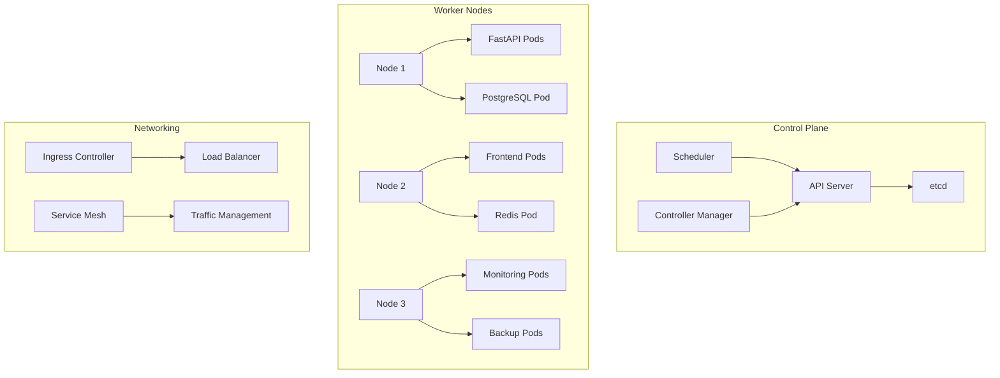

# ☸️ Kubernetes Deployment Guide 2025

## Overview

This guide provides comprehensive instructions for deploying the ToolboxAI Solutions platform on Kubernetes, implementing 2025 best practices for container orchestration, security, and scalability.

## 🏗️ Cluster Architecture

### Production Cluster Design



### Node Configuration

| Node Type | CPU | Memory | Storage | Purpose |
|-----------|-----|--------|---------|---------|
| Control Plane | 4 cores | 8GB | 100GB SSD | Cluster management |
| Worker Nodes | 8 cores | 32GB | 500GB SSD | Application workloads |
| Database Nodes | 16 cores | 64GB | 1TB SSD | Database workloads |

## 🚀 Quick Start

### Prerequisites

- Kubernetes cluster 1.28+
- kubectl 1.28+
- Helm 3.12+
- 3 worker nodes minimum
- 16GB RAM per node minimum

### Cluster Setup

```bash
# Create namespace
kubectl apply -f infrastructure/kubernetes/namespace.yaml

# Create secrets
kubectl apply -f infrastructure/kubernetes/create-secrets.sh

# Deploy PostgreSQL
kubectl apply -f infrastructure/kubernetes/postgres-statefulset.yaml

# Deploy Redis
kubectl apply -f infrastructure/kubernetes/redis-deployment.yaml

# Deploy backend services
kubectl apply -f infrastructure/kubernetes/backend-deployment.yaml

# Deploy ingress
kubectl apply -f infrastructure/kubernetes/ingress.yaml
```

## 📋 Kubernetes Manifests

### Namespace Configuration

```yaml
apiVersion: v1
kind: Namespace
metadata:
  name: toolboxai-production
  labels:
    app: toolboxai
    environment: production
---
apiVersion: v1
kind: Namespace
metadata:
  name: toolboxai-staging
  labels:
    app: toolboxai
    environment: staging
```

### Backend Deployment

```yaml
apiVersion: apps/v1
kind: Deployment
metadata:
  name: backend-deployment
  namespace: toolboxai-production
  labels:
    app: backend
    component: api
    tier: backend
spec:
  replicas: 3
  strategy:
    type: RollingUpdate
    rollingUpdate:
      maxSurge: 1
      maxUnavailable: 0
  selector:
    matchLabels:
      app: backend
      component: api
  template:
    metadata:
      labels:
        app: backend
        component: api
        tier: backend
      annotations:
        prometheus.io/scrape: "true"
        prometheus.io/port: "8008"
        prometheus.io/path: "/metrics"
    spec:
      affinity:
        podAntiAffinity:
          preferredDuringSchedulingIgnoredDuringExecution:
          - weight: 100
            podAffinityTerm:
              labelSelector:
                matchExpressions:
                - key: app
                  operator: In
                  values:
                  - backend
              topologyKey: kubernetes.io/hostname
      containers:
      - name: fastapi
        image: ghcr.io/toolboxai-solutions/backend:latest
        imagePullPolicy: Always
        ports:
        - containerPort: 8008
          name: http
          protocol: TCP
        - containerPort: 9876
          name: mcp
          protocol: TCP
        env:
        - name: ENVIRONMENT
          value: "production"
        - name: DATABASE_URL
          valueFrom:
            secretKeyRef:
              name: database-credentials
              key: url
        - name: REDIS_URL
          valueFrom:
            secretKeyRef:
              name: redis-credentials
              key: url
        - name: JWT_SECRET_KEY
          valueFrom:
            secretKeyRef:
              name: app-secrets
              key: jwt-secret
        - name: OPENAI_API_KEY
          valueFrom:
            secretKeyRef:
              name: app-secrets
              key: openai-key
        resources:
          requests:
            cpu: 500m
            memory: 1Gi
          limits:
            cpu: 2000m
            memory: 2Gi
        livenessProbe:
          httpGet:
            path: /health
            port: 8008
          initialDelaySeconds: 60
          periodSeconds: 30
          timeoutSeconds: 10
          failureThreshold: 3
        readinessProbe:
          httpGet:
            path: /ready
            port: 8008
          initialDelaySeconds: 30
          periodSeconds: 10
          timeoutSeconds: 5
          failureThreshold: 3
        volumeMounts:
        - name: agent-data
          mountPath: /app/agent_data
        - name: logs
          mountPath: /app/logs
      volumes:
      - name: agent-data
        persistentVolumeClaim:
          claimName: agent-data-pvc
      - name: logs
        emptyDir: {}
      imagePullSecrets:
      - name: ghcr-credentials
```

### PostgreSQL StatefulSet

```yaml
apiVersion: apps/v1
kind: StatefulSet
metadata:
  name: postgres
  namespace: toolboxai-production
spec:
  serviceName: postgres-service
  replicas: 1
  selector:
    matchLabels:
      app: postgres
  template:
    metadata:
      labels:
        app: postgres
    spec:
      containers:
      - name: postgres
        image: postgres:15-alpine
        imagePullPolicy: IfNotPresent
        ports:
        - containerPort: 5432
          name: postgres
        env:
        - name: POSTGRES_PASSWORD
          valueFrom:
            secretKeyRef:
              name: postgres-secret
              key: postgres-password
        envFrom:
        - configMapRef:
            name: postgres-config
        volumeMounts:
        - name: postgres-storage
          mountPath: /var/lib/postgresql/data
          subPath: postgres
        - name: init-scripts
          mountPath: /docker-entrypoint-initdb.d
        resources:
          requests:
            cpu: 1000m
            memory: 2Gi
          limits:
            cpu: 2000m
            memory: 4Gi
        livenessProbe:
          exec:
            command:
            - pg_isready
            - -U
            - toolboxai_user
            - -d
            - toolboxai_prod
          initialDelaySeconds: 30
          periodSeconds: 10
          timeoutSeconds: 5
          failureThreshold: 3
        readinessProbe:
          exec:
            command:
            - pg_isready
            - -U
            - toolboxai_user
            - -d
            - toolboxai_prod
          initialDelaySeconds: 15
          periodSeconds: 5
          timeoutSeconds: 3
          failureThreshold: 3
      volumes:
      - name: init-scripts
        configMap:
          name: postgres-init-scripts
  volumeClaimTemplates:
  - metadata:
      name: postgres-storage
    spec:
      accessModes: ["ReadWriteOnce"]
      storageClassName: fast-ssd
      resources:
        requests:
          storage: 100Gi
```

### Redis Deployment

```yaml
apiVersion: apps/v1
kind: Deployment
metadata:
  name: redis-deployment
  namespace: toolboxai-production
  labels:
    app: redis
    component: cache
spec:
  replicas: 1
  selector:
    matchLabels:
      app: redis
      component: cache
  template:
    metadata:
      labels:
        app: redis
        component: cache
    spec:
      containers:
      - name: redis
        image: redis:7-alpine
        imagePullPolicy: IfNotPresent
        command:
        - redis-server
        - /usr/local/etc/redis/redis.conf
        - --requirepass
        - $(REDIS_PASSWORD)
        ports:
        - containerPort: 6379
          name: redis
        env:
        - name: REDIS_PASSWORD
          valueFrom:
            secretKeyRef:
              name: redis-secret
              key: redis-password
        volumeMounts:
        - name: redis-config
          mountPath: /usr/local/etc/redis
        - name: redis-data
          mountPath: /data
        resources:
          requests:
            cpu: 250m
            memory: 256Mi
          limits:
            cpu: 500m
            memory: 512Mi
        livenessProbe:
          exec:
            command:
            - redis-cli
            - ping
          initialDelaySeconds: 30
          periodSeconds: 10
          timeoutSeconds: 5
          failureThreshold: 3
        readinessProbe:
          exec:
            command:
            - redis-cli
            - ping
          initialDelaySeconds: 10
          periodSeconds: 5
          timeoutSeconds: 3
          failureThreshold: 3
      volumes:
      - name: redis-config
        configMap:
          name: redis-config
      - name: redis-data
        persistentVolumeClaim:
          claimName: redis-data-pvc
```

## 🔒 Security Configuration

### Network Policies

```yaml
apiVersion: networking.k8s.io/v1
kind: NetworkPolicy
metadata:
  name: toolboxai-network-policy
  namespace: toolboxai-production
spec:
  podSelector:
    matchLabels:
      app: toolboxai
  policyTypes:
  - Ingress
  - Egress
  ingress:
  - from:
    - namespaceSelector:
        matchLabels:
          name: toolboxai-production
    - podSelector:
        matchLabels:
          app: nginx
    ports:
    - protocol: TCP
      port: 8008
    - protocol: TCP
      port: 9876
  egress:
  - to:
    - namespaceSelector:
        matchLabels:
          name: toolboxai-production
    ports:
    - protocol: TCP
      port: 5432
    - protocol: TCP
      port: 6379
  - to: []
    ports:
    - protocol: TCP
      port: 443
    - protocol: TCP
      port: 80
```

### Pod Security Standards

```yaml
apiVersion: v1
kind: Namespace
metadata:
  name: toolboxai-production
  labels:
    pod-security.kubernetes.io/enforce: restricted
    pod-security.kubernetes.io/audit: restricted
    pod-security.kubernetes.io/warn: restricted
```

### RBAC Configuration

```yaml
apiVersion: rbac.authorization.k8s.io/v1
kind: Role
metadata:
  namespace: toolboxai-production
  name: toolboxai-role
rules:
- apiGroups: [""]
  resources: ["pods", "services", "configmaps", "secrets"]
  verbs: ["get", "list", "watch", "create", "update", "patch", "delete"]
- apiGroups: ["apps"]
  resources: ["deployments", "replicasets"]
  verbs: ["get", "list", "watch", "create", "update", "patch", "delete"]
---
apiVersion: rbac.authorization.k8s.io/v1
kind: RoleBinding
metadata:
  name: toolboxai-rolebinding
  namespace: toolboxai-production
subjects:
- kind: ServiceAccount
  name: toolboxai-sa
  namespace: toolboxai-production
roleRef:
  kind: Role
  name: toolboxai-role
  apiGroup: rbac.authorization.k8s.io
```

## 📊 Monitoring & Observability

### Prometheus Configuration

```yaml
apiVersion: v1
kind: ConfigMap
metadata:
  name: prometheus-config
  namespace: toolboxai-production
data:
  prometheus.yml: |
    global:
      scrape_interval: 15s
      evaluation_interval: 15s

    scrape_configs:
    - job_name: 'kubernetes-pods'
      kubernetes_sd_configs:
      - role: pod
        namespaces:
          names:
          - toolboxai-production
      relabel_configs:
      - source_labels: [__meta_kubernetes_pod_annotation_prometheus_io_scrape]
        action: keep
        regex: true
      - source_labels: [__meta_kubernetes_pod_annotation_prometheus_io_path]
        action: replace
        target_label: __metrics_path__
        regex: (.+)
      - source_labels: [__address__, __meta_kubernetes_pod_annotation_prometheus_io_port]
        action: replace
        regex: ([^:]+)(?::\d+)?;(\d+)
        replacement: $1:$2
        target_label: __address__
      - action: labelmap
        regex: __meta_kubernetes_pod_label_(.+)
      - source_labels: [__meta_kubernetes_namespace]
        action: replace
        target_label: kubernetes_namespace
      - source_labels: [__meta_kubernetes_pod_name]
        action: replace
        target_label: kubernetes_pod_name
```

### Grafana Dashboard

```yaml
apiVersion: v1
kind: ConfigMap
metadata:
  name: grafana-dashboard
  namespace: toolboxai-production
data:
  dashboard.json: |
    {
      "dashboard": {
        "id": null,
        "title": "ToolboxAI Production Dashboard",
        "tags": ["toolboxai", "production"],
        "timezone": "browser",
        "panels": [
          {
            "id": 1,
            "title": "Request Rate",
            "type": "graph",
            "targets": [
              {
                "expr": "rate(http_requests_total[5m])",
                "legendFormat": "{{method}} {{endpoint}}"
              }
            ]
          },
          {
            "id": 2,
            "title": "Error Rate",
            "type": "graph",
            "targets": [
              {
                "expr": "rate(http_requests_total{status=~\"5..\"}[5m])",
                "legendFormat": "5xx errors"
              }
            ]
          }
        ]
      }
    }
```

## 🚀 Deployment Strategies

### Rolling Updates

```yaml
apiVersion: apps/v1
kind: Deployment
metadata:
  name: backend-deployment
spec:
  strategy:
    type: RollingUpdate
    rollingUpdate:
      maxSurge: 1
      maxUnavailable: 0
  template:
    spec:
      containers:
      - name: fastapi
        image: ghcr.io/toolboxai-solutions/backend:v2.0.0
```

### Blue-Green Deployment

```bash
#!/bin/bash
# Blue-green deployment script

# Deploy green environment
kubectl apply -f backend-deployment-green.yaml

# Wait for green to be ready
kubectl wait --for=condition=available --timeout=300s deployment/backend-deployment-green -n toolboxai-production

# Switch service to green
kubectl patch service backend-service -n toolboxai-production -p '{"spec":{"selector":{"version":"green"}}}'

# Clean up blue environment
kubectl delete deployment backend-deployment-blue -n toolboxai-production
```

### Canary Deployment

```yaml
apiVersion: argoproj.io/v1alpha1
kind: Rollout
metadata:
  name: backend-rollout
  namespace: toolboxai-production
spec:
  replicas: 5
  strategy:
    canary:
      steps:
      - setWeight: 20
      - pause: {duration: 10m}
      - setWeight: 40
      - pause: {duration: 10m}
      - setWeight: 60
      - pause: {duration: 10m}
      - setWeight: 80
      - pause: {duration: 10m}
  selector:
    matchLabels:
      app: backend
  template:
    metadata:
      labels:
        app: backend
    spec:
      containers:
      - name: fastapi
        image: ghcr.io/toolboxai-solutions/backend:latest
```

## 🔧 Auto-Scaling

### Horizontal Pod Autoscaler

```yaml
apiVersion: autoscaling/v2
kind: HorizontalPodAutoscaler
metadata:
  name: backend-hpa
  namespace: toolboxai-production
spec:
  scaleTargetRef:
    apiVersion: apps/v1
    kind: Deployment
    name: backend-deployment
  minReplicas: 3
  maxReplicas: 10
  metrics:
  - type: Resource
    resource:
      name: cpu
      target:
        type: Utilization
        averageUtilization: 70
  - type: Resource
    resource:
      name: memory
      target:
        type: Utilization
        averageUtilization: 80
  behavior:
    scaleUp:
      stabilizationWindowSeconds: 60
      policies:
      - type: Percent
        value: 100
        periodSeconds: 60
    scaleDown:
      stabilizationWindowSeconds: 300
      policies:
      - type: Percent
        value: 50
        periodSeconds: 60
```

### Vertical Pod Autoscaler

```yaml
apiVersion: autoscaling.k8s.io/v1
kind: VerticalPodAutoscaler
metadata:
  name: backend-vpa
  namespace: toolboxai-production
spec:
  targetRef:
    apiVersion: apps/v1
    kind: Deployment
    name: backend-deployment
  updatePolicy:
    updateMode: "Auto"
  resourcePolicy:
    containerPolicies:
    - containerName: fastapi
      minAllowed:
        cpu: 100m
        memory: 128Mi
      maxAllowed:
        cpu: 2000m
        memory: 4Gi
```

## 🔧 Troubleshooting

### Common Issues

#### Pods Not Starting

```bash
# Check pod status
kubectl get pods -n toolboxai-production

# Check pod logs
kubectl logs -f deployment/backend-deployment -n toolboxai-production

# Check events
kubectl get events -n toolboxai-production --sort-by='.lastTimestamp'
```

#### Service Discovery Issues

```bash
# Check service endpoints
kubectl get endpoints -n toolboxai-production

# Test service connectivity
kubectl run test-pod --image=busybox -it --rm -- nslookup backend-service.toolboxai-production.svc.cluster.local
```

#### Resource Issues

```bash
# Check resource usage
kubectl top pods -n toolboxai-production
kubectl top nodes

# Check resource quotas
kubectl describe quota -n toolboxai-production
```

### Debugging Commands

```bash
# Get detailed pod information
kubectl describe pod <pod-name> -n toolboxai-production

# Execute commands in pod
kubectl exec -it <pod-name> -n toolboxai-production -- /bin/bash

# Port forward for local access
kubectl port-forward svc/backend-service 8008:8008 -n toolboxai-production

# Check logs from all pods
kubectl logs -l app=backend -n toolboxai-production --tail=100
```

## 📋 Maintenance Procedures

### Regular Maintenance

#### Daily Tasks
- Monitor pod health and resource usage
- Check for failed pods and restart if necessary
- Review logs for errors and warnings
- Verify backup completion

#### Weekly Tasks
- Update base images and security patches
- Review and optimize resource requests/limits
- Analyze performance metrics and trends
- Test disaster recovery procedures

#### Monthly Tasks
- Full security audit and vulnerability assessment
- Capacity planning and resource optimization
- Update documentation and runbooks
- Disaster recovery testing and validation

### Backup Procedures

```bash
#!/bin/bash
# Kubernetes backup script

# Backup etcd
kubectl get all --all-namespaces -o yaml > backup-$(date +%Y%m%d).yaml

# Backup persistent volumes
kubectl get pv -o yaml > pv-backup-$(date +%Y%m%d).yaml

# Backup secrets
kubectl get secrets --all-namespaces -o yaml > secrets-backup-$(date +%Y%m%d).yaml

# Upload to S3
aws s3 cp backup-$(date +%Y%m%d).yaml s3://toolboxai-k8s-backups/
```

## 🎯 Best Practices

### Kubernetes Best Practices

1. **Resource Management**: Set appropriate requests and limits
2. **Health Checks**: Implement comprehensive liveness and readiness probes
3. **Security**: Use Pod Security Standards and Network Policies
4. **Monitoring**: Implement comprehensive monitoring and alerting
5. **Backup**: Regular backup of cluster state and data

### Deployment Best Practices

1. **Rolling Updates**: Use rolling updates for zero-downtime deployments
2. **Blue-Green**: Use blue-green deployments for critical services
3. **Canary**: Use canary deployments for gradual rollouts
4. **Auto-scaling**: Implement HPA and VPA for dynamic scaling
5. **Monitoring**: Monitor deployment success and rollback if necessary

### Security Best Practices

1. **RBAC**: Implement least-privilege access control
2. **Network Policies**: Use network policies for traffic segmentation
3. **Secrets Management**: Use Kubernetes secrets or external secret management
4. **Image Security**: Scan container images for vulnerabilities
5. **Pod Security**: Use Pod Security Standards and security contexts

---

*Last Updated: 2025-09-14*
*Version: 2.0.0*
*Compliance: COPPA, FERPA, GDPR, SOC 2 Type 2*
