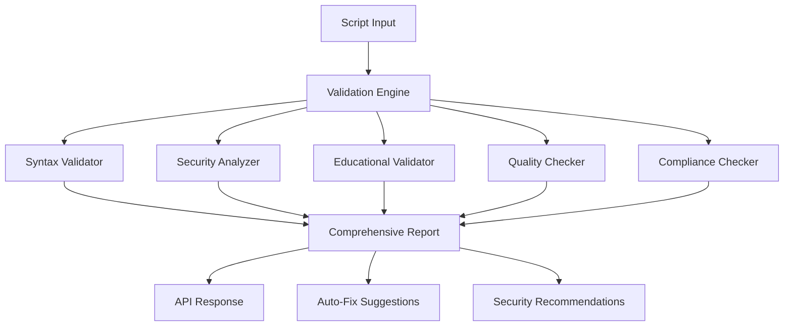

# Roblox Lua Script Validation System

## Overview

The ToolBoxAI Roblox Lua Script Validation System provides comprehensive validation, security analysis, and quality assessment for educational Roblox scripts. This system ensures that all generated content meets safety, educational, and platform standards.

## System Architecture



## Core Components

### 1. Lua Script Validator (`lua_validator.py`)

**Purpose**: Validates Lua syntax, semantics, and Roblox API compatibility.

**Key Features**:
- Syntax checking with luac integration
- Roblox API validation
- Performance analysis
- Memory leak detection
- Complexity assessment

**Example Usage**:
```python
from core.validation import LuaScriptValidator

validator = LuaScriptValidator()
result = validator.validate_script(lua_code, "script.lua")

if result.success:
    print(f"Script validated successfully - Score: {result.performance_score}")
else:
    for issue in result.issues:
        print(f"Line {issue.line}: {issue.message}")
```

### 2. Security Analyzer (`security_analyzer.py`)

**Purpose**: Identifies security vulnerabilities and potential exploits.

**Security Checks**:
- Code injection detection (loadstring, eval)
- Environment manipulation (getfenv, setfenv)
- Remote event security
- Input validation assessment
- Rate limiting verification

**Threat Levels**:
- **CRITICAL**: Immediate security risks (code injection, privilege escalation)
- **HIGH**: Significant vulnerabilities (unvalidated remotes, unsafe operations)
- **MEDIUM**: Moderate security concerns (missing validation, poor practices)
- **LOW**: Minor security improvements needed

**Example**:
```python
from core.validation import SecurityAnalyzer

analyzer = SecurityAnalyzer()
report = analyzer.analyze_security(lua_code, "script.lua")

print(f"Security Score: {report.overall_score}/100")
print(f"Threat Level: {report.threat_level.value}")

for finding in report.findings:
    print(f"Security Issue: {finding.description}")
    print(f"Mitigation: {finding.mitigation}")
```

### 3. Educational Content Validator (`educational_validator.py`)

**Purpose**: Ensures content is appropriate and effective for educational use.

**Validation Areas**:
- Age appropriateness for grade level
- Subject alignment
- Learning objective achievement
- Accessibility compliance
- Engagement factors

**Grade Levels Supported**:
- Kindergarten
- Elementary (Grades 1-5)
- Middle School (Grades 6-8)
- High School (Grades 9-12)
- College/University

**Example**:
```python
from core.validation import EducationalContentValidator, GradeLevel, Subject

validator = EducationalContentValidator()
report = validator.validate_educational_content(
    lua_code,
    GradeLevel.ELEMENTARY,
    Subject.COMPUTER_SCIENCE,
    learning_objectives
)

print(f"Educational Value Score: {report.educational_value_score}")
print(f"Content Rating: {report.content_rating.value}")
```

### 4. Code Quality Checker (`quality_checker.py`)

**Purpose**: Enforces coding standards and best practices.

**Quality Metrics**:
- Code complexity analysis
- Naming convention compliance
- Documentation completeness
- Maintainability assessment
- Performance optimization

**Quality Levels**:
- **EXCELLENT** (90-100): Production-ready, exemplary code
- **GOOD** (70-89): Well-written, minor improvements needed
- **FAIR** (50-69): Acceptable, several improvements recommended
- **POOR** (30-49): Significant issues, major refactoring needed
- **UNACCEPTABLE** (0-29): Critical problems, unsuitable for use

### 5. Roblox Compliance Checker (`roblox_compliance.py`)

**Purpose**: Verifies compliance with Roblox platform policies and standards.

**Compliance Areas**:
- Community Standards compliance
- Developer Terms of Service
- Safety requirements
- Content policy adherence
- Technical standards

## Validation Engine (`validation_engine.py`)

The central orchestrator that coordinates all validation components and provides unified reporting.

### Key Features

**Comprehensive Analysis**:
```python
from core.validation import ValidationEngine, ValidationRequest

engine = ValidationEngine()
request = ValidationRequest(
    script_code=lua_code,
    script_name="educational_script.lua",
    grade_level=GradeLevel.MIDDLE,
    subject=Subject.SCIENCE,
    educational_context=True
)

report = await engine.validate_script(request)
```

**Batch Processing**:
```python
requests = [ValidationRequest(...) for script in scripts]
reports = await engine.batch_validate(requests)
```

**Report Export**:
```python
# JSON format
json_report = engine.export_report(report, "json")

# Human-readable summary
summary = engine.export_report(report, "summary")
```

## API Endpoints

### Validation Endpoints

#### `POST /api/v1/validation/validate`

Validate a single Roblox Lua script.

**Request Body**:
```json
{
    "script_code": "local Players = game:GetService(\"Players\")\nprint(\"Hello World\")",
    "script_name": "hello_world.lua",
    "validation_type": "comprehensive",
    "grade_level": "elementary",
    "subject": "computer_science",
    "learning_objectives": [
        "Learn basic Roblox scripting",
        "Understand service usage"
    ],
    "strict_mode": false,
    "include_suggestions": true,
    "educational_context": true
}
```

**Response**:
```json
{
    "success": true,
    "validation_id": "val_20240101_120000_hello_world",
    "summary": {
        "script_name": "hello_world.lua",
        "overall_status": "passed",
        "overall_score": 85.0,
        "validation_duration_ms": 150.0,
        "critical_issues_count": 0,
        "warnings_count": 1,
        "deployment_ready": true,
        "educational_ready": true,
        "platform_compliant": true
    },
    "report": { ... },
    "timestamp": "2024-01-01T12:00:00Z"
}
```

#### `POST /api/v1/validation/validate/batch`

Validate multiple scripts in batch.

**Request Body**:
```json
{
    "scripts": [
        {
            "script_code": "print('Script 1')",
            "script_name": "script1.lua",
            "validation_type": "comprehensive"
        },
        {
            "script_code": "print('Script 2')",
            "script_name": "script2.lua",
            "validation_type": "security_only"
        }
    ],
    "parallel_processing": true
}
```

#### `GET /api/v1/validation/statistics`

Get validation system statistics.

**Response**:
```json
{
    "total_validations": 1250,
    "passed_validations": 1050,
    "failed_validations": 200,
    "average_score": 78.5,
    "common_issues": {
        "Missing input validation": 45,
        "Performance issues": 32,
        "Code style violations": 28
    },
    "last_updated": "2024-01-01T12:00:00Z"
}
```

### Utility Endpoints

#### `POST /api/v1/validation/templates/secure`

Generate secure code templates.

**Parameters**:
- `template_type`: Type of template (remote_event, data_validation, etc.)

**Response**:
```json
{
    "template_type": "remote_event",
    "code": "-- Secure RemoteEvent Template\nlocal ReplicatedStorage = game:GetService(\"ReplicatedStorage\")\n...",
    "generated_at": "2024-01-01T12:00:00Z",
    "generated_by": "teacher@example.com"
}
```

#### `GET /api/v1/validation/checklists/security`

Get security checklist for developers.

#### `GET /api/v1/validation/checklists/compliance`

Get Roblox compliance checklist.

## Validation Report Structure

### Comprehensive Report

```typescript
interface ComprehensiveReport {
    // Metadata
    script_name: string;
    validation_timestamp: string;
    validation_duration_ms: number;
    overall_status: "passed" | "passed_with_warnings" | "failed" | "error";
    overall_score: number; // 0-100

    // Individual validation results
    syntax_validation: ValidationResult;
    security_analysis: SecurityReport;
    educational_validation?: EducationalReport;
    quality_assessment: QualityReport;
    compliance_check: ComplianceReport;

    // Summary information
    critical_issues: string[];
    warnings: string[];
    recommendations: string[];
    auto_fix_suggestions: string[];

    // Scores breakdown
    scores: {
        syntax: number;
        security: number;
        quality: number;
        compliance: number;
        educational?: number;
    };

    // Readiness flags
    deployment_ready: boolean;
    educational_ready: boolean;
    platform_compliant: boolean;
}
```

### Validation Status Levels

1. **PASSED**: All validations successful, ready for deployment
2. **PASSED_WITH_WARNINGS**: Minor issues that don't prevent usage
3. **FAILED**: Critical issues that prevent deployment
4. **ERROR**: Validation system error occurred

## Security Features

### Input Validation

All script inputs are validated for:
- Maximum size limits (1MB default)
- Dangerous patterns detection
- Encoding validation
- Content sanitization

### Rate Limiting

API endpoints include rate limiting:
- 100 requests per minute per user
- Burst limit of 20 requests per 10 seconds
- Special limits for batch operations

### Audit Logging

All validation activities are logged:
- User identification
- Script checksums
- Validation results
- Performance metrics

## Performance Optimization

### Caching

- Validation results cached by script hash
- Template caching for common patterns
- Service instance reuse

### Parallel Processing

- Concurrent validation of different aspects
- Batch processing for multiple scripts
- Async operations throughout

### Resource Management

- Memory usage monitoring
- Timeout protections
- Circuit breakers for external services

## Educational Integration

### Curriculum Standards

Supports validation against:
- Common Core State Standards (Mathematics)
- Next Generation Science Standards (NGSS)
- Computer Science Teachers Association (CSTA) Standards
- International Society for Technology in Education (ISTE) Standards

### Age-Appropriate Content

Automatic detection and flagging of:
- Inappropriate language or themes
- Violence or scary content
- Complex concepts for younger grades
- Adult themes or references

### Learning Objective Alignment

Validates that scripts support stated learning objectives:
- Content analysis for relevant concepts
- Activity detection for hands-on learning
- Assessment integration verification
- Collaborative feature identification

## Best Practices

### For Developers

1. **Always validate before deployment**
2. **Address critical security issues immediately**
3. **Review educational appropriateness for target audience**
4. **Follow secure coding templates**
5. **Implement proper error handling**

### For Educators

1. **Define clear learning objectives**
2. **Review auto-generated content**
3. **Test with target age group**
4. **Monitor student interactions**
5. **Provide feedback on validation accuracy**

### For Administrators

1. **Configure appropriate validation levels**
2. **Monitor validation statistics**
3. **Review compliance reports regularly**
4. **Update security policies as needed**
5. **Train users on validation system**

## Troubleshooting

### Common Issues

**Validation Timeouts**:
- Reduce script complexity
- Check for infinite loops
- Use batch processing for multiple scripts

**High Memory Usage**:
- Check for memory leaks in event connections
- Validate large data structures
- Implement proper cleanup

**Security Violations**:
- Review dangerous patterns list
- Use secure templates
- Implement input validation

**Educational Content Issues**:
- Verify age-appropriate language
- Check learning objective alignment
- Ensure accessibility compliance

### Performance Issues

**Slow Validation**:
- Check script size and complexity
- Review external dependencies
- Monitor system resources

**API Rate Limits**:
- Implement client-side rate limiting
- Use batch endpoints for multiple scripts
- Cache validation results

## Future Enhancements

### Planned Features

1. **Advanced AI Analysis**: Machine learning for pattern detection
2. **Custom Rule Engine**: User-defined validation rules
3. **Integration Testing**: Automated testing of generated content
4. **Real-time Validation**: Live feedback during script editing
5. **Collaborative Validation**: Peer review workflows

### API Improvements

1. **Webhook Support**: Real-time validation notifications
2. **GraphQL Interface**: More flexible query capabilities
3. **Streaming Validation**: Large script processing
4. **Version Comparison**: Diff validation between script versions

## Support and Documentation

- **API Reference**: Complete endpoint documentation
- **Developer Guide**: Integration tutorials and examples
- **Security Guide**: Best practices for secure scripting
- **Educational Guide**: Curriculum integration guidelines
- **Troubleshooting**: Common issues and solutions

For additional support, contact the ToolBoxAI development team or refer to the comprehensive API documentation.