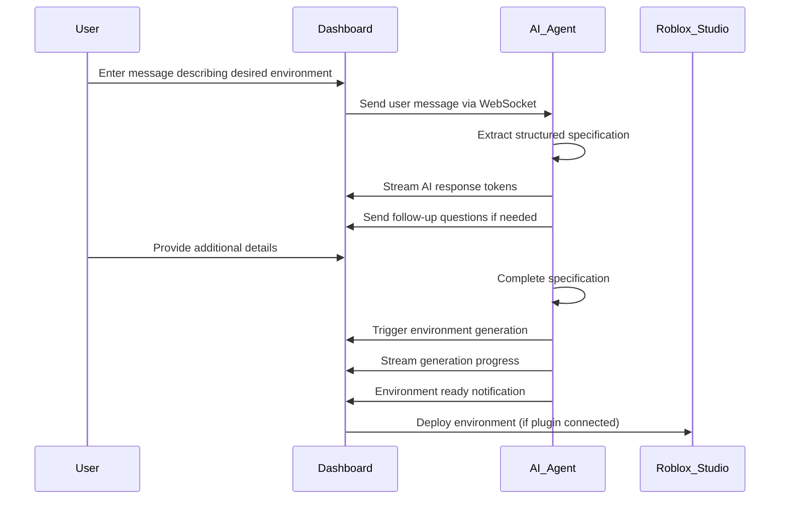

# Roblox AI Integration Guide

## Overview

This guide documents the complete communication process from the dashboard to Roblox Studio Integration with an AI chat agent interface. The system provides real-time, interactive guidance for users to create personalized Roblox educational environments based on templates.

## Architecture

### Components

1. **Frontend (Dashboard)**
   - `RobloxAIChat.tsx` - Main AI chat interface
   - `RobloxStudioIntegration.tsx` - Integration management component
   - `robloxAI.ts` - Service layer for API communication

2. **Backend (FastAPI)**
   - `roblox_ai_agent.py` - Core AI agent logic
   - `roblox_ai.py` - API endpoints
   - `websocket_handler.py` - WebSocket message routing

3. **Real-time Communication**
   - Pusher Channels for WebSocket communication
   - Streaming AI responses
   - Progress updates for environment generation

## Communication Flow

### 1. User Interaction Flow



### 2. Message Types

#### User to AI Agent
```typescript
interface AgentChatUserMessage {
  conversationId: string;
  text: string;
  context?: Record<string, any>;
}
```

#### AI Agent Responses
```typescript
// Streaming tokens
interface AgentChatTokenMessage {
  conversationId: string;
  messageId: string;
  token: string;
}

// Complete response
interface AgentChatCompleteMessage {
  conversationId: string;
  messageId: string;
  content: string;
}

// Follow-up questions
interface AgentFollowupMessage {
  conversationId: string;
  missingFields: FollowupFieldType[];
  questions: string[];
}
```

#### Environment Generation
```typescript
// Generation request
interface RobloxAgentRequest {
  conversationId: string;
  requestId: string;
  spec: RobloxSpec;
}

// Progress updates
interface RobloxEnvProgressMessage {
  requestId: string;
  stage: string;
  percentage: number;
  message?: string;
}

// Completion
interface RobloxEnvReadyMessage {
  requestId: string;
  environmentId: string;
  previewUrl?: string;
  downloadUrl?: string;
}
```

### 3. Specification Structure

The AI agent extracts and validates the following specification:

```typescript
interface RobloxSpec {
  environment_name?: string;        // Required
  theme?: string;                   // Required
  map_type?: 'obby' | 'open_world' | 'dungeon' | 'lab' | 'classroom' | 'puzzle' | 'arena'; // Required
  learning_objectives?: string[];   // Required
  terrain?: string;                 // Optional
  npc_count?: number;              // Optional
  difficulty?: 'easy' | 'medium' | 'hard'; // Optional
  age_range?: string;              // Optional
  assets?: string[];               // Optional
  scripting?: string[];            // Optional
  lighting?: string;               // Optional
  weather?: string;                // Optional
}
```

## Implementation Details

### 1. AI Agent Intelligence

The AI agent uses pattern matching and natural language processing to:

- Extract structured information from free-form user input
- Identify missing required fields
- Generate contextual follow-up questions
- Maintain conversation state across interactions

#### Pattern Extraction Examples

```python
# Environment name extraction
r'(?:call it|named|title(?:d)?)\s+["\']?([^"\'.\n]{3,40})["\']?'

# Theme extraction  
r'(?:theme|style|setting)\s*:?\s*([^.\n]{3,50})'

# Map type detection
if 'obby' in message_lower or 'obstacle' in message_lower:
    spec['map_type'] = 'obby'
elif 'classroom' in message_lower or 'school' in message_lower:
    spec['map_type'] = 'classroom'
```

### 2. Real-time Communication

#### WebSocket Channels
- `agent-chat-{conversationId}` - AI chat messages
- `roblox-environments` - Environment generation events

#### Streaming Implementation
```python
# Stream AI response token by token
async def _stream_response(self, conversation_id: str, response: str):
    words = response.split()
    for i, word in enumerate(words):
        token = word + (" " if i < len(words) - 1 else "")
        
        await pusher_service.trigger_event(
            f"agent-chat-{conversation_id}",
            "message",
            {
                "type": "agent_chat_token",
                "payload": {
                    "conversationId": conversation_id,
                    "messageId": message_id,
                    "token": token
                }
            }
        )
        await asyncio.sleep(0.05)  # Realistic streaming delay
```

### 3. Frontend Integration

#### Chat Interface Setup
```typescript
// Initialize WebSocket connection
useEffect(() => {
  const initializeChat = async () => {
    if (!pusherService.isConnected()) {
      await pusherService.connect();
    }
    
    const subscriptionId = pusherService.subscribe(
      `agent-chat-${conversationId}`,
      handleWebSocketMessage
    );
    
    return () => pusherService.unsubscribe(subscriptionId);
  };
  
  initializeChat();
}, [conversationId]);
```

#### Message Handling
```typescript
const handleWebSocketMessage = useCallback((message: any) => {
  const { type, payload } = message;
  
  switch (type) {
    case WebSocketMessageType.AGENT_CHAT_TOKEN:
      handleStreamingToken(payload);
      break;
    case WebSocketMessageType.AGENT_CHAT_COMPLETE:
      handleStreamingComplete(payload);
      break;
    case WebSocketMessageType.AGENT_FOLLOWUP:
      handleFollowupQuestions(payload);
      break;
    // ... other message types
  }
}, []);
```

## API Endpoints

### Chat Endpoints
- `POST /api/v1/roblox-ai/chat` - Send chat message
- `GET /api/v1/roblox-ai/conversation/{id}/status` - Get conversation status
- `DELETE /api/v1/roblox-ai/conversation/{id}` - Clear conversation

### Environment Generation
- `POST /api/v1/roblox-ai/generate` - Generate environment
- `POST /api/v1/roblox-ai/webhook/pusher` - Handle WebSocket events

### Roblox Studio Integration
- `GET /api/v1/roblox/plugin/status` - Check plugin status
- `POST /api/v1/roblox/deploy/{environmentId}` - Deploy to Studio
- `GET /api/v1/roblox/export/{environmentId}` - Export environment

## Configuration

### Environment Variables
```bash
# AI Configuration
OPENAI_API_KEY=your_openai_key
OPENAI_MODEL=gpt-4
OPENAI_TEMPERATURE=0.7

# Pusher Configuration
PUSHER_APP_ID=your_app_id
PUSHER_KEY=your_key
PUSHER_SECRET=your_secret
PUSHER_CLUSTER=your_cluster

# Roblox Integration
ROBLOX_API_KEY=your_roblox_api_key
ROBLOX_PLUGIN_PORT=5001
```

### Frontend Configuration
```typescript
// config/index.ts
export const PUSHER_KEY = process.env.REACT_APP_PUSHER_KEY || 'dummy-key-for-development';
export const PUSHER_CLUSTER = process.env.REACT_APP_PUSHER_CLUSTER || 'us2';
export const PUSHER_AUTH_ENDPOINT = '/api/v1/pusher/auth';
```

## Usage Examples

### 1. Basic Environment Creation
```
User: "Create a math classroom for grade 5 students"

AI Response: "I'd love to help you create a math classroom! I have some details:
- Learning objectives: Math
- Map type: Classroom  
- Age range: Grade 5

To complete your environment, I need:
- What should we name this environment?
- What theme would you like? (modern, colorful, space-themed, etc.)
- Any specific math topics to focus on?"
```

### 2. Complex Environment with Details
```
User: "Build a space station called 'Mars Math Lab' for teaching fractions and geometry to 4th graders. Make it medium difficulty with 3 NPCs and cool lighting."

AI Response: "Perfect! I have all the details needed:
✅ Name: Mars Math Lab
✅ Theme: Space station
✅ Map type: Lab
✅ Learning objectives: Fractions, Geometry
✅ Difficulty: Medium
✅ NPCs: 3
✅ Lighting: Cool

Generating your Roblox environment now..."
```

## Error Handling

### Common Error Scenarios
1. **WebSocket Connection Failed** - Fallback to HTTP API
2. **AI Agent Timeout** - Retry with exponential backoff
3. **Incomplete Specification** - Request missing information
4. **Generation Failure** - Provide error details and retry option
5. **Plugin Disconnected** - Show installation/connection instructions

### Error Recovery
```typescript
// Automatic retry with fallback
const sendMessage = async (message: string) => {
  try {
    // Try WebSocket first
    await pusherService.send(WebSocketMessageType.AGENT_CHAT_USER, payload);
  } catch (wsError) {
    // Fallback to HTTP API
    await api.request({
      method: 'POST',
      url: '/api/v1/roblox-ai/chat',
      data: { conversation_id: conversationId, message }
    });
  }
};
```

## Testing

### Unit Tests
- AI agent pattern extraction
- WebSocket message handling
- Specification validation

### Integration Tests
- End-to-end chat flow
- Environment generation pipeline
- Roblox Studio plugin communication

### Manual Testing Scenarios
1. Create simple environment with minimal input
2. Create complex environment with all parameters
3. Test follow-up question flow
4. Test error recovery
5. Test Roblox Studio deployment

## Deployment

### Backend Deployment
1. Install dependencies: `pip install -r requirements.txt`
2. Set environment variables
3. Start FastAPI server: `uvicorn main:app --host 0.0.0.0 --port 8000`
4. Start Flask bridge: `python apps/backend/services/roblox.py`

### Frontend Deployment
1. Install dependencies: `npm install`
2. Set environment variables in `.env`
3. Build: `npm run build`
4. Deploy to hosting platform

### Roblox Plugin Deployment
1. Package plugin files
2. Upload to Roblox Creator Store
3. Provide installation instructions to users

## Monitoring and Analytics

### Key Metrics
- Conversation completion rate
- Average messages per environment
- Generation success rate
- User satisfaction scores
- Plugin connection rate

### Logging
- All AI agent interactions
- WebSocket connection events
- Environment generation progress
- Error occurrences and recovery

## Future Enhancements

1. **Voice Input** - Speech-to-text for hands-free interaction
2. **Visual Preview** - Real-time 3D preview of environments
3. **Collaborative Editing** - Multiple users working on same environment
4. **Template Library** - Pre-built environment templates
5. **Advanced AI** - Multi-modal AI with image understanding
6. **Performance Optimization** - Caching and CDN integration

## Support and Troubleshooting

### Common Issues
1. **Plugin not connecting** - Check Roblox Studio version and plugin installation
2. **Slow AI responses** - Check OpenAI API limits and network connectivity
3. **WebSocket disconnections** - Implement reconnection logic
4. **Generation failures** - Validate specification completeness

### Debug Tools
- WebSocket connection monitor
- AI agent conversation logs
- Environment generation pipeline status
- Plugin communication diagnostics

This integration provides a seamless, intelligent interface for creating educational Roblox environments through natural conversation with AI guidance.