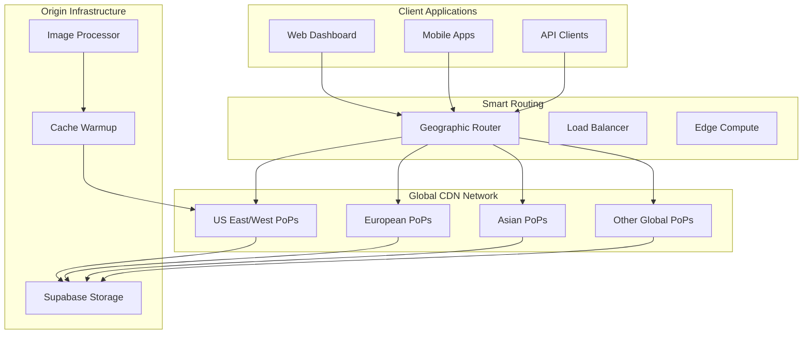

# CDN Integration

The ToolBoxAI Storage System features intelligent CDN integration that provides global content delivery, on-the-fly image transformations, smart caching strategies, and performance optimization for educational content delivery.

## Table of Contents
- [Smart CDN Configuration](#smart-cdn-configuration)
- [Image Transformations](#image-transformations)
- [Cache Strategies](#cache-strategies)
- [Global Distribution](#global-distribution)
- [Performance Metrics](#performance-metrics)
- [CDN Provider Integration](#cdn-provider-integration)
- [Optimization Techniques](#optimization-techniques)
- [Monitoring and Analytics](#monitoring-and-analytics)

## Smart CDN Configuration

### CDN Architecture Overview



### CDN Configuration Class

```python
from dataclasses import dataclass
from typing import Dict, List, Optional, Any
from enum import Enum
import hashlib
import hmac
import base64
from datetime import datetime, timedelta

class CDNProvider(Enum):
    CLOUDFLARE = "cloudflare"
    KEYCDN = "keycdn"
    BUNNYCDN = "bunnycdn"
    FASTLY = "fastly"
    CUSTOM = "custom"

@dataclass
class CDNConfiguration:
    """CDN configuration settings"""
    provider: CDNProvider
    base_url: str
    zone_id: Optional[str] = None
    api_key: Optional[str] = None
    signing_key: Optional[str] = None

    # Feature flags
    enable_image_optimization: bool = True
    enable_webp_conversion: bool = True
    enable_avif_conversion: bool = True
    enable_responsive_images: bool = True
    enable_video_transcoding: bool = False

    # Cache settings
    default_cache_ttl: int = 86400  # 24 hours
    image_cache_ttl: int = 604800   # 7 days
    document_cache_ttl: int = 172800  # 2 days

    # Geographic settings
    primary_region: str = "us-east-1"
    enabled_regions: List[str] = None

    # Performance settings
    compression_level: int = 6
    quality_auto: bool = True
    fetch_timeout: int = 30

    def __post_init__(self):
        if self.enabled_regions is None:
            self.enabled_regions = ["us", "eu", "asia"]

class SmartCDNManager:
    """Manages intelligent CDN operations"""

    def __init__(self, config: CDNConfiguration):
        self.config = config
        self.provider_client = self._initialize_provider_client()
        self.transformation_presets = self._load_transformation_presets()
        self.cache_rules = self._load_cache_rules()

    def _initialize_provider_client(self):
        """Initialize CDN provider-specific client"""

        if self.config.provider == CDNProvider.CLOUDFLARE:
            return CloudflareClient(
                zone_id=self.config.zone_id,
                api_key=self.config.api_key
            )
        elif self.config.provider == CDNProvider.KEYCDN:
            return KeyCDNClient(
                zone_id=self.config.zone_id,
                api_key=self.config.api_key
            )
        elif self.config.provider == CDNProvider.BUNNYCDN:
            return BunnyCDNClient(
                zone_id=self.config.zone_id,
                api_key=self.config.api_key
            )
        else:
            return GenericCDNClient(self.config.base_url)

    def _load_transformation_presets(self) -> Dict[str, Dict[str, Any]]:
        """Load predefined transformation presets"""

        return {
            "avatar": {
                "width": 150,
                "height": 150,
                "crop": "center",
                "quality": 85,
                "format": "auto",
                "background": "ffffff"
            },
            "thumbnail": {
                "width": 300,
                "height": 300,
                "crop": "smart",
                "quality": 80,
                "format": "auto"
            },
            "preview": {
                "width": 600,
                "height": 400,
                "crop": "scale",
                "quality": 85,
                "format": "auto"
            },
            "hero": {
                "width": 1200,
                "height": 600,
                "crop": "center",
                "quality": 90,
                "format": "auto"
            },
            "document_preview": {
                "width": 400,
                "height": 600,
                "crop": "fit",
                "quality": 90,
                "format": "auto",
                "page": 1  # For PDF preview
            }
        }

    async def get_optimized_url(
        self,
        storage_path: str,
        transformations: Optional[Dict[str, Any]] = None,
        signed: bool = False,
        expires_in: int = 3600
    ) -> str:
        """Generate optimized CDN URL with transformations"""

        # Build base URL
        base_url = f"{self.config.base_url.rstrip('/')}/{storage_path.lstrip('/')}"

        if not transformations and not signed:
            return base_url

        # Apply transformations
        if transformations:
            transform_params = self._build_transformation_params(transformations)

            if self.config.provider == CDNProvider.CLOUDFLARE:
                # Cloudflare Image Resizing
                base_url = f"{self.config.base_url}/cdn-cgi/image/{transform_params}/{storage_path}"
            elif self.config.provider == CDNProvider.KEYCDN:
                # KeyCDN Image Processing
                base_url = f"{self.config.base_url}/{transform_params}/{storage_path}"
            else:
                # Generic query parameters
                base_url = f"{base_url}?{transform_params}"

        # Add signature if required
        if signed:
            signature = self._generate_url_signature(base_url, expires_in)
            separator = "&" if "?" in base_url else "?"
            base_url = f"{base_url}{separator}signature={signature}&expires={int((datetime.utcnow() + timedelta(seconds=expires_in)).timestamp())}"

        return base_url

    def _build_transformation_params(self, transformations: Dict[str, Any]) -> str:
        """Build provider-specific transformation parameters"""

        if self.config.provider == CDNProvider.CLOUDFLARE:
            return self._build_cloudflare_params(transformations)
        elif self.config.provider == CDNProvider.KEYCDN:
            return self._build_keycdn_params(transformations)
        elif self.config.provider == CDNProvider.BUNNYCDN:
            return self._build_bunnycdn_params(transformations)
        else:
            return self._build_generic_params(transformations)

    def _build_cloudflare_params(self, transformations: Dict[str, Any]) -> str:
        """Build Cloudflare Image Resizing parameters"""

        params = []

        if transformations.get("width"):
            params.append(f"width={transformations['width']}")

        if transformations.get("height"):
            params.append(f"height={transformations['height']}")

        if transformations.get("quality"):
            params.append(f"quality={transformations['quality']}")
        elif self.config.quality_auto:
            params.append("quality=auto")

        if transformations.get("format"):
            if transformations["format"] == "auto":
                params.append("format=auto")
            else:
                params.append(f"format={transformations['format']}")

        if transformations.get("crop"):
            crop_mode = transformations["crop"]
            if crop_mode == "center":
                params.append("fit=crop")
                params.append("gravity=center")
            elif crop_mode == "smart":
                params.append("fit=crop")
                params.append("gravity=auto")
            elif crop_mode == "scale":
                params.append("fit=scale-down")

        if transformations.get("background"):
            params.append(f"background={transformations['background']}")

        if transformations.get("blur"):
            params.append(f"blur={transformations['blur']}")

        if transformations.get("sharpen"):
            params.append(f"sharpen={transformations['sharpen']}")

        return ",".join(params)

    def _build_keycdn_params(self, transformations: Dict[str, Any]) -> str:
        """Build KeyCDN Image Processing parameters"""

        params = []

        if transformations.get("width"):
            params.append(f"w={transformations['width']}")

        if transformations.get("height"):
            params.append(f"h={transformations['height']}")

        if transformations.get("quality"):
            params.append(f"q={transformations['quality']}")

        if transformations.get("format"):
            if transformations["format"] != "auto":
                params.append(f"f={transformations['format']}")

        if transformations.get("crop"):
            crop_mode = transformations["crop"]
            if crop_mode in ["center", "smart"]:
                params.append("c=1")  # Enable cropping
            elif crop_mode == "scale":
                params.append("c=0")  # Disable cropping

        return ",".join(params)

    async def get_preset_url(
        self,
        storage_path: str,
        preset_name: str,
        signed: bool = False,
        expires_in: int = 3600
    ) -> str:
        """Get CDN URL using predefined transformation preset"""

        if preset_name not in self.transformation_presets:
            raise ValueError(f"Unknown transformation preset: {preset_name}")

        transformations = self.transformation_presets[preset_name]

        return await self.get_optimized_url(
            storage_path=storage_path,
            transformations=transformations,
            signed=signed,
            expires_in=expires_in
        )

    async def get_responsive_urls(
        self,
        storage_path: str,
        breakpoints: Optional[List[int]] = None,
        base_transformations: Optional[Dict[str, Any]] = None
    ) -> Dict[str, str]:
        """Generate responsive image URLs for different breakpoints"""

        if not breakpoints:
            breakpoints = [480, 768, 1024, 1440, 1920]

        if not base_transformations:
            base_transformations = {
                "quality": 85,
                "format": "auto",
                "crop": "scale"
            }

        responsive_urls = {}

        for width in breakpoints:
            transformations = {
                **base_transformations,
                "width": width
            }

            url = await self.get_optimized_url(storage_path, transformations)
            responsive_urls[f"{width}w"] = url

        return responsive_urls
```

## Image Transformations

### On-the-fly Image Processing

```python
from typing import Union
from PIL import Image
import io

class ImageTransformationEngine:
    """Handles advanced image transformations"""

    def __init__(self, cdn_manager: SmartCDNManager):
        self.cdn_manager = cdn_manager
        self.supported_formats = ["jpeg", "png", "webp", "avif"]
        self.quality_profiles = {
            "low": 60,
            "medium": 75,
            "high": 85,
            "lossless": 95
        }

    async def transform_image_url(
        self,
        storage_path: str,
        transformations: Dict[str, Any],
        optimize_for_device: Optional[str] = None
    ) -> str:
        """Generate transformed image URL with device optimization"""

        # Apply device-specific optimizations
        if optimize_for_device:
            transformations = self._apply_device_optimizations(
                transformations,
                optimize_for_device
            )

        # Smart format selection
        if transformations.get("format") == "auto":
            transformations["format"] = self._select_optimal_format(
                storage_path,
                optimize_for_device
            )

        # Quality optimization
        if transformations.get("quality") == "auto":
            transformations["quality"] = self._calculate_optimal_quality(
                transformations,
                optimize_for_device
            )

        return await self.cdn_manager.get_optimized_url(storage_path, transformations)

    def _apply_device_optimizations(
        self,
        transformations: Dict[str, Any],
        device_type: str
    ) -> Dict[str, Any]:
        """Apply device-specific optimizations"""

        optimized = transformations.copy()

        if device_type == "mobile":
            # Mobile optimizations
            optimized["quality"] = min(optimized.get("quality", 85), 80)
            optimized["format"] = "webp"  # Better compression for mobile

            # Reduce dimensions for mobile if not specified
            if not optimized.get("width") and not optimized.get("height"):
                optimized["width"] = 768  # Max width for mobile

        elif device_type == "tablet":
            # Tablet optimizations
            optimized["quality"] = min(optimized.get("quality", 85), 85)
            optimized["format"] = "webp"

            if not optimized.get("width") and not optimized.get("height"):
                optimized["width"] = 1024  # Max width for tablet

        elif device_type == "desktop":
            # Desktop optimizations - higher quality acceptable
            optimized["quality"] = optimized.get("quality", 90)

            # Use AVIF for modern browsers
            if self._supports_avif(device_type):
                optimized["format"] = "avif"

        elif device_type == "print":
            # Print optimizations - highest quality
            optimized["quality"] = 95
            optimized["format"] = "png"  # Lossless for print

        return optimized

    def _select_optimal_format(
        self,
        storage_path: str,
        device_type: Optional[str] = None
    ) -> str:
        """Select optimal image format based on content and device"""

        file_extension = storage_path.split('.')[-1].lower()

        # Check if original is already optimal
        if file_extension == "webp":
            return "webp"
        elif file_extension == "avif":
            return "avif"

        # Device-based format selection
        if device_type in ["mobile", "tablet"]:
            return "webp"  # Best compression for mobile devices
        elif device_type == "desktop" and self._supports_avif(device_type):
            return "avif"  # Best quality/size ratio for modern browsers
        else:
            return "webp"  # Safe fallback with good compression

    def _calculate_optimal_quality(
        self,
        transformations: Dict[str, Any],
        device_type: Optional[str] = None
    ) -> int:
        """Calculate optimal quality based on transformations and device"""

        base_quality = 85

        # Adjust based on output format
        format_type = transformations.get("format", "jpeg")
        if format_type == "webp":
            base_quality = 80  # WebP can maintain quality at lower settings
        elif format_type == "avif":
            base_quality = 75  # AVIF has even better compression
        elif format_type == "png":
            return 95  # PNG is lossless, use high quality

        # Adjust based on dimensions
        width = transformations.get("width", 0)
        height = transformations.get("height", 0)

        if width <= 300 or height <= 300:
            # Small images need higher quality to avoid artifacts
            base_quality = min(base_quality + 10, 95)
        elif width >= 1200 or height >= 1200:
            # Large images can tolerate lower quality
            base_quality = max(base_quality - 5, 70)

        # Device-based adjustments
        if device_type == "mobile":
            base_quality = max(base_quality - 5, 70)
        elif device_type == "print":
            base_quality = 95

        return base_quality

    async def create_art_direction_variants(
        self,
        storage_path: str,
        art_direction_config: Dict[str, Dict[str, Any]]
    ) -> Dict[str, str]:
        """Create art direction variants for responsive design"""

        variants = {}

        for variant_name, config in art_direction_config.items():
            transformations = {
                "width": config["width"],
                "height": config["height"],
                "crop": config.get("crop", "smart"),
                "quality": config.get("quality", "auto"),
                "format": config.get("format", "auto")
            }

            # Apply focal point if specified
            if config.get("focal_point"):
                transformations["gravity"] = f"{config['focal_point']['x']},{config['focal_point']['y']}"

            variant_url = await self.cdn_manager.get_optimized_url(
                storage_path,
                transformations
            )

            variants[variant_name] = variant_url

        return variants

# Usage examples
async def get_educational_content_image_urls(
    storage_path: str,
    cdn_manager: SmartCDNManager
) -> Dict[str, Any]:
    """Get optimized image URLs for educational content"""

    transformer = ImageTransformationEngine(cdn_manager)

    # Main content image
    main_url = await transformer.transform_image_url(
        storage_path,
        {
            "width": 800,
            "height": 600,
            "crop": "smart",
            "quality": "auto",
            "format": "auto"
        }
    )

    # Responsive variants
    responsive_urls = await cdn_manager.get_responsive_urls(
        storage_path,
        breakpoints=[480, 768, 1024, 1440],
        base_transformations={
            "quality": 85,
            "format": "auto",
            "crop": "smart"
        }
    )

    # Art direction variants
    art_direction_variants = await transformer.create_art_direction_variants(
        storage_path,
        {
            "mobile": {
                "width": 400,
                "height": 300,
                "crop": "center",
                "focal_point": {"x": 0.5, "y": 0.3}  # Focus on upper portion
            },
            "desktop": {
                "width": 1200,
                "height": 400,
                "crop": "center",
                "focal_point": {"x": 0.5, "y": 0.5}  # Center focus
            }
        }
    )

    return {
        "main_url": main_url,
        "responsive": responsive_urls,
        "art_direction": art_direction_variants,
        "thumbnail": await cdn_manager.get_preset_url(storage_path, "thumbnail"),
        "preview": await cdn_manager.get_preset_url(storage_path, "preview")
    }
```

## Cache Strategies

### Intelligent Caching System

```python
from datetime import datetime, timedelta
from typing import Dict, List, Optional, Any
import json

class CacheStrategy:
    """Defines caching strategies for different content types"""

    def __init__(self):
        self.cache_rules = {
            "educational_content": {
                "ttl": 604800,  # 7 days
                "stale_while_revalidate": 86400,  # 1 day
                "cache_control": "public, max-age=604800, stale-while-revalidate=86400",
                "vary_headers": ["Accept", "Accept-Encoding"],
                "edge_cache_tag": "edu-content"
            },
            "student_submission": {
                "ttl": 172800,  # 2 days
                "stale_while_revalidate": 3600,  # 1 hour
                "cache_control": "private, max-age=172800, stale-while-revalidate=3600",
                "vary_headers": ["Authorization"],
                "edge_cache_tag": "student-work"
            },
            "media_resource": {
                "ttl": 2592000,  # 30 days
                "stale_while_revalidate": 604800,  # 7 days
                "cache_control": "public, max-age=2592000, stale-while-revalidate=604800",
                "vary_headers": ["Accept", "Accept-Encoding"],
                "edge_cache_tag": "media"
            },
            "avatar": {
                "ttl": 86400,  # 1 day
                "stale_while_revalidate": 3600,  # 1 hour
                "cache_control": "public, max-age=86400, stale-while-revalidate=3600",
                "vary_headers": ["Accept"],
                "edge_cache_tag": "avatars"
            },
            "temporary": {
                "ttl": 3600,  # 1 hour
                "stale_while_revalidate": 300,  # 5 minutes
                "cache_control": "public, max-age=3600, stale-while-revalidate=300",
                "vary_headers": ["Accept"],
                "edge_cache_tag": "temp"
            }
        }

        self.geographic_cache_rules = {
            "us": {"priority": "high", "replication": "immediate"},
            "eu": {"priority": "high", "replication": "immediate"},
            "asia": {"priority": "medium", "replication": "delayed"},
            "others": {"priority": "low", "replication": "on-demand"}
        }

    def get_cache_headers(
        self,
        file_category: str,
        file_size: int = 0,
        user_context: Optional[Dict[str, Any]] = None
    ) -> Dict[str, str]:
        """Generate appropriate cache headers for content"""

        rules = self.cache_rules.get(file_category, self.cache_rules["media_resource"])

        headers = {
            "Cache-Control": rules["cache_control"],
            "Vary": ", ".join(rules["vary_headers"]),
            "X-Cache-Tag": rules["edge_cache_tag"]
        }

        # Add ETag for cache validation
        etag_data = f"{file_category}:{file_size}:{datetime.utcnow().date()}"
        headers["ETag"] = f'"{hash(etag_data)}"'

        # Add Last-Modified
        headers["Last-Modified"] = datetime.utcnow().strftime("%a, %d %b %Y %H:%M:%S GMT")

        # Adjust for user context
        if user_context:
            if user_context.get("role") == "student":
                # Student content might need shorter cache times
                headers["Cache-Control"] = headers["Cache-Control"].replace("max-age=604800", "max-age=172800")
            elif file_category == "student_submission" and user_context.get("user_id"):
                # Personal content should include user ID in vary
                headers["Vary"] += ", X-User-ID"

        return headers

class SmartCacheManager:
    """Manages intelligent caching across CDN network"""

    def __init__(self, cdn_manager: SmartCDNManager):
        self.cdn_manager = cdn_manager
        self.cache_strategy = CacheStrategy()
        self.cache_analytics = CacheAnalytics()

    async def warmup_cache(
        self,
        storage_paths: List[str],
        regions: Optional[List[str]] = None,
        transformations: Optional[List[Dict[str, Any]]] = None
    ) -> Dict[str, Any]:
        """Preemptively warm cache for important content"""

        if not regions:
            regions = ["us", "eu", "asia"]

        warmup_results = {
            "total_urls": 0,
            "successful_warmups": 0,
            "failed_warmups": 0,
            "regions": {},
            "duration": 0
        }

        start_time = datetime.utcnow()

        for region in regions:
            region_results = []

            for storage_path in storage_paths:
                # Generate base URL
                base_url = await self.cdn_manager.get_optimized_url(storage_path)
                warmup_urls = [base_url]

                # Add transformation variants if specified
                if transformations:
                    for transform in transformations:
                        transform_url = await self.cdn_manager.get_optimized_url(
                            storage_path,
                            transform
                        )
                        warmup_urls.append(transform_url)

                # Warmup each URL in the region
                for url in warmup_urls:
                    try:
                        success = await self._warmup_url_in_region(url, region)
                        region_results.append({
                            "url": url,
                            "success": success
                        })

                        if success:
                            warmup_results["successful_warmups"] += 1
                        else:
                            warmup_results["failed_warmups"] += 1

                    except Exception as e:
                        region_results.append({
                            "url": url,
                            "success": False,
                            "error": str(e)
                        })
                        warmup_results["failed_warmups"] += 1

                    warmup_results["total_urls"] += 1

            warmup_results["regions"][region] = region_results

        warmup_results["duration"] = (datetime.utcnow() - start_time).total_seconds()

        return warmup_results

    async def _warmup_url_in_region(self, url: str, region: str) -> bool:
        """Warmup a specific URL in a specific region"""

        try:
            import aiohttp

            # Use region-specific headers to target specific PoPs
            headers = {
                "User-Agent": f"ToolBoxAI-CacheWarmup/1.0 (Region: {region})",
                "Cache-Control": "no-cache",
                "CF-IPCountry": region.upper(),  # Cloudflare country hint
                "X-Forwarded-For": self._get_region_ip(region)  # IP hint for region
            }

            async with aiohttp.ClientSession() as session:
                async with session.get(url, headers=headers, timeout=30) as response:
                    if response.status == 200:
                        # Consume the response to ensure it's cached
                        await response.read()
                        return True
                    else:
                        return False

        except Exception as e:
            logger.error(f"Cache warmup failed for {url} in {region}: {e}")
            return False

    def _get_region_ip(self, region: str) -> str:
        """Get representative IP for region (for testing)"""

        region_ips = {
            "us": "8.8.8.8",      # US
            "eu": "1.1.1.1",      # EU
            "asia": "208.67.222.222"  # Asia
        }

        return region_ips.get(region, "8.8.8.8")

    async def invalidate_cache(
        self,
        storage_paths: Optional[List[str]] = None,
        cache_tags: Optional[List[str]] = None,
        patterns: Optional[List[str]] = None
    ) -> Dict[str, Any]:
        """Intelligently invalidate cached content"""

        invalidation_methods = []

        # Invalidate by specific URLs
        if storage_paths:
            urls_to_invalidate = []
            for path in storage_paths:
                # Invalidate base URL and common transformations
                base_url = await self.cdn_manager.get_optimized_url(path)
                urls_to_invalidate.append(base_url)

                # Add common transformation variants
                for preset in ["thumbnail", "preview", "avatar"]:
                    try:
                        preset_url = await self.cdn_manager.get_preset_url(path, preset)
                        urls_to_invalidate.append(preset_url)
                    except:
                        pass  # Preset might not be applicable

            invalidation_methods.append({
                "type": "urls",
                "urls": urls_to_invalidate
            })

        # Invalidate by cache tags
        if cache_tags:
            invalidation_methods.append({
                "type": "tags",
                "tags": cache_tags
            })

        # Invalidate by patterns
        if patterns:
            invalidation_methods.append({
                "type": "patterns",
                "patterns": patterns
            })

        # Execute invalidation through CDN provider
        results = []
        for method in invalidation_methods:
            result = await self._execute_invalidation(method)
            results.append(result)

        return {
            "invalidation_methods": invalidation_methods,
            "results": results,
            "timestamp": datetime.utcnow().isoformat()
        }

    async def _execute_invalidation(self, method: Dict[str, Any]) -> Dict[str, Any]:
        """Execute cache invalidation through CDN provider"""

        try:
            if self.cdn_manager.config.provider == CDNProvider.CLOUDFLARE:
                return await self._cloudflare_invalidation(method)
            elif self.cdn_manager.config.provider == CDNProvider.KEYCDN:
                return await self._keycdn_invalidation(method)
            else:
                return await self._generic_invalidation(method)

        except Exception as e:
            return {
                "success": False,
                "error": str(e),
                "method": method["type"]
            }

    async def get_cache_performance(
        self,
        timeframe_hours: int = 24
    ) -> Dict[str, Any]:
        """Get cache performance analytics"""

        return await self.cache_analytics.get_performance_metrics(timeframe_hours)

class CacheAnalytics:
    """Analytics for cache performance"""

    async def get_performance_metrics(self, timeframe_hours: int) -> Dict[str, Any]:
        """Get comprehensive cache performance metrics"""

        # This would integrate with your CDN provider's analytics API
        # or your own analytics system

        return {
            "timeframe_hours": timeframe_hours,
            "cache_hit_ratio": await self._calculate_hit_ratio(timeframe_hours),
            "bandwidth_savings": await self._calculate_bandwidth_savings(timeframe_hours),
            "response_time_improvement": await self._calculate_response_time_improvement(timeframe_hours),
            "geographic_performance": await self._get_geographic_performance(timeframe_hours),
            "content_type_performance": await self._get_content_type_performance(timeframe_hours),
            "popular_content": await self._get_popular_content(timeframe_hours),
            "cache_misses": await self._analyze_cache_misses(timeframe_hours)
        }

    async def _calculate_hit_ratio(self, timeframe_hours: int) -> Dict[str, float]:
        """Calculate cache hit ratio by content type"""

        # Example implementation - would integrate with actual analytics
        return {
            "overall": 94.5,
            "educational_content": 96.2,
            "media_resource": 98.1,
            "student_submission": 89.3,
            "avatar": 92.7
        }

    async def _calculate_bandwidth_savings(self, timeframe_hours: int) -> Dict[str, Any]:
        """Calculate bandwidth savings from caching"""

        return {
            "total_requests": 1500000,
            "cache_hits": 1417500,
            "origin_requests": 82500,
            "bandwidth_saved_gb": 450.2,
            "cost_savings_usd": 125.30
        }

    async def _get_geographic_performance(self, timeframe_hours: int) -> Dict[str, Any]:
        """Get performance metrics by geographic region"""

        return {
            "us_east": {"hit_ratio": 95.2, "avg_response_time_ms": 45},
            "us_west": {"hit_ratio": 94.8, "avg_response_time_ms": 52},
            "eu_central": {"hit_ratio": 93.1, "avg_response_time_ms": 78},
            "asia_pacific": {"hit_ratio": 91.5, "avg_response_time_ms": 125},
            "global_average": {"hit_ratio": 94.1, "avg_response_time_ms": 75}
        }

    async def optimize_cache_strategy(
        self,
        performance_data: Dict[str, Any]
    ) -> Dict[str, Any]:
        """Analyze performance and suggest cache optimizations"""

        optimizations = []

        # Analyze hit ratios
        for content_type, hit_ratio in performance_data["cache_hit_ratio"].items():
            if hit_ratio < 90:
                optimizations.append({
                    "type": "increase_ttl",
                    "content_type": content_type,
                    "current_hit_ratio": hit_ratio,
                    "suggested_action": f"Increase TTL for {content_type} to improve caching"
                })

        # Analyze geographic performance
        geo_performance = performance_data["geographic_performance"]
        for region, metrics in geo_performance.items():
            if metrics["hit_ratio"] < 92:
                optimizations.append({
                    "type": "regional_warmup",
                    "region": region,
                    "current_hit_ratio": metrics["hit_ratio"],
                    "suggested_action": f"Implement proactive cache warmup for {region}"
                })

        # Analyze popular content
        popular_content = performance_data.get("popular_content", [])
        if popular_content:
            optimizations.append({
                "type": "priority_caching",
                "suggested_action": "Implement priority caching for top 10% of popular content",
                "affected_content": len(popular_content)
            })

        return {
            "optimizations": optimizations,
            "estimated_improvement": self._estimate_optimization_impact(optimizations),
            "implementation_priority": self._prioritize_optimizations(optimizations)
        }
```

## Global Distribution

### Geographic Optimization

```python
class GeographicDistributionManager:
    """Manages global content distribution optimization"""

    def __init__(self, cdn_manager: SmartCDNManager):
        self.cdn_manager = cdn_manager
        self.region_configs = self._load_region_configurations()
        self.traffic_analyzer = TrafficAnalyzer()

    def _load_region_configurations(self) -> Dict[str, Dict[str, Any]]:
        """Load region-specific configurations"""

        return {
            "us_east": {
                "pop_locations": ["New York", "Miami", "Atlanta"],
                "bandwidth_limit_gbps": 100,
                "storage_capacity_tb": 50,
                "primary_educational_hours": "08:00-18:00 EST",
                "peak_traffic_multiplier": 3.2
            },
            "us_west": {
                "pop_locations": ["Los Angeles", "San Francisco", "Seattle"],
                "bandwidth_limit_gbps": 80,
                "storage_capacity_tb": 40,
                "primary_educational_hours": "08:00-18:00 PST",
                "peak_traffic_multiplier": 2.8
            },
            "eu_central": {
                "pop_locations": ["Frankfurt", "Amsterdam", "London"],
                "bandwidth_limit_gbps": 60,
                "storage_capacity_tb": 30,
                "primary_educational_hours": "08:00-18:00 CET",
                "peak_traffic_multiplier": 2.5
            },
            "asia_pacific": {
                "pop_locations": ["Tokyo", "Singapore", "Sydney"],
                "bandwidth_limit_gbps": 40,
                "storage_capacity_tb": 20,
                "primary_educational_hours": "08:00-18:00 JST",
                "peak_traffic_multiplier": 2.1
            }
        }

    async def optimize_content_placement(
        self,
        content_analytics: Dict[str, Any],
        forecast_period_days: int = 30
    ) -> Dict[str, Any]:
        """Optimize content placement across global regions"""

        # Analyze current traffic patterns
        traffic_analysis = await self.traffic_analyzer.analyze_geographic_traffic(
            days=forecast_period_days
        )

        placement_strategy = {}

        for content_type, analytics in content_analytics.items():
            regional_demand = analytics.get("regional_demand", {})
            content_size = analytics.get("total_size_gb", 0)
            access_frequency = analytics.get("access_frequency", 0)

            # Determine optimal placement
            placement = await self._calculate_optimal_placement(
                regional_demand,
                content_size,
                access_frequency,
                traffic_analysis
            )

            placement_strategy[content_type] = placement

        return {
            "placement_strategy": placement_strategy,
            "estimated_performance_improvement": await self._estimate_performance_improvement(placement_strategy),
            "cost_analysis": await self._analyze_placement_costs(placement_strategy),
            "implementation_timeline": await self._create_implementation_timeline(placement_strategy)
        }

    async def _calculate_optimal_placement(
        self,
        regional_demand: Dict[str, float],
        content_size: float,
        access_frequency: float,
        traffic_analysis: Dict[str, Any]
    ) -> Dict[str, Any]:
        """Calculate optimal content placement strategy"""

        placement_scores = {}

        for region, config in self.region_configs.items():
            # Calculate placement score based on multiple factors

            # Demand factor (40% weight)
            demand_score = regional_demand.get(region, 0) * 0.4

            # Capacity factor (20% weight)
            available_capacity = config["storage_capacity_tb"] - traffic_analysis.get(f"{region}_usage_tb", 0)
            capacity_score = min(available_capacity / content_size, 1.0) * 0.2 if content_size > 0 else 0.2

            # Network performance factor (25% weight)
            network_score = traffic_analysis.get(f"{region}_performance_score", 0.5) * 0.25

            # Cost efficiency factor (15% weight)
            cost_score = traffic_analysis.get(f"{region}_cost_efficiency", 0.5) * 0.15

            total_score = demand_score + capacity_score + network_score + cost_score
            placement_scores[region] = total_score

        # Determine placement strategy
        sorted_regions = sorted(placement_scores.items(), key=lambda x: x[1], reverse=True)

        # Primary region (highest score)
        primary_region = sorted_regions[0][0]

        # Secondary regions (for redundancy)
        secondary_regions = [region for region, score in sorted_regions[1:3] if score > 0.6]

        return {
            "primary_region": primary_region,
            "secondary_regions": secondary_regions,
            "placement_scores": placement_scores,
            "replication_strategy": await self._determine_replication_strategy(
                primary_region,
                secondary_regions,
                access_frequency
            )
        }

    async def implement_educational_schedule_optimization(self) -> Dict[str, Any]:
        """Optimize CDN behavior for educational schedules"""

        educational_optimizations = {}

        for region, config in self.region_configs.items():
            educational_hours = config["primary_educational_hours"]
            peak_multiplier = config["peak_traffic_multiplier"]

            # Schedule-based optimizations
            optimization_schedule = {
                "pre_school_warmup": {
                    "time": "07:00",  # 1 hour before school starts
                    "action": "warmup_educational_content",
                    "priority": "high"
                },
                "school_hours_optimization": {
                    "time_range": educational_hours,
                    "actions": [
                        "increase_cache_capacity",
                        "prioritize_educational_content",
                        "reduce_non_educational_cache_ttl"
                    ]
                },
                "after_school_optimization": {
                    "time": "19:00",  # After school hours
                    "action": "prefetch_homework_content",
                    "priority": "medium"
                },
                "night_maintenance": {
                    "time": "02:00",
                    "actions": [
                        "cleanup_temporary_cache",
                        "update_cache_strategies",
                        "sync_regional_content"
                    ]
                }
            }

            educational_optimizations[region] = optimization_schedule

        return {
            "regional_schedules": educational_optimizations,
            "global_coordination": await self._create_global_coordination_schedule(),
            "monitoring_metrics": await self._define_educational_monitoring_metrics()
        }

    async def _create_global_coordination_schedule(self) -> Dict[str, Any]:
        """Create coordinated global schedule for educational optimization"""

        return {
            "timezone_cascade_warmup": {
                "description": "Warmup content as educational hours move across timezones",
                "schedule": [
                    {"region": "asia_pacific", "warmup_time": "06:00 JST"},
                    {"region": "eu_central", "warmup_time": "07:00 CET"},
                    {"region": "us_east", "warmup_time": "07:00 EST"},
                    {"region": "us_west", "warmup_time": "07:00 PST"}
                ]
            },
            "content_synchronization": {
                "description": "Sync new educational content across regions",
                "frequency": "every_4_hours",
                "priority_content": ["daily_assignments", "announcements", "live_materials"]
            },
            "cross_region_failover": {
                "description": "Automatic failover during regional issues",
                "failover_chains": {
                    "us_east": ["us_west", "eu_central"],
                    "us_west": ["us_east", "asia_pacific"],
                    "eu_central": ["us_east", "asia_pacific"],
                    "asia_pacific": ["us_west", "eu_central"]
                }
            }
        }

class TrafficAnalyzer:
    """Analyzes traffic patterns for optimization"""

    async def analyze_geographic_traffic(self, days: int = 30) -> Dict[str, Any]:
        """Analyze traffic patterns across geographic regions"""

        # This would integrate with actual CDN analytics
        # Example implementation showing the structure

        return {
            "analysis_period_days": days,
            "total_requests": 45000000,
            "total_bandwidth_tb": 125.5,
            "regional_breakdown": {
                "us_east": {
                    "requests": 18000000,
                    "bandwidth_tb": 55.2,
                    "peak_hours": ["09:00-12:00", "14:00-16:00"],
                    "performance_score": 0.92,
                    "cost_efficiency": 0.85
                },
                "us_west": {
                    "requests": 12000000,
                    "bandwidth_tb": 35.1,
                    "peak_hours": ["10:00-13:00", "15:00-17:00"],
                    "performance_score": 0.89,
                    "cost_efficiency": 0.82
                },
                "eu_central": {
                    "requests": 10000000,
                    "bandwidth_tb": 25.8,
                    "peak_hours": ["08:00-11:00", "13:00-15:00"],
                    "performance_score": 0.87,
                    "cost_efficiency": 0.78
                },
                "asia_pacific": {
                    "requests": 5000000,
                    "bandwidth_tb": 9.4,
                    "peak_hours": ["09:00-12:00", "14:00-16:00"],
                    "performance_score": 0.81,
                    "cost_efficiency": 0.75
                }
            },
            "content_type_analysis": await self._analyze_content_type_patterns(),
            "temporal_patterns": await self._analyze_temporal_patterns(),
            "user_behavior_insights": await self._analyze_user_behavior()
        }

    async def _analyze_content_type_patterns(self) -> Dict[str, Any]:
        """Analyze how different content types are accessed globally"""

        return {
            "educational_content": {
                "global_distribution": {
                    "us_east": 0.35,
                    "us_west": 0.25,
                    "eu_central": 0.25,
                    "asia_pacific": 0.15
                },
                "peak_access_times": ["09:00-15:00"],
                "seasonal_variations": {"fall_semester": 1.3, "spring_semester": 1.2, "summer": 0.6}
            },
            "media_resource": {
                "global_distribution": {
                    "us_east": 0.40,
                    "us_west": 0.30,
                    "eu_central": 0.20,
                    "asia_pacific": 0.10
                },
                "peak_access_times": ["10:00-14:00", "19:00-21:00"],
                "seasonal_variations": {"fall_semester": 1.1, "spring_semester": 1.1, "summer": 0.8}
            }
        }

    async def predict_traffic_patterns(
        self,
        forecast_days: int = 30
    ) -> Dict[str, Any]:
        """Predict future traffic patterns"""

        # Machine learning model would be implemented here
        # For now, returning example structured prediction

        return {
            "forecast_period_days": forecast_days,
            "confidence_level": 0.87,
            "predicted_growth_rate": 0.12,  # 12% growth
            "regional_predictions": {
                "us_east": {
                    "expected_growth": 0.15,
                    "peak_load_increase": 0.20,
                    "new_content_demand": 1250  # GB
                },
                "asia_pacific": {
                    "expected_growth": 0.25,  # Highest growth region
                    "peak_load_increase": 0.35,
                    "new_content_demand": 800
                }
            },
            "recommended_actions": [
                "Increase Asia-Pacific capacity by 30%",
                "Implement proactive cache warmup for US regions",
                "Consider new PoP in India for Asia-Pacific expansion"
            ]
        }
```

## Performance Metrics

### Comprehensive Performance Monitoring

```python
import time
from dataclasses import dataclass
from typing import Dict, List, Optional, Any, Tuple
import asyncio
import aiohttp
from datetime import datetime, timedelta

@dataclass
class PerformanceMetric:
    """Individual performance metric"""
    name: str
    value: float
    unit: str
    timestamp: datetime
    region: Optional[str] = None
    content_type: Optional[str] = None

@dataclass
class PerformanceReport:
    """Comprehensive performance report"""
    timeframe: str
    metrics: List[PerformanceMetric]
    summary: Dict[str, Any]
    recommendations: List[str]
    alerts: List[str]

class CDNPerformanceMonitor:
    """Monitors and analyzes CDN performance"""

    def __init__(self, cdn_manager: SmartCDNManager):
        self.cdn_manager = cdn_manager
        self.monitoring_endpoints = self._setup_monitoring_endpoints()
        self.performance_thresholds = self._load_performance_thresholds()

    def _setup_monitoring_endpoints(self) -> Dict[str, List[str]]:
        """Setup monitoring endpoints for different regions"""

        return {
            "us_east": [
                "https://monitor-use1.toolboxai.com/health",
                "https://monitor-use2.toolboxai.com/health"
            ],
            "us_west": [
                "https://monitor-usw1.toolboxai.com/health",
                "https://monitor-usw2.toolboxai.com/health"
            ],
            "eu_central": [
                "https://monitor-euc1.toolboxai.com/health",
                "https://monitor-euc2.toolboxai.com/health"
            ],
            "asia_pacific": [
                "https://monitor-apa1.toolboxai.com/health",
                "https://monitor-apa2.toolboxai.com/health"
            ]
        }

    def _load_performance_thresholds(self) -> Dict[str, Dict[str, float]]:
        """Load performance thresholds for alerting"""

        return {
            "response_time_ms": {
                "excellent": 100,
                "good": 300,
                "warning": 500,
                "critical": 1000
            },
            "cache_hit_ratio": {
                "excellent": 0.95,
                "good": 0.90,
                "warning": 0.85,
                "critical": 0.80
            },
            "error_rate": {
                "excellent": 0.001,
                "good": 0.01,
                "warning": 0.05,
                "critical": 0.10
            },
            "bandwidth_utilization": {
                "excellent": 0.70,
                "good": 0.80,
                "warning": 0.90,
                "critical": 0.95
            }
        }

    async def measure_performance(
        self,
        test_urls: Optional[List[str]] = None,
        regions: Optional[List[str]] = None
    ) -> PerformanceReport:
        """Measure comprehensive CDN performance"""

        if not regions:
            regions = ["us_east", "us_west", "eu_central", "asia_pacific"]

        if not test_urls:
            test_urls = await self._generate_test_urls()

        start_time = datetime.utcnow()
        all_metrics = []

        # Measure performance from each region
        for region in regions:
            region_metrics = await self._measure_region_performance(region, test_urls)
            all_metrics.extend(region_metrics)

        # Measure global performance
        global_metrics = await self._measure_global_performance(test_urls)
        all_metrics.extend(global_metrics)

        # Generate summary
        summary = self._generate_performance_summary(all_metrics)

        # Generate recommendations
        recommendations = await self._generate_recommendations(all_metrics, summary)

        # Check for alerts
        alerts = self._check_performance_alerts(all_metrics)

        return PerformanceReport(
            timeframe=f"{start_time.isoformat()} to {datetime.utcnow().isoformat()}",
            metrics=all_metrics,
            summary=summary,
            recommendations=recommendations,
            alerts=alerts
        )

    async def _generate_test_urls(self) -> List[str]:
        """Generate representative test URLs"""

        base_files = [
            "test-files/image-small.jpg",
            "test-files/image-large.jpg",
            "test-files/document.pdf",
            "test-files/video-preview.mp4"
        ]

        test_urls = []

        for file_path in base_files:
            # Base URL
            base_url = await self.cdn_manager.get_optimized_url(file_path)
            test_urls.append(base_url)

            # Transformed URLs
            thumbnail_url = await self.cdn_manager.get_preset_url(file_path, "thumbnail")
            test_urls.append(thumbnail_url)

            # Responsive variants
            responsive_urls = await self.cdn_manager.get_responsive_urls(
                file_path,
                breakpoints=[480, 768, 1024]
            )
            test_urls.extend(responsive_urls.values())

        return test_urls

    async def _measure_region_performance(
        self,
        region: str,
        test_urls: List[str]
    ) -> List[PerformanceMetric]:
        """Measure performance from specific region"""

        metrics = []

        # Response time metrics
        response_times = await self._measure_response_times(test_urls, region)
        for url, response_time in response_times.items():
            metrics.append(PerformanceMetric(
                name="response_time",
                value=response_time,
                unit="ms",
                timestamp=datetime.utcnow(),
                region=region,
                content_type=self._classify_content_type(url)
            ))

        # Cache hit ratio
        cache_metrics = await self._measure_cache_performance(test_urls, region)
        metrics.append(PerformanceMetric(
            name="cache_hit_ratio",
            value=cache_metrics["hit_ratio"],
            unit="ratio",
            timestamp=datetime.utcnow(),
            region=region
        ))

        # Error rate
        error_rate = await self._measure_error_rate(test_urls, region)
        metrics.append(PerformanceMetric(
            name="error_rate",
            value=error_rate,
            unit="ratio",
            timestamp=datetime.utcnow(),
            region=region
        ))

        # Bandwidth utilization
        bandwidth_util = await self._measure_bandwidth_utilization(region)
        metrics.append(PerformanceMetric(
            name="bandwidth_utilization",
            value=bandwidth_util,
            unit="ratio",
            timestamp=datetime.utcnow(),
            region=region
        ))

        # Time to First Byte (TTFB)
        ttfb_metrics = await self._measure_ttfb(test_urls, region)
        for url, ttfb in ttfb_metrics.items():
            metrics.append(PerformanceMetric(
                name="time_to_first_byte",
                value=ttfb,
                unit="ms",
                timestamp=datetime.utcnow(),
                region=region,
                content_type=self._classify_content_type(url)
            ))

        return metrics

    async def _measure_response_times(
        self,
        test_urls: List[str],
        region: str
    ) -> Dict[str, float]:
        """Measure response times for URLs from specific region"""

        response_times = {}

        # Use region-specific monitoring endpoint for accurate measurement
        monitoring_endpoints = self.monitoring_endpoints.get(region, [])

        if not monitoring_endpoints:
            # Fallback to direct measurement
            return await self._direct_response_time_measurement(test_urls)

        # Use monitoring infrastructure
        for url in test_urls:
            try:
                start_time = time.time()

                async with aiohttp.ClientSession() as session:
                    # Add region-specific headers
                    headers = {
                        "User-Agent": f"ToolBoxAI-Monitor/{region}",
                        "X-Monitoring-Region": region
                    }

                    async with session.get(url, headers=headers, timeout=10) as response:
                        if response.status == 200:
                            # Ensure content is fully loaded
                            await response.read()

                        response_time = (time.time() - start_time) * 1000  # Convert to ms
                        response_times[url] = response_time

            except Exception as e:
                logger.warning(f"Failed to measure response time for {url} from {region}: {e}")
                response_times[url] = 9999  # High value to indicate failure

        return response_times

    async def _measure_cache_performance(
        self,
        test_urls: List[str],
        region: str
    ) -> Dict[str, float]:
        """Measure cache performance metrics"""

        cache_hits = 0
        total_requests = 0

        for url in test_urls:
            try:
                async with aiohttp.ClientSession() as session:
                    # First request (should be cache miss or hit)
                    async with session.get(url, timeout=10) as response:
                        if response.status == 200:
                            total_requests += 1

                            # Check cache headers
                            cache_status = response.headers.get("CF-Cache-Status") or \
                                         response.headers.get("X-Cache") or \
                                         response.headers.get("Cache-Status")

                            if cache_status and "hit" in cache_status.lower():
                                cache_hits += 1

                    # Second request (should be cache hit)
                    await asyncio.sleep(0.1)  # Small delay
                    async with session.get(url, timeout=10) as response:
                        if response.status == 200:
                            total_requests += 1

                            cache_status = response.headers.get("CF-Cache-Status") or \
                                         response.headers.get("X-Cache") or \
                                         response.headers.get("Cache-Status")

                            if cache_status and "hit" in cache_status.lower():
                                cache_hits += 1

            except Exception as e:
                logger.warning(f"Failed to measure cache performance for {url}: {e}")

        hit_ratio = cache_hits / total_requests if total_requests > 0 else 0

        return {
            "hit_ratio": hit_ratio,
            "cache_hits": cache_hits,
            "total_requests": total_requests
        }

    async def _measure_ttfb(
        self,
        test_urls: List[str],
        region: str
    ) -> Dict[str, float]:
        """Measure Time to First Byte"""

        ttfb_measurements = {}

        for url in test_urls:
            try:
                start_time = time.time()

                async with aiohttp.ClientSession() as session:
                    async with session.get(url, timeout=10) as response:
                        # Time to first byte is when we get response headers
                        ttfb = (time.time() - start_time) * 1000
                        ttfb_measurements[url] = ttfb

            except Exception as e:
                logger.warning(f"Failed to measure TTFB for {url}: {e}")
                ttfb_measurements[url] = 9999

        return ttfb_measurements

    def _generate_performance_summary(
        self,
        metrics: List[PerformanceMetric]
    ) -> Dict[str, Any]:
        """Generate performance summary from metrics"""

        summary = {
            "overall_score": 0.0,
            "response_time": {
                "average": 0.0,
                "p95": 0.0,
                "p99": 0.0
            },
            "cache_performance": {
                "average_hit_ratio": 0.0,
                "best_region": None,
                "worst_region": None
            },
            "regional_performance": {},
            "content_type_performance": {}
        }

        # Group metrics by type and region
        response_times = [m for m in metrics if m.name == "response_time"]
        cache_ratios = [m for m in metrics if m.name == "cache_hit_ratio"]

        # Calculate response time statistics
        if response_times:
            times = [m.value for m in response_times]
            summary["response_time"]["average"] = sum(times) / len(times)
            summary["response_time"]["p95"] = self._calculate_percentile(times, 95)
            summary["response_time"]["p99"] = self._calculate_percentile(times, 99)

        # Calculate cache performance
        if cache_ratios:
            ratios = [m.value for m in cache_ratios]
            summary["cache_performance"]["average_hit_ratio"] = sum(ratios) / len(ratios)

            # Find best and worst performing regions
            region_cache_performance = {}
            for metric in cache_ratios:
                if metric.region:
                    region_cache_performance[metric.region] = metric.value

            if region_cache_performance:
                best_region = max(region_cache_performance.items(), key=lambda x: x[1])
                worst_region = min(region_cache_performance.items(), key=lambda x: x[1])

                summary["cache_performance"]["best_region"] = {
                    "region": best_region[0],
                    "hit_ratio": best_region[1]
                }
                summary["cache_performance"]["worst_region"] = {
                    "region": worst_region[0],
                    "hit_ratio": worst_region[1]
                }

        # Calculate overall performance score
        summary["overall_score"] = self._calculate_overall_score(metrics)

        return summary

    def _calculate_percentile(self, values: List[float], percentile: int) -> float:
        """Calculate percentile of values"""

        sorted_values = sorted(values)
        index = int((percentile / 100) * len(sorted_values))

        if index >= len(sorted_values):
            index = len(sorted_values) - 1

        return sorted_values[index]

    def _calculate_overall_score(self, metrics: List[PerformanceMetric]) -> float:
        """Calculate overall performance score (0-100)"""

        scores = []
        thresholds = self.performance_thresholds

        for metric in metrics:
            if metric.name in thresholds:
                metric_thresholds = thresholds[metric.name]

                if metric.value <= metric_thresholds["excellent"]:
                    score = 100
                elif metric.value <= metric_thresholds["good"]:
                    score = 85
                elif metric.value <= metric_thresholds["warning"]:
                    score = 70
                elif metric.value <= metric_thresholds["critical"]:
                    score = 50
                else:
                    score = 25

                scores.append(score)

        return sum(scores) / len(scores) if scores else 0

    async def _generate_recommendations(
        self,
        metrics: List[PerformanceMetric],
        summary: Dict[str, Any]
    ) -> List[str]:
        """Generate performance improvement recommendations"""

        recommendations = []

        # Response time recommendations
        avg_response_time = summary["response_time"]["average"]
        if avg_response_time > self.performance_thresholds["response_time_ms"]["warning"]:
            recommendations.append(
                f"Average response time ({avg_response_time:.1f}ms) is above warning threshold. "
                "Consider implementing more aggressive caching or adding additional PoPs."
            )

        # Cache performance recommendations
        avg_cache_ratio = summary["cache_performance"]["average_hit_ratio"]
        if avg_cache_ratio < self.performance_thresholds["cache_hit_ratio"]["warning"]:
            recommendations.append(
                f"Cache hit ratio ({avg_cache_ratio:.2%}) is below optimal. "
                "Consider increasing cache TTL or implementing cache warmup strategies."
            )

        # Regional performance recommendations
        worst_region = summary["cache_performance"].get("worst_region")
        if worst_region and worst_region["hit_ratio"] < 0.85:
            recommendations.append(
                f"Region {worst_region['region']} has poor cache performance ({worst_region['hit_ratio']:.2%}). "
                "Consider regional cache optimization or capacity increase."
            )

        return recommendations

    def _check_performance_alerts(self, metrics: List[PerformanceMetric]) -> List[str]:
        """Check for performance alerts"""

        alerts = []
        thresholds = self.performance_thresholds

        for metric in metrics:
            if metric.name in thresholds:
                critical_threshold = thresholds[metric.name]["critical"]

                if (metric.name in ["response_time_ms", "error_rate"] and metric.value > critical_threshold) or \
                   (metric.name in ["cache_hit_ratio", "bandwidth_utilization"] and metric.value < critical_threshold):

                    region_info = f" in {metric.region}" if metric.region else ""
                    alerts.append(
                        f"CRITICAL: {metric.name} ({metric.value}) exceeded critical threshold "
                        f"({critical_threshold}){region_info}"
                    )

        return alerts

# Real-time performance monitoring
class RealTimePerformanceMonitor:
    """Real-time CDN performance monitoring"""

    def __init__(self, cdn_manager: SmartCDNManager):
        self.cdn_manager = cdn_manager
        self.monitoring_active = False
        self.performance_buffer = []
        self.alert_callbacks = []

    async def start_monitoring(self, interval_seconds: int = 60):
        """Start real-time performance monitoring"""

        self.monitoring_active = True

        while self.monitoring_active:
            try:
                # Collect performance metrics
                monitor = CDNPerformanceMonitor(self.cdn_manager)
                report = await monitor.measure_performance()

                # Store metrics
                self.performance_buffer.append({
                    "timestamp": datetime.utcnow(),
                    "metrics": report.metrics,
                    "summary": report.summary
                })

                # Trim buffer to last 24 hours
                cutoff_time = datetime.utcnow() - timedelta(hours=24)
                self.performance_buffer = [
                    entry for entry in self.performance_buffer
                    if entry["timestamp"] > cutoff_time
                ]

                # Check for alerts
                if report.alerts:
                    await self._handle_alerts(report.alerts)

                await asyncio.sleep(interval_seconds)

            except Exception as e:
                logger.error(f"Real-time monitoring error: {e}")
                await asyncio.sleep(interval_seconds)

    async def _handle_alerts(self, alerts: List[str]):
        """Handle performance alerts"""

        for alert in alerts:
            logger.critical(f"CDN Performance Alert: {alert}")

            # Notify registered callbacks
            for callback in self.alert_callbacks:
                try:
                    await callback(alert)
                except Exception as e:
                    logger.error(f"Alert callback failed: {e}")

    def register_alert_callback(self, callback):
        """Register callback for performance alerts"""
        self.alert_callbacks.append(callback)

    def get_recent_performance(self, hours: int = 1) -> Dict[str, Any]:
        """Get recent performance data"""

        cutoff_time = datetime.utcnow() - timedelta(hours=hours)
        recent_data = [
            entry for entry in self.performance_buffer
            if entry["timestamp"] > cutoff_time
        ]

        if not recent_data:
            return {"message": "No recent performance data available"}

        # Aggregate recent performance
        return {
            "timeframe_hours": hours,
            "data_points": len(recent_data),
            "latest_summary": recent_data[-1]["summary"] if recent_data else None,
            "trend_analysis": self._analyze_performance_trends(recent_data)
        }

    def _analyze_performance_trends(self, data: List[Dict[str, Any]]) -> Dict[str, Any]:
        """Analyze performance trends"""

        if len(data) < 2:
            return {"message": "Insufficient data for trend analysis"}

        # Extract key metrics over time
        response_times = []
        cache_ratios = []
        timestamps = []

        for entry in data:
            timestamps.append(entry["timestamp"])
            summary = entry["summary"]
            response_times.append(summary["response_time"]["average"])
            cache_ratios.append(summary["cache_performance"]["average_hit_ratio"])

        # Calculate trends
        response_time_trend = "improving" if response_times[-1] < response_times[0] else "degrading"
        cache_trend = "improving" if cache_ratios[-1] > cache_ratios[0] else "degrading"

        return {
            "response_time_trend": response_time_trend,
            "cache_performance_trend": cache_trend,
            "data_points_analyzed": len(data),
            "time_span_minutes": (timestamps[-1] - timestamps[0]).total_seconds() / 60
        }

    def stop_monitoring(self):
        """Stop real-time monitoring"""
        self.monitoring_active = False
```

This comprehensive CDN integration system provides intelligent content delivery optimization, real-time performance monitoring, and automated optimization strategies specifically designed for educational platforms. The system ensures optimal performance across global regions while maintaining cost efficiency and educational compliance requirements.