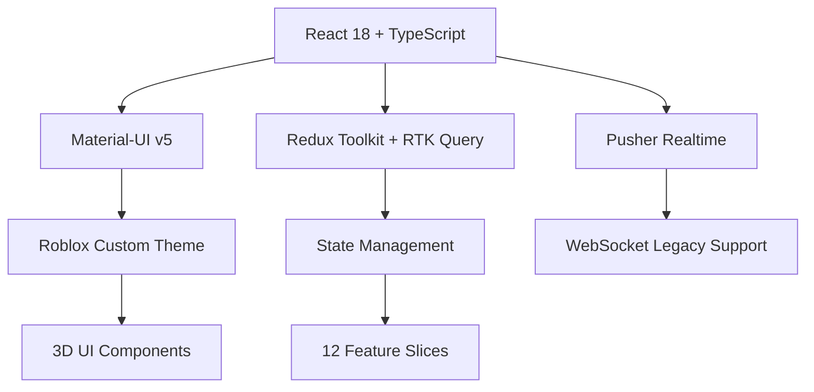

# Dashboard Component Architecture

## Overview

The ToolBoxAI Dashboard is a comprehensive React TypeScript application featuring a Roblox-themed interface, real-time collaboration, and multi-role educational management. Built with Material-UI, Redux Toolkit, and modern React patterns, it provides an immersive educational environment for administrators, teachers, students, and parents.

## Architecture Overview

### Technology Stack



### Component Hierarchy

```
Dashboard Application
├── App.tsx
├── DashboardRouter.tsx
├── AuthContext.tsx (Provider)
├── ThemeWrapper.tsx
└── ErrorBoundary.tsx

Pages (22 main components)
├── Authentication
│   ├── Login.tsx
│   ├── Register.tsx
│   └── PasswordReset.tsx
├── Role-Based Dashboards
│   ├── AdminDashboard.tsx
│   ├── TeacherDashboard.tsx
│   ├── StudentDashboard.tsx
│   └── ParentDashboard.tsx
├── Educational Management
│   ├── Classes.tsx
│   ├── Lessons.tsx
│   ├── Assessments.tsx
│   └── Progress.tsx
├── Communication
│   ├── Messages.tsx
│   └── Notifications
├── Analytics & Reports
│   ├── Reports.tsx
│   ├── Analytics.tsx
│   └── Leaderboard.tsx
└── Administrative
    ├── UserManagement.tsx
    ├── SystemSettings.tsx
    └── ActivityLogs.tsx

Roblox Components (40+ specialized)
├── 3D Elements
│   ├── Roblox3DIcon.tsx
│   ├── Procedural3DCharacter.tsx
│   ├── Simple3DIcon.tsx
│   └── ParticleEffects.tsx
├── UI Components
│   ├── RobloxProgressBar.tsx
│   ├── RobloxAchievementBadge.tsx
│   ├── RobloxNotificationSystem.tsx
│   └── Roblox3DButton.tsx
├── Navigation
│   ├── FloatingIslandNav.tsx
│   ├── Roblox3DNavigation.tsx
│   └── Roblox3DTabs.tsx
└── Integration
    ├── RobloxStudioConnector.tsx
    ├── RobloxEnvironmentPreview.tsx
    └── RobloxAIAssistant.tsx
```

## State Management Architecture

### Redux Store Structure

```typescript
interface RootState {
  // RTK Query API slice
  api: ApiState;

  // Feature slices (12 total)
  ui: UIState;
  user: UserState;
  gamification: GamificationState;
  dashboard: DashboardState;
  classes: ClassesState;
  lessons: LessonsState;
  assessments: AssessmentsState;
  messages: MessagesState;
  progress: ProgressState;
  analytics: AnalyticsState;
  compliance: ComplianceState;
  realtime: RealtimeState;
  roblox: RobloxState;
}
```

### Store Configuration

```typescript
export const store = configureStore({
  reducer: {
    [api.reducerPath]: api.reducer,
    ui: uiReducer,
    user: userReducer,
    gamification: gamificationReducer,
    dashboard: dashboardReducer,
    classes: classesReducer,
    lessons: lessonsReducer,
    assessments: assessmentsReducer,
    messages: messagesReducer,
    progress: progressReducer,
    analytics: analyticsReducer,
    compliance: complianceReducer,
    realtime: realtimeReducer,
    roblox: robloxReducer,
  },
  middleware: (getDefaultMiddleware) =>
    getDefaultMiddleware({
      serializableCheck: {
        ignoredActions: [
          "ui/addNotification",
          "realtime/setWebSocketState",
          "realtime/addRealtimeMessage",
          // RTK Query actions
          'persist/PERSIST',
          'persist/REHYDRATE',
        ],
        ignoredPaths: [
          "ui.notifications",
          "realtime.websocket.error.timestamp",
          `${api.reducerPath}.queries`,
          `${api.reducerPath}.mutations`,
        ],
      },
    })
    .concat(api.middleware)
    .concat(createWebSocketMiddleware(webSocketService)),
});
```

## Feature Slices Documentation

### 1. UI Slice (`uiSlice.ts`)

**Purpose**: Global UI state and notification management

**State Structure**:
```typescript
interface UIState {
  theme: 'light' | 'dark' | 'roblox';
  sidebarOpen: boolean;
  loading: boolean;
  notifications: Notification[];
  modals: {
    [key: string]: boolean;
  };
  errors: ApiError[];
}
```

**Key Actions**:
- `toggleSidebar()`: Toggle sidebar visibility
- `addNotification(notification)`: Add user notification
- `clearNotifications()`: Clear all notifications
- `setLoading(loading)`: Set global loading state
- `openModal(modalId)` / `closeModal(modalId)`: Modal management

### 2. User Slice (`userSlice.ts`)

**Purpose**: User authentication and profile management

**State Structure**:
```typescript
interface UserState {
  currentUser: User | null;
  isAuthenticated: boolean;
  role: 'admin' | 'teacher' | 'student' | 'parent';
  permissions: string[];
  profile: UserProfile;
  preferences: UserPreferences;
}
```

### 3. Gamification Slice (`gamificationSlice.ts`)

**Purpose**: XP, badges, achievements, and leaderboards

**State Structure**:
```typescript
interface GamificationState {
  xp: {
    total: number;
    weekly: number;
    daily: number;
  };
  level: number;
  badges: Badge[];
  achievements: Achievement[];
  leaderboard: LeaderboardEntry[];
  streaks: {
    current: number;
    longest: number;
    type: 'daily' | 'weekly';
  };
}
```

**Key Features**:
- XP tracking and progression
- Badge system with unlock conditions
- Achievement progress tracking
- Real-time leaderboard updates
- Learning streaks

### 4. Classes Slice (`classesSlice.ts`)

**Purpose**: Class management and enrollment

**State Structure**:
```typescript
interface ClassesState {
  classes: ClassInfo[];
  currentClass: ClassInfo | null;
  enrollments: Enrollment[];
  schedule: ScheduleEntry[];
  assignments: Assignment[];
  attendance: AttendanceRecord[];
}
```

### 5. Lessons Slice (`lessonsSlice.ts`)

**Purpose**: Educational content and lesson management

**State Structure**:
```typescript
interface LessonsState {
  lessons: Lesson[];
  currentLesson: Lesson | null;
  progress: LessonProgress[];
  bookmarks: string[];
  favorites: string[];
  recentLessons: string[];
}
```

### 6. Assessments Slice (`assessmentsSlice.ts`)

**Purpose**: Quiz and assessment management

**State Structure**:
```typescript
interface AssessmentsState {
  assessments: Assessment[];
  currentAssessment: Assessment | null;
  submissions: Submission[];
  results: AssessmentResult[];
  grades: Grade[];
  analytics: AssessmentAnalytics;
}
```

### 7. Realtime Slice (`realtimeSlice.ts`)

**Purpose**: Real-time updates and presence management

**State Structure**:
```typescript
interface RealtimeState {
  connectionStatus: 'connected' | 'disconnected' | 'reconnecting';
  pusher: {
    connected: boolean;
    channels: string[];
    lastEvent: PusherEvent | null;
  };
  websocket: {
    connected: boolean;
    error: WebSocketError | null;
  };
  userPresence: UserPresence[];
  messages: RealtimeMessage[];
  notifications: SystemNotification[];
  classrooms: {
    [classId: string]: ClassroomState;
  };
}
```

### 8. Roblox Slice (`robloxSlice.ts`)

**Purpose**: Roblox integration and 3D environment management

**State Structure**:
```typescript
interface RobloxState {
  environments: RobloxEnvironment[];
  currentEnvironment: RobloxEnvironment | null;
  studio: {
    connected: boolean;
    projects: StudioProject[];
    activeProject: string | null;
  };
  assets: RobloxAsset[];
  scripts: RobloxScript[];
  sessions: RobloxSession[];
  aiAssistant: {
    active: boolean;
    context: AIContext;
    suggestions: AISuggestion[];
  };
}
```

## Component Categories

### Administrative Components

#### Admin Control Panel

**File**: `components/pages/admin/AdminControlPanel.tsx`

**Features**:
- Tabbed interface with 8 management sections
- User management with role assignments
- School/institution management
- System settings configuration
- Integration management (LMS, authentication)
- Security settings and compliance
- Activity logs and audit trails
- Platform analytics and storage management

**Usage**:
```typescript
import AdminControlPanel from './components/pages/admin/AdminControlPanel';

// Renders complete admin interface with tabs
<AdminControlPanel />
```

#### User Management

**File**: `components/pages/admin/UserManagement.tsx`

**Features**:
- User creation, editing, and deletion
- Role assignment and permission management
- Bulk user operations
- User activity monitoring
- Password reset and account recovery

### Educational Components

#### Class Management

**Components**:
- `Classes.tsx`: Class listing and overview
- `ClassDetails.tsx`: Detailed class information
- `CreateClassDialog.tsx`: Class creation interface

**Features**:
- Class creation with curriculum alignment
- Student enrollment management
- Assignment distribution
- Progress tracking
- Parent communication

#### Lesson Management

**Components**:
- `Lessons.tsx`: Lesson library and planning
- `CreateLessonDialog.tsx`: Lesson creation wizard

**Features**:
- AI-powered lesson generation
- Curriculum standards alignment
- Interactive content integration
- Assessment attachment
- Roblox environment linking

#### Assessment Management

**Components**:
- `Assessments.tsx`: Assessment overview
- `CreateAssessmentDialog.tsx`: Assessment builder

**Features**:
- Multiple question types
- Automated grading
- Rubric-based evaluation
- Real-time analytics
- Adaptive difficulty

### Roblox-Themed Components

#### 3D UI Elements

**Roblox3DIcon.tsx**:
```typescript
interface Roblox3DIconProps {
  icon: string;
  size?: 'small' | 'medium' | 'large';
  color?: string;
  animated?: boolean;
  depth?: number;
}

const Roblox3DIcon: React.FC<Roblox3DIconProps> = ({
  icon,
  size = 'medium',
  color = '#4CAF50',
  animated = false,
  depth = 4,
}) => {
  return (
    <Box
      sx={{
        position: 'relative',
        display: 'inline-block',
        transform: animated ? 'rotateY(15deg) rotateX(5deg)' : 'none',
        transition: 'transform 0.3s ease',
        '&:hover': {
          transform: 'rotateY(25deg) rotateX(10deg) scale(1.05)',
        },
      }}
    >
      {/* 3D depth layers */}
      {Array.from({ length: depth }).map((_, i) => (
        <Box
          key={i}
          sx={{
            position: 'absolute',
            top: -i,
            left: -i,
            zIndex: depth - i,
            opacity: 1 - i * 0.1,
            bgcolor: color,
            // ... 3D styling
          }}
        />
      ))}
    </Box>
  );
};
```

**RobloxProgressBar.tsx**:
```typescript
interface RobloxProgressBarProps {
  value: number;
  max?: number;
  label?: string;
  animated?: boolean;
  color?: 'primary' | 'success' | 'warning' | 'error';
  size?: 'small' | 'medium' | 'large';
  showXP?: boolean;
}

const RobloxProgressBar: React.FC<RobloxProgressBarProps> = ({
  value,
  max = 100,
  label,
  animated = true,
  color = 'primary',
  size = 'medium',
  showXP = false,
}) => {
  const percentage = Math.min((value / max) * 100, 100);

  return (
    <Box sx={{ position: 'relative', mb: 2 }}>
      {label && (
        <Typography variant="body2" sx={{ mb: 1, fontWeight: 'bold' }}>
          {label}
        </Typography>
      )}

      <Box
        sx={{
          height: size === 'small' ? 8 : size === 'large' ? 20 : 12,
          bgcolor: 'grey.300',
          borderRadius: '8px',
          position: 'relative',
          overflow: 'hidden',
          border: '2px solid #000',
          boxShadow: '4px 4px 0px #000',
        }}
      >
        <Box
          sx={{
            width: `${percentage}%`,
            height: '100%',
            bgcolor: `${color}.main`,
            borderRadius: '6px',
            transition: animated ? 'width 0.8s ease-in-out' : 'none',
            position: 'relative',
            '&::after': {
              content: '""',
              position: 'absolute',
              top: 0,
              left: 0,
              right: 0,
              height: '40%',
              bgcolor: 'rgba(255, 255, 255, 0.3)',
              borderRadius: '6px 6px 0 0',
            },
          }}
        />
      </Box>

      {showXP && (
        <Typography variant="caption" sx={{ mt: 0.5, display: 'block' }}>
          {value} / {max} XP
        </Typography>
      )}
    </Box>
  );
};
```

#### Interactive Elements

**FloatingIslandNav.tsx**:
```typescript
const FloatingIslandNav: React.FC = () => {
  const [selectedIsland, setSelectedIsland] = useState(0);

  const islands = [
    { id: 'dashboard', label: 'Dashboard', icon: <Dashboard />, color: '#4CAF50' },
    { id: 'classes', label: 'Classes', icon: <School />, color: '#2196F3' },
    { id: 'progress', label: 'Progress', icon: <TrendingUp />, color: '#FF9800' },
    { id: 'achievements', label: 'Achievements', icon: <EmojiEvents />, color: '#9C27B0' },
  ];

  return (
    <Box
      sx={{
        position: 'fixed',
        bottom: 20,
        right: 20,
        zIndex: 1300,
        display: 'flex',
        flexDirection: 'column',
        gap: 2,
      }}
    >
      {islands.map((island, index) => (
        <Tooltip key={island.id} title={island.label} placement="left">
          <IconButton
            onClick={() => setSelectedIsland(index)}
            sx={{
              width: 60,
              height: 60,
              bgcolor: island.color,
              color: 'white',
              border: '3px solid #000',
              borderRadius: '50%',
              boxShadow: selectedIsland === index
                ? '0 8px 16px rgba(0,0,0,0.3)'
                : '0 4px 8px rgba(0,0,0,0.2)',
              transform: selectedIsland === index
                ? 'scale(1.1) translateY(-4px)'
                : 'scale(1)',
              transition: 'all 0.3s ease',
              '&:hover': {
                transform: 'scale(1.1) translateY(-4px)',
                boxShadow: '0 8px 16px rgba(0,0,0,0.3)',
              },
            }}
          >
            {island.icon}
          </IconButton>
        </Tooltip>
      ))}
    </Box>
  );
};
```

### Real-time Communication

#### Pusher Integration

**PusherService.ts**:
```typescript
class PusherService {
  private static instance: PusherService;
  private pusher: Pusher | null = null;
  private channels: Map<string, Channel> = new Map();

  static getInstance(): PusherService {
    if (!PusherService.instance) {
      PusherService.instance = new PusherService();
    }
    return PusherService.instance;
  }

  async connect(token: string): Promise<void> {
    this.pusher = new Pusher(config.pusherKey, {
      cluster: config.pusherCluster,
      authEndpoint: '/api/pusher/auth',
      auth: {
        headers: {
          Authorization: `Bearer ${token}`,
        },
      },
    });

    this.pusher.connection.bind('connected', () => {
      console.log('Pusher connected');
    });
  }

  subscribe(channelName: string): Channel {
    if (!this.pusher) throw new Error('Pusher not connected');

    const channel = this.pusher.subscribe(channelName);
    this.channels.set(channelName, channel);
    return channel;
  }

  bindEvent(channelName: string, event: string, callback: Function): void {
    const channel = this.channels.get(channelName);
    if (channel) {
      channel.bind(event, callback);
    }
  }
}
```

#### WebSocket Middleware

```typescript
export const createWebSocketMiddleware = (webSocketService: PusherService) => {
  return (store: any) => (next: any) => (action: any) => {
    // Handle real-time actions
    if (action.type.startsWith('realtime/')) {
      switch (action.type) {
        case 'realtime/sendMessage':
          webSocketService.trigger('messages', 'new-message', action.payload);
          break;
        case 'realtime/updatePresence':
          webSocketService.trigger('presence', 'user-update', action.payload);
          break;
      }
    }

    return next(action);
  };
};
```

## API Integration

### RTK Query Configuration

```typescript
export const api = createApi({
  reducerPath: 'api',
  baseQuery: fetchBaseQuery({
    baseUrl: '/api/v1/',
    prepareHeaders: (headers, { getState }) => {
      const token = (getState() as RootState).user.token;
      if (token) {
        headers.set('Authorization', `Bearer ${token}`);
      }
      return headers;
    },
  }),
  tagTypes: [
    'User', 'Class', 'Lesson', 'Assessment', 'Message',
    'Progress', 'Analytics', 'Roblox', 'Environment'
  ],
  endpoints: (builder) => ({
    // User management
    getUsers: builder.query<User[], void>({
      query: () => 'users',
      providesTags: ['User'],
    }),

    // Class management
    getClasses: builder.query<Class[], void>({
      query: () => 'classes',
      providesTags: ['Class'],
    }),

    createClass: builder.mutation<Class, CreateClassRequest>({
      query: (newClass) => ({
        url: 'classes',
        method: 'POST',
        body: newClass,
      }),
      invalidatesTags: ['Class'],
    }),

    // Content generation
    generateContent: builder.mutation<ContentResponse, ContentRequest>({
      query: (request) => ({
        url: 'content/generate',
        method: 'POST',
        body: request,
      }),
      invalidatesTags: ['Lesson'],
    }),

    // Roblox integration
    deployToRoblox: builder.mutation<DeployResponse, DeployRequest>({
      query: (request) => ({
        url: 'roblox/deploy',
        method: 'POST',
        body: request,
      }),
      invalidatesTags: ['Roblox', 'Environment'],
    }),
  }),
});
```

### Custom Hooks

```typescript
// Enhanced hooks with error handling and loading states
export const useClassesWithLoading = () => {
  const { data: classes, isLoading, error } = useGetClassesQuery();
  const [createClass, { isLoading: isCreating }] = useCreateClassMutation();

  const handleCreateClass = async (classData: CreateClassRequest) => {
    try {
      const result = await createClass(classData).unwrap();
      // Show success notification
      return result;
    } catch (error) {
      // Handle error
      throw error;
    }
  };

  return {
    classes: classes || [],
    isLoading,
    error,
    createClass: handleCreateClass,
    isCreating,
  };
};

export const useRealtimeUpdates = (channelName: string) => {
  const dispatch = useAppDispatch();
  const pusherService = PusherService.getInstance();

  useEffect(() => {
    const channel = pusherService.subscribe(channelName);

    channel.bind('update', (data: any) => {
      dispatch(addRealtimeMessage(data));
    });

    return () => {
      pusherService.unsubscribe(channelName);
    };
  }, [channelName, dispatch]);
};
```

## Theme System

### Roblox Theme Configuration

```typescript
export const robloxTheme = createTheme({
  palette: {
    mode: 'light',
    primary: {
      main: '#00A2FF',
      light: '#4FC3F7',
      dark: '#0277BD',
    },
    secondary: {
      main: '#FF6B6B',
      light: '#FF8A80',
      dark: '#E57373',
    },
    background: {
      default: '#F0F4F8',
      paper: '#FFFFFF',
    },
  },
  typography: {
    fontFamily: '"Roboto Slab", "Roboto", sans-serif',
    h1: {
      fontWeight: 700,
      fontSize: '2.5rem',
      textShadow: '2px 2px 4px rgba(0,0,0,0.1)',
    },
    h2: {
      fontWeight: 600,
      fontSize: '2rem',
    },
    button: {
      fontWeight: 600,
      textTransform: 'none',
    },
  },
  components: {
    MuiButton: {
      styleOverrides: {
        root: {
          borderRadius: 12,
          border: '2px solid transparent',
          boxShadow: '0 4px 8px rgba(0,0,0,0.1)',
          transition: 'all 0.3s ease',
          '&:hover': {
            transform: 'translateY(-2px)',
            boxShadow: '0 6px 12px rgba(0,0,0,0.15)',
          },
        },
      },
    },
    MuiCard: {
      styleOverrides: {
        root: {
          borderRadius: 16,
          border: '2px solid #E0E0E0',
          boxShadow: '0 8px 16px rgba(0,0,0,0.1)',
          transition: 'all 0.3s ease',
          '&:hover': {
            transform: 'translateY(-4px)',
            boxShadow: '0 12px 24px rgba(0,0,0,0.15)',
          },
        },
      },
    },
  },
});
```

### Design Tokens

```typescript
export const designTokens = {
  spacing: {
    xs: '4px',
    sm: '8px',
    md: '16px',
    lg: '24px',
    xl: '32px',
    xxl: '48px',
  },
  borderRadius: {
    small: '8px',
    medium: '12px',
    large: '16px',
    round: '50%',
  },
  shadows: {
    roblox: '0 4px 8px rgba(0,0,0,0.15), 0 2px 4px rgba(0,0,0,0.1)',
    floating: '0 8px 32px rgba(0,0,0,0.12)',
    pressed: 'inset 0 2px 4px rgba(0,0,0,0.1)',
  },
  colors: {
    robloxBlue: '#00A2FF',
    robloxRed: '#FF6B6B',
    robloxGreen: '#4CAF50',
    robloxYellow: '#FFB74D',
    robloxPurple: '#9C27B0',
  },
};
```

## Performance Optimization

### Code Splitting

```typescript
// Lazy load page components
const AdminDashboard = lazy(() => import('./components/dashboards/AdminDashboard'));
const TeacherDashboard = lazy(() => import('./components/dashboards/TeacherDashboard'));
const StudentDashboard = lazy(() => import('./components/dashboards/StudentDashboard'));

// Route-based splitting
const DashboardRouter: React.FC = () => {
  return (
    <Suspense fallback={<LoadingSpinner />}>
      <Routes>
        <Route path="/admin" element={<AdminDashboard />} />
        <Route path="/teacher" element={<TeacherDashboard />} />
        <Route path="/student" element={<StudentDashboard />} />
      </Routes>
    </Suspense>
  );
};
```

### Memoization

```typescript
// Memoized expensive components
const ExpensiveChart = React.memo<ChartProps>(({ data, options }) => {
  const chartData = useMemo(() => {
    return processChartData(data);
  }, [data]);

  return <Chart data={chartData} options={options} />;
});

// Memoized selectors
const selectFilteredClasses = createSelector(
  [
    (state: RootState) => state.classes.classes,
    (state: RootState, filter: string) => filter,
  ],
  (classes, filter) => {
    return classes.filter(cls =>
      cls.name.toLowerCase().includes(filter.toLowerCase())
    );
  }
);
```

### Virtual Scrolling

```typescript
import { FixedSizeList as List } from 'react-window';

const VirtualizedClassList: React.FC<{ classes: Class[] }> = ({ classes }) => {
  const Row = ({ index, style }: { index: number; style: React.CSSProperties }) => (
    <div style={style}>
      <ClassCard class={classes[index]} />
    </div>
  );

  return (
    <List
      height={600}
      itemCount={classes.length}
      itemSize={120}
      width="100%"
    >
      {Row}
    </List>
  );
};
```

## Testing Strategy

### Component Testing

```typescript
import { render, screen, fireEvent } from '@testing-library/react';
import { Provider } from 'react-redux';
import { store } from '../store';
import AdminControlPanel from './AdminControlPanel';

describe('AdminControlPanel', () => {
  const renderWithProviders = (component: React.ReactElement) => {
    return render(
      <Provider store={store}>
        <ThemeProvider theme={robloxTheme}>
          {component}
        </ThemeProvider>
      </Provider>
    );
  };

  it('renders all admin tabs', () => {
    renderWithProviders(<AdminControlPanel />);

    expect(screen.getByText('Users')).toBeInTheDocument();
    expect(screen.getByText('Schools')).toBeInTheDocument();
    expect(screen.getByText('System Settings')).toBeInTheDocument();
    expect(screen.getByText('Security')).toBeInTheDocument();
  });

  it('switches tabs correctly', () => {
    renderWithProviders(<AdminControlPanel />);

    fireEvent.click(screen.getByText('Schools'));
    expect(screen.getByText('School Management')).toBeInTheDocument();
  });

  it('displays security alerts badge', () => {
    renderWithProviders(<AdminControlPanel />);

    const securityTab = screen.getByText('Security').closest('button');
    expect(securityTab).toHaveTextContent('3');
  });
});
```

### Integration Testing

```typescript
import { rest } from 'msw';
import { setupServer } from 'msw/node';

const server = setupServer(
  rest.get('/api/v1/classes', (req, res, ctx) => {
    return res(ctx.json([
      { id: 1, name: 'Math 101', students: 25 },
      { id: 2, name: 'Science 201', students: 30 },
    ]));
  })
);

beforeAll(() => server.listen());
afterEach(() => server.resetHandlers());
afterAll(() => server.close());

describe('Class Management Integration', () => {
  it('loads and displays classes from API', async () => {
    renderWithProviders(<Classes />);

    await waitFor(() => {
      expect(screen.getByText('Math 101')).toBeInTheDocument();
      expect(screen.getByText('Science 201')).toBeInTheDocument();
    });
  });
});
```

### E2E Testing with Playwright

```typescript
import { test, expect } from '@playwright/test';

test.describe('Dashboard Navigation', () => {
  test('admin can navigate through all sections', async ({ page }) => {
    await page.goto('/login');

    // Login as admin
    await page.fill('[data-testid=email]', 'admin@example.com');
    await page.fill('[data-testid=password]', 'password');
    await page.click('[data-testid=login-button]');

    // Check admin dashboard loads
    await expect(page.locator('text=Admin Control Panel')).toBeVisible();

    // Test tab navigation
    await page.click('text=Users');
    await expect(page.locator('text=User Management')).toBeVisible();

    await page.click('text=Schools');
    await expect(page.locator('text=School Management')).toBeVisible();
  });

  test('student sees appropriate dashboard', async ({ page }) => {
    await page.goto('/login');

    // Login as student
    await page.fill('[data-testid=email]', 'student@example.com');
    await page.fill('[data-testid=password]', 'password');
    await page.click('[data-testid=login-button]');

    // Check student dashboard loads
    await expect(page.locator('text=My Learning Journey')).toBeVisible();
    await expect(page.locator('[data-testid=xp-progress]')).toBeVisible();
    await expect(page.locator('[data-testid=achievements]')).toBeVisible();
  });
});
```

## Accessibility

### ARIA Implementation

```typescript
const AccessibleProgressBar: React.FC<ProgressBarProps> = ({ value, max, label }) => {
  const percentage = (value / max) * 100;

  return (
    <Box role="progressbar" aria-valuenow={value} aria-valuemin={0} aria-valuemax={max} aria-label={label}>
      <Typography id="progress-label" variant="body2">
        {label}
      </Typography>
      <Box
        sx={{ /* styling */ }}
        aria-labelledby="progress-label"
        aria-describedby="progress-description"
      >
        {/* Progress bar implementation */}
      </Box>
      <Typography id="progress-description" variant="caption">
        {percentage.toFixed(0)}% complete
      </Typography>
    </Box>
  );
};
```

### Keyboard Navigation

```typescript
const KeyboardNavigableTab: React.FC<TabProps> = ({ children, onSelect }) => {
  const handleKeyDown = (event: React.KeyboardEvent) => {
    switch (event.key) {
      case 'Enter':
      case ' ':
        event.preventDefault();
        onSelect();
        break;
      case 'ArrowRight':
        event.preventDefault();
        // Focus next tab
        break;
      case 'ArrowLeft':
        event.preventDefault();
        // Focus previous tab
        break;
    }
  };

  return (
    <div
      role="tab"
      tabIndex={0}
      onKeyDown={handleKeyDown}
      onClick={onSelect}
      aria-selected={selected}
    >
      {children}
    </div>
  );
};
```

## Deployment Configuration

### Build Optimization

```typescript
// vite.config.ts
export default defineConfig({
  plugins: [react()],
  build: {
    rollupOptions: {
      output: {
        manualChunks: {
          vendor: ['react', 'react-dom'],
          mui: ['@mui/material', '@mui/icons-material'],
          charts: ['recharts', 'chart.js'],
          roblox: ['three', '@react-three/fiber'],
        },
      },
    },
    chunkSizeWarningLimit: 1000,
  },
  server: {
    proxy: {
      '/api': {
        target: 'http://localhost:8008',
        changeOrigin: true,
      },
    },
  },
});
```

### Environment Configuration

```typescript
// Environment-specific settings
const config = {
  development: {
    apiUrl: 'http://localhost:8008',
    pusherKey: 'dev_key',
    enableDevTools: true,
  },
  staging: {
    apiUrl: 'https://staging-api.toolboxai.com',
    pusherKey: 'staging_key',
    enableDevTools: false,
  },
  production: {
    apiUrl: 'https://api.toolboxai.com',
    pusherKey: 'prod_key',
    enableDevTools: false,
  },
};
```

## Future Enhancements

### Planned Features

1. **Advanced 3D Elements**:
   - WebGL-powered 3D navigation
   - Procedural 3D character generation
   - Interactive 3D learning environments

2. **AI Integration**:
   - Real-time AI tutoring
   - Adaptive UI based on learning patterns
   - Intelligent content recommendations

3. **Mobile Optimization**:
   - Progressive Web App capabilities
   - Touch-optimized 3D interactions
   - Offline functionality

4. **Enhanced Analytics**:
   - Machine learning insights
   - Predictive analytics
   - Custom dashboard creation

### Performance Roadmap

1. **Micro-frontends**: Split dashboard into independently deployable modules
2. **CDN Integration**: Optimize asset delivery
3. **Service Workers**: Advanced caching and offline support
4. **WebAssembly**: High-performance 3D rendering

---

*Last Updated: September 16, 2025*
*Version: 2.0.0*
*Next Review: December 2025*