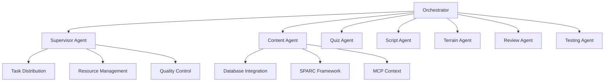

# Agent System Documentation

## Overview

The ToolBoxAI Agent System is a sophisticated multi-agent architecture designed for educational content generation with Roblox integration. The system leverages LangChain, LangGraph state machines, and the SPARC framework to create intelligent, collaborative agents that can generate comprehensive educational environments.

## Architecture

### Core Components

1. **Base Agent Framework** (`core/agents/base_agent.py`)
2. **Orchestrator System** (`core/agents/orchestrator.py`)
3. **Specialized Agents** (Content, Quiz, Script, Review, etc.)
4. **Supervisor Agents** (Standard and Advanced)
5. **Integration Layer** (MCP, SPARC, Database)

### Agent Hierarchy



## Base Agent Architecture

### Core Features

The `BaseAgent` class provides:

- **LangChain Integration**: Direct integration with OpenAI GPT models
- **SPARC Framework Hooks**: Structured reasoning and context management
- **Memory Management**: Persistent task memory with size limits
- **Error Handling**: Comprehensive error recovery and metrics
- **Tool System**: Extensible tool integration
- **Collaboration Support**: Multi-agent coordination
- **Testing Integration**: Automatic validation triggers

### Agent States

```python
class AgentStatus(Enum):
    IDLE = "idle"
    PROCESSING = "processing"
    WAITING = "waiting"
    ERROR = "error"
    COMPLETED = "completed"
```

### Configuration

```python
@dataclass
class AgentConfig:
    name: str = "BaseAgent"
    model: str = "gpt-3.5-turbo"
    temperature: float = 0.7
    max_retries: int = 3
    timeout: int = 300
    verbose: bool = False
    memory_enabled: bool = True
    max_context_length: int = 128000
    max_tokens: int = 4096
    tools: List[Any] = field(default_factory=list)
    system_prompt: str = ""
```

### Task Execution

```python
async def execute(self, task: str, context: Optional[Dict[str, Any]] = None) -> TaskResult:
    """
    Execute a task with the given context.

    Args:
        task: Task description
        context: Optional context dictionary

    Returns:
        TaskResult with execution details
    """
```

## Orchestrator System

### Workflow Types

The orchestrator supports multiple workflow types:

```python
class WorkflowType(Enum):
    FULL_ENVIRONMENT = "full_environment"
    CONTENT_ONLY = "content_only"
    QUIZ_ONLY = "quiz_only"
    TERRAIN_ONLY = "terrain_only"
    SCRIPT_ONLY = "script_only"
    REVIEW_OPTIMIZE = "review_optimize"
    TESTING_VALIDATION = "testing_validation"
    CUSTOM = "custom"
```

### Workflow Execution

1. **Request Analysis**: Understanding requirements
2. **Agent Coordination**: Task distribution
3. **State Management**: Progress tracking
4. **Result Integration**: Component assembly
5. **Quality Assurance**: Testing and validation

### Full Environment Workflow

```
analyze → generate_content → create_quiz → build_terrain →
develop_scripts → review_code → run_tests → integrate → finalize
```

## Specialized Agents

### Content Agent

**Purpose**: Educational content generation with curriculum alignment

**Capabilities**:
- Curriculum-aligned content creation (Common Core, NGSS, CSTA)
- Database-enhanced content generation
- SPARC framework integration
- MCP context management
- Multi-modal content creation
- Real-time assessment integration

**Key Features**:
- Real-time database integration
- Standards lookup and alignment
- Vocabulary generation
- Learning objective building
- Interactive element design
- Quality metrics tracking

**Example Usage**:
```python
content_agent = ContentAgent()
result = await content_agent.execute(
    "Generate science content for grade 7",
    {
        "subject": "Science",
        "grade_level": "7",
        "topic": "Solar System",
        "learning_objectives": ["Understand planetary orbits"]
    }
)
```

### Quiz Agent

**Purpose**: Interactive assessment creation

**Capabilities**:
- Multiple question type generation
- Difficulty scaling
- Standards alignment
- Roblox implementation ready
- Progress tracking integration

### Script Agent

**Purpose**: Lua script generation for Roblox

**Capabilities**:
- Game logic implementation
- UI system creation
- Event handling
- Performance optimization
- Security validation

### Terrain Agent

**Purpose**: 3D environment generation

**Capabilities**:
- Educational terrain creation
- Theme-based environments
- Interactive element placement
- Performance optimization

### Review Agent

**Purpose**: Code quality assurance

**Capabilities**:
- Comprehensive code review
- Security analysis
- Performance optimization
- Best practice validation
- Refactoring suggestions

### Testing Agent

**Purpose**: Quality validation and testing

**Capabilities**:
- Unit test generation
- Integration testing
- Performance testing
- Coverage analysis
- Failure analysis

## Integration Systems

### Database Integration

**Features**:
- Real-time content lookup
- Student progress analysis
- Curriculum standards access
- Content quality tracking
- Performance metrics

**Example**:
```python
async def _lookup_database_content(self, query: str) -> str:
    content_items = await self.agent_db.get_educational_content()
    # Process and return relevant content
```

### SPARC Framework Integration

**Components**:
- **State Manager**: Learning state tracking
- **Policy Engine**: Decision making
- **Action Executor**: Task execution
- **Reward Calculator**: Quality assessment
- **Context Tracker**: Session management

**Example**:
```python
async def _execute_sparc_cycle(self, task_data: Dict[str, Any]) -> Dict[str, Any]:
    # Create observation
    observation = {
        "task_type": "content_generation",
        "content_quality": self._calculate_content_quality_score(content),
        "timestamp": datetime.now().isoformat()
    }

    # Update state and get policy decision
    current_state = await self.state_manager.update_state(observation)
    policy_decision = await self.policy_engine.decide(policy_input)

    # Execute action and calculate rewards
    action_result = await self.action_executor.execute(action)
    rewards = await self.reward_calculator.calculate_rewards(reward_input)
```

### MCP (Model Context Protocol) Integration

**Features**:
- Context sharing between agents
- Real-time updates
- Cross-agent communication
- State synchronization

**Example**:
```python
async def _update_mcp_context(self, context_data: Dict[str, Any]) -> bool:
    async with websockets.connect(self.mcp_url) as websocket:
        message = {
            "type": "context_update",
            "source": "content_agent",
            "data": context_data,
            "timestamp": datetime.now().isoformat()
        }
        await websocket.send(json.dumps(message))
```

## Agent Collaboration

### Collaboration Patterns

1. **Sequential Execution**: One agent after another
2. **Parallel Execution**: Multiple agents simultaneously
3. **Hierarchical Coordination**: Supervisor-agent relationships
4. **Peer-to-Peer Communication**: Direct agent interaction

### Example Collaboration

```python
async def collaborate(
    self, other_agent: "BaseAgent", task: str, context: Optional[Dict[str, Any]] = None
) -> TaskResult:
    # Execute tasks in parallel
    results = await asyncio.gather(
        self.execute(f"Your part: {task}", context),
        other_agent.execute(f"Your part: {task}", context)
    )

    # Combine results
    combined_output = {
        self.name: results[0].output,
        other_agent.name: results[1].output
    }

    return TaskResult.create(
        success=all(r.success for r in results),
        output=combined_output,
        metadata={"collaboration": True, "agents": [self.name, other_agent.name]}
    )
```

## Quality Metrics

### Content Quality Assessment

The system tracks multiple quality dimensions:

```python
def _calculate_content_quality_score(self, content: Dict[str, Any]) -> float:
    score = 0.0
    max_score = 100.0

    # Core components
    if content.get("explanation"): score += 25.0
    if content.get("vocabulary"): score += 20.0
    if content.get("standards_alignment"): score += 20.0
    if content.get("learning_path"): score += 15.0

    # Enhancement bonuses
    if content.get("source") == "database_enhanced": score += 10.0
    if self.use_real_data: score += 5.0
    if self.sparc_available: score += 5.0

    return min(score / max_score, 1.0)
```

### Performance Metrics

Each agent tracks:
- Tasks processed
- Success rate
- Average execution time
- Error count
- Quality scores
- Resource utilization

## Error Handling

### Resilience Patterns

1. **Graceful Degradation**: Fall back to simpler implementations
2. **Retry Logic**: Exponential backoff for recoverable errors
3. **Circuit Breaker**: Prevent cascade failures
4. **Fallback Data**: Use mock data when real data unavailable

### Example Error Handling

```python
async def _save_with_retry(self, content_type: str, content_data: Dict[str, Any], max_retries: int = 3) -> bool:
    for attempt in range(max_retries):
        try:
            success = await db.save_generated_content(content_type, content_data)
            if success:
                return True
            await asyncio.sleep(2 ** attempt)  # Exponential backoff
        except Exception as e:
            logger.warning(f"Save attempt {attempt + 1} error: {e}")
            if attempt < max_retries - 1:
                await asyncio.sleep(2 ** attempt)
    return False
```

## Configuration and Environment

### Environment Detection

The system automatically detects available resources:

```python
# Check if we should use mock LLM
USE_MOCK_LLM = not os.getenv("OPENAI_API_KEY") or os.getenv("USE_MOCK_LLM") == "true"

# Database availability
DATABASE_AVAILABLE = True if get_agent_database else False

# SPARC framework availability
SPARC_AVAILABLE = True if sparc_imports_successful else False

# MCP availability
MCP_AVAILABLE = True if websockets_available else False
```

### Adaptive Configuration

Agents adapt their behavior based on available resources:

```python
if config is None:
    if not self.env_config.use_mock_llm and os.getenv("OPENAI_API_KEY"):
        model = "gpt-4o" if os.getenv("USE_GPT4", "false").lower() == "true" else "gpt-3.5-turbo"
    else:
        model = "gpt-3.5-turbo"

    config = AgentConfig(
        name="ContentAgent",
        model=model,
        temperature=0.7,
        system_prompt=self._get_enhanced_content_prompt(),
        tools=self._initialize_tools()
    )
```

## Best Practices

### Agent Development

1. **Single Responsibility**: Each agent has a clear, focused purpose
2. **Composition Over Inheritance**: Use composition for complex behaviors
3. **Async First**: Design for asynchronous execution
4. **Error Resilience**: Handle failures gracefully
5. **Resource Awareness**: Adapt to available resources
6. **Quality Metrics**: Track and optimize performance

### Tool Integration

1. **Lazy Loading**: Load tools only when needed
2. **Fallback Tools**: Provide alternatives for unavailable tools
3. **Tool Validation**: Verify tool availability before use
4. **Resource Management**: Clean up tool resources

### Memory Management

1. **Size Limits**: Prevent memory leaks with bounded storage
2. **Selective Retention**: Keep only relevant memory entries
3. **Compression**: Summarize old memories
4. **Context Windows**: Maintain appropriate context sizes

## API Reference

### Core Methods

```python
# Agent execution
async def execute(task: str, context: Dict[str, Any]) -> TaskResult

# Agent collaboration
async def collaborate(other_agent: BaseAgent, task: str) -> TaskResult

# Tool management
def add_tool(tool: Any) -> None

# Status monitoring
def get_status() -> Dict[str, Any]

# Memory management
def get_memory_context(limit: int = 5) -> List[Dict[str, Any]]

# Self-reflection
async def reflect() -> Dict[str, Any]
```

### Orchestrator Methods

```python
# Main orchestration
async def orchestrate(request: OrchestrationRequest) -> OrchestrationResult

# Convenience methods
async def generate_environment(**kwargs) -> OrchestrationResult
async def review_code(code: str, language: str = "lua") -> OrchestrationResult

# Monitoring
def get_metrics() -> Dict[str, Any]
async def health_check() -> Dict[str, Any]
```

## Testing and Validation

### Unit Testing

Each agent includes comprehensive unit tests:

```python
async def test_content_agent_execution():
    agent = ContentAgent()
    result = await agent.execute(
        "Generate math content",
        {"subject": "Mathematics", "grade_level": "5"}
    )
    assert result.success
    assert "content" in result.output
```

### Integration Testing

Multi-agent workflows are tested end-to-end:

```python
async def test_full_environment_generation():
    orchestrator = Orchestrator()
    request = OrchestrationRequest(
        workflow_type=WorkflowType.FULL_ENVIRONMENT,
        subject="Science",
        grade_level="6",
        learning_objectives=["Solar System"]
    )
    result = await orchestrator.orchestrate(request)
    assert result.success
    assert result.content is not None
    assert result.scripts is not None
```

### Performance Testing

Load testing ensures agents can handle production workloads:

```python
async def test_agent_load_performance():
    agent = ContentAgent()
    tasks = [
        agent.execute(f"Task {i}", {"subject": "Math"})
        for i in range(100)
    ]
    results = await asyncio.gather(*tasks)
    success_rate = sum(1 for r in results if r.success) / len(results)
    assert success_rate > 0.95
```

## Deployment Considerations

### Resource Requirements

- **Memory**: 2-4GB per agent instance
- **CPU**: Multi-core for parallel processing
- **Network**: Stable connection for API calls
- **Storage**: Database access for enhanced features

### Scaling Strategies

1. **Horizontal Scaling**: Multiple agent instances
2. **Load Balancing**: Distribute tasks across instances
3. **Resource Pooling**: Share expensive resources
4. **Caching**: Cache frequent operations

### Monitoring

1. **Health Checks**: Regular agent status monitoring
2. **Metrics Collection**: Performance and quality tracking
3. **Error Reporting**: Centralized error logging
4. **Resource Usage**: Memory and CPU monitoring

## Future Enhancements

### Planned Features

1. **Advanced Learning Models**: Fine-tuned domain-specific models
2. **Real-time Collaboration**: Live multi-agent coordination
3. **Enhanced SPARC Integration**: More sophisticated reasoning
4. **Mobile Agent Support**: Cross-platform deployment
5. **Advanced Analytics**: Machine learning insights

### Research Areas

1. **Multi-modal Learning**: Vision and audio integration
2. **Federated Learning**: Distributed model training
3. **Causal Reasoning**: Enhanced problem solving
4. **Curriculum Optimization**: Adaptive learning paths

---

*Last Updated: September 16, 2025*
*Version: 2.0.0*
*Next Review: December 2025*