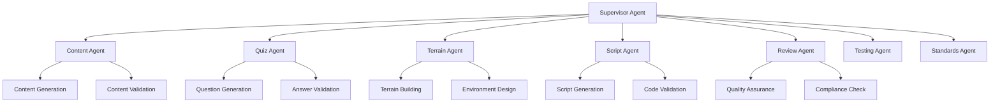

# 🤖 Agent System Implementation Guide 2025

## Overview

This guide provides comprehensive implementation details for the ToolboxAI Solutions AI agent system, covering agent architecture, communication protocols, workflow orchestration, and best practices for 2025 standards.

## 🏗️ Agent Architecture

### Agent Hierarchy



### Base Agent Implementation

```python
# Base Agent Class
from abc import ABC, abstractmethod
from typing import Dict, Any, Optional, List
from dataclasses import dataclass
from enum import Enum
import asyncio
import logging
from datetime import datetime

class AgentStatus(Enum):
    IDLE = "idle"
    PROCESSING = "processing"
    COMPLETED = "completed"
    FAILED = "failed"
    RETRYING = "retrying"

@dataclass
class TaskResult:
    success: bool
    output: Optional[Dict[str, Any]] = None
    error: Optional[str] = None
    metadata: Optional[Dict[str, Any]] = None
    execution_time: float = 0.0
    timestamp: datetime = None

    def __post_init__(self):
        if self.timestamp is None:
            self.timestamp = datetime.utcnow()

@dataclass
class AgentConfig:
    name: str
    model: str = "gpt-4-turbo-preview"
    temperature: float = 0.1
    max_tokens: int = 4096
    timeout: int = 300
    retry_attempts: int = 3
    circuit_breaker_threshold: int = 5

class BaseAgent(ABC):
    def __init__(self, config: AgentConfig):
        self.config = config
        self.status = AgentStatus.IDLE
        self.logger = logging.getLogger(f"agent.{config.name}")
        self.failure_count = 0
        self.last_failure_time = None
        self.circuit_breaker_open = False

    @abstractmethod
    async def execute(self, task: str, context: Dict[str, Any]) -> TaskResult:
        """Execute agent task"""
        pass

    async def process_task(self, task: str, context: Dict[str, Any]) -> TaskResult:
        """Process task with error handling and circuit breaker"""
        if self.circuit_breaker_open:
            return TaskResult(
                success=False,
                error="Circuit breaker is open"
            )

        start_time = datetime.utcnow()
        self.status = AgentStatus.PROCESSING

        try:
            result = await self.execute(task, context)

            if result.success:
                self.failure_count = 0
                self.status = AgentStatus.COMPLETED
            else:
                self._handle_failure()
                self.status = AgentStatus.FAILED

            result.execution_time = (datetime.utcnow() - start_time).total_seconds()
            return result

        except Exception as e:
            self._handle_failure()
            self.status = AgentStatus.FAILED
            return TaskResult(
                success=False,
                error=str(e),
                execution_time=(datetime.utcnow() - start_time).total_seconds()
            )

    def _handle_failure(self):
        """Handle agent failure"""
        self.failure_count += 1
        self.last_failure_time = datetime.utcnow()

        if self.failure_count >= self.config.circuit_breaker_threshold:
            self.circuit_breaker_open = True
            self.logger.warning(f"Circuit breaker opened for agent {self.config.name}")

    def reset_circuit_breaker(self):
        """Reset circuit breaker"""
        self.circuit_breaker_open = False
        self.failure_count = 0
        self.logger.info(f"Circuit breaker reset for agent {self.config.name}")

    def get_health_status(self) -> Dict[str, Any]:
        """Get agent health status"""
        return {
            "name": self.config.name,
            "status": self.status.value,
            "failure_count": self.failure_count,
            "circuit_breaker_open": self.circuit_breaker_open,
            "last_failure_time": self.last_failure_time.isoformat() if self.last_failure_time else None
        }
```

## 🎯 Specialized Agents

### Content Agent

```python
# Content Generation Agent
from core.agents.base_agent import BaseAgent, TaskResult, AgentConfig
from typing import Dict, Any
import json

class ContentAgent(BaseAgent):
    def __init__(self, config: AgentConfig = None):
        if config is None:
            config = AgentConfig(name="content_agent")
        super().__init__(config)

    async def execute(self, task: str, context: Dict[str, Any]) -> TaskResult:
        """Generate educational content"""
        try:
            # Extract context information
            subject = context.get("subject", "General")
            grade_level = context.get("grade_level", 5)
            learning_objectives = context.get("learning_objectives", [])
            duration_minutes = context.get("duration_minutes", 30)

            # Generate content using LLM
            content_prompt = self._build_content_prompt(
                task, subject, grade_level, learning_objectives, duration_minutes
            )

            content = await self._generate_content(content_prompt)

            # Validate content quality
            validation_result = await self._validate_content(content, context)

            if not validation_result["is_valid"]:
                return TaskResult(
                    success=False,
                    error=f"Content validation failed: {validation_result['errors']}"
                )

            return TaskResult(
                success=True,
                output={
                    "content": content,
                    "subject": subject,
                    "grade_level": grade_level,
                    "learning_objectives": learning_objectives,
                    "duration_minutes": duration_minutes,
                    "quality_score": validation_result["quality_score"]
                },
                metadata={
                    "agent": self.config.name,
                    "model": self.config.model,
                    "tokens_used": content.count(" ") + 1  # Approximate token count
                }
            )

        except Exception as e:
            return TaskResult(
                success=False,
                error=f"Content generation failed: {str(e)}"
            )

    def _build_content_prompt(self, task: str, subject: str, grade_level: int,
                            learning_objectives: List[str], duration_minutes: int) -> str:
        """Build content generation prompt"""
        return f"""
        Generate educational content for the following requirements:

        Task: {task}
        Subject: {subject}
        Grade Level: {grade_level}
        Duration: {duration_minutes} minutes
        Learning Objectives: {', '.join(learning_objectives)}

        Requirements:
        - Age-appropriate language and concepts
        - Engaging and interactive content
        - Clear learning progression
        - Include examples and activities
        - Align with educational standards

        Format the content as structured JSON with sections for:
        - Introduction
        - Main Content
        - Examples
        - Activities
        - Assessment
        - Summary
        """

    async def _generate_content(self, prompt: str) -> str:
        """Generate content using LLM"""
        # Implementation would call LLM API
        # This is a placeholder
        return "Generated educational content"

    async def _validate_content(self, content: str, context: Dict[str, Any]) -> Dict[str, Any]:
        """Validate content quality"""
        # Implementation would validate content
        return {
            "is_valid": True,
            "quality_score": 0.85,
            "errors": []
        }
```

### Quiz Agent

```python
# Quiz Generation Agent
class QuizAgent(BaseAgent):
    def __init__(self, config: AgentConfig = None):
        if config is None:
            config = AgentConfig(name="quiz_agent")
        super().__init__(config)

    async def execute(self, task: str, context: Dict[str, Any]) -> TaskResult:
        """Generate quiz questions and answers"""
        try:
            content = context.get("content", "")
            difficulty = context.get("difficulty", "medium")
            question_count = context.get("question_count", 5)
            question_types = context.get("question_types", ["multiple_choice", "true_false"])

            # Generate quiz questions
            quiz_prompt = self._build_quiz_prompt(content, difficulty, question_count, question_types)
            quiz_data = await self._generate_quiz(quiz_prompt)

            # Validate quiz quality
            validation_result = await self._validate_quiz(quiz_data, context)

            if not validation_result["is_valid"]:
                return TaskResult(
                    success=False,
                    error=f"Quiz validation failed: {validation_result['errors']}"
                )

            return TaskResult(
                success=True,
                output={
                    "quiz": quiz_data,
                    "difficulty": difficulty,
                    "question_count": question_count,
                    "question_types": question_types,
                    "quality_score": validation_result["quality_score"]
                },
                metadata={
                    "agent": self.config.name,
                    "model": self.config.model
                }
            )

        except Exception as e:
            return TaskResult(
                success=False,
                error=f"Quiz generation failed: {str(e)}"
            )

    def _build_quiz_prompt(self, content: str, difficulty: str, question_count: int,
                          question_types: List[str]) -> str:
        """Build quiz generation prompt"""
        return f"""
        Generate a quiz based on the following content:

        Content: {content}
        Difficulty: {difficulty}
        Question Count: {question_count}
        Question Types: {', '.join(question_types)}

        Requirements:
        - Questions should test understanding, not just memorization
        - Include a mix of question types
        - Provide clear, unambiguous answers
        - Ensure appropriate difficulty level
        - Include explanations for answers

        Format as JSON with structure:
        {{
            "questions": [
                {{
                    "id": "q1",
                    "type": "multiple_choice",
                    "question": "Question text",
                    "options": ["A", "B", "C", "D"],
                    "correct_answer": "A",
                    "explanation": "Explanation text"
                }}
            ]
        }}
        """

    async def _generate_quiz(self, prompt: str) -> Dict[str, Any]:
        """Generate quiz using LLM"""
        # Implementation would call LLM API
        return {"questions": []}

    async def _validate_quiz(self, quiz_data: Dict[str, Any], context: Dict[str, Any]) -> Dict[str, Any]:
        """Validate quiz quality"""
        return {
            "is_valid": True,
            "quality_score": 0.90,
            "errors": []
        }
```

### Terrain Agent

```python
# Terrain Generation Agent
class TerrainAgent(BaseAgent):
    def __init__(self, config: AgentConfig = None):
        if config is None:
            config = AgentConfig(name="terrain_agent")
        super().__init__(config)

    async def execute(self, task: str, context: Dict[str, Any]) -> TaskResult:
        """Generate 3D terrain and environment"""
        try:
            environment_type = context.get("environment_type", "classroom")
            size = context.get("size", "medium")
            theme = context.get("theme", "educational")
            interactive_elements = context.get("interactive_elements", [])

            # Generate terrain data
            terrain_prompt = self._build_terrain_prompt(
                task, environment_type, size, theme, interactive_elements
            )
            terrain_data = await self._generate_terrain(terrain_prompt)

            # Validate terrain
            validation_result = await self._validate_terrain(terrain_data, context)

            if not validation_result["is_valid"]:
                return TaskResult(
                    success=False,
                    error=f"Terrain validation failed: {validation_result['errors']}"
                )

            return TaskResult(
                success=True,
                output={
                    "terrain": terrain_data,
                    "environment_type": environment_type,
                    "size": size,
                    "theme": theme,
                    "interactive_elements": interactive_elements,
                    "quality_score": validation_result["quality_score"]
                },
                metadata={
                    "agent": self.config.name,
                    "model": self.config.model
                }
            )

        except Exception as e:
            return TaskResult(
                success=False,
                error=f"Terrain generation failed: {str(e)}"
            )

    def _build_terrain_prompt(self, task: str, environment_type: str, size: str,
                            theme: str, interactive_elements: List[str]) -> str:
        """Build terrain generation prompt"""
        return f"""
        Generate 3D terrain and environment for:

        Task: {task}
        Environment Type: {environment_type}
        Size: {size}
        Theme: {theme}
        Interactive Elements: {', '.join(interactive_elements)}

        Requirements:
        - Educational and engaging
        - Age-appropriate design
        - Interactive elements for learning
        - Clear navigation paths
        - Visual appeal and accessibility

        Format as JSON with structure:
        {{
            "terrain": {{
                "heightmap": "base64_encoded_heightmap",
                "textures": ["texture1", "texture2"],
                "objects": [
                    {{
                        "type": "building",
                        "position": [x, y, z],
                        "rotation": [x, y, z],
                        "scale": [x, y, z],
                        "properties": {{}}
                    }}
                ]
            }},
            "lighting": {{
                "ambient": "color",
                "directional": "color",
                "shadows": true
            }},
            "interactive_elements": [
                {{
                    "id": "element1",
                    "type": "button",
                    "position": [x, y, z],
                    "action": "trigger_event"
                }}
            ]
        }}
        """

    async def _generate_terrain(self, prompt: str) -> Dict[str, Any]:
        """Generate terrain using LLM"""
        # Implementation would call LLM API
        return {"terrain": {}}

    async def _validate_terrain(self, terrain_data: Dict[str, Any], context: Dict[str, Any]) -> Dict[str, Any]:
        """Validate terrain quality"""
        return {
            "is_valid": True,
            "quality_score": 0.88,
            "errors": []
        }
```

## 🔄 Agent Communication

### Message Passing System

```python
# Agent Communication System
from typing import Dict, Any, List, Optional
import asyncio
import json
from datetime import datetime
import uuid

class AgentMessage:
    def __init__(self, sender: str, recipient: str, message_type: str,
                 payload: Dict[str, Any], priority: int = 0):
        self.id = str(uuid.uuid4())
        self.sender = sender
        self.recipient = recipient
        self.message_type = message_type
        self.payload = payload
        self.priority = priority
        self.timestamp = datetime.utcnow()
        self.correlation_id = None

    def to_dict(self) -> Dict[str, Any]:
        return {
            "id": self.id,
            "sender": self.sender,
            "recipient": self.recipient,
            "message_type": self.message_type,
            "payload": self.payload,
            "priority": self.priority,
            "timestamp": self.timestamp.isoformat(),
            "correlation_id": self.correlation_id
        }

class AgentCommunicationBus:
    def __init__(self):
        self.subscribers: Dict[str, List[callable]] = {}
        self.message_queue = asyncio.Queue()
        self.running = False

    async def start(self):
        """Start the communication bus"""
        self.running = True
        asyncio.create_task(self._process_messages())

    async def stop(self):
        """Stop the communication bus"""
        self.running = False

    async def publish(self, message: AgentMessage):
        """Publish message to the bus"""
        await self.message_queue.put(message)

    async def subscribe(self, agent_id: str, handler: callable):
        """Subscribe agent to messages"""
        if agent_id not in self.subscribers:
            self.subscribers[agent_id] = []
        self.subscribers[agent_id].append(handler)

    async def _process_messages(self):
        """Process messages from the queue"""
        while self.running:
            try:
                message = await asyncio.wait_for(self.message_queue.get(), timeout=1.0)
                await self._route_message(message)
            except asyncio.TimeoutError:
                continue
            except Exception as e:
                print(f"Error processing message: {e}")

    async def _route_message(self, message: AgentMessage):
        """Route message to appropriate subscribers"""
        # Route to specific recipient
        if message.recipient in self.subscribers:
            for handler in self.subscribers[message.recipient]:
                try:
                    await handler(message)
                except Exception as e:
                    print(f"Error in message handler: {e}")

        # Route to broadcast subscribers
        if "*" in self.subscribers:
            for handler in self.subscribers["*"]:
                try:
                    await handler(message)
                except Exception as e:
                    print(f"Error in broadcast handler: {e}")
```

### Agent Registry

```python
# Agent Registry
from typing import Dict, Any, Optional
import asyncio
from datetime import datetime, timedelta

class AgentRegistry:
    def __init__(self):
        self.agents: Dict[str, BaseAgent] = {}
        self.agent_health: Dict[str, Dict[str, Any]] = {}
        self.health_check_interval = 30  # seconds

    def register_agent(self, agent: BaseAgent):
        """Register an agent"""
        self.agents[agent.config.name] = agent
        self.agent_health[agent.config.name] = {
            "last_health_check": datetime.utcnow(),
            "status": "unknown",
            "response_time": 0.0
        }

    def unregister_agent(self, agent_name: str):
        """Unregister an agent"""
        if agent_name in self.agents:
            del self.agents[agent_name]
            del self.agent_health[agent_name]

    def get_agent(self, agent_name: str) -> Optional[BaseAgent]:
        """Get agent by name"""
        return self.agents.get(agent_name)

    def get_available_agents(self) -> List[str]:
        """Get list of available agents"""
        return list(self.agents.keys())

    def get_healthy_agents(self) -> List[str]:
        """Get list of healthy agents"""
        healthy_agents = []
        for agent_name, health in self.agent_health.items():
            if health["status"] == "healthy":
                healthy_agents.append(agent_name)
        return healthy_agents

    async def health_check_agent(self, agent_name: str) -> bool:
        """Perform health check on agent"""
        if agent_name not in self.agents:
            return False

        agent = self.agents[agent_name]
        start_time = datetime.utcnow()

        try:
            # Send ping message to agent
            health_result = await agent.process_task("ping", {})
            response_time = (datetime.utcnow() - start_time).total_seconds()

            self.agent_health[agent_name] = {
                "last_health_check": datetime.utcnow(),
                "status": "healthy" if health_result.success else "unhealthy",
                "response_time": response_time
            }

            return health_result.success

        except Exception as e:
            self.agent_health[agent_name] = {
                "last_health_check": datetime.utcnow(),
                "status": "unhealthy",
                "response_time": 0.0,
                "error": str(e)
            }
            return False

    async def start_health_monitoring(self):
        """Start health monitoring for all agents"""
        while True:
            for agent_name in self.agents.keys():
                await self.health_check_agent(agent_name)
            await asyncio.sleep(self.health_check_interval)
```

## 🎯 Workflow Orchestration

### Workflow Engine

```python
# Workflow Orchestration Engine
from typing import Dict, Any, List, Optional
from enum import Enum
import asyncio
from datetime import datetime, timedelta

class WorkflowStatus(Enum):
    PENDING = "pending"
    RUNNING = "running"
    COMPLETED = "completed"
    FAILED = "failed"
    CANCELLED = "cancelled"

class WorkflowExecution:
    def __init__(self, workflow_id: str, workflow_config: Dict[str, Any]):
        self.workflow_id = workflow_id
        self.workflow_config = workflow_config
        self.status = WorkflowStatus.PENDING
        self.start_time = None
        self.end_time = None
        self.results: Dict[str, Any] = {}
        self.errors: List[str] = []
        self.current_step = 0
        self.total_steps = len(workflow_config.get("steps", []))

    def get_progress(self) -> float:
        """Get workflow progress percentage"""
        if self.total_steps == 0:
            return 0.0
        return (self.current_step / self.total_steps) * 100

class WorkflowEngine:
    def __init__(self, agent_registry: AgentRegistry, communication_bus: AgentCommunicationBus):
        self.agent_registry = agent_registry
        self.communication_bus = communication_bus
        self.active_workflows: Dict[str, WorkflowExecution] = {}
        self.workflow_templates: Dict[str, Dict[str, Any]] = {}

    async def execute_workflow(self, workflow_config: Dict[str, Any],
                             context: Dict[str, Any]) -> WorkflowExecution:
        """Execute a workflow"""
        workflow_id = str(uuid.uuid4())
        execution = WorkflowExecution(workflow_id, workflow_config)
        self.active_workflows[workflow_id] = execution

        try:
            execution.status = WorkflowStatus.RUNNING
            execution.start_time = datetime.utcnow()

            # Execute workflow steps
            steps = workflow_config.get("steps", [])
            for i, step in enumerate(steps):
                execution.current_step = i

                # Execute step
                step_result = await self._execute_step(step, context, execution)

                if not step_result["success"]:
                    execution.status = WorkflowStatus.FAILED
                    execution.errors.append(step_result["error"])
                    break

                execution.results[step["name"]] = step_result["result"]

            if execution.status == WorkflowStatus.RUNNING:
                execution.status = WorkflowStatus.COMPLETED

        except Exception as e:
            execution.status = WorkflowStatus.FAILED
            execution.errors.append(str(e))

        finally:
            execution.end_time = datetime.utcnow()

        return execution

    async def _execute_step(self, step: Dict[str, Any], context: Dict[str, Any],
                          execution: WorkflowExecution) -> Dict[str, Any]:
        """Execute a single workflow step"""
        step_type = step.get("type", "agent")

        if step_type == "agent":
            return await self._execute_agent_step(step, context, execution)
        elif step_type == "condition":
            return await self._execute_condition_step(step, context, execution)
        elif step_type == "parallel":
            return await self._execute_parallel_step(step, context, execution)
        else:
            return {
                "success": False,
                "error": f"Unknown step type: {step_type}"
            }

    async def _execute_agent_step(self, step: Dict[str, Any], context: Dict[str, Any],
                                execution: WorkflowExecution) -> Dict[str, Any]:
        """Execute agent step"""
        agent_name = step.get("agent")
        task = step.get("task", "")
        step_context = {**context, **step.get("context", {})}

        # Get agent from registry
        agent = self.agent_registry.get_agent(agent_name)
        if not agent:
            return {
                "success": False,
                "error": f"Agent {agent_name} not found"
            }

        # Execute agent task
        result = await agent.process_task(task, step_context)

        return {
            "success": result.success,
            "result": result.output,
            "error": result.error,
            "metadata": result.metadata
        }

    async def _execute_condition_step(self, step: Dict[str, Any], context: Dict[str, Any],
                                    execution: WorkflowExecution) -> Dict[str, Any]:
        """Execute condition step"""
        condition = step.get("condition", "")
        condition_result = self._evaluate_condition(condition, context, execution)

        if condition_result:
            next_step = step.get("true_step")
        else:
            next_step = step.get("false_step")

        if next_step:
            return await self._execute_step(next_step, context, execution)

        return {
            "success": True,
            "result": {"condition_result": condition_result}
        }

    async def _execute_parallel_step(self, step: Dict[str, Any], context: Dict[str, Any],
                                   execution: WorkflowExecution) -> Dict[str, Any]:
        """Execute parallel steps"""
        parallel_steps = step.get("steps", [])

        # Execute all steps in parallel
        tasks = [
            self._execute_step(parallel_step, context, execution)
            for parallel_step in parallel_steps
        ]

        results = await asyncio.gather(*tasks, return_exceptions=True)

        # Check if all steps succeeded
        success = all(
            isinstance(result, dict) and result.get("success", False)
            for result in results
        )

        return {
            "success": success,
            "result": {
                "parallel_results": results
            }
        }

    def _evaluate_condition(self, condition: str, context: Dict[str, Any],
                          execution: WorkflowExecution) -> bool:
        """Evaluate condition expression"""
        # Simple condition evaluation
        # In production, use a proper expression evaluator
        try:
            # Replace variables with actual values
            condition_expr = condition
            for key, value in context.items():
                condition_expr = condition_expr.replace(f"${{{key}}}", str(value))

            # Evaluate condition
            return eval(condition_expr)
        except:
            return False
```

## 🧪 Testing Framework

### Agent Testing

```python
# Agent Testing Framework
import pytest
from unittest.mock import Mock, patch, AsyncMock
from core.agents.content_agent import ContentAgent
from core.agents.quiz_agent import QuizAgent

class TestAgentSystem:
    @pytest.fixture
    def content_agent(self):
        return ContentAgent()

    @pytest.fixture
    def quiz_agent(self):
        return QuizAgent()

    @pytest.mark.asyncio
    async def test_content_agent_generation(self, content_agent):
        """Test content generation"""
        with patch('core.agents.content_agent.llm_client') as mock_llm:
            mock_llm.generate.return_value = "Generated content"

            result = await content_agent.process_task(
                "Generate lesson about photosynthesis",
                {
                    "subject": "Biology",
                    "grade_level": 7,
                    "learning_objectives": ["Understand photosynthesis"]
                }
            )

            assert result.success is True
            assert "Generated content" in str(result.output)

    @pytest.mark.asyncio
    async def test_quiz_agent_generation(self, quiz_agent):
        """Test quiz generation"""
        with patch('core.agents.quiz_agent.llm_client') as mock_llm:
            mock_llm.generate.return_value = '{"questions": []}'

            result = await quiz_agent.process_task(
                "Generate quiz about photosynthesis",
                {
                    "content": "Photosynthesis content",
                    "difficulty": "medium",
                    "question_count": 5
                }
            )

            assert result.success is True
            assert "questions" in result.output

    @pytest.mark.asyncio
    async def test_agent_circuit_breaker(self, content_agent):
        """Test circuit breaker functionality"""
        with patch('core.agents.content_agent.llm_client') as mock_llm:
            mock_llm.generate.side_effect = Exception("API Error")

            # Trigger circuit breaker
            for _ in range(6):  # More than threshold
                await content_agent.process_task("test", {})

            # Circuit breaker should be open
            assert content_agent.circuit_breaker_open is True

            # Should fail immediately
            result = await content_agent.process_task("test", {})
            assert result.success is False
            assert "Circuit breaker is open" in result.error

    @pytest.mark.asyncio
    async def test_workflow_execution(self):
        """Test workflow execution"""
        from core.workflow.workflow_engine import WorkflowEngine
        from core.agents.agent_registry import AgentRegistry

        # Setup
        registry = AgentRegistry()
        communication_bus = AgentCommunicationBus()
        workflow_engine = WorkflowEngine(registry, communication_bus)

        # Register agents
        registry.register_agent(ContentAgent())
        registry.register_agent(QuizAgent())

        # Define workflow
        workflow_config = {
            "steps": [
                {
                    "name": "generate_content",
                    "type": "agent",
                    "agent": "content_agent",
                    "task": "Generate lesson content"
                },
                {
                    "name": "generate_quiz",
                    "type": "agent",
                    "agent": "quiz_agent",
                    "task": "Generate quiz questions"
                }
            ]
        }

        # Execute workflow
        with patch('core.agents.content_agent.llm_client') as mock_llm:
            mock_llm.generate.return_value = "Generated content"

            execution = await workflow_engine.execute_workflow(
                workflow_config,
                {"subject": "Biology", "grade_level": 7}
            )

            assert execution.status == WorkflowStatus.COMPLETED
            assert "generate_content" in execution.results
            assert "generate_quiz" in execution.results
```

## 📊 Monitoring & Analytics

### Agent Performance Monitoring

```python
# Agent Performance Monitoring
from typing import Dict, Any, List
from datetime import datetime, timedelta
import asyncio
from collections import defaultdict, deque

class AgentPerformanceMonitor:
    def __init__(self):
        self.metrics: Dict[str, Dict[str, Any]] = defaultdict(dict)
        self.execution_history: Dict[str, deque] = defaultdict(lambda: deque(maxlen=1000))
        self.alert_thresholds = {
            "success_rate": 0.8,
            "avg_response_time": 30.0,
            "error_rate": 0.2
        }

    def record_execution(self, agent_name: str, execution_time: float,
                        success: bool, error: str = None):
        """Record agent execution metrics"""
        timestamp = datetime.utcnow()

        # Update metrics
        if agent_name not in self.metrics:
            self.metrics[agent_name] = {
                "total_executions": 0,
                "successful_executions": 0,
                "failed_executions": 0,
                "total_execution_time": 0.0,
                "avg_execution_time": 0.0,
                "success_rate": 0.0,
                "error_rate": 0.0,
                "last_execution": None
            }

        metrics = self.metrics[agent_name]
        metrics["total_executions"] += 1
        metrics["total_execution_time"] += execution_time
        metrics["avg_execution_time"] = metrics["total_execution_time"] / metrics["total_executions"]
        metrics["last_execution"] = timestamp

        if success:
            metrics["successful_executions"] += 1
        else:
            metrics["failed_executions"] += 1

        metrics["success_rate"] = metrics["successful_executions"] / metrics["total_executions"]
        metrics["error_rate"] = metrics["failed_executions"] / metrics["total_executions"]

        # Record in history
        self.execution_history[agent_name].append({
            "timestamp": timestamp,
            "execution_time": execution_time,
            "success": success,
            "error": error
        })

    def get_agent_metrics(self, agent_name: str) -> Dict[str, Any]:
        """Get metrics for specific agent"""
        return self.metrics.get(agent_name, {})

    def get_all_metrics(self) -> Dict[str, Dict[str, Any]]:
        """Get metrics for all agents"""
        return dict(self.metrics)

    def check_alerts(self) -> List[Dict[str, Any]]:
        """Check for performance alerts"""
        alerts = []

        for agent_name, metrics in self.metrics.items():
            # Check success rate
            if metrics["success_rate"] < self.alert_thresholds["success_rate"]:
                alerts.append({
                    "agent": agent_name,
                    "type": "low_success_rate",
                    "value": metrics["success_rate"],
                    "threshold": self.alert_thresholds["success_rate"],
                    "message": f"Agent {agent_name} has low success rate: {metrics['success_rate']:.2%}"
                })

            # Check average response time
            if metrics["avg_execution_time"] > self.alert_thresholds["avg_response_time"]:
                alerts.append({
                    "agent": agent_name,
                    "type": "high_response_time",
                    "value": metrics["avg_execution_time"],
                    "threshold": self.alert_thresholds["avg_response_time"],
                    "message": f"Agent {agent_name} has high response time: {metrics['avg_execution_time']:.2f}s"
                })

            # Check error rate
            if metrics["error_rate"] > self.alert_thresholds["error_rate"]:
                alerts.append({
                    "agent": agent_name,
                    "type": "high_error_rate",
                    "value": metrics["error_rate"],
                    "threshold": self.alert_thresholds["error_rate"],
                    "message": f"Agent {agent_name} has high error rate: {metrics['error_rate']:.2%}"
                })

        return alerts

    def get_performance_report(self) -> Dict[str, Any]:
        """Generate comprehensive performance report"""
        report = {
            "timestamp": datetime.utcnow().isoformat(),
            "agents": self.get_all_metrics(),
            "alerts": self.check_alerts(),
            "summary": {
                "total_agents": len(self.metrics),
                "healthy_agents": len([a for a in self.metrics.values()
                                     if a["success_rate"] >= self.alert_thresholds["success_rate"]]),
                "unhealthy_agents": len([a for a in self.metrics.values()
                                       if a["success_rate"] < self.alert_thresholds["success_rate"]])
            }
        }

        return report
```

## 🎯 Best Practices

### Agent Development Guidelines

1. **Single Responsibility**: Each agent should have a single, well-defined purpose
2. **Error Handling**: Implement comprehensive error handling and recovery
3. **Logging**: Use structured logging for debugging and monitoring
4. **Testing**: Write comprehensive unit and integration tests
5. **Documentation**: Document agent capabilities and usage

### Performance Optimization

1. **Async Operations**: Use async/await for I/O operations
2. **Connection Pooling**: Implement connection pooling for external services
3. **Caching**: Cache frequently accessed data
4. **Circuit Breakers**: Implement circuit breakers for resilience
5. **Monitoring**: Monitor performance metrics continuously

### Security Considerations

1. **Input Validation**: Validate all inputs to agents
2. **Authentication**: Implement proper authentication for agent communication
3. **Authorization**: Use role-based access control
4. **Audit Logging**: Log all agent activities
5. **Data Protection**: Encrypt sensitive data

---

*Last Updated: 2025-09-14*
*Version: 2.0.0*
*Compliance: COPPA, FERPA, GDPR, SOC 2 Type 2*

