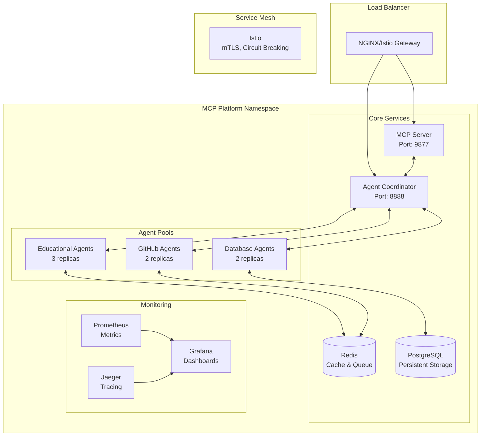

# MCP-Agent Docker Integration Implementation Guide

## Overview

This document provides a comprehensive implementation plan for integrating Model Context Protocol (MCP) configuration with AI agents in Docker containers. The solution transforms the existing embedded agent architecture into a distributed, scalable, containerized system.

## Architecture Overview

### Current State Analysis
- **Existing**: Agents embedded in FastAPI backend
- **Challenge**: Limited scalability, resource contention, complex debugging
- **Solution**: Dedicated agent containers with MCP orchestration

### New Architecture Components



## Implementation Components

### 1. Docker Compose Configuration

**File**: `infrastructure/docker/docker-compose.prod.yml`

**Key Services Added**:
- **MCP Server**: Model Context Protocol coordinator
- **Agent Coordinator**: Central orchestration service
- **Educational Agents**: Content generation pool
- **GitHub Agents**: CI/CD integration pool
- **Database Agents**: Data management pool

**Service Dependencies**:
```yaml
mcp-server:
  depends_on:
    - postgres
    - redis
  networks:
    - toolboxai_network
    - mcp_network

agent-coordinator:
  depends_on:
    - mcp-server
  networks:
    - toolboxai_network
    - mcp_network
```

### 2. MCP Configuration

**File**: `config/mcp-servers.json`

**Core Configuration Sections**:

```json
{
  "mcpServers": {
    "orchestrator": {
      "configuration": {
        "taskQueue": {
          "maxRetries": 3,
          "retryDelay": 5000,
          "taskTimeout": 300000
        },
        "agents": {
          "discovery": {
            "enabled": true,
            "interval": 30000
          },
          "healthCheck": {
            "enabled": true,
            "interval": 60000
          }
        }
      }
    }
  }
}
```

**Key Features**:
- **Service Discovery**: Automatic agent registration
- **Health Monitoring**: Continuous agent health checks
- **Load Balancing**: Round-robin task distribution
- **Fault Tolerance**: Retry policies and circuit breakers

### 3. Docker Images

#### MCP Server (`mcp-server.Dockerfile`)
```dockerfile
FROM python:3.12-slim as production
# Multi-stage build for optimized image size
# Non-root user for security
# Health checks for container orchestration
```

**Key Features**:
- Multi-stage build for optimization
- Non-root execution for security
- Built-in health checks
- WebSocket support for MCP protocol

#### Agent Coordinator (`agent-coordinator.Dockerfile`)
```dockerfile
# Central orchestration service
# Manages agent lifecycle and task distribution
# HTTP API for external integration
```

#### Agent Pool Images
- **Educational Agents**: Content generation specialists
- **GitHub Agents**: CI/CD and repository management
- **Database Agents**: Data operations and backup management

### 4. Kubernetes Deployment

**File**: `infrastructure/kubernetes/apps/mcp/enhanced-agents-deployment.yaml`

#### Core Components

**MCP Server StatefulSet**:
```yaml
apiVersion: apps/v1
kind: StatefulSet
metadata:
  name: mcp-server-enhanced
spec:
  replicas: 3
  podManagementPolicy: Parallel
  # Persistent storage for context data
  # Anti-affinity for high availability
```

**Agent Coordinator Deployment**:
```yaml
apiVersion: apps/v1
kind: Deployment
metadata:
  name: agent-coordinator
spec:
  replicas: 1  # Single coordinator instance
  strategy:
    type: RollingUpdate
    rollingUpdate:
      maxUnavailable: 0
      maxSurge: 1
```

**Agent Pool Deployments**:
- **Educational Agents**: 3 replicas with autoscaling
- **GitHub Agents**: 2 replicas with burst capability
- **Database Agents**: 2 replicas with backup storage

#### Security Configuration

**Network Policies**:
```yaml
apiVersion: networking.k8s.io/v1
kind: NetworkPolicy
metadata:
  name: mcp-platform-network-policy
spec:
  # Restrict ingress/egress traffic
  # Allow only necessary service communication
```

**RBAC Configuration**:
```yaml
# Service accounts with minimal required permissions
# ClusterRoles for specific component needs
# ClusterRoleBindings for secure access
```

### 5. Service Discovery and Communication

#### Agent Registration Process

```python
# Agent Pool Registration
async def _register_with_mcp(self):
    registration_data = {
        "pool_id": self.pool_id,
        "agent_type": "educational",
        "capabilities": ["content-generation", "assessment-design"],
        "endpoint": f"http://educational-agents:{AGENT_PORT}",
        "health_endpoint": f"http://educational-agents:{AGENT_PORT}/health"
    }

    # Store in Redis for MCP discovery
    await self.redis_client.hset(
        "mcp:agent_pools",
        self.pool_id,
        json.dumps(registration_data, default=str)
    )
```

#### Health Check Implementation

```python
# Continuous health monitoring
async def _agent_health_monitor(self):
    while self.running:
        for agent_id, agent in self.agents.items():
            if agent.status.value == "error":
                logger.warning(f"Agent {agent_id} in error state, resetting")
                agent.reset()
        await asyncio.sleep(30)
```

### 6. Environment Configuration

**File**: `config/environments/.env.prod`

**Key Configuration Categories**:

```bash
# MCP Server Configuration
MCP_HOST=0.0.0.0
MCP_PORT=9876
MCP_SERVER_URL=ws://mcp-server:9876
MCP_MAX_CONCURRENT_TASKS=50

# Agent Coordinator Configuration
COORDINATOR_PORT=8888
MAX_CONCURRENT_AGENTS=10
AGENT_HEALTH_CHECK_INTERVAL=30

# Security Configuration
JWT_SECRET_KEY=${JWT_SECRET_KEY}
RATE_LIMIT_MAX_REQUESTS=1000

# Scaling Configuration
AUTO_SCALING_ENABLED=true
MIN_REPLICAS=1
MAX_REPLICAS=10
TARGET_CPU_PERCENTAGE=70
```

### 7. Monitoring and Observability

#### Prometheus Metrics

**ServiceMonitor Configuration**:
```yaml
apiVersion: monitoring.coreos.com/v1
kind: ServiceMonitor
metadata:
  name: mcp-platform-monitor
spec:
  selector:
    matchLabels:
      app: mcp-server
  endpoints:
  - port: metrics
    path: /metrics
    interval: 30s
```

**Custom Metrics**:
- Agent pool utilization
- Task completion rates
- Error rates and types
- Response times
- Queue depths

#### Alerting Rules

```yaml
# Critical alerts for system health
- alert: MCPServerDown
  expr: up{job="mcp-server"} == 0
  for: 1m
  labels:
    severity: critical

- alert: AgentCoordinatorTaskQueueFull
  expr: agent_coordinator_task_queue_size > 900
  for: 2m
  labels:
    severity: warning
```

### 8. Service Mesh Integration

#### Istio Configuration

**VirtualService**:
```yaml
apiVersion: networking.istio.io/v1beta1
kind: VirtualService
metadata:
  name: mcp-platform-vs
spec:
  hosts:
  - mcp-platform.toolboxai.solutions
  http:
  - match:
    - uri:
        prefix: "/mcp"
    route:
    - destination:
        host: mcp-server.mcp-platform.svc.cluster.local
    timeout: 30s
    retries:
      attempts: 3
```

**Circuit Breaking**:
```yaml
apiVersion: networking.istio.io/v1beta1
kind: DestinationRule
metadata:
  name: educational-agents-dr
spec:
  trafficPolicy:
    connectionPool:
      tcp:
        maxConnections: 50
      http:
        consecutiveGatewayErrors: 3
    outlierDetection:
      consecutiveGatewayErrors: 2
      interval: 15s
```

### 9. Custom Resource Definitions

#### MCPServer CRD

```yaml
apiVersion: apiextensions.k8s.io/v1
kind: CustomResourceDefinition
metadata:
  name: mcpservers.toolboxai.io
spec:
  group: toolboxai.io
  versions:
  - name: v1
    schema:
      openAPIV3Schema:
        type: object
        properties:
          spec:
            properties:
              serverType:
                type: string
                enum: ["orchestrator", "content", "integration"]
              replicas:
                type: integer
                minimum: 1
                maximum: 10
```

#### AgentPool CRD

```yaml
apiVersion: toolboxai.io/v1
kind: AgentPool
metadata:
  name: educational-content-pool
spec:
  agentType: educational
  poolSize: 5
  capabilities:
    - content-generation
    - curriculum-alignment
  autoscaling:
    enabled: true
    minReplicas: 2
    maxReplicas: 10
```

## Deployment Process

### 1. Prerequisites

```bash
# Required tools
- kubectl (Kubernetes CLI)
- docker (Container runtime)
- helm (Package manager - optional)

# Required credentials
- GitHub Container Registry access
- Kubernetes cluster access
- OpenAI API key
```

### 2. Deployment Script

**File**: `scripts/deploy-mcp-agents.sh`

```bash
# Full deployment
./scripts/deploy-mcp-agents.sh deploy

# Build images only
./scripts/deploy-mcp-agents.sh build

# Verify deployment
./scripts/deploy-mcp-agents.sh verify

# Cleanup
./scripts/deploy-mcp-agents.sh cleanup
```

### 3. Deployment Steps

1. **Build Docker Images**
   ```bash
   docker build -f infrastructure/docker/mcp-server.Dockerfile -t ghcr.io/toolboxai-solutions/mcp-server:latest .
   ```

2. **Push to Registry**
   ```bash
   docker push ghcr.io/toolboxai-solutions/mcp-server:latest
   ```

3. **Deploy to Kubernetes**
   ```bash
   kubectl apply -f infrastructure/kubernetes/apps/mcp/
   ```

4. **Verify Deployment**
   ```bash
   kubectl get pods -n mcp-platform
   kubectl logs -n mcp-platform -l app=mcp-server
   ```

## Security Considerations

### 1. Container Security

- **Non-root execution**: All containers run as non-root users
- **Read-only file systems**: Where possible
- **Resource limits**: CPU and memory constraints
- **Security contexts**: Restricted capabilities

### 2. Network Security

- **Network policies**: Restrict inter-pod communication
- **mTLS**: Service-to-service encryption with Istio
- **JWT authentication**: Secure API access
- **Rate limiting**: Prevent abuse

### 3. Secret Management

- **Kubernetes secrets**: For sensitive configuration
- **Secret rotation**: Automated credential updates
- **Least privilege**: Minimal required permissions

## Performance Optimization

### 1. Resource Management

```yaml
resources:
  requests:
    memory: "1Gi"
    cpu: "500m"
  limits:
    memory: "2Gi"
    cpu: "1000m"
```

### 2. Autoscaling

```yaml
# Horizontal Pod Autoscaler
spec:
  minReplicas: 2
  maxReplicas: 10
  metrics:
  - type: Resource
    resource:
      name: cpu
      target:
        type: Utilization
        averageUtilization: 70
```

### 3. Load Balancing

- **Round-robin**: Default for most services
- **Least connections**: For compute-intensive tasks
- **Session affinity**: When required

## Troubleshooting Guide

### 1. Common Issues

**MCP Server Connection Issues**:
```bash
# Check WebSocket connectivity
kubectl exec -n mcp-platform deployment/mcp-server -- python -c "import asyncio, websockets; asyncio.run(websockets.connect('ws://localhost:9876/health'))"
```

**Agent Registration Problems**:
```bash
# Check Redis connectivity
kubectl exec -n mcp-platform deployment/agent-coordinator -- redis-cli -h redis ping
```

**High Memory Usage**:
```bash
# Check resource usage
kubectl top pods -n mcp-platform
kubectl describe pod -n mcp-platform <pod-name>
```

### 2. Monitoring Commands

```bash
# View logs
kubectl logs -n mcp-platform -l app=mcp-server -f

# Check events
kubectl get events -n mcp-platform --sort-by='.lastTimestamp'

# Port forwarding for debugging
kubectl port-forward -n mcp-platform service/mcp-server 9876:9876
```

## Migration Strategy

### 1. Phased Rollout

1. **Phase 1**: Deploy MCP infrastructure alongside existing system
2. **Phase 2**: Migrate educational agents to containers
3. **Phase 3**: Migrate remaining agent types
4. **Phase 4**: Decommission embedded agents

### 2. Rollback Plan

```bash
# Emergency rollback
kubectl rollout undo deployment/educational-agents -n mcp-platform

# Complete rollback
./scripts/deploy-mcp-agents.sh cleanup all
```

## Future Enhancements

### 1. Advanced Features

- **Multi-cluster deployment**: Cross-region agent pools
- **GPU acceleration**: For AI-intensive tasks
- **Event sourcing**: Complete audit trail
- **Advanced routing**: Intelligent task distribution

### 2. Integration Opportunities

- **Argo Workflows**: Complex workflow orchestration
- **Knative**: Serverless agent execution
- **Service mesh**: Advanced traffic management
- **GitOps**: Automated deployment workflows

## Conclusion

This implementation provides a robust, scalable foundation for MCP-Agent integration with Docker and Kubernetes. The architecture supports:

- **High availability**: Multiple replicas with health checks
- **Scalability**: Horizontal pod autoscaling
- **Security**: Comprehensive security controls
- **Observability**: Full monitoring and tracing
- **Maintainability**: Clear separation of concerns

The solution transforms the existing monolithic agent architecture into a distributed, cloud-native system capable of handling production workloads at scale.
