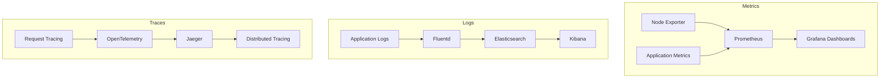

# 📊 Infrastructure Monitoring & Observability 2025

## Overview

This document outlines the comprehensive monitoring and observability strategy for the ToolboxAI Solutions infrastructure, implementing 2025 best practices for monitoring, logging, tracing, and alerting.

## 🎯 Monitoring Strategy

### Three Pillars of Observability



### Monitoring Stack Architecture

| Component | Purpose | Technology | Port |
|-----------|---------|------------|------|
| Metrics Collection | Prometheus | Prometheus | 9090 |
| Metrics Visualization | Grafana | Grafana | 3000 |
| Log Collection | Fluentd | Fluentd | 24224 |
| Log Storage | Elasticsearch | Elasticsearch | 9200 |
| Log Visualization | Kibana | Kibana | 5601 |
| Distributed Tracing | Jaeger | Jaeger | 16686 |
| Alerting | AlertManager | AlertManager | 9093 |

## 📈 Metrics Collection

### Prometheus Configuration

```yaml
# prometheus.yml
global:
  scrape_interval: 15s
  evaluation_interval: 15s
  external_labels:
    cluster: 'toolboxai-production'
    environment: 'production'

rule_files:
  - "rules/*.yml"

alerting:
  alertmanagers:
    - static_configs:
        - targets:
          - alertmanager:9093

scrape_configs:
  # Kubernetes API Server
  - job_name: 'kubernetes-apiservers'
    kubernetes_sd_configs:
    - role: endpoints
    scheme: https
    tls_config:
      ca_file: /var/run/secrets/kubernetes.io/serviceaccount/ca.crt
    bearer_token_file: /var/run/secrets/kubernetes.io/serviceaccount/token
    relabel_configs:
    - source_labels: [__meta_kubernetes_namespace, __meta_kubernetes_service_name, __meta_kubernetes_endpoint_port_name]
      action: keep
      regex: default;kubernetes;https

  # Kubernetes Nodes
  - job_name: 'kubernetes-nodes'
    kubernetes_sd_configs:
    - role: node
    scheme: https
    tls_config:
      ca_file: /var/run/secrets/kubernetes.io/serviceaccount/ca.crt
    bearer_token_file: /var/run/secrets/kubernetes.io/serviceaccount/token
    relabel_configs:
    - action: labelmap
      regex: __meta_kubernetes_node_label_(.+)
    - target_label: __address__
      replacement: kubernetes.default.svc:443
    - source_labels: [__meta_kubernetes_node_name]
      regex: (.+)
      target_label: __metrics_path__
      replacement: /api/v1/nodes/${1}/proxy/metrics

  # Kubernetes Pods
  - job_name: 'kubernetes-pods'
    kubernetes_sd_configs:
    - role: pod
    relabel_configs:
    - source_labels: [__meta_kubernetes_pod_annotation_prometheus_io_scrape]
      action: keep
      regex: true
    - source_labels: [__meta_kubernetes_pod_annotation_prometheus_io_path]
      action: replace
      target_label: __metrics_path__
      regex: (.+)
    - source_labels: [__address__, __meta_kubernetes_pod_annotation_prometheus_io_port]
      action: replace
      regex: ([^:]+)(?::\d+)?;(\d+)
      replacement: $1:$2
      target_label: __address__
    - action: labelmap
      regex: __meta_kubernetes_pod_label_(.+)
    - source_labels: [__meta_kubernetes_namespace]
      action: replace
      target_label: kubernetes_namespace
    - source_labels: [__meta_kubernetes_pod_name]
      action: replace
      target_label: kubernetes_pod_name

  # FastAPI Backend
  - job_name: 'fastapi-backend'
    static_configs:
    - targets: ['fastapi-main:8008']
    metrics_path: /metrics
    scrape_interval: 30s

  # PostgreSQL
  - job_name: 'postgres'
    static_configs:
    - targets: ['postgres-exporter:9187']
    scrape_interval: 30s

  # Redis
  - job_name: 'redis'
    static_configs:
    - targets: ['redis-exporter:9121']
    scrape_interval: 30s
```

### Custom Metrics

```python
# Application metrics collection
from prometheus_client import Counter, Histogram, Gauge, start_http_server
import time

# Request metrics
REQUEST_COUNT = Counter('http_requests_total', 'Total HTTP requests', ['method', 'endpoint', 'status'])
REQUEST_DURATION = Histogram('http_request_duration_seconds', 'HTTP request duration', ['method', 'endpoint'])
ACTIVE_CONNECTIONS = Gauge('active_connections', 'Number of active connections')

# Database metrics
DB_QUERY_DURATION = Histogram('db_query_duration_seconds', 'Database query duration', ['query_type'])
DB_CONNECTIONS = Gauge('db_connections', 'Number of database connections')

# Business metrics
USER_SESSIONS = Gauge('user_sessions_active', 'Number of active user sessions')
CONTENT_GENERATED = Counter('content_generated_total', 'Total content generated', ['content_type'])
QUIZ_COMPLETED = Counter('quiz_completed_total', 'Total quizzes completed', ['difficulty'])

def track_request(func):
    def wrapper(*args, **kwargs):
        start_time = time.time()
        try:
            result = func(*args, **kwargs)
            REQUEST_COUNT.labels(method='GET', endpoint=func.__name__, status='200').inc()
            return result
        except Exception as e:
            REQUEST_COUNT.labels(method='GET', endpoint=func.__name__, status='500').inc()
            raise
        finally:
            REQUEST_DURATION.labels(method='GET', endpoint=func.__name__).observe(time.time() - start_time)
    return wrapper
```

## 📝 Logging Strategy

### Log Collection with Fluentd

```yaml
# fluentd-config.yaml
apiVersion: v1
kind: ConfigMap
metadata:
  name: fluentd-config
  namespace: toolboxai-production
data:
  fluent.conf: |
    <source>
      @type tail
      path /var/log/containers/*.log
      pos_file /var/log/fluentd-containers.log.pos
      tag kubernetes.*
      format json
      time_key time
      time_format %Y-%m-%dT%H:%M:%S.%NZ
    </source>

    <filter kubernetes.**>
      @type kubernetes_metadata
      @id filter_kube_metadata
      kubernetes_url "#{ENV['FLUENT_FILTER_KUBERNETES_URL'] || 'https://' + ENV['KUBERNETES_SERVICE_HOST'] + ':' + ENV['KUBERNETES_SERVICE_PORT'] + '/api'}"
      verify_ssl "#{ENV['KUBERNETES_VERIFY_SSL'] || true}"
      ca_file "#{ENV['KUBERNETES_CA_FILE']}"
    </filter>

    <filter kubernetes.**>
      @type parser
      key_name log
      reserve_data true
      <parse>
        @type json
      </parse>
    </filter>

    <match kubernetes.**>
      @type elasticsearch
      host elasticsearch.logging.svc.cluster.local
      port 9200
      index_name toolboxai-logs
      type_name _doc
      include_tag_key true
      tag_key @log_name
      flush_interval 1s
      <buffer>
        @type file
        path /var/log/fluentd-buffers/kubernetes.system.buffer
        flush_mode interval
        retry_type exponential_backoff
        flush_thread_count 2
        flush_interval 5s
        retry_forever
        retry_max_interval 30
        chunk_limit_size 2M
        queue_limit_length 8
        overflow_action block
      </buffer>
    </match>
```

### Application Logging

```python
# Structured logging configuration
import logging
import json
from datetime import datetime
from pythonjsonlogger import jsonlogger

class CustomJSONFormatter(jsonlogger.JsonFormatter):
    def add_fields(self, log_record, record, message_dict):
        super().add_fields(log_record, record, message_dict)
        if not log_record.get('timestamp'):
            log_record['timestamp'] = datetime.utcnow().isoformat()
        if not log_record.get('level'):
            log_record['level'] = record.levelname
        if not log_record.get('logger'):
            log_record['logger'] = record.name

# Configure logging
def setup_logging():
    logger = logging.getLogger()
    logger.setLevel(logging.INFO)

    handler = logging.StreamHandler()
    formatter = CustomJSONFormatter('%(timestamp)s %(level)s %(name)s %(message)s')
    handler.setFormatter(formatter)
    logger.addHandler(handler)

    return logger

# Usage
logger = setup_logging()

# Structured logging
logger.info("User login", extra={
    "user_id": "12345",
    "ip_address": "192.168.1.1",
    "user_agent": "Mozilla/5.0...",
    "session_id": "sess_abc123"
})

logger.error("Database connection failed", extra={
    "error": "Connection timeout",
    "database": "postgresql",
    "retry_count": 3,
    "duration_ms": 5000
})
```

## 🔍 Distributed Tracing

### Jaeger Configuration

```yaml
# jaeger-deployment.yaml
apiVersion: apps/v1
kind: Deployment
metadata:
  name: jaeger
  namespace: toolboxai-production
spec:
  replicas: 1
  selector:
    matchLabels:
      app: jaeger
  template:
    metadata:
      labels:
        app: jaeger
    spec:
      containers:
      - name: jaeger
        image: jaegertracing/all-in-one:latest
        ports:
        - containerPort: 16686
          name: ui
        - containerPort: 14268
          name: http
        env:
        - name: COLLECTOR_OTLP_ENABLED
          value: "true"
        resources:
          requests:
            cpu: 100m
            memory: 128Mi
          limits:
            cpu: 500m
            memory: 512Mi
```

### OpenTelemetry Instrumentation

```python
# OpenTelemetry configuration
from opentelemetry import trace
from opentelemetry.exporter.jaeger.thrift import JaegerExporter
from opentelemetry.sdk.trace import TracerProvider
from opentelemetry.sdk.trace.export import BatchSpanProcessor
from opentelemetry.instrumentation.fastapi import FastAPIInstrumentor
from opentelemetry.instrumentation.requests import RequestsInstrumentor
from opentelemetry.instrumentation.psycopg2 import Psycopg2Instrumentor

def setup_tracing():
    # Configure tracer provider
    trace.set_tracer_provider(TracerProvider())
    tracer = trace.get_tracer(__name__)

    # Configure Jaeger exporter
    jaeger_exporter = JaegerExporter(
        agent_host_name="jaeger-agent",
        agent_port=6831,
    )

    # Add span processor
    span_processor = BatchSpanProcessor(jaeger_exporter)
    trace.get_tracer_provider().add_span_processor(span_processor)

    # Instrument libraries
    FastAPIInstrumentor.instrument_app(app)
    RequestsInstrumentor().instrument()
    Psycopg2Instrumentor().instrument()

    return tracer

# Usage
tracer = setup_tracing()

@tracer.start_as_current_span("process_user_request")
def process_user_request(user_id: str, request_data: dict):
    with tracer.start_as_current_span("validate_input"):
        validate_input(request_data)

    with tracer.start_as_current_span("database_query"):
        result = database.query("SELECT * FROM users WHERE id = %s", (user_id,))

    with tracer.start_as_current_span("generate_response"):
        response = generate_response(result)

    return response
```

## 🚨 Alerting Strategy

### Alert Rules

```yaml
# alert-rules.yaml
groups:
- name: toolboxai.rules
  rules:
  # High error rate
  - alert: HighErrorRate
    expr: rate(http_requests_total{status=~"5.."}[5m]) > 0.1
    for: 5m
    labels:
      severity: critical
      service: backend
    annotations:
      summary: "High error rate detected"
      description: "Error rate is {{ $value }} errors per second"
      runbook_url: "https://docs.toolboxai.com/runbooks/high-error-rate"

  # High response time
  - alert: HighResponseTime
    expr: histogram_quantile(0.95, rate(http_request_duration_seconds_bucket[5m])) > 1
    for: 5m
    labels:
      severity: warning
      service: backend
    annotations:
      summary: "High response time detected"
      description: "95th percentile response time is {{ $value }} seconds"

  # High memory usage
  - alert: HighMemoryUsage
    expr: (container_memory_usage_bytes / container_spec_memory_limit_bytes) > 0.8
    for: 5m
    labels:
      severity: warning
      service: backend
    annotations:
      summary: "High memory usage detected"
      description: "Memory usage is {{ $value }}% of limit"

  # Database connection issues
  - alert: DatabaseConnectionFailed
    expr: up{job="postgres"} == 0
    for: 1m
    labels:
      severity: critical
      service: database
    annotations:
      summary: "Database connection failed"
      description: "PostgreSQL database is not responding"

  # Redis connection issues
  - alert: RedisConnectionFailed
    expr: up{job="redis"} == 0
    for: 1m
    labels:
      severity: critical
      service: cache
    annotations:
      summary: "Redis connection failed"
      description: "Redis cache is not responding"

  # Disk space low
  - alert: DiskSpaceLow
    expr: (node_filesystem_avail_bytes / node_filesystem_size_bytes) < 0.1
    for: 5m
    labels:
      severity: warning
      service: infrastructure
    annotations:
      summary: "Disk space low"
      description: "Disk space is {{ $value }}% available"

  # Pod restart frequency
  - alert: PodRestartFrequency
    expr: rate(kube_pod_container_status_restarts_total[15m]) > 0.1
    for: 5m
    labels:
      severity: warning
      service: kubernetes
    annotations:
      summary: "Pod restart frequency high"
      description: "Pod {{ $labels.pod }} is restarting frequently"
```

### AlertManager Configuration

```yaml
# alertmanager.yml
global:
  smtp_smarthost: 'smtp.gmail.com:587'
  smtp_from: 'alerts@toolboxai.com'
  smtp_auth_username: 'alerts@toolboxai.com'
  smtp_auth_password: 'your-app-password'

route:
  group_by: ['alertname', 'service']
  group_wait: 10s
  group_interval: 10s
  repeat_interval: 1h
  receiver: 'web.hook'
  routes:
  - match:
      severity: critical
    receiver: 'critical-alerts'
  - match:
      severity: warning
    receiver: 'warning-alerts'

receivers:
- name: 'web.hook'
  webhook_configs:
  - url: 'http://webhook:5001/'

- name: 'critical-alerts'
  email_configs:
  - to: 'oncall@toolboxai.com'
    subject: 'CRITICAL: {{ .GroupLabels.alertname }}'
    body: |
      {{ range .Alerts }}
      Alert: {{ .Annotations.summary }}
      Description: {{ .Annotations.description }}
      {{ end }}
  slack_configs:
  - api_url: 'https://hooks.slack.com/services/YOUR/SLACK/WEBHOOK'
    channel: '#alerts-critical'
    title: 'Critical Alert'
    text: '{{ range .Alerts }}{{ .Annotations.summary }}{{ end }}'

- name: 'warning-alerts'
  email_configs:
  - to: 'devops@toolboxai.com'
    subject: 'WARNING: {{ .GroupLabels.alertname }}'
    body: |
      {{ range .Alerts }}
      Alert: {{ .Annotations.summary }}
      Description: {{ .Annotations.description }}
      {{ end }}
```

## 📊 Dashboards

### Grafana Dashboard Configuration

```json
{
  "dashboard": {
    "id": null,
    "title": "ToolboxAI Production Dashboard",
    "tags": ["toolboxai", "production"],
    "timezone": "browser",
    "panels": [
      {
        "id": 1,
        "title": "Request Rate",
        "type": "graph",
        "targets": [
          {
            "expr": "rate(http_requests_total[5m])",
            "legendFormat": "{{method}} {{endpoint}}"
          }
        ],
        "yAxes": [
          {
            "label": "Requests/sec"
          }
        ]
      },
      {
        "id": 2,
        "title": "Error Rate",
        "type": "graph",
        "targets": [
          {
            "expr": "rate(http_requests_total{status=~\"5..\"}[5m])",
            "legendFormat": "5xx errors"
          }
        ],
        "yAxes": [
          {
            "label": "Errors/sec"
          }
        ]
      },
      {
        "id": 3,
        "title": "Response Time",
        "type": "graph",
        "targets": [
          {
            "expr": "histogram_quantile(0.95, rate(http_request_duration_seconds_bucket[5m]))",
            "legendFormat": "95th percentile"
          },
          {
            "expr": "histogram_quantile(0.50, rate(http_request_duration_seconds_bucket[5m]))",
            "legendFormat": "50th percentile"
          }
        ],
        "yAxes": [
          {
            "label": "Seconds"
          }
        ]
      },
      {
        "id": 4,
        "title": "CPU Usage",
        "type": "graph",
        "targets": [
          {
            "expr": "rate(container_cpu_usage_seconds_total[5m])",
            "legendFormat": "{{pod}}"
          }
        ],
        "yAxes": [
          {
            "label": "CPU cores"
          }
        ]
      },
      {
        "id": 5,
        "title": "Memory Usage",
        "type": "graph",
        "targets": [
          {
            "expr": "container_memory_usage_bytes",
            "legendFormat": "{{pod}}"
          }
        ],
        "yAxes": [
          {
            "label": "Bytes"
          }
        ]
      }
    ],
    "time": {
      "from": "now-1h",
      "to": "now"
    },
    "refresh": "30s"
  }
}
```

## 🔧 Troubleshooting

### Common Monitoring Issues

#### Prometheus Not Scraping

```bash
# Check Prometheus targets
kubectl port-forward svc/prometheus 9090:9090 -n monitoring
# Open http://localhost:9090/targets

# Check service discovery
kubectl get endpoints -n toolboxai-production
kubectl get services -n toolboxai-production
```

#### Logs Not Appearing

```bash
# Check Fluentd logs
kubectl logs -f deployment/fluentd -n logging

# Check Elasticsearch
kubectl port-forward svc/elasticsearch 9200:9200 -n logging
curl http://localhost:9200/_cluster/health
```

#### Alerts Not Firing

```bash
# Check AlertManager
kubectl port-forward svc/alertmanager 9093:9093 -n monitoring
# Open http://localhost:9093

# Check alert rules
kubectl get configmap -n monitoring
kubectl describe configmap prometheus-config -n monitoring
```

### Performance Optimization

#### Prometheus Optimization

```yaml
# Prometheus resource optimization
apiVersion: apps/v1
kind: StatefulSet
metadata:
  name: prometheus
spec:
  template:
    spec:
      containers:
      - name: prometheus
        resources:
          requests:
            cpu: 500m
            memory: 2Gi
          limits:
            cpu: 2000m
            memory: 8Gi
        args:
        - --storage.tsdb.retention.time=30d
        - --storage.tsdb.retention.size=10GB
        - --web.enable-lifecycle
        - --web.enable-admin-api
```

#### Elasticsearch Optimization

```yaml
# Elasticsearch cluster optimization
apiVersion: apps/v1
kind: StatefulSet
metadata:
  name: elasticsearch
spec:
  template:
    spec:
      containers:
      - name: elasticsearch
        env:
        - name: ES_JAVA_OPTS
          value: "-Xms2g -Xmx2g"
        - name: discovery.type
          value: "single-node"
        resources:
          requests:
            cpu: 1000m
            memory: 4Gi
          limits:
            cpu: 2000m
            memory: 8Gi
```

## 📋 Maintenance Procedures

### Daily Monitoring Tasks

1. **Check Alert Status**
   - Review active alerts
   - Investigate critical alerts
   - Update alert runbooks

2. **Review Metrics**
   - Check system performance
   - Review application metrics
   - Analyze trends

3. **Log Analysis**
   - Review error logs
   - Check for security issues
   - Monitor user activity

### Weekly Monitoring Tasks

1. **Dashboard Review**
   - Update dashboards
   - Add new metrics
   - Remove unused panels

2. **Alert Tuning**
   - Adjust alert thresholds
   - Add new alert rules
   - Remove false positives

3. **Capacity Planning**
   - Review resource usage
   - Plan for scaling
   - Update capacity models

### Monthly Monitoring Tasks

1. **Performance Analysis**
   - Analyze performance trends
   - Identify optimization opportunities
   - Update performance baselines

2. **Security Review**
   - Review security logs
   - Check for anomalies
   - Update security policies

3. **Documentation Update**
   - Update runbooks
   - Document new procedures
   - Review monitoring strategy

---

*Last Updated: 2025-09-14*
*Version: 2.0.0*
*Compliance: COPPA, FERPA, GDPR, SOC 2 Type 2*
