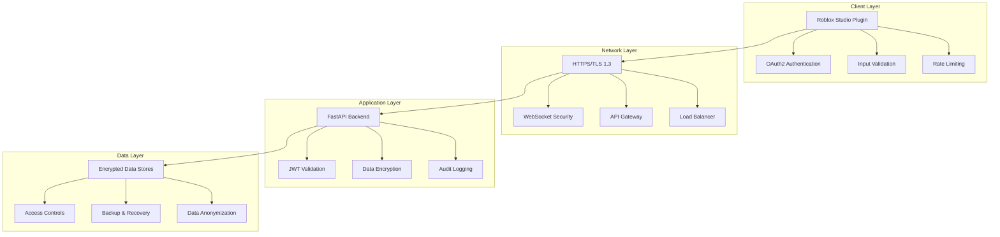

# 🔒 Roblox Security & Compliance 2025

## Overview

This document outlines the comprehensive security measures and compliance requirements for the ToolboxAI Roblox integration, ensuring adherence to 2025 standards and regulations.

## 🛡️ Security Architecture

### Multi-Layer Security Model



## 🔐 Authentication & Authorization

### OAuth2 Implementation

#### Client Credentials Flow

```lua
-- OAuth2Client.lua
local OAuth2Client = {}
OAuth2Client.__index = OAuth2Client

function OAuth2Client.new(clientId, clientSecret)
    local self = setmetatable({}, OAuth2Client)
    self.clientId = clientId
    self.clientSecret = clientSecret
    self.tokenEndpoint = "https://apis.roblox.com/oauth/v1/token"
    self.accessToken = nil
    self.refreshToken = nil
    self.tokenExpiry = 0
    return self
end

function OAuth2Client:GetAccessToken()
    -- Check if token is still valid
    if self.accessToken and tick() < self.tokenExpiry then
        return self.accessToken
    end

    -- Request new token
    local success, response = pcall(function()
        return HttpService:RequestAsync({
            Url = self.tokenEndpoint,
            Method = "POST",
            Headers = {
                ["Content-Type"] = "application/x-www-form-urlencoded"
            },
            Body = "grant_type=client_credentials&client_id=" .. self.clientId .. "&client_secret=" .. self.clientSecret
        })
    end)

    if success and response.Success then
        local data = HttpService:JSONDecode(response.Body)
        self.accessToken = data.access_token
        self.refreshToken = data.refresh_token
        self.tokenExpiry = tick() + data.expires_in
        return self.accessToken
    else
        warn("Failed to get access token:", response.Body)
        return nil
    end
end
```

#### Authorization Code Flow

```lua
function OAuth2Client:GetAuthorizationUrl(redirectUri, scope)
    local state = HttpService:GenerateGUID(false)
    local params = {
        response_type = "code",
        client_id = self.clientId,
        redirect_uri = redirectUri,
        scope = scope or "openid profile",
        state = state
    }

    local queryString = ""
    for key, value in pairs(params) do
        queryString = queryString .. key .. "=" .. value .. "&"
    end

    return "https://authorize.roblox.com/v1/authorize?" .. queryString:sub(1, -2), state
end

function OAuth2Client:ExchangeCodeForToken(code, redirectUri)
    local success, response = pcall(function()
        return HttpService:RequestAsync({
            Url = self.tokenEndpoint,
            Method = "POST",
            Headers = {
                ["Content-Type"] = "application/x-www-form-urlencoded"
            },
            Body = "grant_type=authorization_code&client_id=" .. self.clientId .. "&client_secret=" .. self.clientSecret .. "&code=" .. code .. "&redirect_uri=" .. redirectUri
        })
    end)

    if success and response.Success then
        local data = HttpService:JSONDecode(response.Body)
        self.accessToken = data.access_token
        self.refreshToken = data.refresh_token
        self.tokenExpiry = tick() + data.expires_in
        return true
    else
        warn("Failed to exchange code for token:", response.Body)
        return false
    end
end
```

### JWT Token Validation

```lua
-- JWTValidator.lua
local JWTValidator = {}
JWTValidator.__index = JWTValidator

function JWTValidator.new(secretKey)
    local self = setmetatable({}, JWTValidator)
    self.secretKey = secretKey
    return self
end

function JWTValidator:ValidateToken(token)
    local parts = token:split(".")
    if #parts ~= 3 then
        return false, "Invalid token format"
    end

    local header = self:Base64Decode(parts[1])
    local payload = self:Base64Decode(parts[2])
    local signature = parts[3]

    -- Validate signature
    local expectedSignature = self:Sign(parts[1] .. "." .. parts[2])
    if signature ~= expectedSignature then
        return false, "Invalid signature"
    end

    -- Parse payload
    local success, data = pcall(function()
        return HttpService:JSONDecode(payload)
    end)

    if not success then
        return false, "Invalid payload"
    end

    -- Check expiration
    if data.exp and os.time() > data.exp then
        return false, "Token expired"
    end

    return true, data
end
```

## 🛡️ Data Protection

### Encryption at Rest

```lua
-- DataEncryption.lua
local DataEncryption = {}
DataEncryption.__index = DataEncryption

function DataEncryption.new(encryptionKey)
    local self = setmetatable({}, DataEncryption)
    self.encryptionKey = encryptionKey
    return self
end

function DataEncryption:EncryptData(data)
    local jsonData = HttpService:JSONEncode(data)
    local encrypted = self:XOREncrypt(jsonData, self.encryptionKey)
    return self:Base64Encode(encrypted)
end

function DataEncryption:DecryptData(encryptedData)
    local decoded = self:Base64Decode(encryptedData)
    local decrypted = self:XORDecrypt(decoded, self.encryptionKey)
    return HttpService:JSONDecode(decrypted)
end

function DataEncryption:XOREncrypt(data, key)
    local result = ""
    local keyIndex = 1

    for i = 1, #data do
        local char = string.byte(data, i)
        local keyChar = string.byte(key, keyIndex)
        local encryptedChar = char ~ keyChar
        result = result .. string.char(encryptedChar)

        keyIndex = keyIndex + 1
        if keyIndex > #key then
            keyIndex = 1
        end
    end

    return result
end
```

### Encryption in Transit

```lua
-- SecureHTTPClient.lua
local SecureHTTPClient = {}
SecureHTTPClient.__index = SecureHTTPClient

function SecureHTTPClient.new()
    local self = setmetatable({}, SecureHTTPClient)
    self.baseUrl = "https://api.toolboxai.com"
    self.timeout = 30
    return self
end

function SecureHTTPClient:SecureRequest(endpoint, method, data, headers)
    local url = self.baseUrl .. endpoint
    local requestHeaders = {
        ["Content-Type"] = "application/json",
        ["User-Agent"] = "ToolboxAI-Plugin/2.0.0",
        ["X-Request-ID"] = HttpService:GenerateGUID(false)
    }

    -- Add custom headers
    if headers then
        for key, value in pairs(headers) do
            requestHeaders[key] = value
        end
    end

    local requestData = {
        Url = url,
        Method = method or "GET",
        Headers = requestHeaders,
        Body = data and HttpService:JSONEncode(data) or nil
    }

    local success, response = pcall(function()
        return HttpService:RequestAsync(requestData)
    end)

    if success and response.Success then
        return true, HttpService:JSONDecode(response.Body)
    else
        return false, response.Body or "Request failed"
    end
end
```

## 🔍 Input Validation & Sanitization

### Comprehensive Input Validation

```lua
-- InputValidator.lua
local InputValidator = {}
InputValidator.__index = InputValidator

function InputValidator.new()
    local self = setmetatable({}, InputValidator)
    return self
end

function InputValidator:ValidatePlayerData(data)
    local errors = {}

    -- Validate player ID
    if not data.playerId or type(data.playerId) ~= "string" then
        table.insert(errors, "Player ID is required and must be a string")
    elseif not self:IsValidPlayerId(data.playerId) then
        table.insert(errors, "Invalid player ID format")
    end

    -- Validate progress
    if data.progress then
        if type(data.progress) ~= "number" then
            table.insert(errors, "Progress must be a number")
        elseif data.progress < 0 or data.progress > 100 then
            table.insert(errors, "Progress must be between 0 and 100")
        end
    end

    -- Validate score
    if data.score then
        if type(data.score) ~= "number" then
            table.insert(errors, "Score must be a number")
        elseif data.score < 0 then
            table.insert(errors, "Score must be non-negative")
        end
    end

    -- Validate achievements
    if data.achievements then
        if type(data.achievements) ~= "table" then
            table.insert(errors, "Achievements must be a table")
        else
            for _, achievement in ipairs(data.achievements) do
                if not self:IsValidAchievement(achievement) then
                    table.insert(errors, "Invalid achievement: " .. tostring(achievement))
                end
            end
        end
    end

    return #errors == 0, errors
end

function InputValidator:IsValidPlayerId(playerId)
    -- Check if player ID is a valid Roblox user ID
    local id = tonumber(playerId)
    return id and id > 0 and id < 2147483647
end

function InputValidator:IsValidAchievement(achievement)
    -- Check if achievement ID is valid
    local validAchievements = {
        "first_quiz", "perfect_score", "speed_learner", "persistent_student"
    }

    for _, valid in ipairs(validAchievements) do
        if achievement == valid then
            return true
        end
    end

    return false
end

function InputValidator:SanitizeString(input)
    if type(input) ~= "string" then
        return ""
    end

    -- Remove potentially dangerous characters
    local sanitized = input:gsub("[<>\"'&]", "")

    -- Remove control characters
    sanitized = sanitized:gsub("[\0-\31]", "")

    -- Limit length
    if #sanitized > 1000 then
        sanitized = sanitized:sub(1, 1000)
    end

    return sanitized
end
```

## 🚨 Rate Limiting & DDoS Protection

### Advanced Rate Limiting

```lua
-- AdvancedRateLimiter.lua
local AdvancedRateLimiter = {}
AdvancedRateLimiter.__index = AdvancedRateLimiter

function AdvancedRateLimiter.new()
    local self = setmetatable({}, AdvancedRateLimiter)
    self.limiters = {}
    self.globalLimiter = {
        requests = {},
        maxRequests = 1000, -- Global limit per minute
        windowSize = 60
    }
    return self
end

function AdvancedRateLimiter:IsAllowed(identifier, limit, windowSize)
    local now = tick()
    local windowStart = now - (windowSize or 60)

    -- Initialize limiter for identifier
    if not self.limiters[identifier] then
        self.limiters[identifier] = {
            requests = {},
            maxRequests = limit or 60,
            windowSize = windowSize or 60,
            violations = 0,
            blockedUntil = 0
        }
    end

    local limiter = self.limiters[identifier]

    -- Check if currently blocked
    if now < limiter.blockedUntil then
        return false, "Rate limit exceeded, try again later"
    end

    -- Clean old requests
    local validRequests = {}
    for _, timestamp in ipairs(limiter.requests) do
        if timestamp > windowStart then
            table.insert(validRequests, timestamp)
        end
    end
    limiter.requests = validRequests

    -- Check rate limit
    if #limiter.requests >= limiter.maxRequests then
        limiter.violations = limiter.violations + 1

        -- Progressive blocking
        local blockDurations = {1, 5, 30, 300, 1800} -- 1s, 5s, 30s, 5min, 30min
        local blockIndex = math.min(limiter.violations, #blockDurations)
        limiter.blockedUntil = now + blockDurations[blockIndex]

        return false, "Rate limit exceeded, blocked for " .. blockDurations[blockIndex] .. " seconds"
    end

    -- Add request
    table.insert(limiter.requests, now)

    -- Reset violations after good behavior
    if #limiter.requests < limiter.maxRequests / 2 then
        limiter.violations = math.max(0, limiter.violations - 1)
    end

    return true, "Request allowed"
end
```

## 📊 Audit Logging & Monitoring

### Comprehensive Audit System

```lua
-- AuditLogger.lua
local AuditLogger = {}
AuditLogger.__index = AuditLogger

function AuditLogger.new()
    local self = setmetatable({}, AuditLogger)
    self.logs = {}
    self.maxLogs = 10000
    return self
end

function AuditLogger:LogEvent(eventType, userId, details, severity)
    local logEntry = {
        timestamp = os.time(),
        eventType = eventType,
        userId = userId,
        details = details,
        severity = severity or "INFO",
        sessionId = self:GetCurrentSessionId(),
        ipAddress = self:GetClientIP(),
        userAgent = self:GetUserAgent()
    }

    table.insert(self.logs, logEntry)

    -- Maintain log size
    if #self.logs > self.maxLogs then
        table.remove(self.logs, 1)
    end

    -- Send to external logging service
    self:SendToExternalLogger(logEntry)

    -- Alert on high severity events
    if severity == "CRITICAL" or severity == "ERROR" then
        self:SendAlert(logEntry)
    end
end

function AuditLogger:LogAuthentication(userId, success, details)
    self:LogEvent("AUTHENTICATION", userId, {
        success = success,
        details = details
    }, success and "INFO" or "WARN")
end

function AuditLogger:LogDataAccess(userId, dataType, operation, details)
    self:LogEvent("DATA_ACCESS", userId, {
        dataType = dataType,
        operation = operation,
        details = details
    }, "INFO")
end

function AuditLogger:LogSecurityEvent(userId, eventType, details)
    self:LogEvent("SECURITY", userId, {
        eventType = eventType,
        details = details
    }, "WARN")
end
```

## 🏛️ Compliance Standards

### COPPA Compliance (Children's Online Privacy Protection Act)

```lua
-- COPPACompliance.lua
local COPPACompliance = {}
COPPACompliance.__index = COPPACompliance

function COPPACompliance.new()
    local self = setmetatable({}, COPPACompliance)
    self.minAge = 13
    self.parentalConsentRequired = true
    return self
end

function COPPACompliance:VerifyAge(userId)
    -- Check if user is 13 or older
    local userInfo = self:GetUserInfo(userId)
    if not userInfo or not userInfo.age then
        return false, "Age verification required"
    end

    if userInfo.age < self.minAge then
        return false, "Parental consent required for users under 13"
    end

    return true, "Age verified"
end

function COPPACompliance:RequireParentalConsent(userId)
    -- Check if parental consent is on file
    local consent = self:GetParentalConsent(userId)
    if not consent or not consent.verified then
        return false, "Parental consent required"
    end

    return true, "Parental consent verified"
end

function COPPACompliance:CollectMinimalData(userId, dataType)
    -- Only collect data necessary for educational purposes
    local allowedDataTypes = {
        "progress", "achievements", "session_duration", "quiz_results"
    }

    for _, allowed in ipairs(allowedDataTypes) do
        if dataType == allowed then
            return true
        end
    end

    return false, "Data type not allowed under COPPA"
end
```

### FERPA Compliance (Family Educational Rights and Privacy Act)

```lua
-- FERPACompliance.lua
local FERPACompliance = {}
FERPACompliance.__index = FERPACompliance

function FERPACompliance.new()
    local self = setmetatable({}, FERPACompliance)
    return self
end

function FERPACompliance:ProtectEducationalRecords(userId, recordType)
    -- Ensure educational records are properly protected
    local protectionLevel = self:GetProtectionLevel(recordType)

    if protectionLevel == "HIGH" then
        -- Encrypt sensitive educational data
        return self:EncryptEducationalData(userId, recordType)
    end

    return true
end

function FERPACompliance:GetProtectionLevel(recordType)
    local highProtectionTypes = {
        "grades", "test_scores", "disciplinary_records", "special_education"
    }

    for _, type in ipairs(highProtectionTypes) do
        if recordType == type then
            return "HIGH"
        end
    end

    return "STANDARD"
end

function FERPACompliance:AllowDataSharing(userId, recipient, dataType)
    -- Check if data sharing is allowed under FERPA
    local consent = self:GetDataSharingConsent(userId, recipient)
    if not consent then
        return false, "Data sharing consent required"
    end

    return true, "Data sharing allowed"
end
```

### GDPR Compliance (General Data Protection Regulation)

```lua
-- GDPRCompliance.lua
local GDPRCompliance = {}
GDPRCompliance.__index = GDPRCompliance

function GDPRCompliance.new()
    local self = setmetatable({}, GDPRCompliance)
    return self
end

function GDPRCompliance:ProcessDataWithConsent(userId, dataType, purpose)
    -- Ensure data processing has proper consent
    local consent = self:GetConsent(userId, dataType, purpose)
    if not consent or not consent.valid then
        return false, "Consent required for data processing"
    end

    return true, "Consent verified"
end

function GDPRCompliance:ProvideDataPortability(userId)
    -- Provide user data in portable format
    local userData = self:GetAllUserData(userId)
    local portableData = self:FormatForPortability(userData)

    return portableData
end

function GDPRCompliance:HandleDataDeletion(userId)
    -- Handle right to be forgotten
    local success = self:DeleteUserData(userId)
    if success then
        self:LogDataDeletion(userId)
        return true, "Data deleted successfully"
    else
        return false, "Failed to delete data"
    end
end
```

## 🔒 Security Testing

### Automated Security Tests

```lua
-- SecurityTester.lua
local SecurityTester = {}
SecurityTester.__index = SecurityTester

function SecurityTester.new()
    local self = setmetatable({}, SecurityTester)
    return self
end

function SecurityTester:TestInputValidation()
    local tests = {
        {
            name = "SQL Injection Test",
            input = "'; DROP TABLE users; --",
            expected = "blocked"
        },
        {
            name = "XSS Test",
            input = "<script>alert('xss')</script>",
            expected = "sanitized"
        },
        {
            name = "Path Traversal Test",
            input = "../../../etc/passwd",
            expected = "blocked"
        }
    }

    for _, test in ipairs(tests) do
        local result = self:TestInput(test.input)
        if result ~= test.expected then
            warn("Security test failed:", test.name)
        end
    end
end

function SecurityTester:TestAuthentication()
    -- Test token validation
    local validToken = self:GenerateValidToken()
    local invalidToken = "invalid_token"

    local validResult = self:ValidateToken(validToken)
    local invalidResult = self:ValidateToken(invalidToken)

    assert(validResult, "Valid token should be accepted")
    assert(not invalidResult, "Invalid token should be rejected")
end

function SecurityTester:TestRateLimiting()
    local limiter = AdvancedRateLimiter.new()
    local identifier = "test_user"

    -- Test normal usage
    for i = 1, 10 do
        local allowed = limiter:IsAllowed(identifier, 10, 60)
        assert(allowed, "Normal usage should be allowed")
    end

    -- Test rate limit
    local allowed = limiter:IsAllowed(identifier, 10, 60)
    assert(not allowed, "Rate limit should be enforced")
end
```

## 📋 Security Checklist

### Pre-Deployment Security Checklist

- [ ] **Authentication & Authorization**
  - [ ] OAuth2 implementation verified
  - [ ] JWT token validation working
  - [ ] Role-based access control implemented
  - [ ] Session management secure

- [ ] **Data Protection**
  - [ ] Encryption at rest implemented
  - [ ] Encryption in transit verified
  - [ ] Data anonymization working
  - [ ] Secure key management

- [ ] **Input Validation**
  - [ ] All inputs validated
  - [ ] SQL injection protection
  - [ ] XSS protection implemented
  - [ ] Path traversal protection

- [ ] **Rate Limiting**
  - [ ] Per-user rate limiting
  - [ ] Global rate limiting
  - [ ] DDoS protection
  - [ ] Progressive blocking

- [ ] **Audit & Monitoring**
  - [ ] Comprehensive logging
  - [ ] Security event monitoring
  - [ ] Performance monitoring
  - [ ] Alert system working

- [ ] **Compliance**
  - [ ] COPPA compliance verified
  - [ ] FERPA compliance implemented
  - [ ] GDPR compliance working
  - [ ] Privacy policy updated

## 🚨 Incident Response

### Security Incident Response Plan

1. **Detection**
   - Automated monitoring alerts
   - User reports
   - Security scans

2. **Assessment**
   - Determine severity
   - Identify affected systems
   - Assess data exposure

3. **Containment**
   - Isolate affected systems
   - Block malicious traffic
   - Preserve evidence

4. **Eradication**
   - Remove threats
   - Patch vulnerabilities
   - Update security measures

5. **Recovery**
   - Restore services
   - Verify security
   - Monitor for recurrence

6. **Lessons Learned**
   - Document incident
   - Update procedures
   - Improve security

---

*Last Updated: 2025-09-14*
*Version: 2.0.0*
*Compliance: COPPA, FERPA, GDPR, OWASP Top 10 2025*
