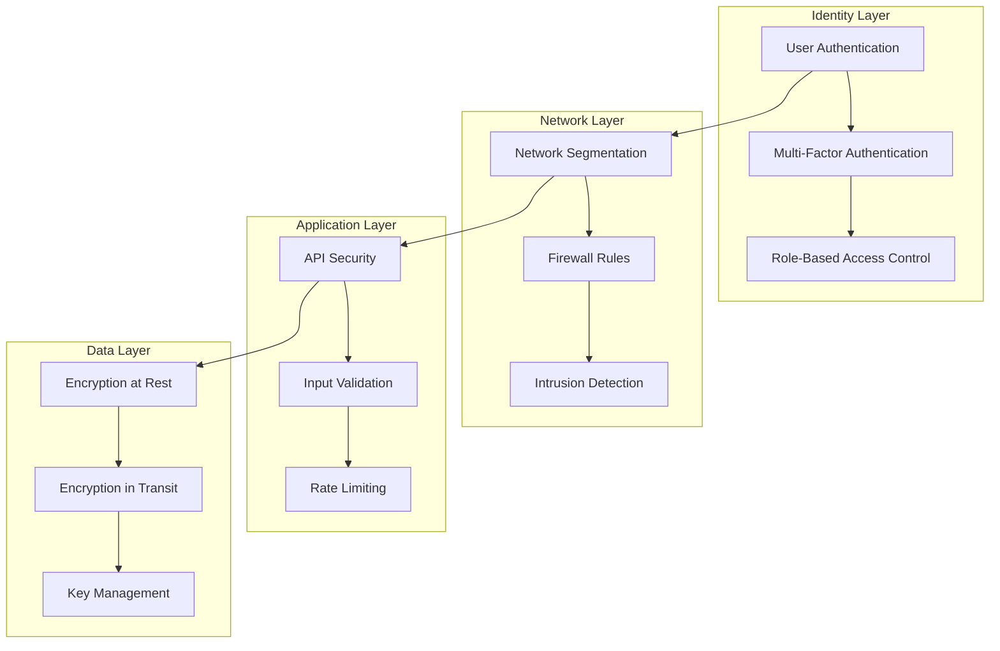

# 🔒 Infrastructure Security 2025

## Overview

This document outlines the comprehensive security strategy for the ToolboxAI Solutions infrastructure, implementing 2025 best practices for security, compliance, and risk management.

## 🛡️ Security Architecture

### Zero-Trust Security Model



### Security Controls Matrix

| Control Category | Implementation | Technology | Status |
|------------------|----------------|------------|--------|
| Identity & Access | OAuth2/JWT | Auth0, AWS Cognito | ✅ Implemented |
| Network Security | VPC, Security Groups | AWS VPC, Kubernetes Network Policies | ✅ Implemented |
| Data Protection | Encryption | AWS KMS, TLS 1.3 | ✅ Implemented |
| Application Security | WAF, Rate Limiting | AWS WAF, NGINX | ✅ Implemented |
| Monitoring | SIEM, Logging | ELK Stack, Prometheus | ✅ Implemented |
| Compliance | Audit Logging | AWS CloudTrail, Custom | ✅ Implemented |

## 🔐 Identity & Access Management

### OAuth2/JWT Implementation

```yaml
# JWT Configuration
apiVersion: v1
kind: ConfigMap
metadata:
  name: jwt-config
  namespace: toolboxai-production
data:
  jwt-config.yaml: |
    issuer: "https://auth.toolboxai.com"
    audience: "toolboxai-api"
    algorithm: "RS256"
    access_token_ttl: 3600  # 1 hour
    refresh_token_ttl: 604800  # 7 days
    public_key_url: "https://auth.toolboxai.com/.well-known/jwks.json"
```

### Role-Based Access Control (RBAC)

```yaml
# Kubernetes RBAC
apiVersion: rbac.authorization.k8s.io/v1
kind: Role
metadata:
  namespace: toolboxai-production
  name: toolboxai-role
rules:
- apiGroups: [""]
  resources: ["pods", "services", "configmaps", "secrets"]
  verbs: ["get", "list", "watch"]
- apiGroups: ["apps"]
  resources: ["deployments", "replicasets"]
  verbs: ["get", "list", "watch"]
- apiGroups: ["networking.k8s.io"]
  resources: ["networkpolicies"]
  verbs: ["get", "list", "watch"]

---
apiVersion: rbac.authorization.k8s.io/v1
kind: RoleBinding
metadata:
  name: toolboxai-rolebinding
  namespace: toolboxai-production
subjects:
- kind: ServiceAccount
  name: toolboxai-sa
  namespace: toolboxai-production
roleRef:
  kind: Role
  name: toolboxai-role
  apiGroup: rbac.authorization.k8s.io
```

### Multi-Factor Authentication

```python
# MFA Implementation
import pyotp
import qrcode
from io import BytesIO
import base64

class MFAProvider:
    def __init__(self):
        self.issuer_name = "ToolboxAI Solutions"

    def generate_secret(self, user_email: str) -> str:
        """Generate TOTP secret for user"""
        secret = pyotp.random_base32()
        return secret

    def generate_qr_code(self, user_email: str, secret: str) -> str:
        """Generate QR code for MFA setup"""
        totp_uri = pyotp.totp.TOTP(secret).provisioning_uri(
            name=user_email,
            issuer_name=self.issuer_name
        )

        qr = qrcode.QRCode(version=1, box_size=10, border=5)
        qr.add_data(totp_uri)
        qr.make(fit=True)

        img = qr.make_image(fill_color="black", back_color="white")
        buffer = BytesIO()
        img.save(buffer, format='PNG')
        buffer.seek(0)

        return base64.b64encode(buffer.getvalue()).decode()

    def verify_token(self, secret: str, token: str) -> bool:
        """Verify TOTP token"""
        totp = pyotp.TOTP(secret)
        return totp.verify(token, valid_window=1)
```

## 🌐 Network Security

### Network Segmentation

```yaml
# Network Policy for Database Isolation
apiVersion: networking.k8s.io/v1
kind: NetworkPolicy
metadata:
  name: database-network-policy
  namespace: toolboxai-production
spec:
  podSelector:
    matchLabels:
      app: postgres
  policyTypes:
  - Ingress
  - Egress
  ingress:
  - from:
    - namespaceSelector:
        matchLabels:
          name: toolboxai-production
    - podSelector:
        matchLabels:
          app: backend
    ports:
    - protocol: TCP
      port: 5432
  egress:
  - to: []
    ports:
    - protocol: TCP
      port: 53
    - protocol: UDP
      port: 53
```

### Firewall Rules

```yaml
# AWS Security Group Rules
apiVersion: v1
kind: ConfigMap
metadata:
  name: security-group-rules
  namespace: toolboxai-production
data:
  rules.yaml: |
    # Web Tier Security Group
    web_tier:
      ingress:
        - protocol: tcp
          port: 80
          source: 0.0.0.0/0
        - protocol: tcp
          port: 443
          source: 0.0.0.0/0
      egress:
        - protocol: tcp
          port: 8008
          destination: app_tier

    # Application Tier Security Group
    app_tier:
      ingress:
        - protocol: tcp
          port: 8008
          source: web_tier
        - protocol: tcp
          port: 9876
          source: web_tier
      egress:
        - protocol: tcp
          port: 5432
          destination: db_tier
        - protocol: tcp
          port: 6379
          destination: cache_tier

    # Database Tier Security Group
    db_tier:
      ingress:
        - protocol: tcp
          port: 5432
          source: app_tier
      egress: []
```

### Intrusion Detection System

```yaml
# Falco Configuration for Runtime Security
apiVersion: v1
kind: ConfigMap
metadata:
  name: falco-config
  namespace: toolboxai-production
data:
  falco.yaml: |
    rules_file:
      - /etc/falco/falco_rules.yaml
      - /etc/falco/falco_rules.local.yaml
      - /etc/falco/k8s_audit_rules.yaml
      - /etc/falco/rules.d

    json_output: true
    json_include_output_property: true

    http_output:
      enabled: true
      url: http://falco-webhook:8080/

    # Custom rules for ToolboxAI
    custom_rules:
      - rule: ToolboxAI Suspicious Database Access
        desc: Detect suspicious database access patterns
        condition: >
          ka and ka.verb in (create, update, delete) and
          ka.target.resource in (secrets, configmaps) and
          ka.user.name != "system:serviceaccount:toolboxai-production:toolboxai-sa"
        output: >
          Suspicious database access by user %ka.user.name
          (user=%ka.user.name verb=%ka.verb resource=%ka.target.resource)
        priority: WARNING
        source: k8s_audit
```

## 🔒 Data Protection

### Encryption at Rest

```yaml
# Kubernetes Encryption Configuration
apiVersion: apiserver.config.k8s.io/v1
kind: EncryptionConfiguration
resources:
- resources:
  - secrets
  - configmaps
  providers:
  - aescbc:
      keys:
      - name: key1
        secret: <base64-encoded-32-byte-key>
  - identity: {}
```

### Encryption in Transit

```yaml
# TLS Configuration
apiVersion: v1
kind: ConfigMap
metadata:
  name: tls-config
  namespace: toolboxai-production
data:
  nginx.conf: |
    server {
        listen 443 ssl http2;
        server_name api.toolboxai.com;

        ssl_certificate /etc/ssl/certs/toolboxai.crt;
        ssl_certificate_key /etc/ssl/private/toolboxai.key;

        # TLS 1.3 only
        ssl_protocols TLSv1.3;
        ssl_ciphers ECDHE-RSA-AES256-GCM-SHA512:DHE-RSA-AES256-GCM-SHA512;
        ssl_prefer_server_ciphers off;

        # Security headers
        add_header Strict-Transport-Security "max-age=31536000; includeSubDomains" always;
        add_header X-Frame-Options DENY always;
        add_header X-Content-Type-Options nosniff always;
        add_header X-XSS-Protection "1; mode=block" always;
        add_header Referrer-Policy "strict-origin-when-cross-origin" always;

        location / {
            proxy_pass http://backend-service:8008;
            proxy_set_header Host $host;
            proxy_set_header X-Real-IP $remote_addr;
            proxy_set_header X-Forwarded-For $proxy_add_x_forwarded_for;
            proxy_set_header X-Forwarded-Proto $scheme;
        }
    }
```

### Key Management

```python
# AWS KMS Integration
import boto3
from cryptography.fernet import Fernet
import base64

class KeyManager:
    def __init__(self):
        self.kms_client = boto3.client('kms', region_name='us-west-2')
        self.key_id = 'arn:aws:kms:us-west-2:123456789012:key/12345678-1234-1234-1234-123456789012'

    def generate_data_key(self) -> tuple:
        """Generate data encryption key"""
        response = self.kms_client.generate_data_key(
            KeyId=self.key_id,
            KeySpec='AES_256'
        )

        plaintext_key = response['Plaintext']
        encrypted_key = response['CiphertextBlob']

        return plaintext_key, encrypted_key

    def encrypt_data(self, data: str, key: bytes) -> str:
        """Encrypt data with provided key"""
        f = Fernet(key)
        encrypted_data = f.encrypt(data.encode())
        return base64.b64encode(encrypted_data).decode()

    def decrypt_data(self, encrypted_data: str, key: bytes) -> str:
        """Decrypt data with provided key"""
        f = Fernet(key)
        decoded_data = base64.b64decode(encrypted_data.encode())
        decrypted_data = f.decrypt(decoded_data)
        return decrypted_data.decode()
```

## 🛡️ Application Security

### Web Application Firewall (WAF)

```yaml
# AWS WAF Rules
apiVersion: v1
kind: ConfigMap
metadata:
  name: waf-rules
  namespace: toolboxai-production
data:
  rules.yaml: |
    # SQL Injection Protection
    - name: SQLInjectionRule
      priority: 1
      action: BLOCK
      statement:
        managed_rule_group_statement:
          vendor_name: AWS
          name: AWSManagedRulesSQLiRuleSet
          version: "1.0"

    # XSS Protection
    - name: XSSRule
      priority: 2
      action: BLOCK
      statement:
        managed_rule_group_statement:
          vendor_name: AWS
          name: AWSManagedRulesCommonRuleSet
          version: "1.0"

    # Rate Limiting
    - name: RateLimitRule
      priority: 3
      action: BLOCK
      statement:
        rate_based_statement:
          limit: 2000
          aggregate_key_type: IP
      visibility_config:
        sampled_requests_enabled: true
        cloudwatch_metrics_enabled: true
        metric_name: RateLimitRule
```

### API Security

```python
# API Security Middleware
from fastapi import FastAPI, Request, HTTPException, Depends
from fastapi.security import HTTPBearer, HTTPAuthorizationCredentials
import jwt
import time
from functools import wraps

security = HTTPBearer()

class APISecurity:
    def __init__(self, secret_key: str, algorithm: str = "HS256"):
        self.secret_key = secret_key
        self.algorithm = algorithm

    def verify_token(self, credentials: HTTPAuthorizationCredentials = Depends(security)):
        """Verify JWT token"""
        try:
            payload = jwt.decode(
                credentials.credentials,
                self.secret_key,
                algorithms=[self.algorithm]
            )

            # Check token expiration
            if payload.get("exp", 0) < time.time():
                raise HTTPException(status_code=401, detail="Token expired")

            return payload
        except jwt.InvalidTokenError:
            raise HTTPException(status_code=401, detail="Invalid token")

    def rate_limit(self, max_requests: int = 100, window: int = 3600):
        """Rate limiting decorator"""
        def decorator(func):
            @wraps(func)
            async def wrapper(request: Request, *args, **kwargs):
                client_ip = request.client.host
                current_time = int(time.time())
                window_start = current_time - window

                # Check rate limit (simplified implementation)
                # In production, use Redis or similar for distributed rate limiting
                if self.check_rate_limit(client_ip, max_requests, window_start):
                    raise HTTPException(status_code=429, detail="Rate limit exceeded")

                return await func(request, *args, **kwargs)
            return wrapper
        return decorator

    def check_rate_limit(self, client_ip: str, max_requests: int, window_start: int) -> bool:
        """Check if client has exceeded rate limit"""
        # Implementation would use Redis or similar
        # Return True if rate limit exceeded
        pass

# Usage
app = FastAPI()
api_security = APISecurity(secret_key="your-secret-key")

@app.get("/api/protected")
async def protected_endpoint(
    request: Request,
    token_data: dict = Depends(api_security.verify_token)
):
    return {"message": "Access granted", "user": token_data.get("sub")}

@app.get("/api/rate-limited")
@api_security.rate_limit(max_requests=10, window=60)
async def rate_limited_endpoint(request: Request):
    return {"message": "Rate limited endpoint"}
```

### Input Validation

```python
# Input Validation and Sanitization
from pydantic import BaseModel, validator, Field
import re
from typing import Optional

class UserInput(BaseModel):
    username: str = Field(..., min_length=3, max_length=50)
    email: str = Field(..., regex=r'^[a-zA-Z0-9._%+-]+@[a-zA-Z0-9.-]+\.[a-zA-Z]{2,}$')
    password: str = Field(..., min_length=8, max_length=128)
    age: Optional[int] = Field(None, ge=13, le=120)  # COPPA compliance

    @validator('username')
    def validate_username(cls, v):
        # Only allow alphanumeric and underscore
        if not re.match(r'^[a-zA-Z0-9_]+$', v):
            raise ValueError('Username must contain only alphanumeric characters and underscores')
        return v.lower()

    @validator('password')
    def validate_password(cls, v):
        # Password strength requirements
        if not re.search(r'[A-Z]', v):
            raise ValueError('Password must contain at least one uppercase letter')
        if not re.search(r'[a-z]', v):
            raise ValueError('Password must contain at least one lowercase letter')
        if not re.search(r'\d', v):
            raise ValueError('Password must contain at least one digit')
        if not re.search(r'[!@#$%^&*(),.?":{}|<>]', v):
            raise ValueError('Password must contain at least one special character')
        return v

class ContentInput(BaseModel):
    title: str = Field(..., min_length=1, max_length=200)
    content: str = Field(..., min_length=1, max_length=10000)
    subject: str = Field(..., min_length=1, max_length=100)
    grade_level: int = Field(..., ge=1, le=12)

    @validator('content')
    def sanitize_content(cls, v):
        # Remove potentially dangerous HTML/script tags
        dangerous_tags = ['script', 'iframe', 'object', 'embed', 'form']
        for tag in dangerous_tags:
            v = re.sub(f'<{tag}[^>]*>.*?</{tag}>', '', v, flags=re.IGNORECASE | re.DOTALL)
            v = re.sub(f'<{tag}[^>]*>', '', v, flags=re.IGNORECASE)
        return v
```

## 📊 Security Monitoring

### Security Information and Event Management (SIEM)

```yaml
# ELK Stack Security Configuration
apiVersion: v1
kind: ConfigMap
metadata:
  name: elasticsearch-security
  namespace: toolboxai-production
data:
  elasticsearch.yml: |
    xpack.security.enabled: true
    xpack.security.transport.ssl.enabled: true
    xpack.security.transport.ssl.verification_mode: certificate
    xpack.security.transport.ssl.keystore.path: certs/elastic-certificates.p12
    xpack.security.transport.ssl.truststore.path: certs/elastic-certificates.p12
    xpack.security.http.ssl.enabled: true
    xpack.security.http.ssl.keystore.path: certs/elastic-certificates.p12
    xpack.security.http.ssl.truststore.path: certs/elastic-certificates.p12
```

### Security Alerts

```yaml
# Security Alert Rules
apiVersion: v1
kind: ConfigMap
metadata:
  name: security-alerts
  namespace: toolboxai-production
data:
  security-rules.yaml: |
    groups:
    - name: security.rules
      rules:
      # Failed login attempts
      - alert: FailedLoginAttempts
        expr: rate(auth_failed_total[5m]) > 5
        for: 2m
        labels:
          severity: warning
          category: authentication
        annotations:
          summary: "High number of failed login attempts"
          description: "{{ $value }} failed login attempts per second"

      # Suspicious API activity
      - alert: SuspiciousAPIActivity
        expr: rate(http_requests_total{status=~"4.."}[5m]) > 10
        for: 5m
        labels:
          severity: warning
          category: application
        annotations:
          summary: "Suspicious API activity detected"
          description: "High rate of 4xx responses: {{ $value }} per second"

      # Unauthorized access attempts
      - alert: UnauthorizedAccess
        expr: rate(http_requests_total{status="401"}[5m]) > 2
        for: 1m
        labels:
          severity: critical
          category: authorization
        annotations:
          summary: "Unauthorized access attempts detected"
          description: "{{ $value }} unauthorized requests per second"

      # Data exfiltration attempts
      - alert: DataExfiltrationAttempt
        expr: rate(http_requests_total{endpoint=~".*export.*"}[5m]) > 1
        for: 1m
        labels:
          severity: critical
          category: data_protection
        annotations:
          summary: "Potential data exfiltration attempt"
          description: "High rate of export requests: {{ $value }} per second"
```

## 🏛️ Compliance Framework

### COPPA Compliance

```python
# COPPA Compliance Implementation
from datetime import datetime, timedelta
from typing import Optional

class COPPACompliance:
    def __init__(self):
        self.min_age = 13
        self.parental_consent_required = True

    def verify_age(self, birth_date: datetime) -> tuple[bool, str]:
        """Verify user age for COPPA compliance"""
        age = (datetime.now() - birth_date).days // 365

        if age < self.min_age:
            return False, "Parental consent required for users under 13"

        return True, "Age verified"

    def require_parental_consent(self, user_id: str) -> bool:
        """Check if parental consent is required and obtained"""
        # Implementation would check database for consent status
        return True

    def collect_minimal_data(self, user_id: str, data_type: str) -> bool:
        """Ensure only necessary data is collected for educational purposes"""
        allowed_data_types = [
            "progress", "achievements", "session_duration",
            "quiz_results", "learning_objectives"
        ]

        return data_type in allowed_data_types

    def data_retention_policy(self, user_id: str) -> datetime:
        """Implement data retention policy for children's data"""
        # COPPA requires deletion of children's data when no longer needed
        return datetime.now() + timedelta(days=365)  # 1 year retention
```

### GDPR Compliance

```python
# GDPR Compliance Implementation
class GDPRCompliance:
    def __init__(self):
        self.data_retention_period = 365  # days

    def process_data_with_consent(self, user_id: str, data_type: str, purpose: str) -> bool:
        """Ensure data processing has proper consent"""
        consent = self.get_consent(user_id, data_type, purpose)
        return consent and consent.get("valid", False)

    def provide_data_portability(self, user_id: str) -> dict:
        """Provide user data in portable format"""
        user_data = self.get_all_user_data(user_id)
        return self.format_for_portability(user_data)

    def handle_data_deletion(self, user_id: str) -> bool:
        """Handle right to be forgotten"""
        try:
            # Delete user data
            self.delete_user_data(user_id)
            self.log_data_deletion(user_id)
            return True
        except Exception as e:
            self.log_error(f"Failed to delete data for user {user_id}: {e}")
            return False

    def anonymize_data(self, data: dict) -> dict:
        """Anonymize personal data"""
        anonymized = data.copy()

        # Remove or hash PII
        if "email" in anonymized:
            anonymized["email"] = self.hash_email(anonymized["email"])
        if "name" in anonymized:
            anonymized["name"] = "Anonymous"
        if "ip_address" in anonymized:
            anonymized["ip_address"] = self.hash_ip(anonymized["ip_address"])

        return anonymized
```

### SOC 2 Type 2 Compliance

```yaml
# SOC 2 Compliance Controls
apiVersion: v1
kind: ConfigMap
metadata:
  name: soc2-controls
  namespace: toolboxai-production
data:
  controls.yaml: |
    # Security Controls
    security:
      - control: "CC6.1 - Logical and Physical Access Controls"
        implementation: "RBAC, MFA, Network Segmentation"
        status: "Implemented"

      - control: "CC6.2 - Access Restriction"
        implementation: "Principle of Least Privilege, JWT Tokens"
        status: "Implemented"

      - control: "CC6.3 - Access Revocation"
        implementation: "Automated token expiration, User deactivation"
        status: "Implemented"

    # Availability Controls
    availability:
      - control: "CC7.1 - System Monitoring"
        implementation: "Prometheus, Grafana, AlertManager"
        status: "Implemented"

      - control: "CC7.2 - Incident Response"
        implementation: "Automated alerting, Runbooks, Escalation procedures"
        status: "Implemented"

      - control: "CC7.3 - Data Backup"
        implementation: "Automated backups, Cross-region replication"
        status: "Implemented"

    # Processing Integrity Controls
    processing_integrity:
      - control: "CC8.1 - Data Validation"
        implementation: "Input validation, Data sanitization"
        status: "Implemented"

      - control: "CC8.2 - Error Handling"
        implementation: "Comprehensive error handling, Logging"
        status: "Implemented"

    # Confidentiality Controls
    confidentiality:
      - control: "CC6.7 - Data Encryption"
        implementation: "TLS 1.3, AES-256 encryption at rest"
        status: "Implemented"

      - control: "CC6.8 - Key Management"
        implementation: "AWS KMS, Key rotation policies"
        status: "Implemented"
```

## 🔧 Security Testing

### Automated Security Testing

```yaml
# Security Testing Pipeline
apiVersion: v1
kind: ConfigMap
metadata:
  name: security-tests
  namespace: toolboxai-production
data:
  security-tests.yaml: |
    tests:
      - name: "Vulnerability Scanning"
        tool: "Trivy"
        schedule: "0 2 * * *"  # Daily at 2 AM
        command: "trivy image --severity HIGH,CRITICAL toolboxai/backend:latest"

      - name: "SAST Analysis"
        tool: "SonarQube"
        schedule: "0 3 * * *"  # Daily at 3 AM
        command: "sonar-scanner -Dsonar.projectKey=toolboxai"

      - name: "Dependency Scanning"
        tool: "Snyk"
        schedule: "0 4 * * *"  # Daily at 4 AM
        command: "snyk test --severity-threshold=high"

      - name: "Container Security"
        tool: "Falco"
        schedule: "continuous"
        command: "falco --rules-file=/etc/falco/falco_rules.yaml"

      - name: "Network Security"
        tool: "Nmap"
        schedule: "0 5 * * 0"  # Weekly on Sunday
        command: "nmap -sS -O -v --script vuln target.com"
```

### Penetration Testing

```bash
#!/bin/bash
# Automated Penetration Testing Script

# OWASP ZAP Security Testing
docker run -t owasp/zap2docker-stable zap-baseline.py \
  -t https://api.toolboxai.com \
  -r zap-report.html \
  -J zap-report.json

# Nmap Vulnerability Scanning
nmap -sS -sV -O -A --script vuln \
  --script-args="unsafe=1" \
  api.toolboxai.com

# SQLMap Testing
sqlmap -u "https://api.toolboxai.com/api/users" \
  --batch --level=5 --risk=3 \
  --output-dir=sqlmap-results

# Nikto Web Vulnerability Scanner
nikto -h https://api.toolboxai.com \
  -output nikto-report.html \
  -Format htm
```

## 📋 Security Incident Response

### Incident Response Plan

```yaml
# Incident Response Procedures
apiVersion: v1
kind: ConfigMap
metadata:
  name: incident-response
  namespace: toolboxai-production
data:
  procedures.yaml: |
    phases:
      detection:
        - "Automated monitoring alerts"
        - "User reports"
        - "Security scans"
        - "Log analysis"

      assessment:
        - "Determine severity level"
        - "Identify affected systems"
        - "Assess data exposure"
        - "Document timeline"

      containment:
        - "Isolate affected systems"
        - "Block malicious traffic"
        - "Preserve evidence"
        - "Implement temporary fixes"

      eradication:
        - "Remove threats"
        - "Patch vulnerabilities"
        - "Update security measures"
        - "Verify system integrity"

      recovery:
        - "Restore services"
        - "Verify security"
        - "Monitor for recurrence"
        - "Update documentation"

      lessons_learned:
        - "Document incident"
        - "Update procedures"
        - "Improve security"
        - "Conduct post-mortem"

    severity_levels:
      critical:
        - "Data breach"
        - "System compromise"
        - "Service outage"
        - "Ransomware attack"

      high:
        - "Unauthorized access"
        - "Malware detection"
        - "DDoS attack"
        - "Suspicious activity"

      medium:
        - "Failed login attempts"
        - "Policy violations"
        - "Vulnerability discovery"
        - "Performance issues"

      low:
        - "Minor security events"
        - "Informational alerts"
        - "Routine maintenance"
```

## 🎯 Security Best Practices

### Infrastructure Security Checklist

- [ ] **Identity & Access Management**
  - [ ] Multi-factor authentication enabled
  - [ ] Role-based access control implemented
  - [ ] Regular access reviews conducted
  - [ ] Privileged access management in place

- [ ] **Network Security**
  - [ ] Network segmentation implemented
  - [ ] Firewall rules configured
  - [ ] Intrusion detection enabled
  - [ ] VPN access secured

- [ ] **Data Protection**
  - [ ] Encryption at rest enabled
  - [ ] Encryption in transit enforced
  - [ ] Key management implemented
  - [ ] Data classification in place

- [ ] **Application Security**
  - [ ] Input validation implemented
  - [ ] Output encoding applied
  - [ ] Authentication secured
  - [ ] Session management protected

- [ ] **Monitoring & Logging**
  - [ ] Security monitoring enabled
  - [ ] Log aggregation configured
  - [ ] Alerting rules defined
  - [ ] Incident response procedures documented

### Regular Security Tasks

#### Daily
- Review security alerts
- Check for failed login attempts
- Monitor system performance
- Verify backup completion

#### Weekly
- Update security patches
- Review access logs
- Analyze security metrics
- Test incident response procedures

#### Monthly
- Conduct security assessments
- Review user access rights
- Update security policies
- Perform vulnerability scans

#### Quarterly
- Full security audit
- Penetration testing
- Disaster recovery testing
- Security training updates

---

*Last Updated: 2025-09-14*
*Version: 2.0.0*
*Compliance: COPPA, FERPA, GDPR, SOC 2 Type 2*
