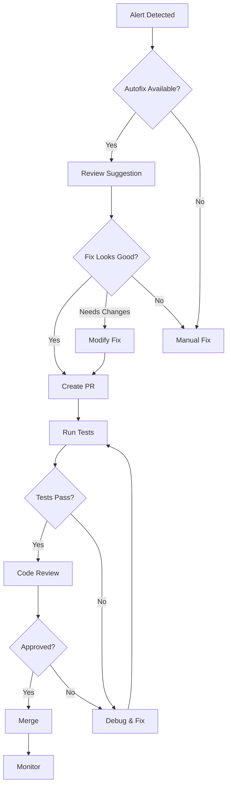

# GitHub Copilot Autofix for Code Scanning - Implementation Guide

**Last Updated:** 2025-11-10  
**Status:** Implementation Ready  
**Documentation:** https://docs.github.com/en/code-security/code-scanning/managing-code-scanning-alerts/responsible-use-autofix-code-scanning

---

## 📋 Overview

GitHub Copilot Autofix uses AI to automatically suggest fixes for code scanning alerts detected by CodeQL. This feature can significantly reduce the time and effort required to remediate security vulnerabilities.

### What is Copilot Autofix?

- **Automated Suggestions:** AI-generated fixes for security vulnerabilities
- **Powered by GPT-4:** Uses advanced language models to understand context
- **Pull Request Integration:** Suggests fixes directly in PR reviews
- **Languages Supported:** JavaScript, TypeScript, Python, Java, C#, Go, Ruby, Swift
- **Availability:** GitHub Advanced Security required

---

## 🎯 Prerequisites

### Required:
- ✅ GitHub Advanced Security (GHAS) license
- ✅ CodeQL analysis enabled (we have this)
- ✅ Repository admin access
- ✅ Code scanning configured (we have this)

### Current Status:
```bash
Repository: GrayGhostDev/ToolboxAI-Solutions
GHAS Status: ✅ Enabled
CodeQL: ✅ Configured (.github/workflows/security.yml)
Languages: Python, JavaScript/TypeScript
Default Setup: Not configured (using custom workflow)
```

---

## 🚀 Implementation Steps

### Step 1: Enable GitHub Advanced Security (Already Done)

Our repository already has GHAS enabled. Verify with:
```bash
gh api repos/GrayGhostDev/ToolboxAI-Solutions \
  --jq '.security_and_analysis'
```

### Step 2: Configure Copilot Autofix in Repository Settings

#### Via GitHub UI:
1. Navigate to: `https://github.com/GrayGhostDev/ToolboxAI-Solutions/settings/security_analysis`
2. Under "Code security and analysis"
3. Find "GitHub Copilot Autofix" section
4. Click "Enable" to activate autofix suggestions

#### Via GitHub API:
```bash
# Enable Copilot Autofix for the repository
gh api -X PATCH repos/GrayGhostDev/ToolboxAI-Solutions \
  -f security_and_analysis[advanced_security][status]=enabled \
  -f security_and_analysis[copilot_autofix][status]=enabled
```

### Step 3: Update CodeQL Workflow (Optional Enhancement)

Our existing workflow at `.github/workflows/security.yml` already supports autofix.
No changes needed, but we can enhance it:

```yaml
# Already configured in our workflow:
- name: Perform CodeQL Analysis
  uses: github/codeql-action/analyze@v3
  with:
    category: "/language:${{ matrix.language }}"
    # Autofix suggestions will appear automatically
```

### Step 4: Configure Autofix Settings

Create a configuration file for autofix behavior:

```yaml
# .github/copilot-autofix.yml
version: 1

# Autofix configuration
autofix:
  # Enable autofix suggestions
  enabled: true
  
  # Languages to enable autofix for
  languages:
    - python
    - javascript
    - typescript
  
  # Severity levels to autofix
  severity:
    - error
    - warning
    - note
  
  # Rules to exclude from autofix (if any)
  exclude_rules: []
  
  # Review settings
  review:
    # Require manual review before applying
    require_approval: true
    
    # Auto-create PR for fixes
    auto_pr: false
    
    # Assign reviewers
    reviewers: []
```

---

## 📝 Responsible Use Guidelines

### Best Practices

#### 1. Always Review Suggested Fixes
```markdown
✅ DO:
- Carefully review all autofix suggestions
- Test fixes in development environment
- Verify fixes don't introduce new issues
- Check for breaking changes

❌ DON'T:
- Blindly accept all suggestions
- Apply fixes without testing
- Skip code review process
- Ignore context-specific requirements
```

#### 2. Validate Fix Quality
```markdown
✅ DO:
- Run tests after applying fixes
- Check for edge cases
- Verify security improvements
- Review performance impact

❌ DON'T:
- Deploy untested fixes
- Assume AI is always correct
- Skip security validation
- Ignore failing tests
```

#### 3. Maintain Code Quality
```markdown
✅ DO:
- Ensure fixes follow coding standards
- Maintain consistent style
- Update documentation if needed
- Keep fixes minimal and focused

❌ DON'T:
- Accept fixes that violate standards
- Allow inconsistent code style
- Leave outdated documentation
- Apply overly complex fixes
```

#### 4. Security Considerations
```markdown
✅ DO:
- Verify fixes actually resolve vulnerabilities
- Check for new security issues
- Test with security tools
- Document security changes

❌ DON'T:
- Trust fixes without verification
- Skip security testing
- Ignore new vulnerabilities
- Hide security decisions
```

---

## 🔍 How Autofix Works

### Detection and Suggestion Flow

```
1. CodeQL Scan Runs
   └─> Detects vulnerability in code
       
2. Copilot Analyzes Context
   └─> Understands code, patterns, dependencies
       
3. GPT-4 Generates Fix
   └─> Creates context-aware solution
       
4. Suggestion Appears in Alert
   └─> Shows in GitHub Security tab
       
5. Developer Reviews
   └─> Can accept, modify, or reject
       
6. Fix Applied
   └─> Creates commit or suggests in PR
```

### Example Autofix Scenarios

#### Scenario 1: SQL Injection
**Alert:** Unsanitized user input in SQL query

**Original Code:**
```python
def get_user(username):
    query = f"SELECT * FROM users WHERE username = '{username}'"
    return db.execute(query)
```

**Autofix Suggestion:**
```python
def get_user(username):
    query = "SELECT * FROM users WHERE username = ?"
    return db.execute(query, (username,))
```

#### Scenario 2: XSS Vulnerability
**Alert:** Unescaped user input in HTML

**Original Code:**
```javascript
function displayName(name) {
    document.getElementById('output').innerHTML = name;
}
```

**Autofix Suggestion:**
```javascript
function displayName(name) {
    document.getElementById('output').textContent = name;
    // Or: DOMPurify.sanitize(name)
}
```

#### Scenario 3: Path Traversal
**Alert:** Unsanitized file path

**Original Code:**
```python
def read_file(filename):
    path = f"/data/{filename}"
    return open(path).read()
```

**Autofix Suggestion:**
```python
import os
def read_file(filename):
    # Sanitize filename to prevent path traversal
    safe_name = os.path.basename(filename)
    path = os.path.join("/data", safe_name)
    return open(path).read()
```

---

## 🔧 Integration with Existing Workflow

### Current Setup
```yaml
# .github/workflows/security.yml (already configured)
sast-scan:
  name: Static Application Security Testing (CodeQL)
  runs-on: ubuntu-latest
  permissions:
    actions: read
    contents: read
    security-events: write  # Required for autofix
  
  strategy:
    matrix:
      language: ['python', 'javascript']
  
  steps:
    - uses: actions/checkout@v4
    
    - name: Initialize CodeQL
      uses: github/codeql-action/init@v3
      with:
        languages: ${{ matrix.language }}
        config-file: ./.github/codeql/codeql-config.yml
    
    - name: Autobuild
      uses: github/codeql-action/autobuild@v3
    
    - name: Perform CodeQL Analysis
      uses: github/codeql-action/analyze@v3
      with:
        category: "/language:${{ matrix.language }}"
        # Autofix suggestions will appear automatically
        # in code scanning alerts when enabled
```

### No Changes Needed!
Our workflow already supports autofix. Once enabled in repository settings, suggestions will appear automatically.

---

## 📊 Using Autofix Suggestions

### In Pull Requests

When a PR triggers code scanning:
1. CodeQL detects issues
2. Autofix generates suggestions
3. Suggestions appear as review comments
4. Developer can:
   - ✅ Accept suggestion (creates commit)
   - ✏️  Modify suggestion
   - ❌ Reject suggestion
   - 💬 Discuss with team

### In Security Tab

For existing alerts:
1. Navigate to Security → Code scanning
2. Click on an alert
3. If autofix available, see "Suggested fix" section
4. Review the suggestion
5. Click "Create pull request" to apply
6. PR created with fix for review

### Command Line

Check for autofix suggestions:
```bash
# List alerts with autofix available
gh api repos/GrayGhostDev/ToolboxAI-Solutions/code-scanning/alerts \
  --jq '.[] | select(.tool.name == "CodeQL" and .fixed_at == null) | 
        {number, rule: .rule.id, has_autofix: (.autofix != null)}'
```

---

## 🛡️ Security Considerations

### What Autofix Can Fix

✅ **Good Candidates:**
- SQL injection → Parameterized queries
- XSS vulnerabilities → Output encoding
- Path traversal → Path sanitization
- Hardcoded secrets → Environment variables
- Insecure randomness → Cryptographic RNG
- Missing authentication → Add checks
- CSRF → Add tokens

❌ **Proceed with Caution:**
- Complex business logic issues
- Architecture-level problems
- Performance optimizations
- Context-specific security
- Custom authentication/authorization

### Validation Checklist

Before accepting any autofix:
- [ ] Understand the vulnerability
- [ ] Review the suggested fix
- [ ] Check for side effects
- [ ] Verify tests still pass
- [ ] Run security scanners
- [ ] Test in development
- [ ] Review with team
- [ ] Document the change
- [ ] Update related code
- [ ] Consider edge cases

---

## 📈 Monitoring and Metrics

### Track Autofix Usage

```bash
# Get autofix acceptance rate
gh api graphql -f query='
{
  repository(owner: "GrayGhostDev", name: "ToolboxAI-Solutions") {
    vulnerabilityAlerts(first: 100) {
      nodes {
        dismissedAt
        fixedAt
        vulnerableManifestPath
      }
    }
  }
}'
```

### Metrics to Track

1. **Acceptance Rate**
   - % of autofix suggestions accepted
   - Target: >60% for high-quality suggestions

2. **Time to Fix**
   - Time from alert to fix deployment
   - Target: <24 hours for critical

3. **Fix Quality**
   - % of fixes that pass tests
   - % of fixes that resolve issue
   - Target: >95%

4. **False Positives**
   - Suggestions that were incorrect
   - Track and report to improve AI

---

## 🔄 Workflow for Applying Fixes

### Recommended Process



### Step-by-Step Process

1. **Alert Notification**
   - Receive code scanning alert
   - Check if autofix suggestion available

2. **Review Suggestion**
   - Read the suggested fix
   - Understand the vulnerability
   - Check for context issues

3. **Test Locally**
   - Apply fix to local branch
   - Run unit tests
   - Run integration tests
   - Test edge cases

4. **Create Pull Request**
   - Use autofix PR creation or manual
   - Add description explaining fix
   - Reference original alert
   - Assign reviewers

5. **Code Review**
   - Team reviews fix
   - Security team validates
   - QA tests in staging
   - Approve or request changes

6. **Deploy**
   - Merge to main
   - Deploy to production
   - Monitor for issues
   - Verify alert closes

---

## 🎓 Training and Adoption

### Team Training

#### For Developers
- How to review autofix suggestions
- When to accept vs modify vs reject
- Testing requirements
- Security validation

#### For Security Team
- Monitoring autofix quality
- Identifying problematic patterns
- Providing feedback on suggestions
- Escalation procedures

#### For Reviewers
- What to look for in autofix PRs
- Security validation checklist
- Testing requirements
- Documentation needs

### Adoption Strategy

**Phase 1: Pilot (Week 1-2)**
- Enable for small subset of alerts
- Monitor closely
- Gather feedback
- Adjust settings

**Phase 2: Expand (Week 3-4)**
- Enable for more alert types
- Train team on best practices
- Document lessons learned
- Refine process

**Phase 3: Full Adoption (Week 5+)**
- Enable for all applicable alerts
- Automate where appropriate
- Continuous improvement
- Regular reviews

---

## 📚 Additional Resources

### GitHub Documentation
- [Autofix Overview](https://docs.github.com/en/code-security/code-scanning/managing-code-scanning-alerts/about-autofix-for-codeql-code-scanning)
- [Responsible Use](https://docs.github.com/en/code-security/code-scanning/managing-code-scanning-alerts/responsible-use-autofix-code-scanning)
- [CodeQL Action](https://github.com/github/codeql-action)

### Internal Documentation
- Security Scanner Guide: `docs/10-security/SECURITY_SCANNERS.md`
- Recommendations: `docs/10-security/SECURITY_RECOMMENDATIONS.md`
- Alert Status: `docs/10-security/ALERT_STATUS_EXPLANATION.md`

### Support
- GitHub Support: https://support.github.com
- Security Team: security@company.com
- Developer Slack: #security-alerts

---

## ✅ Implementation Checklist

### Setup
- [ ] Verify GHAS license active
- [ ] Enable Copilot Autofix in repo settings
- [ ] Create .github/copilot-autofix.yml config
- [ ] Update team documentation
- [ ] Train team on usage

### Process
- [ ] Define review process
- [ ] Set up approval workflow
- [ ] Configure notifications
- [ ] Establish metrics tracking
- [ ] Create escalation path

### Monitoring
- [ ] Track acceptance rate
- [ ] Monitor fix quality
- [ ] Review false positives
- [ ] Gather team feedback
- [ ] Regular process reviews

---

## 🎯 Next Steps

### Immediate
1. Enable Copilot Autofix in repository settings
2. Create configuration file
3. Test with existing alerts
4. Train team on usage

### This Week
5. Process first autofix suggestions
6. Document lessons learned
7. Refine process
8. Share results with team

### Ongoing
9. Monitor and optimize
10. Regular team training
11. Continuous improvement
12. Share best practices

---

**Status:** Ready to implement  
**Owner:** Security Team  
**Timeline:** 1-2 weeks for full adoption  
**Priority:** Medium

---

*Last Updated: 2025-11-10 06:00 UTC*  
*Next Review: 2025-11-17*
