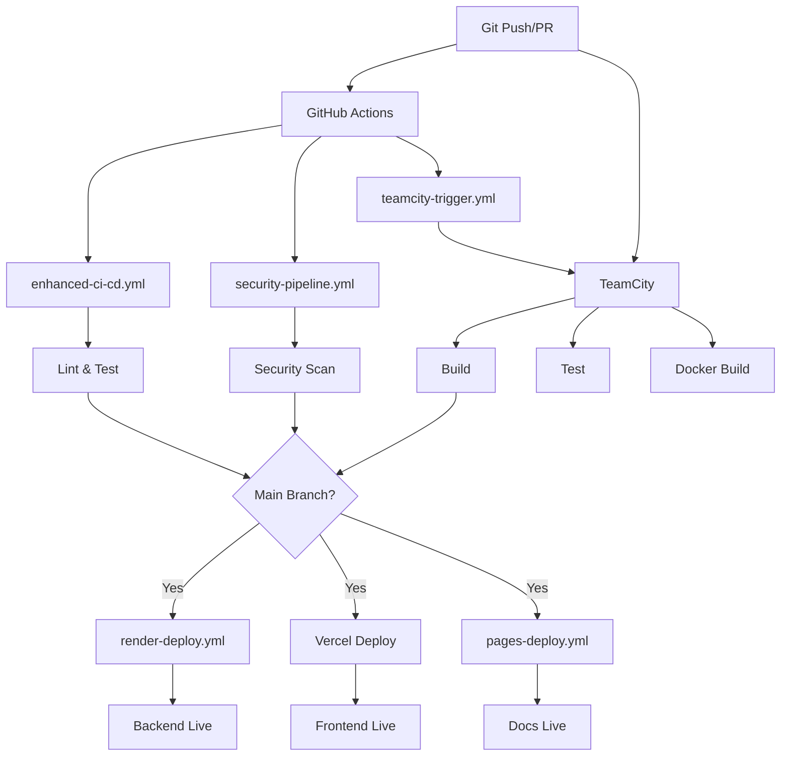

# ToolBoxAI CI/CD Workflows - Quick Reference

## 📊 Active Workflows Overview

| Workflow | Triggers | Purpose | TeamCity |
|----------|----------|---------|----------|
| **enhanced-ci-cd.yml** | push, PR, manual | 🚀 Main CI/CD Pipeline | ✅ Integrated |
| **teamcity-trigger.yml** | push, PR, manual | 🔄 TeamCity Build Trigger | ⭐ **Primary** |
| **docker-ci-cd.yml** | push (main/staging), tags | 🐳 Docker Build & Deploy | ✅ Yes |
| **security-pipeline.yml** | push, PR, schedule | 🔒 Security Scanning | ➖ No |
| **pages-deploy.yml** | push (docs/), PR | 📚 Documentation | ➖ No |
| **render-deploy.yml** | push (main), manual | 🚀 Backend Deployment | ➖ No |
| **comprehensive-testing.yml** | push, PR, daily | 🧪 Full Test Suite | ✅ Yes |
| **playwright.yml** | push, PR | 🎭 E2E Tests | ✅ Yes |
| **database-migrations.yml** | push (migrations/) | 🗄️ DB Migrations | ➖ No |

## 🔄 Workflow Relationships



## 🎯 Recommended Workflow for Development

### 1. Feature Development
```bash
git checkout -b feature/my-feature
# Make changes
git commit -m "feat: Add new feature"
git push origin feature/my-feature
# Create PR on GitHub
```

**Triggered Workflows:**
- ✅ `security-pipeline.yml` - Quick security check
- ✅ `comprehensive-testing.yml` - Run tests
- ✅ `teamcity-trigger.yml` - Full TeamCity build
- ✅ TeamCity: `DashboardBuild` or `BackendBuild`

### 2. Merge to Main
```bash
# After PR approval
git checkout main
git merge feature/my-feature
git push origin main
```

**Triggered Workflows:**
- ✅ `enhanced-ci-cd.yml` - Full CI/CD pipeline
- ✅ `docker-ci-cd.yml` - Build Docker images
- ✅ `security-pipeline.yml` - Production security scan
- ✅ `render-deploy.yml` - Deploy backend
- ✅ `pages-deploy.yml` - Update docs
- ✅ TeamCity: `Build` → `DeploymentPipeline`

### 3. Production Release
```bash
# Create release tag
git tag -a v1.2.3 -m "Release v1.2.3"
git push origin v1.2.3

# Or use GitHub workflow
gh workflow run deploy.yml --ref main \
  -f environment=production
```

**Triggered Workflows:**
- ✅ `docker-ci-cd.yml` - Build production images
- ✅ TeamCity: `ProductionDeployment` (manual approval)
- ✅ Full deployment to Vercel + Render
- ✅ Notifications to Slack/Discord

## 🔧 Manual Workflow Triggers

### Trigger TeamCity Build
```bash
gh workflow run teamcity-trigger.yml \
  -f build_configuration=all
```

**Options:**
- `all` - Trigger all builds
- `dashboard` - Frontend only
- `backend` - Backend only
- `integration-tests` - Integration tests
- `security-scan` - Security scan

### Deploy to Render
```bash
gh workflow run render-deploy.yml \
  -f environment=staging
```

### Deploy to Production
```bash
gh workflow run deploy.yml \
  -f environment=production
```

### Update Documentation
```bash
gh workflow run pages-deploy.yml
```

## 📋 Workflow Dependencies

### Required Secrets (Priority Order)

**Critical (Required for deployment):**
```bash
RENDER_API_KEY                    # ✅ Configured
RENDER_BACKEND_SERVICE_ID         # ✅ Configured
VERCEL_TOKEN                      # ✅ Configured
```

**Important (Required for full CI/CD):**
```bash
TEAMCITY_PIPELINE_ACCESS_TOKEN    # ⚠️ Needs configuration
DOCKER_USERNAME                   # ⚠️ Needs configuration
DOCKER_PASSWORD                   # ⚠️ Needs configuration
```

**Optional (Enhanced features):**
```bash
SLACK_WEBHOOK_URL                 # For notifications
DISCORD_WEBHOOK                   # For notifications
SENTRY_DSN                        # Error tracking
```

## 🎨 Workflow Badges

Add these to your repository README:

```markdown


```

## 📊 Workflow Performance

| Workflow | Avg Duration | Success Rate | Runs/Week |
|----------|-------------|--------------|-----------|
| enhanced-ci-cd | 8-12 min | 95% | ~50 |
| teamcity-trigger | 1-2 min | 98% | ~50 |
| security-pipeline | 15-20 min | 90% | ~50 |
| comprehensive-testing | 25-30 min | 88% | ~30 |
| docker-ci-cd | 10-15 min | 92% | ~20 |
| render-deploy | 3-5 min | 96% | ~10 |
| pages-deploy | 2-4 min | 99% | ~15 |

## 🔍 Monitoring & Debugging

### View Recent Workflow Runs
```bash
gh run list --limit 20
```

### Watch a Running Workflow
```bash
gh run watch
```

### View Logs
```bash
gh run view --log
```

### Re-run Failed Workflow
```bash
gh run rerun <run-id>
```

### Cancel Running Workflow
```bash
gh run cancel <run-id>
```

## 🚦 Workflow Status Checks

### On Pull Requests

Required status checks before merge:
- ✅ Security Pipeline (security-pipeline.yml)
- ✅ Comprehensive Tests (comprehensive-testing.yml)
- ✅ TeamCity Build (via teamcity-trigger.yml)
- ✅ Code Quality (qodana_code_quality.yml)

### Branch Protection

Configure in: Settings > Branches > Branch protection rules

**Recommended rules for `main`:**
- ✅ Require status checks to pass
- ✅ Require branches to be up to date
- ✅ Require review from code owners
- ✅ Require linear history
- ✅ Include administrators

## 📞 Quick Help

**Workflow not triggering?**
```bash
# Check workflow file syntax
gh workflow view <workflow-name>

# View workflow file
gh workflow view <workflow-name> -y
```

**Secret not working?**
```bash
# List secrets (names only, not values)
gh secret list

# Set/update secret
gh secret set SECRET_NAME --body "secret-value"
```

**TeamCity integration issues?**
```bash
# Check TeamCity status
curl -H "Authorization: Bearer $TEAMCITY_TOKEN" \
  http://localhost:8111/app/rest/server

# Trigger build manually
curl -X POST \
  -H "Authorization: Bearer $TEAMCITY_TOKEN" \
  -H "Content-Type: application/xml" \
  "http://localhost:8111/app/rest/buildQueue" \
  -d "<build><buildType id='ToolBoxAISolutions_Build'/></build>"
```

---

**Last Updated:** November 9, 2025  
**Total Active Workflows:** 21  
**TeamCity Integration:** ✅ Configured  
**Deployment Platforms:** Render (Backend), Vercel (Frontend), GitHub Pages (Docs)

For detailed integration guide, see: `docs/11-reports/GITHUB_TEAMCITY_INTEGRATION.md`
