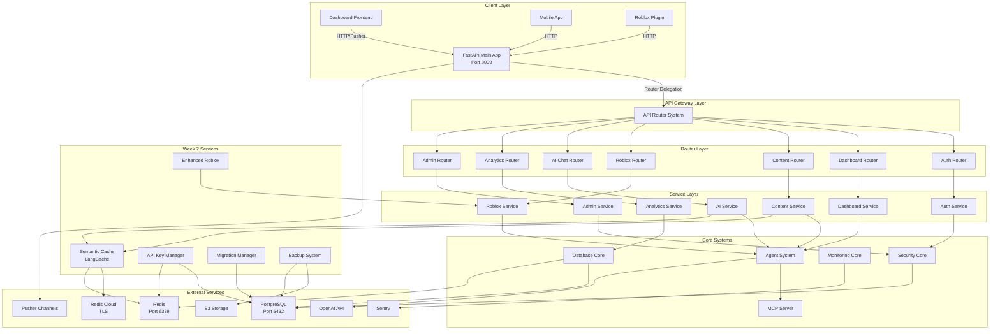

# Backend Architecture Documentation

## Table of Contents
- [System Overview](#system-overview)
- [Architecture Diagram](#architecture-diagram)
- [Component Descriptions](#component-descriptions)
- [Data Flow](#data-flow)
- [Module Dependencies](#module-dependencies)
- [Technology Stack](#technology-stack)
- [Configuration Management](#configuration-management)

## System Overview

The ToolboxAI Backend is a comprehensive FastAPI-based microservice architecture designed for educational content generation and management. The system features a monolithic main application with modular router-based organization, real-time communication capabilities, and extensive AI agent integration.

### Key Characteristics
- **Framework**: FastAPI with async/await support
- **Architecture Pattern**: Modular Monolith with Router-based separation
- **Real-time**: Pusher Channels for WebSocket replacement
- **AI Integration**: Multi-agent system with SPARC framework
- **Security**: JWT authentication, CORS, rate limiting, circuit breakers
- **Monitoring**: Sentry integration, comprehensive logging, health checks
- **Database**: PostgreSQL with async SQLAlchemy, Redis for caching

## Architecture Diagram



## System Architecture Diagram

```
┌─────────────────────────────────────────────────────────────────────┐
│                        ToolboxAI Backend System                     │
├─────────────────────────────────────────────────────────────────────┤
│                                                                     │
│  ┌─────────────────┐    ┌──────────────────┐    ┌─────────────────┐ │
│  │   Dashboard     │    │   Mobile App     │    │   Roblox Game   │ │
│  │   (React)       │    │   (Flutter)      │    │   Environment   │ │
│  └─────────────────┘    └──────────────────┘    └─────────────────┘ │
│           │                       │                       │         │
│           └───────────────────────┼───────────────────────┘         │
│                                   │                                 │
├─────────────────────────────────────────────────────────────────────┤
│                            API Gateway Layer                        │
│  ┌─────────────────────────────────────────────────────────────────┐ │
│  │                     FastAPI Application                         │ │
│  │  ┌─────────────┐  ┌─────────────┐  ┌─────────────┐            │ │
│  │  │   CORS      │  │ Rate Limit  │  │ Auth/JWT    │            │ │
│  │  │ Middleware  │  │ Middleware  │  │ Middleware  │            │ │
│  │  └─────────────┘  └─────────────┘  └─────────────┘            │ │
│  └─────────────────────────────────────────────────────────────────┘ │
├─────────────────────────────────────────────────────────────────────┤
│                         Resilience Layer                           │
│  ┌─────────────────┐  ┌─────────────────┐  ┌─────────────────┐     │
│  │ Circuit Breaker │  │ Retry Logic     │  │ Bulkhead        │     │
│  │ Middleware      │  │ Middleware      │  │ Middleware      │     │
│  └─────────────────┘  └─────────────────┘  └─────────────────┘     │
├─────────────────────────────────────────────────────────────────────┤
│                           Core Services                            │
│  ┌─────────────────┐  ┌─────────────────┐  ┌─────────────────┐     │
│  │ Agent Service   │  │ Pusher Service  │  │ Auth Service    │     │
│  │ - AI Agents     │  │ - Real-time     │  │ - JWT Tokens    │     │
│  │ - Task Queue    │  │ - WebSockets    │  │ - User Sessions │     │
│  │ - Orchestration │  │ - Channels      │  │ - Role-based    │     │
│  └─────────────────┘  └─────────────────┘  └─────────────────┘     │
│                                                                     │
│  ┌─────────────────┐  ┌─────────────────┐  ┌─────────────────┐     │
│  │ Content Service │  │ Roblox Service  │  │ Analytics       │     │
│  │ - AI Generation │  │ - Asset Mgmt    │  │ - Performance   │     │
│  │ - Educational   │  │ - Script Deploy │  │ - User Behavior │     │
│  │ - Validation    │  │ - Testing       │  │ - System Health │     │
│  └─────────────────┘  └─────────────────┘  └─────────────────┘     │
├─────────────────────────────────────────────────────────────────────┤
│              Week 2 Production Services (September 2025)           │
│  ┌─────────────────┐  ┌─────────────────┐  ┌─────────────────┐     │
│  │ Semantic Cache  │  │ API Key Manager │  │ Migration Mgr   │     │
│  │ - LangCache     │  │ - Key Generation│  │ - Blue-Green    │     │
│  │ - Similarity    │  │ - Rate Limiting │  │ - Rollback      │     │
│  │ - Fallback      │  │ - Scope Control │  │ - Health Check  │     │
│  └─────────────────┘  └─────────────────┘  └─────────────────┘     │
│                                                                     │
│  ┌─────────────────┐  ┌─────────────────┐                           │
│  │ Backup Manager  │  │ Enhanced Roblox │                           │
│  │ - Encryption    │  │ - Asset Bundle  │                           │
│  │ - S3 Upload     │  │ - Versioning    │                           │
│  │ - PITR Recovery │  │ - Deployment    │                           │
│  └─────────────────┘  └─────────────────┘                           │
├─────────────────────────────────────────────────────────────────────┤
│                          Integration Layer                         │
│  ┌─────────────────┐  ┌─────────────────┐  ┌─────────────────┐     │
│  │   OpenAI API    │  │   Supabase      │  │     Redis       │     │
│  │ - GPT Models    │  │ - Database      │  │ - Caching       │     │
│  │ - Embeddings    │  │ - Real-time DB  │  │ - Sessions      │     │
│  │ - Fine-tuning   │  │ - Storage       │  │ - Task Queue    │     │
│  └─────────────────┘  └─────────────────┘  └─────────────────┘     │
│                                                                     │
│  ┌─────────────────┐  ┌─────────────────┐  ┌─────────────────┐     │
│  │  PostgreSQL     │  │     Sentry      │  │    Pusher       │     │
│  │ - User Data     │  │ - Error Track   │  │ - Real-time     │     │
│  │ - Content Store │  │ - Performance   │  │ - WebSocket Alt │     │
│  │ - Analytics     │  │ - Monitoring    │  │ - Channels      │     │
│  └─────────────────┘  └─────────────────┘  └─────────────────┘     │
└─────────────────────────────────────────────────────────────────────┘
```

## Component Architecture

### 1. **API Layer (FastAPI Application)**

#### Core FastAPI App (`apps/backend/main.py`)
- **Port**: 8009
- **Features**: Comprehensive FastAPI server with lifespan management
- **Middleware Stack**:
  - CORS with secure configuration
  - Rate limiting
  - Authentication/Authorization
  - Request correlation ID tracking
  - Security headers
  - Error handling and monitoring

#### App Factory Pattern (`apps/backend/core/app_factory.py`)
- **Purpose**: Creates configurable FastAPI instances
- **Modes**: Production and testing configurations
- **Features**:
  - Skip lifespan for testing
  - Conditional Sentry initialization
  - Environment-specific configurations

### 2. **Resilience & Fault Tolerance**

#### Circuit Breaker System (`apps/backend/core/circuit_breaker.py`)
- **Pattern**: Circuit Breaker with Half-Open state
- **Features**:
  - Configurable failure thresholds
  - Exponential backoff with jitter
  - Fallback function support
  - Comprehensive metrics tracking
  - Async support with timeout handling

#### Resilience Middleware (`apps/backend/api/middleware/resilience.py`)
- **Components**:
  - **ResilienceMiddleware**: Path-based circuit breaker routing
  - **RetryMiddleware**: Automatic retry with exponential backoff
  - **BulkheadMiddleware**: Resource isolation and capacity management

#### Rate Limiting (`apps/backend/core/rate_limiter.py`)
- **Features**: Token bucket algorithm
- **Scope**: Per-user, per-endpoint, global limits
- **Integration**: Redis-backed with failover

### 3. **AI Agent System**

#### Agent Service (`apps/backend/services/agent_service.py`)
- **Architecture**: Centralized agent lifecycle management
- **Agent Types**:
  - Content Generation Agent
  - Quiz Generation Agent
  - Terrain Generation Agent
  - Script Generation Agent
  - Code Review Agent
  - Roblox specialized agents (Asset, Testing, Analytics)

#### Agent Features:
- **Task Routing**: Intelligent agent selection and load balancing
- **Status Management**: Real-time status tracking (Idle, Busy, Error, etc.)
- **Performance Metrics**: Success rates, execution times, resource usage
- **Persistence**: Supabase integration for task and agent data
- **Real-time Updates**: Pusher integration for live status updates

#### Task Execution Flow:
```
Request → Task Creation → Agent Selection → Task Execution → Result → Notification
    ↓           ↓              ↓              ↓           ↓          ↓
 Validate → Queue if     → Circuit     → Monitor    → Store   → Pusher
 Input      no agents       Breaker       Progress    Result    Event
```

### 4. **Real-time Communication**

#### Pusher Integration (`apps/backend/services/pusher.py`)
- **Channels**:
  - `dashboard-updates`: General dashboard notifications
  - `content-generation`: AI content creation progress
  - `agent-status`: Agent activity monitoring
  - `user-{user_id}`: Private user channels
- **Events**: Task lifecycle, agent status, system notifications
- **Authentication**: Private channel auth via JWT

#### WebSocket Legacy Support (`apps/backend/websocket.py`)
- **Endpoints**: `/ws/content`, `/ws/roblox`, `/ws/agent/{agent_id}`
- **Features**: Backward compatibility during Pusher migration
- **Security**: JWT-based authentication

### 5. **Security Architecture**

#### Authentication System (`apps/backend/api/auth/`)
- **JWT Implementation**: Access and refresh tokens
- **Security Features**:
  - Token rotation and revocation
  - Role-based access control (Admin, Teacher, Student)
  - Multi-factor authentication support
  - Session management with Redis

#### Security Middleware (`apps/backend/core/security/`)
- **Components**:
  - CORS configuration with environment-aware origins
  - Security headers (HSTS, CSP, X-Frame-Options)
  - Rate limiting with sliding window
  - Input validation and sanitization
  - Audit logging

### 6. **Configuration Management**

#### Centralized Settings (`apps/backend/core/config.py`)
- **Source**: `toolboxai_settings` module for shared configuration
- **Features**:
  - Environment-specific settings
  - API key management
  - Database connection strings
  - Service URL configurations
  - Development/production mode detection

#### Environment Variables:
```bash
# Core Configuration
DATABASE_URL=postgresql://...
REDIS_URL=redis://...
JWT_SECRET_KEY=...

# AI Services
OPENAI_API_KEY=...
OPENAI_MODEL=gpt-4

# Real-time Services
PUSHER_APP_ID=...
PUSHER_KEY=...
PUSHER_SECRET=...
PUSHER_CLUSTER=us2

# Monitoring
SENTRY_DSN=...
SENTRY_ENVIRONMENT=production

# Feature Flags
SKIP_AUTH=false
PUSHER_ENABLED=true
ROJO_ENABLED=true
```

### 7. **Database Architecture**

#### Primary Database (PostgreSQL)
- **Connection**: SQLAlchemy with async support
- **Models**: User management, content storage, analytics
- **Migrations**: Alembic for schema versioning

#### Caching Layer (Redis)
- **Usage**: Session storage, rate limiting, task queues
- **Features**: Failover handling, connection pooling
- **Integration**: Shared across services

#### Supabase Integration
- **Features**: Real-time database, storage, edge functions
- **Usage**: Agent metrics, task execution records
- **Benefits**: Built-in real-time subscriptions

### 8. **Monitoring & Observability**

#### Logging System (`apps/backend/core/logging.py`)
- **Features**:
  - Structured logging with correlation IDs
  - Performance timing decorators
  - Database operation logging
  - External API call tracking
  - Audit trail logging

#### Sentry Integration (`apps/backend/core/monitoring.py`)
- **Features**: Error tracking, performance monitoring
- **Environment**: Conditional initialization
- **Scope**: Request tracking with user context

#### Health Checks (`apps/backend/api/health/`)
- **Endpoints**:
  - `/health` - Basic health check
  - `/health/agents` - Agent system status
  - `/health/mcp` - Model Context Protocol status
  - `/health/supabase` - Database connectivity
- **Features**: Dependency validation, performance metrics

### 9. **API Design Patterns**

#### RESTful API Structure:
```
/api/v1/
├── auth/           # Authentication endpoints
├── users/          # User management
├── content/        # Educational content
├── agents/         # AI agent management
├── roblox/         # Roblox integration
├── analytics/      # Analytics and reporting
├── admin/          # Administrative functions
└── health/         # Health monitoring
```

#### Response Format Standardization:
```json
{
  "status": "success|error",
  "data": { ... },
  "message": "Human readable message",
  "metadata": {
    "timestamp": "2025-09-23T...",
    "request_id": "uuid",
    "execution_time": 0.123
  }
}
```

## Data Flow Architecture

### 1. **User Request Flow**
```
Client Request → CORS Check → Rate Limit → Authentication →
Route Handler → Business Logic → Database/AI Service → Response
```

### 2. **AI Content Generation Flow**
```
Content Request → Agent Service → Available Agent Check →
Task Queue → Agent Execution → Result Validation →
Store Result → Pusher Notification → Client Response
```

### 3. **Real-time Update Flow**
```
Event Trigger → Pusher Service → Channel Authentication →
Event Broadcast → Client Subscription → UI Update
```

## Integration Points

### 1. **External Services**
- **OpenAI API**: Content generation, embeddings
- **Roblox Open Cloud**: Asset management, place publishing
- **Pusher Channels**: Real-time communication
- **Sentry**: Error tracking and performance monitoring

### 2. **Internal Services**
- **MCP (Model Context Protocol)**: AI model management
- **Agent Coordinator**: Cross-agent orchestration
- **Analytics Engine**: Usage and performance analytics
- **Content Validation**: AI-generated content quality assurance

### 3. **Database Integrations**
- **PostgreSQL**: Primary data storage
- **Redis**: Caching and session management
- **Supabase**: Real-time features and agent metrics

## Technology Stack Details

### **Core Framework**
- **FastAPI**: Modern async web framework
- **Uvicorn**: ASGI server with auto-reload
- **Pydantic v2**: Data validation and settings

### **Database & ORM**
- **SQLAlchemy**: Async ORM with connection pooling
- **Alembic**: Database migration management
- **Redis**: In-memory data structure store

### **AI & ML**
- **OpenAI API**: GPT models for content generation
- **LangChain**: AI application framework
- **Custom Agents**: Specialized educational content agents

### **Real-time & Communication**
- **Pusher Channels**: WebSocket alternative
- **Native WebSockets**: Legacy support
- **Server-Sent Events**: For streaming responses

### **Security & Authentication**
- **JWT**: Token-based authentication
- **Passlib**: Password hashing
- **CORS**: Cross-origin resource sharing
- **Rate Limiting**: Request throttling

### **Monitoring & Reliability**
- **Sentry**: Error tracking and performance
- **Circuit Breakers**: Fault tolerance
- **Health Checks**: Service monitoring
- **Structured Logging**: Observability

### **Development & Testing**
- **Pytest**: Testing framework
- **Factory Pattern**: App creation for testing
- **Mocking**: External service mocking
- **Environment Isolation**: Testing configurations

## Performance Characteristics

### **Scalability Features**
- **Async Operations**: Non-blocking I/O throughout
- **Connection Pooling**: Database and Redis connections
- **Circuit Breakers**: Prevent cascade failures
- **Resource Isolation**: Bulkhead pattern implementation

### **Caching Strategy**
- **Redis**: Session and computation caching
- **Agent Results**: Cached for repeated requests
- **Configuration**: In-memory caching with TTL

### **Resource Management**
- **Agent Pool**: Dynamic agent allocation
- **Task Queue**: Load balancing across agents
- **Memory Management**: Garbage collection optimization
- **Database Pooling**: Connection reuse

## Security Model

### **Authentication Layers**
1. **API Key Authentication**: For service-to-service
2. **JWT Authentication**: For user sessions
3. **Role-Based Access**: Admin, Teacher, Student roles
4. **Channel Authentication**: For private Pusher channels

### **Security Headers**
- **HSTS**: Force HTTPS connections
- **CSP**: Content Security Policy
- **X-Frame-Options**: Prevent clickjacking
- **X-Content-Type-Options**: MIME type sniffing protection

### **Data Protection**
- **Input Validation**: Pydantic models for all inputs
- **SQL Injection Protection**: ORM-based queries
- **XSS Prevention**: Input sanitization
- **Rate Limiting**: DDoS protection

## Deployment Architecture

### **Environment Configuration**
- **Development**: Local with hot-reload
- **Staging**: Production-like environment
- **Production**: Optimized for performance and reliability

### **Container Support**
- **Docker**: Multi-stage builds
- **Docker Compose**: Development orchestration
- **Health Checks**: Container health monitoring

### **Infrastructure Requirements**
- **CPU**: 2+ cores for agent processing
- **Memory**: 4GB+ for AI model operations
- **Storage**: SSD for database performance
- **Network**: High bandwidth for real-time features

This architecture provides a robust, scalable, and maintainable foundation for the ToolboxAI educational platform, with comprehensive support for AI agents, real-time communication, and fault tolerance.