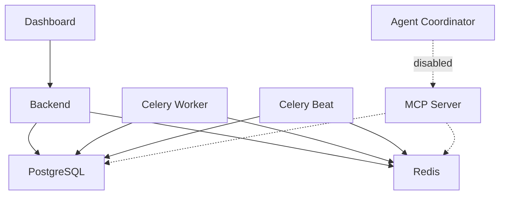

# Docker Services Status (Development)

**Last Updated**: 2025-11-01
**Environment**: Development
**Configuration**: docker-compose.yml + docker-compose.dev.yml

---

## Active Services ✅

These services run by default in development mode:

| Service | Port(s) | Purpose | Health Check |
|---------|---------|---------|--------------|
| **postgres** | 5434 | Primary PostgreSQL 16 database | `pg_isready` |
| **redis** | 6381 | Cache and Celery queue | `PING` |
| **backend** | 8009, 5678 | FastAPI application + debugger | `/health` endpoint |
| **dashboard** | 5179, 9229 | React frontend + debugger | Vite dev server |
| **celery-worker** | - | Background task workers (x2 replicas) | Celery inspect ping |
| **celery-beat** | - | Task scheduler | Process check |
| **adminer** | 8080 | Database management UI | - |
| **redis-commander** | 8081 | Redis management UI | - |
| **mailhog** | 1025, 8025 | Email testing (SMTP + Web UI) | - |

### Service URLs

- **Backend API**: http://localhost:8009
- **Backend API Docs**: http://localhost:8009/api/v1/docs
- **Backend Health**: http://localhost:8009/health
- **Dashboard**: http://localhost:5179
- **Adminer**: http://localhost:8080
- **Redis Commander**: http://localhost:8081
- **Mailhog**: http://localhost:8025

---

## Disabled Services (Profiles) ⏸️

These services are disabled by default to optimize development environment. Enable them when needed using Docker Compose profiles.

### Agent Coordinator
**Profile**: `agents`
**Reason**: Pydantic v2.10 compatibility issue with LangSmith
**Ports**: 8888, 8889
**Enable**: `docker compose --profile agents up -d`

**Known Issue**: LangSmith dependency uses Pydantic v1 `ForwardRef._evaluate()` which doesn't exist in Pydantic v2.10+. Waiting for upstream fix or considering Pydantic downgrade.

### Redis Cloud Connector
**Profile**: `cloud`
**Reason**: Only needed for Redis Cloud/LangCache integration
**Ports**: None (internal)
**Enable**: `docker compose --profile cloud up -d`

### Backup Coordinator
**Profile**: `backups`
**Reason**: Backups not needed in local development
**Ports**: None
**Enable**: `docker compose --profile backups up -d`

### Migration Runner
**Profile**: `migrations`
**Reason**: Migrations run manually when needed
**Ports**: None
**Enable**: `docker compose --profile migrations up -d`

### Roblox Sync Service
**Profile**: `roblox`
**Reason**: Optional Roblox integration
**Ports**: 34872
**Enable**: `docker compose --profile roblox up -d`

### Prometheus Monitoring
**Profile**: `monitoring`
**Reason**: Optional metrics collection
**Ports**: 9090
**Enable**: `docker compose --profile monitoring up -d`

---

## Service Dependencies



---

## Common Operations

### Start All Active Services
```bash
cd infrastructure/docker/compose
docker compose -f docker-compose.yml -f docker-compose.dev.yml up -d
```

### Start with Specific Profiles
```bash
# Enable agent coordinator
docker compose --profile agents up -d

# Enable multiple profiles
docker compose --profile agents --profile cloud up -d

# Enable all services
docker compose \
  --profile agents \
  --profile cloud \
  --profile backups \
  --profile migrations \
  --profile roblox \
  --profile monitoring \
  up -d
```

### Check Service Status
```bash
docker compose -f docker-compose.yml -f docker-compose.dev.yml ps
```

### View Service Logs
```bash
# All services
docker compose -f docker-compose.yml -f docker-compose.dev.yml logs -f

# Specific service
docker compose -f docker-compose.yml -f docker-compose.dev.yml logs -f backend

# Multiple services
docker compose -f docker-compose.yml -f docker-compose.dev.yml logs -f backend celery-worker
```

### Restart Specific Service
```bash
docker compose -f docker-compose.yml -f docker-compose.dev.yml restart backend
```

### Stop All Services
```bash
docker compose -f docker-compose.yml -f docker-compose.dev.yml down
```

### Clean Restart (Remove Volumes)
```bash
docker compose -f docker-compose.yml -f docker-compose.dev.yml down -v
docker compose -f docker-compose.yml -f docker-compose.dev.yml up -d
```

---

## Troubleshooting

### Service Won't Start
1. Check logs: `docker compose logs service-name`
2. Check dependencies are running (postgres, redis)
3. Check port conflicts: `lsof -i :PORT`
4. Rebuild image: `docker compose build service-name`

### Database Connection Errors
1. Verify postgres is running: `docker compose ps postgres`
2. Check credentials in `.env` or `.secrets/`
3. Test connection: `docker compose exec postgres psql -U toolboxai -d toolboxai -c "SELECT 1;"`

### Dashboard Not Loading
1. Check dashboard logs for npm errors
2. Verify backend is accessible: `curl http://localhost:8009/health`
3. Check browser console for errors
4. Verify node_modules installed: `docker compose logs dashboard | grep "Dependencies installed"`

### Celery Workers Not Processing Tasks
1. Check Celery Beat is running (schedules tasks)
2. Verify Redis connection: `docker compose exec redis redis-cli PING`
3. Check worker logs: `docker compose logs celery-worker`
4. Monitor with Flower: http://localhost:5555 (if celery-flower is running)

---

## Performance Optimization

### Current Resource Limits (Development)

| Service | CPU Limit | Memory Limit | Notes |
|---------|-----------|--------------|-------|
| postgres | 2.0 | 2GB | Shared buffers: 256MB |
| redis | 1.0 | 512MB | Max memory: 256MB |
| backend | 2.0 | 2GB | Single worker in dev |
| dashboard | 1.0 | 1GB | Vite dev server |
| celery-worker | 2.0 | 2GB | 2 replicas, 2 concurrency each |
| celery-beat | 0.5 | 512MB | Single instance |

### Reduce Resource Usage

If running on resource-constrained machine:

1. **Reduce celery workers**: Set `replicas: 1` in docker-compose.dev.yml
2. **Lower concurrency**: Set `CELERY_WORKER_CONCURRENCY: 1`
3. **Disable optional services**: Already done via profiles
4. **Use Docker resource limits**: Already configured

---

## Health Check Endpoints

| Service | Endpoint | Expected Response |
|---------|----------|-------------------|
| Backend | http://localhost:8009/health | `{"status": "healthy"}` |
| Dashboard | http://localhost:5179 | HTML page |
| Celery Worker | `celery inspect ping` | `{"ok": "pong"}` |
| PostgreSQL | `pg_isready` | Exit code 0 |
| Redis | `redis-cli PING` | `PONG` |

---

## Security Notes (Development Only)

⚠️ **These configurations are for local development only**:

- Services run as root user (user: root)
- Security options disabled (security_opt: [])
- Capabilities not dropped (cap_drop: [])
- Filesystems writable (read_only: false)
- Simple passwords in environment variables
- No TLS/SSL on internal connections

**DO NOT use these settings in production!** See `docker-compose.yml` for production security configurations.

---

## Next Steps

1. **Start Docker**: Ensure Docker Desktop or Docker daemon is running
2. **Start Services**: `docker compose -f docker-compose.yml -f docker-compose.dev.yml up -d`
3. **Verify Health**: Check all services are healthy after 2-3 minutes
4. **Access Dashboard**: Open http://localhost:5179
5. **Check Logs**: Monitor logs for any errors

---

## Additional Resources

- [KNOWN_ISSUES.md](./KNOWN_ISSUES.md) - Current issues and workarounds
- [docker-compose.yml](./docker-compose.yml) - Base configuration
- [docker-compose.dev.yml](./docker-compose.dev.yml) - Development overrides
- [../README.md](../README.md) - Docker infrastructure overview
