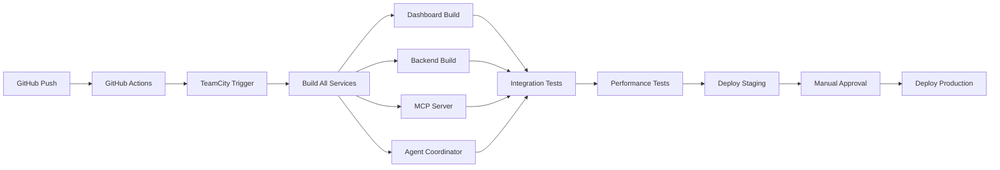

# TeamCity CI/CD Configuration

## Overview

This directory contains the TeamCity Cloud configuration and scripts for the ToolBoxAI Solutions project. The setup uses TeamCity's Kotlin DSL for configuration-as-code, ensuring all build configurations are version-controlled and reviewable.

## 🚀 Quick Setup

### 1. Initial Setup

Run the trigger script to set up TeamCity Cloud:

```bash
./infrastructure/teamcity/trigger-cloud-build.sh
```

This will:
- Connect to TeamCity Cloud instance
- Create the ToolBoxAI project
- Configure VCS root for GitHub
- Import Kotlin DSL settings
- Trigger initial builds

### 2. GitHub Integration

The repository includes GitHub Actions workflows that automatically trigger TeamCity builds:

- **Push to main/develop**: Triggers full build pipeline
- **Pull requests**: Triggers build and posts status
- **Manual dispatch**: Allows selecting specific builds

## 📋 Build Configurations

### Master Builds
- **Build All Services**: Orchestrates all service builds
- **Dashboard Build**: React/Vite with Mantine UI
- **Backend Build**: FastAPI with type checking
- **MCP Server Build**: Model Context Protocol server
- **Agent Coordinator Build**: LangChain/LangGraph agents

### Testing & Quality
- **Integration Tests**: Full stack testing
- **Performance Tests**: Lighthouse, k6 load testing
- **Security Scan**: Dependency and container scanning

### Deployment
- **Deploy to Staging**: Automated staging deployment
- **Deploy to Production**: Blue-green deployment with approval

## 🔑 Environment Variables

Required secrets in GitHub:
- `TEAMCITY_PIPELINE_ACCESS_TOKEN`: TeamCity API token
- `GITHUB_TOKEN`: GitHub access token (auto-provided)
- `SLACK_WEBHOOK_URL`: Slack notifications

Required in TeamCity:
- Docker Hub credentials
- AWS credentials for S3 backups
- Database URLs for staging/production

## 🏗️ Kotlin DSL Configuration

The build configuration is defined in `.teamcity/settings.kts`:

```kotlin
// Main build orchestration
object Build : BuildType({
    name = "Build All Services"
    // ... configuration
})

// Individual service builds
object DashboardBuild : BuildType({
    name = "Dashboard (React + Vite)"
    // ... configuration
})
```

## 🔄 Build Pipeline Flow



## 🐳 Docker Registry

Builds push Docker images to:
- `build-cloud.docker.com:443/thegrayghost23/toolboxai-{service}`

Images are tagged with:
- Build number: `:{build.number}`
- Latest: `:latest`

## 🔒 Security Features

- **Dependency scanning**: Safety, npm audit
- **Secret detection**: TruffleHog
- **SAST**: Semgrep
- **Container scanning**: Trivy
- **Non-root containers**: Security-hardened images

## 📊 Monitoring

- **Slack notifications**: Build status updates
- **Pusher integration**: Real-time build progress
- **Performance metrics**: Coverage and size thresholds
- **GitHub PR comments**: Build status on PRs

## 🛠️ Maintenance

### Updating Build Configurations

1. Edit `.teamcity/settings.kts`
2. Commit and push changes
3. TeamCity will auto-import new configuration

### Adding New Build Type

```kotlin
object NewBuildType : BuildType({
    name = "New Build"
    description = "Description"

    vcs {
        root(MainRepository)
    }

    steps {
        // Add build steps
    }
})
```

### Triggering Manual Builds

Via CLI:
```bash
./infrastructure/teamcity/teamcity-cli.sh trigger DashboardBuild
```

Via UI:
1. Open https://grayghost-toolboxai.teamcity.com
2. Navigate to project
3. Click "Run" on desired build

## 📝 Troubleshooting

### Builds Not Appearing

1. Check versioned settings are enabled
2. Verify `.teamcity/settings.kts` syntax
3. Check TeamCity server logs

### Connection Issues

1. Verify API token is valid
2. Check network connectivity
3. Ensure TeamCity Cloud instance is running

### Docker Build Failures

1. Check Docker Hub credentials
2. Verify Dockerfile paths
3. Check disk space on agents

## 📚 Resources

- [TeamCity Documentation](https://www.jetbrains.com/help/teamcity/)
- [Kotlin DSL Reference](https://www.jetbrains.com/help/teamcity/kotlin-dsl.html)
- [TeamCity Cloud](https://www.jetbrains.com/teamcity/cloud/)

## 🤝 Support

For issues:
1. Check TeamCity build logs
2. Review GitHub Actions logs
3. Contact: GrayGhostDev

---

*TeamCity Cloud Instance: https://grayghost-toolboxai.teamcity.com*
*Last Updated: 2025-09-28*