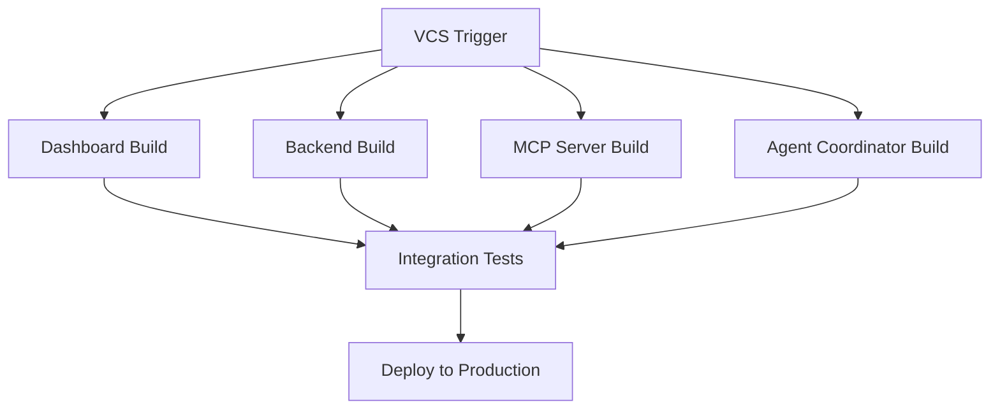

# TeamCity Cloud Integration for ToolBoxAI Solutions

## Overview
This document describes the TeamCity Cloud CI/CD integration configured for ToolBoxAI Solutions. The system uses TeamCity Cloud with Docker-in-Docker support to build, test, and deploy all services.

## Cloud Configuration

### TeamCity Cloud Instance
- **Cloud URL**: `cloud://thegrayghost23/jetbrains_linux-amd64`
- **Registry**: `build-cloud.docker.com:443/thegrayghost23`
- **Server URL**: `https://grayghost-toolboxai.teamcity.com`
- **Builder Type**: Linux AMD64 with Docker support

### Authentication
The TeamCity Pipeline access token is stored in `.env`:
```
TEAMCITY_PIPELINE_ACCESS_TOKEN=eyJ0eXAiOiAiVENWMiJ9...
TEAMCITY_USERNAME=GrayGhostDev
```

## Build Configurations

### 1. Dashboard Build (React + Vite)
- **Path**: `apps/dashboard/`
- **Tests**: Unit tests with Vitest
- **TypeScript**: Type checking enabled
- **Coverage**: Minimum 80% required
- **Docker Image**: `build-cloud.docker.com:443/thegrayghost23/toolboxai-dashboard`

### 2. Backend Build (FastAPI)
- **Path**: `apps/backend/`
- **Tests**: pytest with integration tests
- **Security**: Bandit and Safety scans
- **Type Checking**: BasedPyright
- **Docker Image**: `build-cloud.docker.com:443/thegrayghost23/toolboxai-backend`

### 3. MCP Server Build
- **Path**: `core/mcp/`
- **Purpose**: Model Context Protocol server
- **Docker Image**: `build-cloud.docker.com:443/thegrayghost23/toolboxai-mcp`

### 4. Agent Coordinator Build
- **Path**: `core/agents/`
- **Dependencies**: LangChain, LangGraph, LangSmith
- **Docker Image**: `build-cloud.docker.com:443/thegrayghost23/toolboxai-coordinator`

### 5. Integration Tests
- **Type**: Full stack testing
- **Services**: All containers started via docker-compose
- **E2E Tests**: Playwright for dashboard
- **Health Checks**: All endpoints verified

### 6. Deploy to Production
- **Trigger**: After successful integration tests
- **Target**: Cloud deployment using Docker Compose
- **Environment**: Production configurations applied

## Pipeline Structure



## Kotlin DSL Configuration

The pipeline is defined programmatically in `.teamcity/settings.kts`:

### Key Features
1. **Parallel Builds**: Dashboard and Backend build concurrently
2. **Docker Registry**: TeamCity Cloud Registry for all images
3. **Security Scanning**: Trivy for container vulnerabilities
4. **Test Coverage**: Enforced minimums with failure conditions
5. **Resource Limits**: CPU and memory constraints on builds

### Environment Parameters
```kotlin
params {
    param("env.TEAMCITY_CLOUD_BUILDER", "cloud://thegrayghost23/jetbrains_linux-amd64")
    param("env.DOCKER_REGISTRY", "build-cloud.docker.com:443/thegrayghost23")
    param("env.NODE_VERSION", "22")
    param("env.PYTHON_VERSION", "3.12")
}
```

### Build Agent Requirements
All builds require the cloud Linux AMD64 agent:
```kotlin
requirements {
    contains("teamcity.agent.name", "linux-amd64")
}
```

## Docker Images

### Registry Structure
```
build-cloud.docker.com:443/thegrayghost23/
├── toolboxai-dashboard:latest
├── toolboxai-dashboard:{build_number}
├── toolboxai-backend:latest
├── toolboxai-backend:{build_number}
├── toolboxai-mcp:latest
├── toolboxai-mcp:{build_number}
├── toolboxai-coordinator:latest
└── toolboxai-coordinator:{build_number}
```

### Multi-Stage Builds
All Dockerfiles use multi-stage builds for:
- Smaller final images
- Security (no build tools in production)
- Layer caching optimization

## Triggers

### VCS Triggers
- **Branches**: `main`, `develop`, `feature/*`
- **Path Filters**:
  - Dashboard: `apps/dashboard/**`
  - Backend: `apps/backend/**`, `core/**`, `database/**`
  - MCP: `core/mcp/**`
  - Agents: `core/agents/**`

### Build Dependencies
- Integration tests depend on all component builds
- Deployment depends on successful integration tests
- Failure in any dependency blocks downstream builds

## Features

### Build Features
1. **Docker Support**: Login to TeamCity Cloud Registry
2. **Performance Monitoring**: Track build times and resource usage
3. **Pusher Notifications**: Real-time build status updates
4. **Artifact Publishing**: Coverage reports and build artifacts

### Failure Conditions
- Test failures stop builds immediately
- Coverage below 80% fails dashboard builds
- Security vulnerabilities fail container builds
- Timeout after 30-45 minutes per build

## Monitoring

### Build Status
- View at: https://grayghost-toolboxai.teamcity.com/pipelines
- Real-time updates via Pusher channels
- Slack/Email notifications configurable

### Metrics
- Build duration trends
- Test coverage over time
- Failure rate analysis
- Resource utilization

## Local Development

### Testing Pipeline Changes
```bash
# Validate Kotlin DSL
cd .teamcity
kotlin settings.kts

# Test locally with Docker
docker compose -f infrastructure/docker/compose/docker-compose.yml \
               -f infrastructure/docker/compose/docker-compose.test.yml up
```

### Debugging Failed Builds
1. Check build logs in TeamCity UI
2. Review artifact reports
3. Run failed step locally
4. Check Docker logs for container issues

## Security

### Secrets Management
- Stored in TeamCity as "credentialsJSON" parameters
- Never hardcoded in settings.kts
- Rotated regularly
- Access controlled by TeamCity roles

### Container Security
- Non-root users (UID 1001-1004)
- Read-only filesystems
- Security scanning with Trivy
- Minimal base images (Alpine/slim)

## Maintenance

### Regular Tasks
1. Update base images monthly
2. Review and optimize build times
3. Clean up old Docker images
4. Monitor storage usage

### Troubleshooting

#### Build Agent Issues
- Agent offline: Check cloud status
- Resource exhaustion: Review limits
- Network issues: Check firewall rules

#### Docker Registry Issues
- Authentication failures: Verify credentials
- Push failures: Check quota limits
- Pull rate limits: Use cache effectively

## Next Steps

1. **Enable Webhooks**: For instant build triggers
2. **Add Performance Tests**: Include load testing
3. **Implement Blue-Green Deployments**: Zero-downtime releases
4. **Add Security Gates**: SAST/DAST integration
5. **Configure Auto-scaling**: Based on build queue

## Resources

- [TeamCity Pipelines Documentation](https://www.jetbrains.com/help/teamcity/pipelines/)
- [TeamCity Cloud Guide](https://www.jetbrains.com/help/teamcity/teamcity-cloud.html)
- [Kotlin DSL Reference](https://www.jetbrains.com/help/teamcity/kotlin-dsl.html)
- [Docker Build Best Practices](https://docs.docker.com/build/building/best-practices/)